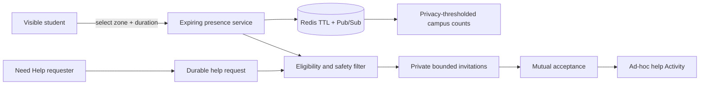
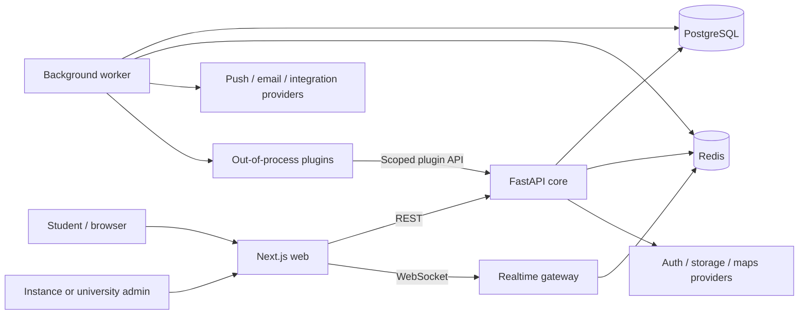
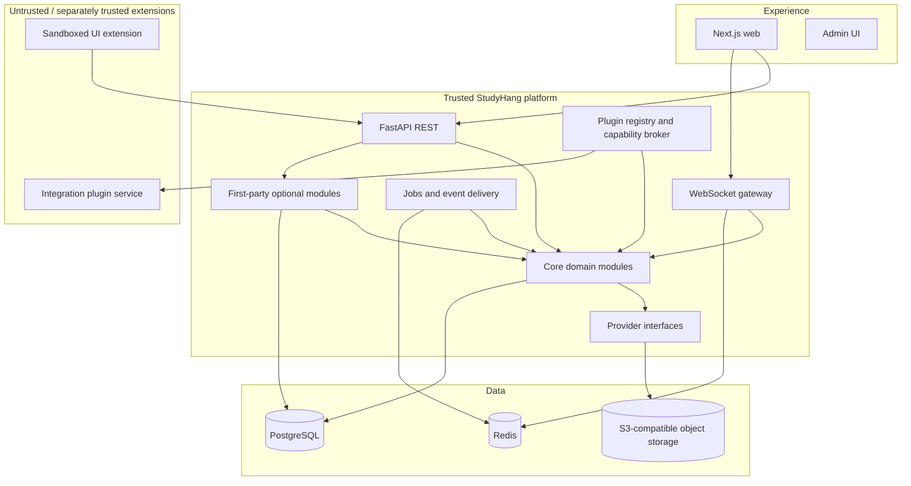
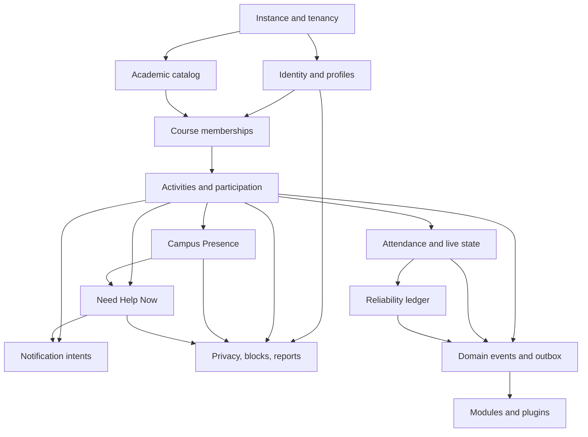
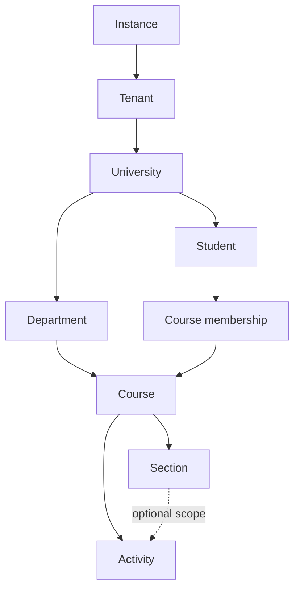
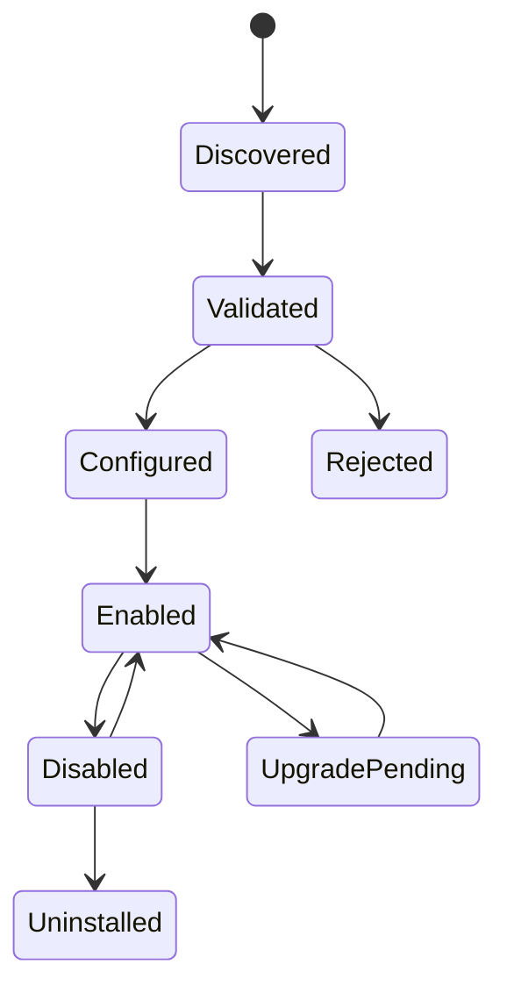
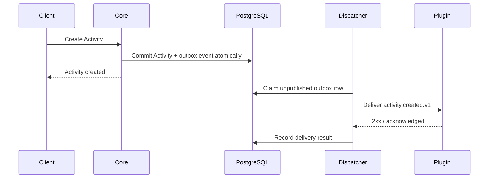

# Part 1 — Vision, Architecture, and Open-Source Philosophy

**Product:** StudyHang (working name)  
**Status:** accepted architecture baseline; no application implementation authorized  
**Audience:** founders, maintainers, contributors, university operators, and integration developers  
**Decision horizon:** pre-alpha through 1.0

## 1. Executive decision

StudyHang will be an open-source academic collaboration platform whose initial wedge is dependable course-based study coordination and whose long-term direction is an extensible operating system for academic communities.

It will begin as a **modular monolith with a worker and realtime gateway**, deployed from one monorepo and one versioned release. It will support both a hosted cloud service and self-hosted instances from the same codebase. Optional capabilities integrate through versioned events, provider interfaces, and a capability-based plugin SDK rather than edits to core domain logic.

The core remains intentionally small:

- identity and tenant/university context;
- academic catalog and memberships;
- authorization, privacy, moderation, and audit primitives;
- Activity, participation, RSVP, attendance, reliability, Campus Presence, and Need Help Now invariants;
- event/outbox, plugin registry, and provider interfaces;
- stable REST, realtime, and extension contracts.

Chat, notes, calendars, LMS bridges, mentorship, careers, AI, analytics, marketplaces, clubs, hackathons, and research communities are modules or plugins. They may use core capabilities; they may not rewrite core invariants.

### Accepted technology baseline

| Concern | Accepted decision |
| --- | --- |
| Backend | FastAPI and Python |
| Database/runtime persistence | PostgreSQL, SQLAlchemy 2 async, Alembic |
| Frontend | Latest stable/Active LTS Next.js at implementation start; Next.js 15 only when still supported and compatibility justifies it |
| Authentication now | Google OAuth and email + password behind an abstract identity layer |
| Authentication later | GitHub, Microsoft, and university SSO |
| Realtime | WebSockets and Redis Pub/Sub; PostgreSQL remains authoritative |
| Storage now | Local storage adapter for development/single-node use |
| Storage later | S3, MinIO, and Cloudflare R2 adapters |
| Notifications now | In-app notification records, Web Push, and email |
| Notifications later | Firebase, Discord, and Slack adapters |

See [ADR-0001](decisions/0001-python-orm.md), [ADR-0002](decisions/0002-platform-baseline.md), and [ADR-0003](decisions/0003-activities-presence-help-now.md).

## 2. Vision

### Long-term vision

StudyHang becomes the trusted collaboration layer between a university's formal systems and the informal ways students actually help one another.

Students should be able to:

- meet classmates and form durable academic relationships;
- organize academic activities whose participant lists are trustworthy;
- see privacy-safe campus activity happening now and request immediate course help;
- prepare for exams and projects together;
- build teams, research groups, clubs, and peer-mentoring networks;
- preserve course knowledge and resources in the right context;
- integrate calendars, learning systems, conferencing, and community tools without surrendering their data to one vendor.

### Initial promise

> Find the right classmates, see where academic collaboration is happening, and organize or join the right activity now or later.

This promise is narrower than the vision on purpose. A platform earns the right to expand by solving one frequent, painful workflow well.

### What StudyHang is not

- not a general-purpose messaging server with university branding;
- not a replacement for an LMS, SIS, calendar, or video-conferencing provider;
- not a public popularity graph or reliability leaderboard;
- not a single-university deployment disguised as multitenant software;
- not a plugin marketplace before the plugin security and compatibility model is mature;
- not an AI product in the MVP.

## 3. Product and engineering principles

| Principle | Architectural consequence |
| --- | --- |
| Solve a real academic job | Core releases are measured by successful collaboration outcomes, not message volume |
| Trust with dignity | Reliability is explainable, limited in visibility, appealable, and never a public ranking |
| API first | The web client consumes the same versioned application API available to other clients |
| Modular by ownership | Domain modules own rules and data access behind explicit application contracts |
| Event enabled, not event dependent | Core commands commit without requiring optional plugins to be online |
| Self-hostable | No required proprietary identity, storage, notification, analytics, or cloud service |
| Cloud operable | The same artifacts scale horizontally and use managed provider adapters |
| Secure extension | Plugins receive least-privilege capabilities and cannot mutate core tables |
| Accessible by default | WCAG 2.2 AA is a release criterion across core and extension UI |
| Global academic model | Domains, terms, sections, timezones, and names do not assume US `.edu` conventions |
| Contributor empathy | One documented workflow, local provider fakes, bounded issues, and explicit decisions |
| Evolution over speculation | Define extraction seams now; do not deploy microservices before an operational need exists |

## 4. Product boundary: core, first-party modules, plugins

### Core platform

Core is versioned and maintained with the strongest compatibility promise.

1. Tenant/instance settings and university hierarchy.
2. Identity mapping, profiles, roles, consent, privacy, block/report primitives.
3. University → department → course → section membership graph.
4. Activities, activity types, capacity, waitlist, RSVP, attendance, and lifecycle rules.
5. Opt-in Campus Presence and course-scoped Need Help Now matching.
6. Reliability event ledger, policy versioning, explanations, and appeals.
7. Authorization policy engine and audit log.
8. REST/OpenAPI, realtime envelope, event/outbox, plugin registry, configuration, and health APIs.
9. Provider ports for identity, storage, notification, maps, email, search, and telemetry.

### First-party modules

First-party modules ship in the repository and follow core quality standards but can evolve on a faster cadence behind feature flags:

- course discussion;
- activity chat;
- notes/resources;
- discovery and deterministic recommendations;
- moderation console;
- instance/university administration;
- calendar export.

They use the same plugin/event contracts where practical. This dogfoods extension points without pretending every internal module must be dynamically uninstallable.

### External plugins

External plugins include:

- Canvas, Moodle, Blackboard, Discord, Slack, Teams, Zoom, calendar, and notification bridges;
- mentorship, tutoring, career, research, clubs, and hackathon modules;
- analytics/export adapters;
- future AI capabilities;
- optional hosted provider adapters.

The word “plugin” does not imply arbitrary code runs inside the trusted core process. Isolation depends on plugin type and is described below.

## 5. Activity, Campus Presence, and Need Help Now

### Activity is the canonical aggregate

Internally, the platform models an `Activity`, not a `StudySession`. “Study Session” remains one user-facing activity type.

Initial types are:

- study session;
- homework group;
- project meeting;
- project team formation;
- lab help;
- interview practice;
- research discussion;
- office-hours meetup;
- hackathon preparation;
- ad-hoc help meetup.

Every Activity may use shared capabilities such as scheduling, location, capacity, participation, waitlist, RSVP, attendance, live status, chat, files, notifications, and reliability evidence. Type-specific rules are validated policy/configuration attached to an activity type. The model does not add a new nullable column for every future activity format.

The MVP product layer may add goals, outcomes, compatibility preferences, and weekly recurrence through these shared Activity capabilities without changing the Part 1 architecture.

Core APIs and events use `activity` terminology. Product UI may use the more specific type label—such as “Study session” or “Project meeting”—where that is clearer to students.

### Campus Presence

Campus Presence answers “Is anyone studying here right now?” without requiring an Activity to be created.

Example experience:

```text
Hayden Library
18 students studying now

8  CSE 340
4  MAT 343
3  CSE 355
3  SER 222
```

Privacy and product behavior:

- invisible is the default;
- a student manually selects an approved campus zone and duration;
- presence is coarse, short-lived, renewable, and automatically expires;
- no background GPS tracking or movement history;
- the public surface shows thresholded aggregates, not a named directory;
- low-count course/location groups are hidden or combined to prevent inference;
- “Go invisible” takes effect immediately;
- blocking and safety policy apply to every individual interaction derived from presence.

Presence lives primarily as expiring Redis state for realtime counts/fan-out. Durable PostgreSQL data holds visibility preference, approved campus zones, safety policy, and minimal audit/consent facts. Redis loss clears live presence rather than exposing stale people. Presence changes are not public plugin events by default.

### Need Help Now

Need Help Now answers “Can someone in my course help me right now?”

1. A student creates a short-lived request with course, topic, desired help mode, optional approved campus zone, and expiry.
2. The matcher filters to same-tenant/university eligible students with the course, current opt-in availability/presence, allowed notification preferences, and no block/safety conflict.
3. Private invitations are sent to a bounded candidate set. The product never exposes a browsable list of “online students.”
4. A candidate may accept, decline, or ignore without reliability penalty.
5. Identity and exact meeting context are progressively disclosed only after mutual acceptance.
6. An accepted match can create an `ad_hoc_help_meetup` Activity and reuse attendance, live status, chat, safety, and completion rules.

Matching is deterministic and explainable in the initial release; it is not an AI feature. Help requests are rate-limited, expire quickly, respect quiet hours, and support report/block. Repeated declines suppress further invitations from the same request.

### Realtime flow



Campus counts are convenience state, not attendance evidence. Only explicit Activity check-in/host corroboration can affect reliability.

## 6. System context



### Why this shape

- PostgreSQL transactions protect capacity, waitlists, attendance, and audit history.
- A separate worker is required because reminder correctness cannot depend on an open browser or HTTP request.
- Realtime can initially share API code and image but has a separate entry point/deployable so WebSocket scaling and rolling deploys do not constrain ordinary REST traffic.
- Redis accelerates queueing, rate limits, presence, and fan-out but is never canonical.
- External plugins are isolated from the core process and database.

## 7. Runtime architecture



### Deployables

| Deployable | Responsibility | Scale signal |
| --- | --- | --- |
| `web` | Next.js UI, static assets, server rendering | requests, render latency |
| `api` | REST, authz, commands/queries, plugin management | API RPS/latency |
| `worker` | scheduled tasks, outbox, notifications, plugin delivery | due-task lag/backlog |
| `realtime` | authenticated WebSockets and fan-out | concurrent connections/messages |

All backend deployables use one Python source tree and release version. Separation is operational, not duplicated business logic.

## 8. Module architecture

Core modules are organized around business capabilities:



Within a module:

- **domain** owns entities, policies, state machines, and domain events;
- **application** owns commands, queries, transactions, authorization orchestration, and ports;
- **infrastructure** implements repositories and provider adapters;
- **presentation** exposes REST/realtime schemas.

Dependency rules:

1. Domain code imports no framework, database, queue, or provider SDK.
2. Route handlers and workers call the same application services.
3. Modules do not query another module's private tables.
4. Cross-module writes happen through an application contract inside one transaction when required; other reactions use events.
5. Optional modules may fail without rolling back a completed core command.

## 9. Multi-tenant and multi-university model

### Terms

- **Instance:** one deployed StudyHang installation and administrative boundary.
- **Tenant:** a policy/branding/data-administration boundary within an instance. For the initial release, instance and tenant may be one-to-one, but tenant IDs exist in the model so hosted deployments can safely support many.
- **University:** an academic organization inside a tenant/instance. One instance may contain many universities.
- **University admin:** a role scoped to one university, not a global instance administrator.

### Hierarchy



### Isolation decision

MVP uses a shared PostgreSQL schema with required `tenant_id` on tenant-owned aggregate roots and repository-level mandatory scope. High-risk queries use database constraints and integration tests to prevent cross-tenant access. A hosted control plane is not required for self-hosted deployments.

Design requirements:

- no default/fallback tenant in production code;
- tenant resolved from authenticated identity/host context and passed explicitly;
- globally unique opaque IDs do not replace scope checks;
- unique constraints include tenant/university scope where appropriate;
- cache keys, object paths, jobs, events, logs, metrics, and WebSocket channels carry tenant context;
- instance and university branding are configuration/data, not forks;
- university email domains support arbitrary verified domains, not only `.edu`;
- tenant export/deletion and per-tenant encryption-key evolution remain possible.

Schema-per-tenant and database-per-tenant are not MVP defaults because migrations, pooling, search, and community operations become materially harder. A regulated institutional profile can add database-per-tenant later behind the repository and provisioning boundaries.

## 10. Authentication abstraction

Self-hosting conflicts with any mandatory proprietary authentication vendor. StudyHang therefore owns an `IdentityProvider` contract and its internal user/authorization model.

### Required capabilities

- authenticate and validate an external identity;
- register and authenticate a verified local email/password identity;
- map provider subject to an internal user;
- verify institutional email ownership;
- link/unlink identities with reauthentication;
- expose provider health and configuration state;
- process lifecycle callbacks idempotently;
- support OIDC discovery where available.

### Provider profiles

| Profile | Default path |
| --- | --- |
| Local development | deterministic development provider + local mail catcher; never enabled in production |
| Basic self-host | email + password with verification, plus optional Google OAuth |
| University | Google/email initially; Microsoft or university SSO adapter later |
| Hosted cloud | Google OAuth and email + password; proprietary identity platforms remain optional adapters |

Core foreign keys use internal user IDs. Provider claims never become application authorization without StudyHang policy checks.

Password credentials use a maintained authentication/security library, modern adaptive hashing, secure reset tokens, verification, rate limits, session revocation, and account-enumeration resistance. StudyHang does not implement cryptographic primitives. MFA/passkeys are a planned hardening path.

## 11. Storage, notification, maps, and other provider interfaces

### Storage

Canonical interface: create upload intent, finalize/scan asset, authorize download, delete, health, and quota usage.

- initial: local filesystem adapter for development and explicitly supported single-node profiles;
- later self-host: MinIO or another S3-compatible service;
- later cloud: S3 or Cloudflare R2.

Object keys are tenant-scoped. Private uploads use signed short-lived URLs and quarantine/scanning. No storage-specific URL is persisted as canonical domain data.

Local storage cannot be silently used on ephemeral or horizontally scaled production instances. Startup validation requires an operator to select a durable shared adapter for those profiles.

### Notifications

Canonical in-app notifications are stored first. The initial adapters deliver standards-based Web Push and email. Later adapters may add Firebase, Discord, and Slack. A failed optional channel does not erase the in-app notification.

### Maps and locations

Location records and coordinates are provider-neutral. Geocoding/map tiles use Google Maps or OpenStreetMap-compatible adapters. Core flows remain usable as text/list experiences without a map provider.

### Provider contract rule

Provider interfaces express StudyHang capabilities, not a lowest-common-denominator copy of vendor SDKs. Vendor-only enhancements are optional capability flags and never required to load core pages.

## 12. Plugin system

### Goals

- add integrations and optional academic modules without modifying core;
- preserve a stable, documented extension surface;
- make permissions, data access, configuration, failures, and upgrades visible to operators;
- keep an unhealthy or malicious plugin from corrupting core state;
- support self-hosted installation without requiring a central marketplace.

### Non-goals for the first release

- arbitrary Python packages loaded into the API process;
- unreviewed JavaScript injected into the main DOM;
- direct plugin access to core tables or secrets;
- synchronous plugin callbacks inside correctness-critical transactions;
- a public marketplace before signing, review, revocation, and compatibility policies exist.

### Plugin types

| Type | Execution | Examples |
| --- | --- | --- |
| Provider adapter | trusted first-party/in-tree initially | S3, R2, FCM, OIDC, maps |
| Integration plugin | out-of-process service via events + scoped API | Discord, Canvas, Moodle, calendar |
| Backend module plugin | isolated container/process with plugin-owned schema | mentorship, tutoring, research |
| UI extension | sandboxed iframe/approved extension point | admin panel or course-side tool |
| Theme/branding package | declarative tokens/assets only | university branding |

### Manifest

A plugin bundle has a declarative manifest conceptually containing:

```yaml
api_version: studyhang.plugins/v1
id: org.example.calendar
version: 1.2.0
name: Example Calendar
core_compatibility: ">=0.9 <2.0"
execution: service
events:
  subscribe:
    - activity.created.v1
    - activity.updated.v1
permissions:
  - activities:read_metadata
  - participants:read_self_or_consented
routes:
  backend_prefix: /plugins/org.example.calendar
ui_extensions:
  - slot: activity.actions
configuration_schema: config.schema.json
migrations:
  namespace: plugin_org_example_calendar
```

The real manifest schema is versioned, JSON-schema validated, signed/checksummed where distribution requires it, and documented by the plugin SDK.

### Capability and permission model

Permissions are deny-by-default, tenant-approved, and human-readable. Examples:

- Activity metadata read;
- course membership read;
- user profile fields by explicit scope;
- create notification intents;
- register webhook/subscription;
- plugin-owned storage quota;
- plugin-owned route and UI slot.

There is no `database:*` or unrestricted `users:read`. Sensitive profile, attendance, moderation, private location, and reliability data require narrow capabilities and may be forbidden to third-party plugins entirely.

### Routes

- Backend plugins receive a namespaced route or call the scoped Plugin API with short-lived service credentials.
- Core reserves `/v1/plugins/{plugin_id}/...` and prevents route shadowing.
- Public plugin endpoints declare authentication, rate limits, and OpenAPI fragments.
- UI extensions render only in named slots with an explicit data contract.

### Database migrations

- Plugin-owned tables live in a plugin-specific PostgreSQL schema or prefixed namespace.
- A plugin migration can never alter/drop a core table, enum, trigger, or index.
- The plugin manager serializes installation/upgrade, records migration versions, and backs up/checks compatibility.
- Core transactions do not span an external plugin database/service.
- Uninstall defaults to disable and retain data; destructive purge is a separate confirmed operation with export opportunity.

### Frontend components

Third-party UI is sandboxed and communicates through a versioned message/SDK bridge. It receives theme tokens, locale, route context, and scoped data—not DOM access or auth tokens. First-party/in-tree plugins may compile React components against documented extension interfaces after maintainer review.

### Lifecycle



Install validates manifest, compatibility, signature/checksum, permissions, configuration schema, migrations, health, and declared routes. Enablement is tenant-scoped. A kill switch disables event delivery and UI without taking core offline.

### Plugin SDK deliverables

- manifest JSON schema and validator;
- generated client for the scoped Plugin API;
- event schemas and test fixtures;
- local plugin harness and fake core;
- permission/configuration helpers;
- health, retry, idempotency, and observability conventions;
- UI extension bridge and accessibility checklist;
- compatibility/deprecation and publishing guides;
- reference “hello integration” plugin.

## 13. Event-driven architecture

### Event classes

1. **Domain event:** internal fact emitted by core domain logic, usually within one transaction boundary.
2. **Integration event:** privacy-reviewed, versioned public projection delivered to modules/plugins after commit.
3. **Audit event:** privileged/security record with separate retention and access.
4. **Analytics event:** consented product measurement; never treated as a domain contract.

Do not expose raw domain/database records as plugin events.

### Event envelope

```json
{
  "event_id": "evt_opaque",
  "type": "activity.created.v1",
  "occurred_at": "2026-08-03T19:00:00Z",
  "tenant_id": "tenant_opaque",
  "actor": { "type": "user", "id": "user_opaque" },
  "subject": { "type": "activity", "id": "activity_opaque", "version": 1 },
  "correlation_id": "req_opaque",
  "causation_id": null,
  "data": {
    "course_id": "course_opaque",
    "starts_at": "2026-08-05T22:00:00Z",
    "timezone": "America/Phoenix"
  }
}
```

Rules:

- event names are past-tense facts and use lower-case dotted form in wire contracts;
- payloads contain the minimum data needed for the declared event purpose;
- email, private location, message/note bodies, auth claims, moderation evidence, and exact reliability history are excluded by default;
- every schema has a version and compatibility/deprecation window;
- events are immutable; correction is a new event;
- ordering is guaranteed only per aggregate where supported, using aggregate version;
- consumers deduplicate by event ID and handle gaps through the API/resync path.

### Transactional outbox flow



Delivery is at least once. Plugins must be idempotent. Retries use exponential backoff and a dead-letter state. Plugin failure cannot roll back or block the original Activity creation.

### Initial public event catalog

| Event | Trigger | Default sensitivity |
| --- | --- | --- |
| `student.registered.v1` | internal user activated | restricted; minimal identity |
| `student.joined_course.v1` | course membership activated | restricted |
| `activity.created.v1` | Activity scheduled/created | metadata according to visibility |
| `activity.updated.v1` | material field changed | metadata diff/projection |
| `activity.cancelled.v1` | terminal cancellation | participant-scoped |
| `participant.joined_activity.v1` | confirmed/waitlisted | restricted |
| `participant.left_activity.v1` | participation released | restricted |
| `participant.checked_in.v1` | arrival recorded | highly restricted/not third-party default |
| `activity.started.v1` | Activity active | visibility-scoped |
| `activity.ended.v1` | Activity completed | visibility-scoped |
| `message.sent.v1` | P1 message accepted | metadata only by default |
| `note.uploaded.v1` | P1 asset ready | course-scoped metadata |
| `reliability.snapshot_updated.v1` | projection changed | internal only by default |

The source brief's PascalCase names remain domain-language aliases; wire contracts use namespaced, versioned names.

## 14. Monorepo target

```text
studyhang/
├── apps/
│   ├── web/                         # Next.js user/admin experience
│   └── api/                         # FastAPI, worker, realtime entry points
├── packages/
│   ├── ui/                          # Shared accessible UI primitives/tokens
│   ├── api-client/                  # Generated TypeScript REST client
│   ├── event-schemas/               # Versioned integration-event schemas
│   ├── plugin-sdk/                  # Manifest, permissions, API/event helpers
│   ├── shared/                      # Small language-appropriate shared contracts
│   ├── types/                       # UI-only TypeScript types
│   ├── utils/                       # Pure, narrowly scoped utilities
│   └── config-*/                    # Lint/type/test configuration
├── plugins/
│   ├── first-party/                 # Optional reviewed integrations
│   └── examples/                    # Reference plugins, no production secrets
├── docs/
│   ├── architecture/
│   ├── api/
│   ├── plugins/
│   ├── self-hosting/
│   ├── deployment/
│   ├── runbooks/
│   └── decisions/
├── docker/
├── scripts/
└── .github/
```

There is no TypeScript `packages/database` while FastAPI/Python owns persistence. Shared database access across languages would break the API/domain boundary. Database schema and migrations live with the API, while generated API/event contracts live in language-neutral packages.

Every published package/plugin has a README, ownership, tests, lint/type checks, version/compatibility declaration, and minimal dependency surface. Internal folders are not turned into packages without a real independent consumer or release boundary.

## 15. Self-hosting architecture

### One-command objective

After an operator copies and completes `.env.example`, the supported development/small-instance profile starts with:

```text
docker compose up
```

The Compose project includes:

- `web`;
- `api`;
- `worker`;
- `realtime`;
- PostgreSQL;
- Redis;
- MinIO (S3-compatible storage);
- local SMTP catcher in development profile;
- migration/init job;
- optional reverse proxy/TLS profile for documented production-like use.

“One command” does not mean unsafe universal production defaults. Production self-hosting requires explicit secrets, domain/TLS, email/OIDC, backups, object-storage durability, and monitoring. The deployment guide distinguishes demo, small trusted deployment, and production profiles.

### Configuration

- environment variables/config files only; no source edits;
- typed startup validation with actionable errors;
- secret values may use Docker/Kubernetes secret-file references;
- instance name, logo, theme, university domains, locale, timezone, providers, quotas, and enabled plugins are runtime configuration/data;
- configuration has a documented stability/deprecation policy;
- generated `.env.example` contains safe placeholders, not credentials.

### Self-host support contract

The project documents minimum CPU/memory/storage, supported PostgreSQL/Redis versions, backup/restore, upgrades, migrations, TLS, SMTP/OIDC, health checks, logs/metrics, and rollback. Self-hosted data does not call a StudyHang cloud service unless the operator enables a clearly documented integration.

## 16. Cloud deployment

Cloud targets use the same images and configuration contracts:

- web: Vercel or container platform;
- API/worker/realtime: Railway, Render, Fly.io, DigitalOcean, AWS, Azure, or Google Cloud container services;
- managed PostgreSQL/Redis/object storage;
- provider adapters selected by environment.

Platform-specific templates may automate infrastructure but cannot introduce product forks. The deployment matrix specifies capabilities such as WebSocket duration, background workers, persistent storage, private networking, region placement, and backup support.

Preview environments use synthetic data and isolated secrets. Production migrations are single-run release jobs using expand/migrate/contract.

## 17. Scalability path

1. Tune queries/indexes and use read projections.
2. Horizontally scale stateless API, realtime, and worker deployables independently.
3. Partition job/event/audit tables only after measured volume.
4. Add dedicated search behind a search interface when PostgreSQL relevance/latency fails objectives.
5. Extract notification/event delivery if its failure or scaling profile threatens core jobs.
6. Extract a domain service only with independent scaling, security, ownership, and operational justification.

The plugin boundary is not a reason to create dozens of microservices inside core.

## 18. Security architecture

- explicit tenant and object-level authorization on every query/command;
- least-privilege plugin/provider credentials with rotation and revocation;
- signed/verified plugin bundles where distributed; operator consent for permissions;
- no direct core database access for external plugins;
- TLS, secure headers, CSRF/session protections, rate limits, validation, and safe errors;
- upload quarantine, content validation, malware-scanning hook, signed downloads;
- tamper-evident/audited privileged changes and plugin lifecycle actions;
- secrets excluded from repository, images, logs, events, and browser bundles;
- backup/restore and incident-response drills;
- dependency, secret, SAST, container, license, and migration checks in CI;
- threat-model review for every new extension point.

Plugins are a security boundary, not merely a folder convention.

## 19. Observability and operations

All deployables emit vendor-neutral structured logs, metrics, and traces with tenant-safe correlation IDs. Sensitive fields are redacted at the source.

Core signals include API latency/errors, database pool/locks, worker lag, outbox age, event delivery failures, plugin health, WebSocket connections/resync, storage scan backlog, notification outcomes, and tenant-scoped quota usage.

Every alert has an owner and runbook. Plugin metrics are namespaced and cannot create unbounded labels from user content.

## 20. Open-source philosophy and governance

### License

Apache License 2.0 is the proposed default because it is permissive for individuals, universities, and commercial adopters while providing an explicit patent grant. Branding/trademarks are handled separately from source licensing.

### Governance principles

- public roadmap, proposals, ADRs, release notes, and decision rationale;
- maintainers earn scope through sustained contribution and community trust;
- sensitive security/conduct matters use private processes;
- no private feature roadmap that surprises community contributors;
- vendor integrations remain optional and replaceable;
- generated/automated changes are reviewable and reproducible;
- contribution rules optimize for clarity, not gatekeeping.

### Decision process

| Change | Process |
| --- | --- |
| Small bug/docs/test | issue or direct PR when clearly scoped |
| Public API/event/plugin contract | proposal + compatibility review |
| Core module/data/security boundary | ADR/RFC + maintainer approval |
| Governance/license/code of conduct | public proposal and explicit vote/process |
| Vulnerability/conduct case | private response process, public summary when safe |

### Contributor ladder

1. Contributor: accepted contribution or constructive community work.
2. Reviewer: demonstrated judgment in a bounded area.
3. Maintainer: release/review responsibility for named modules.
4. Core maintainer: cross-cutting architecture, security, and governance responsibility.

Exact nomination, inactivity, removal, conflict-of-interest, and appeal rules are written before the project solicits broad maintainership.

### Community health

Track time to first response/review, contributor completion/drop-off, issue clarity, maintainer load, release cadence, accessibility/security debt, and representation in product research. GitHub stars are an awareness signal, not the project outcome.

## 21. Documentation contract

Before private pilot, the repository must contain and keep current:

- product README and status;
- architecture, database, API/realtime, and ADR documentation;
- development setup and provider-fake guide;
- contribution, code of conduct, governance, security, and release process;
- plugin manifest/permissions/events/migrations/UI SDK guide;
- Docker/self-hosting, upgrades, backup/restore, and troubleshooting;
- cloud deployment matrix and production checklist;
- changelog, roadmap, issue/PR templates, labels, and starter issues;
- operator and moderator runbooks.

Documentation changes are part of feature definition-of-done. Generated API/schema references are checked for drift in CI.

## 22. Architecture decisions and tensions

### Backend and persistence — accepted

Use FastAPI, Python, PostgreSQL, SQLAlchemy 2 async, and Alembic. Prisma is not part of the runtime or migration stack. See [ADR-0001](decisions/0001-python-orm.md).

### Frontend version — accepted

Select the latest stable/Active LTS Next.js at implementation start. Next.js 15 is acceptable only if it remains supported and a documented compatibility constraint justifies it.

### Authentication — accepted

Start with Google OAuth and email + password behind the provider-neutral identity layer. Add GitHub, Microsoft, and university SSO later. Core owns identity mapping and authorization.

### Storage — accepted

Start with the local storage adapter. Add S3, MinIO, and Cloudflare R2 adapters later. Local storage is not a safe default for ephemeral or horizontally scaled production deployments.

### Realtime and notifications — accepted

Use WebSockets and Redis Pub/Sub for realtime delivery while PostgreSQL remains authoritative. Start notification delivery with Web Push and email, then add Firebase, Discord, and Slack adapters.

### Activity, Campus Presence, and Need Help Now — accepted

`Activity` is the canonical internal aggregate; Study Session is one type. Campus Presence and Need Help Now enter the product/architecture baseline subject to the privacy, expiry, aggregation, safety, and consent constraints in [ADR-0003](decisions/0003-activities-presence-help-now.md).

### Plugins versus core stability

Plugin contracts are designed in the foundation, but a broad marketplace is not an MVP. First prove permission isolation, version compatibility, migrations, failure handling, revocation, and operator UX with a small reference integration.

## 23. Phased architecture delivery

### Foundation

- provider contracts and local fakes;
- tenant scope, modular boundaries, domain/outbox primitives;
- Docker Compose and cloud-compatible images;
- versioned OpenAPI/event schemas;
- plugin manifest/permission schema and registry, disabled by default.

### MVP

- identity, academic graph, Activities, Campus Presence, Need Help Now, RSVP, attendance, reliability, and notifications;
- in-app and selected provider adapters;
- first-party event consumers;
- one read-only reference integration plugin.

### Public beta

- supported plugin installation/upgrade/disable lifecycle;
- sandboxed UI extension proof;
- plugin-owned migrations/schema and SDK;
- chat/notes modules if pilot evidence supports them;
- production self-host guide and deployment templates.

### 1.0+

- compatibility/deprecation guarantees;
- signed distribution and curated marketplace process if community demand exists;
- institution integrations and advanced module ecosystem;
- AI plugins only after separate governance and safety gates.

## 24. Acceptance criteria for Part 1

Part 1 is approved when maintainers explicitly agree that:

- [x] StudyHang is the temporary canonical name pending trademark review.
- [x] Dependable academic coordination is the initial wedge; broader community modules do not enter MVP by default.
- [x] `Activity` is the canonical aggregate and supports the accepted initial activity types.
- [x] Campus Presence and Need Help Now are part of the baseline with privacy-safe defaults.
- [x] The modular monolith + worker + realtime topology is the starting architecture.
- [x] One release/codebase supports self-host and cloud profiles.
- [x] Tenant, university, and provider boundaries are not hardcoded.
- [x] External plugins run with least privilege and no direct core table access.
- [x] Integration events are versioned, privacy-filtered, transactional-outbox delivered, and at least once.
- [x] ADR-0001, ADR-0002, and ADR-0003 are accepted.
- [x] Auth and storage have open self-host defaults; proprietary providers are optional.
- [ ] Apache-2.0 and the proposed open-governance direction are accepted.
- [x] No application implementation begins before the Part 2 data/domain design incorporates these decisions.

## 25. Remaining governance and rollout decisions

1. Confirm whether hosted multi-tenancy is a launch requirement or only architectural readiness.
2. Choose the first reference plugin (calendar integration remains the recommendation).
3. Decide whether “one-command production” means a supported small-instance profile or only development/demo; the recommendation remains a documented small-instance profile plus hardened guidance.
4. Confirm Apache-2.0 and whether project trademarks need a separate policy.
5. Assign owners for plugin security review, self-host support, authentication security, Campus Presence safety, and open-source governance.
6. Validate Campus Presence aggregation thresholds, maximum duration, approved-zone policy, and Need Help invitation limits during Part 2/product research.
