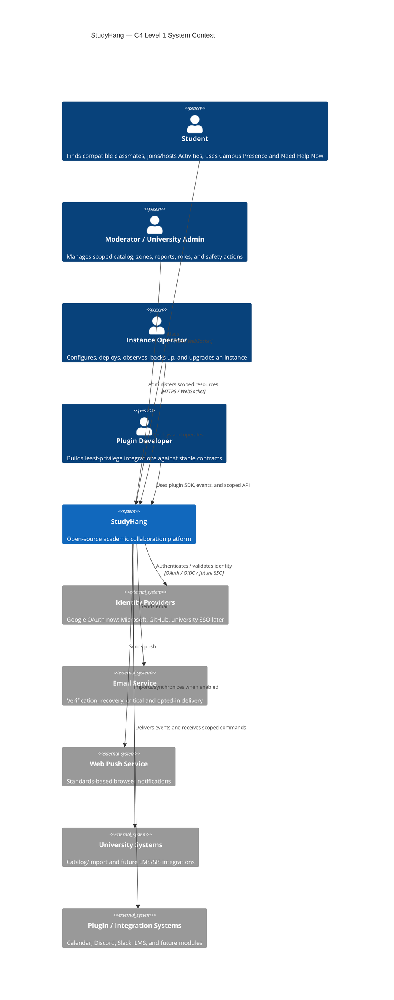
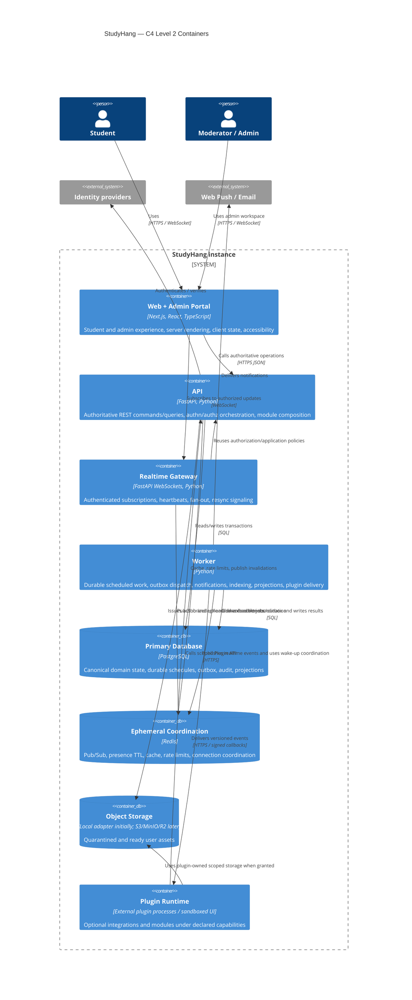
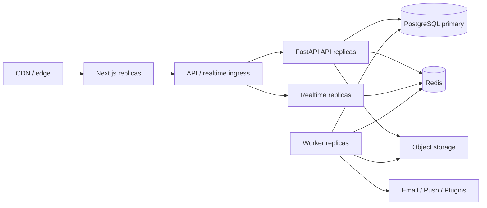
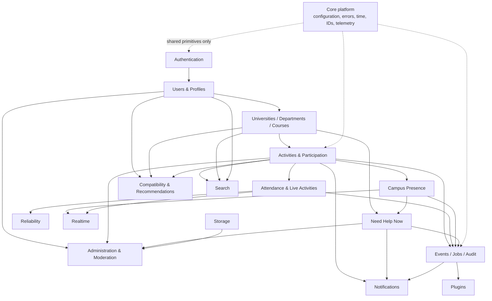
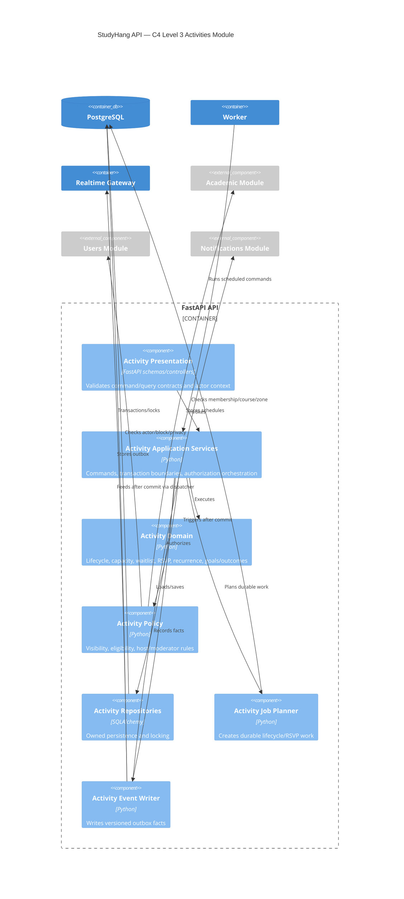
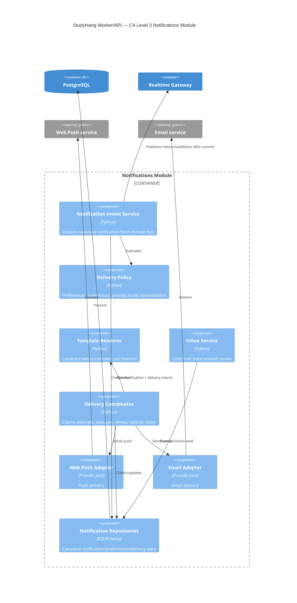
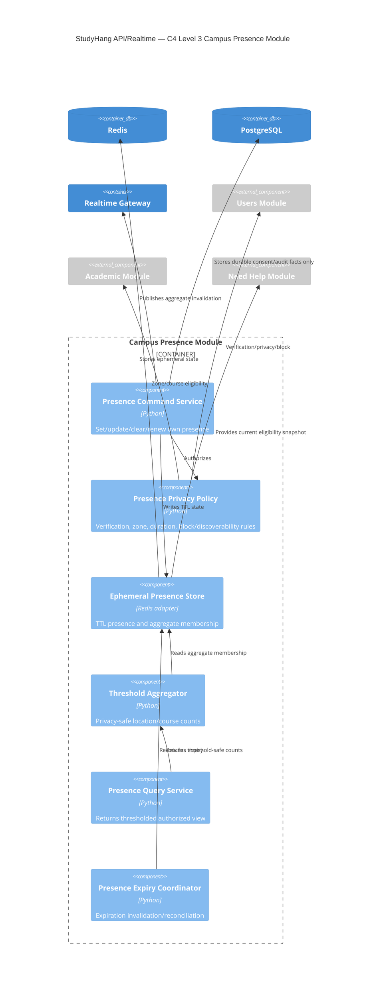
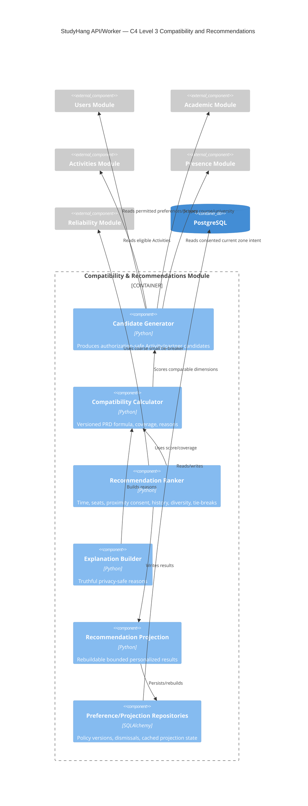
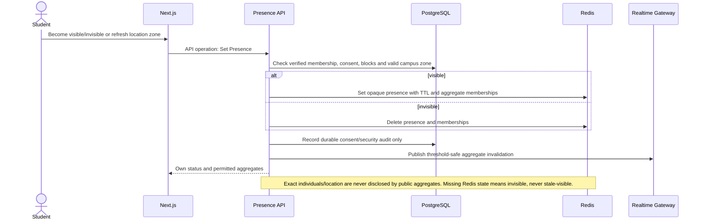
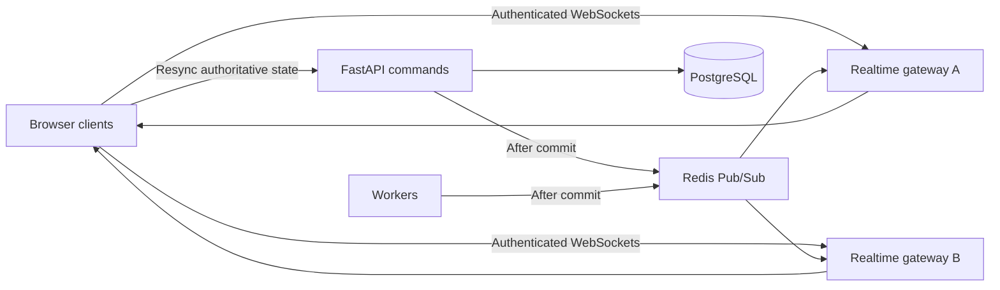

# Part 3 — System Design Document

**Product:** StudyHang (working name)  
**Status:** implementation-ready engineering design; no implementation code  
**Version:** 1.0 draft  
**Last updated:** 2026-08-04  
**Normative inputs:** finalized Part 1, finalized Part 2 PRD, ADR-0001–0003

## 0. Scope and conventions

This document explains how the finalized product behaves internally. It does not change product scope or architecture decisions. It defines logical API operations but intentionally does not define HTTP paths, database tables/columns, or code-level classes. Those belong to the API, database, and implementation specifications derived from this SDD.

### Quality goals

Priority order:

1. Correct authorization, tenant isolation, capacity, RSVP, attendance, presence privacy, and reliability evidence.
2. Recoverable time-based workflows and external delivery.
3. Clear module ownership and contributor ergonomics.
4. Horizontal scaling of stateless request/realtime/worker processes.
5. Replaceable providers and safe plugins.
6. Performance optimization based on observed load, not speculative microservices.

### Architecture style

- Modular monolith for domain/application behavior.
- Separate runtime entry points for API, worker, and realtime using the same backend release and modules.
- PostgreSQL as the sole canonical business-state store.
- Redis for ephemeral presence, Pub/Sub fan-out, caching, rate limits, and wake-up coordination.
- Transactional outbox for durable event publication.
- REST/OpenAPI for authoritative commands/queries; WebSockets for low-latency invalidation/status.
- External plugins execute outside the trusted core process and use capabilities, events, and scoped APIs.

### C4 documentation policy

This SDD uses:

- **Level 1 — System Context:** people and systems around StudyHang.
- **Level 2 — Containers:** independently deployable/runtime data components.
- **Level 3 — Components:** maintainable internals of the four most critical capabilities.
- **Level 4 — Code:** deliberately deferred until real packages/classes exist. It will be generated/maintained close to code only where it adds value.

All diagrams are architectural views, not deployment-instance counts.

---

## 1. High-level architecture

### 1.1 C4 Level 1 — System Context



#### Context responsibilities

- Students and administrators interact only through authenticated product surfaces; no client accesses databases/storage credentials directly.
- Identity providers establish authentication claims. StudyHang owns internal identity mapping, university verification, roles, permissions, privacy, and account state.
- University/integration systems are optional. Core Activity/RSVP/presence functionality remains available when they fail.
- Plugin developers target versioned contracts; plugins never import core internals or connect to core data stores.

### 1.2 C4 Level 2 — Container Diagram



### 1.3 Container responsibilities

#### Browser

- Renders accessible product state and validates input for fast feedback.
- Holds short-lived authenticated session material using the selected secure auth profile.
- Uses generated API types and stable realtime envelopes.
- Treats API responses as authoritative for capacity, RSVP, attendance, compatibility, presence, and permissions.
- Maintains local drafts and limited private cache; never stores secrets or unrestricted personal data.

#### Next.js web and admin portal

- One deployable application with distinct student/admin route boundaries and visual context.
- Performs server rendering and initial data composition through the API, never direct database queries.
- Admin portal checks role/scope again at the API; hiding a route is not authorization.
- Contains feature modules, query orchestration, error/loading boundaries, and accessibility behavior.
- Does not execute scheduled workflows or canonical business rules.

#### FastAPI API layer

- Composition root for domain modules and provider interfaces.
- Validates identity, tenant/university context, input contracts, idempotency, authorization, and resource versions.
- Opens transaction boundaries around domain commands and their outbox/audit effects.
- Provides authoritative query projections and compatibility explanations.
- Does not call external notification/plugins synchronously inside business transactions.

#### Authentication

- Google OAuth and email/password adapters map credentials/provider subjects to internal users.
- Email/password handles verification, adaptive hashing, secure reset, session revocation, rate limits, and enumeration resistance through maintained security libraries.
- Future adapters implement the same identity contract.
- Authorization remains in StudyHang modules, never delegated to a provider claim alone.

#### PostgreSQL

- Canonical state and transaction/locking boundary.
- Durable scheduled tasks, outbox delivery intent, audit history, moderation/reliability evidence, search source, and rebuildable projections.
- Enforces referential/uniqueness/check invariants later defined by the database specification.
- Backups/PITR and migrations are release-critical.

#### Redis

- Ephemeral only: Campus Presence TTL, WebSocket Pub/Sub, request/cache coordination, rate-limit counters, and optional worker wake-up.
- Redis loss may clear presence and delay realtime/cached reads; it must not lose committed Activities, participation, notifications, or jobs.
- Pub/Sub is not an event history or durable job queue.

#### Worker

- Claims durable due work using leases and transactional state changes.
- Executes RSVP reminders/removal, waitlist promotion, lifecycle reconciliation, presence cleanup support, notification delivery, outbox/plugin dispatch, search/recommendation/statistics projections.
- Calls the same application services/policies as the API.
- Is safe under duplicate execution and process crashes.

#### Realtime gateway

- Authenticates connection and every subscription.
- Maintains in-memory connection/subscription maps per instance.
- Publishes/receives minimal versioned update envelopes through Redis Pub/Sub.
- Sends heartbeat, detects stale clients, rate-limits messages, and signals `resync_required` on gaps.
- Does not persist canonical chat, attendance, or presence preferences.

#### Storage

- Provider-neutral service issues short-lived authorized upload/download intents.
- Local storage is limited to development/explicit single-node profiles.
- Uploads move through quarantine → validation/scanning → ready/rejected behavior.
- Object identifiers, not provider URLs, are canonical.

#### Plugin runtime

- External integration/backend plugins run in their own process/container and own namespaced data.
- Third-party UI runs sandboxed in named slots.
- Plugin registry/capability broker remains in core; runtime failures cannot roll back core commands.
- Provider adapters trusted in-process are initially first-party and reviewed separately from arbitrary plugins.

### 1.4 Deployment view



At small scale, these are Compose services on one host. At larger scale, deployables scale independently without changing module boundaries.

---

## 2. Module design

### 2.1 Module dependency view



Arrows show allowed application-level dependency/data-flow direction, not unrestricted imports. Modules use public application interfaces and event schemas; they do not access another module's repositories.

### 2.2 Standard module contract

Every module has:

- domain policies/state transitions with no framework/provider imports;
- application commands, queries, authorization policies, and ports;
- infrastructure repositories/adapters owned by that module;
- presentation schemas registered by the API/realtime composition root;
- unit/integration/contract fixtures;
- published events that are facts after commit;
- explicit consumed-event handlers that are idempotent.

Cross-module synchronous calls are allowed only when the user command requires one atomic invariant. Other reactions use committed events/projections.

### 2.3 Authentication module

| Concern | Design |
| --- | --- |
| Purpose | Establish internal actor identity and secure account sessions |
| Responsibilities | Google OAuth, email/password registration/login, verification/reset, session lifecycle, provider linking, auth rate limits |
| Public interfaces | Authenticate credential/provider result; verify session; revoke session(s); start/complete verification/reset; link identity |
| Dependencies | Core configuration/security/time; email delivery intent; Users activation interface |
| Owned data | Credential/provider mappings, verification/reset/session security state; no profile/business roles |
| Events published | `identity.registered.v1`, `identity.email_verified.v1`, `identity.session_revoked.v1`, `identity.provider_linked.v1` |
| Events consumed | User suspension/deletion, security key rotation/config changes |
| Future extensions | GitHub, Microsoft, OIDC/SAML university SSO, MFA/passkeys |

### 2.4 Users and Profiles module

| Concern | Design |
| --- | --- |
| Purpose | Own internal user lifecycle, profile/privacy, Study Preferences, blocks, and active university context |
| Responsibilities | onboarding state, profile edits, privacy projection, course-confidence/preferences, account-state enforcement, block relationships |
| Public interfaces | Get/update own profile; view permitted profile; update preferences/privacy; activate/suspend/delete projection; block/unblock |
| Dependencies | Authentication identity mapping; Academic membership lookup; Storage avatar capability; Audit |
| Owned data | User state, profile, preferences, field visibility, study styles/availability, block relationships |
| Events published | `user.activated.v1`, `profile.updated.v1`, `preferences.updated.v1`, `privacy.updated.v1`, `user.blocked.v1`, `user.suspended.v1`, `user.deletion_started.v1` |
| Events consumed | University/course merge/archive, asset ready/rejected, moderation actions |
| Future extensions | Multiple affiliations, richer audiences, trusted circles, plugin profile panels |

### 2.5 Universities, Departments, Courses module

| Concern | Design |
| --- | --- |
| Purpose | Canonical multitenant academic catalog and course membership context |
| Responsibilities | universities/domains/departments/courses/terms/sections, aliases/merges, membership, catalog requests/imports, approved campus zones |
| Public interfaces | Search/read catalog; join/leave/update course membership; submit/review change request; preview/apply import; manage zones/domains/branding |
| Dependencies | Users verification/context; Administration roles; Audit; Search indexing intent |
| Owned data | Academic catalog, domain verification, terms/sections, course memberships, catalog provenance, approved zones |
| Events published | `university.verified.v1`, `course.changed.v1`, `course.merged.v1`, `membership.joined.v1`, `membership.left.v1`, `campus_zone.changed.v1` |
| Events consumed | User university change/deletion, import plugin results |
| Future extensions | LMS/SIS sync, multiple campuses, instructor verification, federated catalogs |

### 2.6 Activities and Participation module

| Concern | Design |
| --- | --- |
| Purpose | Own Activity/recurring-series lifecycle, goals, compatibility profile, capacity, participation, waitlist, and outcomes |
| Responsibilities | draft/publish/edit/duplicate/cancel/archive, weekly recurrence, join/leave, capacity serialization, waitlist offers, RSVP transitions, goal/outcome facts |
| Public interfaces | Activity commands/queries; series commands; participant commands; host roster; outcome reporting |
| Dependencies | Academic eligibility/zones; Users blocks/privacy/preferences; Notifications intent; Events/jobs; Audit |
| Owned data | Activity aggregate, type/policy reference, series/occurrences, location snapshot, participation/waitlist state, goals/outcomes/bookmarks |
| Events published | `activity.created.v1`, `activity.updated.v1`, `activity.cancelled.v1`, `activity.started.v1`, `activity.ended.v1`, `participant.joined_activity.v1`, `participant.left_activity.v1`, `waitlist.offer_created.v1`, `activity.outcome_reported.v1` |
| Events consumed | Course/zone archive, user suspension/block, scheduled RSVP/lifecycle commands |
| Future extensions | Co-hosts, richer recurrence, persistent teams, plugin Activity types |

### 2.7 Attendance and Live Activities module

| Concern | Design |
| --- | --- |
| Purpose | Own check-in, late/cancel/no-show evidence, Live/Ending status, continuation, completion correction |
| Responsibilities | attendance commands, host corrections, occurrence proof, timers, continuation windows, automatic completion, factual outcome duration/attendance projection |
| Public interfaces | Check in; report late/can't attend; host mark/correct; start/continue/end/reopen; read live roster/counts |
| Dependencies | Activities current aggregate/policies; Users actor; Realtime publication; Events/jobs; Audit |
| Owned data | Attendance status/history, live activity signals, completion/correction evidence |
| Events published | `attendance.checked_in.v1`, `attendance.running_late.v1`, `attendance.cancelled_late.v1`, `attendance.no_show_finalized.v1`, `activity.live_status_changed.v1` |
| Events consumed | Activity check-in window/start/cancel/complete, participant confirmation changes |
| Future extensions | QR/location verification, co-host evidence, checkout/duration verification |

### 2.8 Campus Presence module

| Concern | Design |
| --- | --- |
| Purpose | Provide deliberate, temporary campus availability and privacy-thresholded counts |
| Responsibilities | visible/invisible intent, TTL renewal, approved-zone validation, aggregate/course threshold projection, individual discoverability consent |
| Public interfaces | Set/update/clear own presence; read authorized aggregate zones; obtain matching eligibility snapshot |
| Dependencies | Users verification/privacy/blocks; Academic zones/membership; Redis ephemeral store; Realtime; Audit consent facts |
| Owned data | Durable preference/consent policy; ephemeral live presence and aggregate projections |
| Events published | Internal `presence.changed.v1`, `presence.expired.v1`, threshold-safe aggregate invalidations; individual presence is not a plugin event |
| Events consumed | User logout/suspension/deletion/block, zone archive, course membership change |
| Future extensions | Occupancy integrations, trusted-circle visibility, campus accessibility/crowding |

### 2.9 Need Help Now module

| Concern | Design |
| --- | --- |
| Purpose | Create bounded immediate-help requests and mutual, privacy-safe matches |
| Responsibilities | request lifecycle, eligibility/ranking waves, invitation caps/fatigue, progressive disclosure, mutual acceptance, Ad-Hoc Help Activity creation |
| Public interfaces | Create/cancel/extend request; accept/decline invitation; confirm match; read own request/invitations |
| Dependencies | Academic membership; Users preferences/blocks; Presence availability; Recommendations compatibility; Activities creation; Notifications; Jobs/Audit |
| Owned data | Help requests, invitation waves/responses, provisional/mutual match state, rate/fatigue facts |
| Events published | `need_help.requested.v1`, `need_help.wave_started.v1`, `need_help.invitation_sent.v1`, `need_help.matched.v1`, `need_help.expired.v1` |
| Events consumed | Presence/user/block/course changes, invitation/request deadlines |
| Future extensions | Group help, mentor/tutor routing, topic taxonomy, calendar-aware availability |

### 2.10 Compatibility and Recommendations module

| Concern | Design |
| --- | --- |
| Purpose | Deterministically score Study Compatibility and rank authorized Activities/partners |
| Responsibilities | eligibility-safe candidate generation, PRD formula/version, explanations/coverage, diversity/fairness rotation, cold start, recommendation projection |
| Public interfaces | Calculate viewer-to-Activity/partner compatibility; list recommendations; explain; dismiss/mute |
| Dependencies | Users preferences/privacy; Academic context; Activities/outcomes; Presence consent; Reliability coarse snapshot; Search candidate retrieval |
| Owned data | Scoring policy versions, dismissals/mutes, rebuildable recommendation projections; no source profile facts |
| Events published | `compatibility.calculated.v1` (internal/aggregate), `recommendation.projection_updated.v1`, `recommendation.dismissed.v1` |
| Events consumed | Preferences/privacy/membership/Activity/presence/reliability/outcome changes |
| Future extensions | Group compatibility, controlled experimentation, privacy-reviewed AI replacement |

### 2.11 Notifications module

| Concern | Design |
| --- | --- |
| Purpose | Create canonical in-app notifications and deliver through configured channels |
| Responsibilities | templates/localization parameters, preferences/quiet hours/mutes, dedupe/consolidation, in-app inbox/read state, Web Push/email delivery attempts |
| Public interfaces | Create notification intent; list/read inbox; update preferences/subscriptions; deliver/retry channel |
| Dependencies | Users destinations/preferences; Activity/help context; Worker/jobs; Web Push/email providers; Realtime invalidation |
| Owned data | Notification resource, preference, device subscription, channel delivery history/dedupe |
| Events published | `notification.created.v1`, `notification.read.v1`, `notification.delivered.v1`, `notification.delivery_failed.v1` |
| Events consumed | Activity/RSVP/waitlist/attendance/help/security/moderation facts |
| Future extensions | Firebase, Discord, Slack, digests, institution-approved SMS |

### 2.12 Search module

| Concern | Design |
| --- | --- |
| Purpose | Authorized discovery across universities, courses, Activities, students, locations, tags, and later notes |
| Responsibilities | query normalization, authorization-first candidate scope, text/rank/filter/sort/cursor, indexing projection, aliases |
| Public interfaces | Domain/global search operations; indexing commands; explain safe match reason |
| Dependencies | Academic, Users privacy, Activities visibility, Presence aggregate zones, Storage/Notes later |
| Owned data | Rebuildable search documents/projections and synonym/config policy; source entities remain owned elsewhere |
| Events published | `search.index_updated.v1` (operational), indexing failure metrics |
| Events consumed | Create/update/archive/privacy/block/merge/asset-ready facts |
| Future extensions | Dedicated engine, notes full text, semantic search under governance |

### 2.13 Storage module

| Concern | Design |
| --- | --- |
| Purpose | Safe provider-neutral upload/download lifecycle |
| Responsibilities | upload intent, quotas, quarantine, type/hash verification, scanning, ready/reject, signed access, deletion/retention |
| Public interfaces | Authorize upload; finalize; authorize download; inspect metadata; delete/retain; provider health |
| Dependencies | Users/tenant authorization; course/Activity ownership; Worker scanning; Audit/moderation |
| Owned data | Asset metadata/status/ownership and provider object reference; binary object lives in configured storage |
| Events published | `asset.uploaded.v1`, `asset.ready.v1`, `asset.rejected.v1`, `asset.deleted.v1` |
| Events consumed | Account/content deletion, moderation quarantine, provider scan result |
| Future extensions | S3, MinIO, R2, media transformations, content-addressing |

### 2.14 Plugins module

| Concern | Design |
| --- | --- |
| Purpose | Safely register, permission, configure, deliver events to, and operate optional extensions |
| Responsibilities | manifest validation, compatibility, capability grants, lifecycle, namespaced routes/data, secrets, health, event subscriptions, UI slots |
| Public interfaces | Install/validate/enable/disable/upgrade/uninstall; scoped Plugin API/token; event delivery/ack; health/configuration |
| Dependencies | Authentication service principals; Events/outbox; Storage scoped quota; Administration/Audit |
| Owned data | Plugin registry/version/config/grants/secrets references/delivery subscriptions/migration status/health |
| Events published | `plugin.installed.v1`, `plugin.enabled.v1`, `plugin.disabled.v1`, `plugin.upgraded.v1`, `plugin.delivery_failed.v1` |
| Events consumed | Versioned subscribed integration events only after grant and tenant enablement |
| Future extensions | Signed registry/marketplace, stronger sandbox runtimes, certification/revocation |

### 2.15 Administration and Moderation module

| Concern | Design |
| --- | --- |
| Purpose | Scoped roles, reports, moderation/enforcement, catalog/zone admin, aggregate operational/product views |
| Responsibilities | role grants, report cases, evidence authorization, warning/restriction/suspension/appeal, conflicts, admin workspace projections |
| Public interfaces | Submit/view report; claim/review case; apply/reverse action; manage scoped roles/settings; read safe aggregates |
| Dependencies | All target modules through public moderation interfaces; Audit; Notifications; Users |
| Owned data | Roles/grants, reports/cases, moderation actions/appeals, scoped configuration references |
| Events published | `report.submitted.v1`, `moderation.action_applied.v1`, `moderation.action_reversed.v1`, `role.granted.v1` |
| Events consumed | User/content/activity/plugin/catalog incidents and deletion/retention facts |
| Future extensions | Two-person approval, transparency reports, policy packs, legal hold |

### 2.16 Audit module

| Concern | Design |
| --- | --- |
| Purpose | Immutable, privacy-minimized evidence for privileged/security/business-critical actions |
| Responsibilities | record actor/scope/action/target/outcome/correlation/safe metadata, retention/access policy, export to security tooling |
| Public interfaces | Append audit fact within/after transaction as policy requires; privileged scoped query; retention/export |
| Dependencies | Core identity/correlation/time; no dependency on target module repositories |
| Owned data | Append-only audit records and retention/export state |
| Events published | Operational audit-export facts only; audit content is not a plugin event |
| Events consumed | Privileged actions may append synchronously; security lifecycle events enrich asynchronously |
| Future extensions | Tamper-evident signing, external SIEM, institution retention profiles |

### 2.17 C4 Level 3 — Activities components



### 2.18 C4 Level 3 — Notifications components



### 2.19 C4 Level 3 — Presence components



### 2.20 C4 Level 3 — Compatibility and Recommendations components



---

## 3. Critical request flows

### 3.1 Flow conventions

- Diagram labels name logical operations, not HTTP endpoints.
- The API is authoritative. WebSocket messages invalidate or advance a client view; they never replace an authoritative read.
- A successful state-changing transaction commits domain state and an outbox record together.
- Redis failure may reduce freshness or realtime delivery but must not corrupt canonical state.
- Clients attach an idempotency key to retryable creates and an expected version to conflict-prone edits.
- Notifications are asynchronous unless identity verification is required to finish the request.

### 3.2 Login

```mermaid
sequenceDiagram
    actor S as Student
    participant W as Next.js
    participant A as FastAPI/Auth
    participant I as Identity Provider
    participant P as PostgreSQL
    participant R as Redis
    participant N as Notification Worker

    S->>W: Choose Google or email/password
    W->>A: API operation: Start/complete authentication
    alt Google OAuth
        A->>I: Validate authorization response
        I-->>A: Verified identity claims
    else Email/password
        A->>P: Verify credential record and status
    end
    A->>P: Upsert identity link; load user and memberships
    A->>P: Commit session/audit facts plus outbox event
    A->>R: Cache bounded session/revocation metadata
    A-->>W: Secure session and bootstrap profile
    P-->>N: user.registered.v1 when first registration
    N-->>S: Verification/welcome notification if applicable
    Note over W,A: Failure: invalid state/nonce/credential is generic; no account enumeration. Redis failure does not block login.
```

### 3.3 Profile update

```mermaid
sequenceDiagram
    actor S as Student
    participant W as Next.js
    participant A as Users API
    participant P as PostgreSQL
    participant R as Redis
    participant X as Realtime Gateway
    participant K as Recommendation Worker

    S->>W: Save profile/preferences with expected version
    W->>A: API operation: Update Profile
    A->>P: Authorize owner/admin; validate references
    A->>P: Update atomically; write audit/outbox
    alt version conflict
        P-->>A: Conflict with current version
        A-->>W: Conflict and safe current representation
    else committed
        A->>R: Invalidate profile/search/recommendation caches
        A->>X: Publish profile invalidation
        P-->>K: profile.updated.v1
        K->>P: Rebuild affected recommendation projections
        A-->>W: Updated profile and version
    end
    Note over A,K: Notification is normally unnecessary. Moderation-sensitive changes may enqueue a security notice.
```

### 3.4 Create and edit Activity

```mermaid
sequenceDiagram
    actor H as Host
    participant W as Next.js
    participant A as Activities API
    participant P as PostgreSQL
    participant R as Redis
    participant X as Realtime Gateway
    participant J as Scheduler/Workers
    participant N as Notification Service

    H->>W: Submit Activity or edit with expected version
    W->>A: API operation: Create/Edit Activity
    A->>P: Check identity, course access, host policy, recurrence and time rules
    A->>P: Transaction: Activity/series changes + goals + audit + outbox
    alt conflict or invalid transition
        P-->>A: Reject; no partial mutation
        A-->>W: Validation/conflict response
    else committed
        A->>R: Invalidate discovery and Activity caches
        A->>X: Publish Activity created/updated invalidation
        P-->>J: activity.created.v1 or activity.updated.v1
        J->>P: Materialize due reminders/recurrences idempotently
        J->>N: Notify affected participants on material edits
        A-->>W: Authoritative Activity and version
    end
```

### 3.5 Join and leave Activity

```mermaid
sequenceDiagram
    actor S as Student
    participant W as Next.js
    participant A as Participation API
    participant P as PostgreSQL
    participant R as Redis
    participant X as Realtime Gateway
    participant N as Notification Service

    S->>W: Join or leave
    W->>A: API operation with idempotency key
    A->>P: Lock Activity capacity scope; authorize and check state
    alt join with seat available
        A->>P: Confirm participant; append reliability evidence/outbox
    else join while full
        A->>P: Append to ordered waitlist
    else leave
        A->>P: Mark departure; classify cancellation timing; create promotion work
    end
    A->>P: Commit transaction
    A->>R: Invalidate counts/lists
    A->>X: Publish participant/count update
    P-->>N: participant.joined.v1 / participant.left.v1
    N-->>S: Confirmation or waitlist status
    A-->>W: Authoritative participation state
    Note over A,P: Duplicate requests return the original result. Concurrent joins serialize on capacity and cannot oversubscribe.
```

### 3.6 Waitlist promotion

```mermaid
sequenceDiagram
    participant J as Waitlist Worker
    participant P as PostgreSQL
    participant R as Redis
    participant X as Realtime Gateway
    participant N as Notification Service
    actor S as Next Student

    J->>P: Claim vacancy work with lease
    J->>P: Lock Activity and next eligible queued participant
    J->>P: Create time-bounded offer; commit outbox
    J->>R: Invalidate Activity/waitlist counters
    J->>X: Publish waitlist offer/count update
    J->>N: Deliver offer with expiry
    N-->>S: Seat available: accept or decline
    alt accepts before expiry
        S->>P: API operation: Accept Offer
        P->>P: Atomic capacity check; confirm; close offer
    else declines or expires
        J->>P: Close offer; enqueue next promotion
    end
    Note over J,P: Crashes are recovered by lease expiry. Offer and promotion keys make retries idempotent.
```

### 3.7 RSVP confirmation

```mermaid
sequenceDiagram
    participant J as RSVP Worker
    participant P as PostgreSQL
    participant N as Notification Service
    actor S as Participant
    participant A as Participation API
    participant R as Redis
    participant X as Realtime Gateway

    J->>P: Claim due RSVP request/removal work
    J->>P: Record prompt generation idempotently
    J->>N: Send confirmation request
    N-->>S: Are you still attending?
    S->>A: API operation: Respond Yes/No
    A->>P: Validate prompt generation and Activity state
    A->>P: Transition participation; write audit/outbox
    A->>R: Invalidate roster/counts
    A->>X: Publish RSVP roster update
    alt no response by removal deadline
        J->>P: Atomic pending check; mark removed; enqueue promotion
        J->>X: Publish roster update
        J->>N: Notify removal and host-visible change
    end
    Note over A,P: A late response cannot resurrect a removed seat; the student may rejoin or waitlist under current capacity.
```

### 3.8 Attendance check-in and live status

```mermaid
sequenceDiagram
    participant J as Activity Clock Worker
    participant P as PostgreSQL
    participant X as Realtime Gateway
    participant N as Notification Service
    actor S as Participant
    participant A as Attendance API

    J->>P: Advance due Activity to Check-in/Live using expected state
    J->>X: Publish state and check-in prompt
    J->>N: Deliver arrival prompt
    S->>A: API operation: I'm Here / Running Late / Can't Make It
    A->>P: Authorize participant; transition attendance; outbox
    A->>X: Publish live roster update to authorized subscribers
    A-->>S: Current attendance state
    J->>P: At active-check deadline, request Continue/End
    J->>X: Publish live-status prompt
    alt authorized response
        A->>P: Continue window or complete Activity
    else nobody responds for 15 minutes
        J->>P: Compare last activity/version; complete idempotently
    end
    Note over J,X: WebSocket loss delays visual updates only; reconnect fetches the authoritative snapshot.
```

### 3.9 Need Help Now

```mermaid
sequenceDiagram
    actor S as Requester
    participant W as Next.js
    participant A as Need Help API
    participant P as PostgreSQL
    participant R as Redis
    participant M as Matching Service
    participant N as Notification Service
    participant X as Realtime Gateway

    S->>W: Request help for course/topic with mode and expiry
    W->>A: API operation: Create Need Help request
    A->>P: Authorize course membership; enforce abuse/cooldown policy
    A->>P: Persist request and outbox atomically
    A->>R: Register bounded live request with TTL
    A->>M: Generate eligible candidates
    M->>P: Read relationships/preferences/blocks
    M->>R: Read consented online/presence signals
    M->>N: Notify bounded candidate set without exposing exact location
    M->>X: Publish requester status
    alt candidate accepts
        M->>P: Atomic match; close competing invitations
        M->>X: Publish matched status
        M->>N: Notify both parties
    else timeout/cancel
        M->>P: Mark expired/cancelled idempotently
    end
    Note over A,R: Redis failure falls back to non-presence candidate signals; durable request state remains correct.
```

### 3.10 Campus Presence



### 3.11 Search

```mermaid
sequenceDiagram
    actor S as Student
    participant W as Next.js
    participant A as Search API
    participant R as Redis
    participant P as PostgreSQL

    S->>W: Query with type, filters, sort and cursor
    W->>A: API operation: Search
    A->>A: Normalize query; derive authorization scope
    A->>R: Read scope/version-aware result cache
    alt safe cache hit
        R-->>A: Ordered identifiers and cursor metadata
        A->>P: Hydrate and re-authorize mutable results
    else miss
        A->>P: Authorized full-text/trigram query and stable cursor
        A->>R: Store bounded non-sensitive result cache
    end
    A-->>W: Typed results, facets and next cursor
    Note over A,P: Database/search failure returns a degradable error, not unfiltered data. Realtime is not used for query results.
```

### 3.12 Recommendations

```mermaid
sequenceDiagram
    actor S as Student
    participant W as Next.js
    participant A as Recommendation API
    participant R as Redis
    participant P as PostgreSQL
    participant K as Recommendation Worker

    S->>W: Open suggested Activities
    W->>A: API operation: Get Recommendations
    A->>R: Read user/policy-version cache
    alt valid projection
        R-->>A: Ranked identifiers and explanations
    else stale/missing
        A->>P: Read latest authorized durable projection
        A-->>K: Enqueue/coalesce refresh hint
    end
    A->>P: Hydrate, re-check visibility/capacity/blocks
    A-->>W: Ranked results with compatibility coverage/reasons
    K->>P: Generate candidates; deterministically score/rank; save projection
    K->>R: Replace cache and publish invalidation
    Note over A,K: Cold start falls back to course/time/popularity rules. A worker failure never blocks ordinary discovery.
```

---

## 4. Realtime architecture

### 4.1 Contract and topology

The realtime gateway is a stateless, independently scaled runtime from the same backend release. It authenticates the WebSocket handshake, authorizes each subscription against current relationships, keeps only local connection metadata, and fans out small versioned messages. PostgreSQL holds history and canonical state; Redis Pub/Sub distributes ephemeral messages between gateway replicas.



### 4.2 Channel classes

| Channel | Examples | Authorization | Durability |
|---|---|---|---|
| User | notification badge, waitlist offer | Exact user | Ephemeral delivery; durable notification exists when required |
| Activity | status, roster counts, attendance | Visible Activity plus participation/host rules | State is durable in PostgreSQL |
| Course | Activity/feed invalidation | Active course access | Query again after invalidation |
| Presence zone | thresholded counts | Verified university/zone policy | Redis TTL only |
| Conversation | messages, typing, pins | Current membership and block rules | Messages/pins durable; typing ephemeral |
| Admin | moderation queue/operations | Scoped admin role | Canonical audit/work items durable |

Sensitive roster detail uses narrower host/participant channels than public Activity counters. Topic names contain opaque identifiers, never emails, names, course secrets, or raw locations.

### 4.3 Message envelope

Every message carries: schema version, message type, opaque subject identifier, aggregate version or sequence, emitted time, trace identifier, and a minimal payload. Clients ignore unknown optional fields, reject unsupported major versions, deduplicate by message identifier, and compare the aggregate version with local state.

### 4.4 Connection lifecycle and recovery

1. The client obtains/refreshes its normal secure session, then opens a WebSocket.
2. The gateway verifies authentication and account status; it does not trust client-supplied roles.
3. The client requests subscriptions; the gateway authorizes each resource and periodically revalidates long-lived membership.
4. Server ping/client pong establishes liveness. Missing heartbeats close the connection and expire typing/online signals.
5. The client reconnects with exponential backoff plus jitter and a cap. Authentication failures require session renewal, not infinite retry.
6. A client may send its last observed version. If continuity is uncertain, the gateway emits `resync_required`; the client performs an authoritative REST read.
7. During a disconnect, optimistic UI is marked unverified. Commands can still use REST; their idempotency keys make retries safe.

Redis Pub/Sub does not replay. Therefore session recovery is snapshot-based, not message-replay-based. Durable chat may optionally use a database cursor; that is a domain query, not Redis replay.

### 4.5 Realtime feature behavior

- **Presence:** renewed TTL records; disconnect shortens freshness through heartbeat expiry. Public views show thresholded aggregates.
- **Typing:** rate-limited ephemeral events with a few-second TTL; silently dropped under pressure.
- **Attendance/live Activities:** durable transition first, realtime invalidation second; host detail and browse-level counters are separated.
- **Live counters:** derived from committed state or privacy-safe Redis aggregates; periodic reconciliation corrects drift.
- **Status updates:** coalesced by aggregate/version so a slow client receives the newest state rather than an unbounded backlog.

### 4.6 Backpressure and multi-node failure

Each connection has a bounded outbound buffer. Low-value typing/presence refresh messages are discarded first; state messages are coalesced; a persistently slow client is disconnected with a resync instruction. Gateway failure affects only connected sockets. Clients reconnect to another replica. Redis failure disables cross-node fan-out and ephemeral presence; API/worker commits continue, gateway-local delivery is best effort, and clients poll/refetch until Redis recovers.

---

## 5. Internal event system

### 5.1 Delivery model

Domain modules write business state and a versioned outbox record in one PostgreSQL transaction. An outbox publisher claims records with leases, publishes internal work, and marks delivery progress. Delivery is **at least once**: every consumer must record or derive an idempotency key and make effects repeat-safe. Redis may wake workers or fan out committed facts, but it is not the durable event bus.

Ordering is guaranteed only per aggregate by aggregate version. Consumers detect gaps and reload canonical state. There is no global ordering. Payloads contain identifiers and the minimum stable facts required for routing; consumers query their own authorized source for mutable detail.

### 5.2 Event catalog

| Event | Producer | Primary consumers | Minimal payload | Ordering / idempotency |
|---|---|---|---|---|
| `user.registered.v1` | Authentication | Users, notifications, audit | user ID, identity method, time | Per user; event ID |
| `profile.updated.v1` | Users | Search, recommendations, realtime | user ID, changed field classes, profile version | Per user/version |
| `activity.created.v1` | Activities | Scheduler, search, recommendations, notifications | Activity/series/course/host IDs, state, start time, version | Per Activity/version |
| `activity.updated.v1` | Activities | Scheduler, search, recommendations, notifications, realtime | Activity ID, material-change classes, version | Per Activity/version |
| `activity.cancelled.v1` | Activities | Participation, notifications, search, plugins | Activity ID, actor ID, reason class, version | Per Activity/version |
| `activity.started.v1` | Attendance clock | Attendance, notifications, realtime | Activity ID, start time, version | Per Activity/version |
| `activity.ended.v1` | Attendance/live | Outcomes, reliability, statistics, plugins | Activity ID, end reason/time, version | Per Activity/version |
| `participant.joined.v1` | Participation | Notifications, recommendations, realtime, audit | Activity/user IDs, confirmed-or-waitlisted, version | Per participation/version |
| `participant.left.v1` | Participation | Waitlist, reliability, notifications, realtime | Activity/user IDs, timing class, version | Per participation/version |
| `waitlist.offer.created.v1` | Waitlist worker | Notifications, realtime | Activity/user/offer IDs, expiry | Per offer; offer ID |
| `rsvp.requested.v1` | RSVP worker | Notifications, audit | Activity/user/prompt IDs, response deadline | Per prompt; prompt ID |
| `rsvp.responded.v1` | Participation | Waitlist, notifications, realtime | Activity/user/prompt IDs, response, version | Per prompt/version |
| `attendance.confirmed.v1` | Attendance | Reliability, outcomes, realtime | Activity/user IDs, arrival state/time, version | Per attendance/version |
| `presence.changed.v1` | Presence | Threshold aggregation, Need Help, realtime | user opaque ID, university/zone IDs, visible flag, expiry | Latest per presence generation |
| `need_help.requested.v1` | Need Help | Matching, notifications, moderation | request/user/course IDs, mode, expiry | Per request/version |
| `need_help.matched.v1` | Need Help | Notifications, realtime, statistics | request/match IDs, participant IDs | Per match/version |
| `recommendation.generated.v1` | Recommendations | Realtime, statistics | user ID, policy version, projection version | Latest projection wins |
| `notification.created.v1` | Any module via notification command | Delivery worker, realtime | notification ID, recipient ID, template, channel policy | Notification ID |
| `plugin.installed.v1` | Plugins | Audit, admin realtime | plugin/installation IDs, version, granted capabilities | Installation/version |

### 5.3 Retry, dead letters, and replay

- Consumers use bounded exponential backoff with jitter. Permanent validation/permission/provider errors are not retried blindly.
- After the configured attempt/age limit, a work item enters a durable dead-letter state with error class, trace ID, attempts, next operator action, and redacted context.
- Admins can inspect, retry after remediation, or dismiss with an audited reason. Replay uses the original event ID so consumers remain idempotent.
- Poison events are isolated; one aggregate cannot stop a partition/worker loop.
- Outbox lag, oldest undelivered age, retry count, and dead-letter count are monitored.

### 5.4 Evolution rules

Event names include a major schema version. Additive optional fields stay within a major version; renamed/removed or semantic changes create a new version. Producers support a documented overlap window, consumers ignore unknown optional fields, and plugin contracts receive a longer deprecation window than internal consumers.

---

## 6. Background jobs

Workers claim durable work using a lease and compare the target aggregate version/state before changing anything. Scheduled timestamps are stored in UTC; university-local time is calculated from an explicit IANA timezone. Every job has a deterministic key such as purpose + Activity + participant + schedule generation.

| Job | Trigger / schedule | Durable effect | Retry and recovery | Monitoring |
|---|---|---|---|---|
| Morning reminder | Daily planning plus per-Activity university-local morning | Notification intent if participant remains eligible | Backoff; skip after usefulness window | due/sent/late/suppressed |
| RSVP prompt | Three hours before Activity | Prompt generation and pending status | Lease recovery; exact prompt key | prompt lag/response rate |
| Second reminder | Two hours before, only unresolved | Notification intent | Coalesced with existing prompt | delivery/duplicate suppression |
| Automatic removal | One hour before, unresolved pending RSVP | Atomic removal, evidence, vacancy work | Recheck state under lock; retry conflicts | removals/promotions/lag |
| Waitlist promotion | Seat vacancy or offer expiry | Next eligible offer | Serialize capacity; lease and offer expiry recovery | queue age/offer conversion |
| Activity clock | At check-in, start, active check, no-response, end/expiry times | Valid state transition | Expected-state compare; stale work is success/no-op | transition lag/stuck states |
| Recurrence materializer | Rolling horizon and series edit | Future occurrence(s) | Unique occurrence key; reconciliation scan | horizon coverage/failures |
| Presence cleanup | TTL expiry naturally; periodic reconciliation | Remove stale aggregates/invalidation | Redis scan bounded; loss means invisible | stale ratio/key volume |
| Notification delivery | Notification intent | Channel attempt/status | Channel-specific backoff, fallback policy, DLQ | latency/bounce/failure/opt-out |
| Recommendation update | Relevant events plus periodic stale sweep | Replace versioned projection | Coalesce per user; old versions no-op | freshness/build time/coverage |
| Search indexing | Committed searchable changes | Refresh PostgreSQL search projection | Event replay + periodic consistency sweep | indexing lag/mismatch |
| Statistics aggregation | Incremental events plus daily reconciliation | Privacy-safe aggregates | Recompute windows from canonical data | freshness/drift/runtime |
| Upload cleanup | Abandoned upload expiry / moderation deletion | Remove quarantined/orphaned objects | Confirm references before deletion; retry provider errors | orphan bytes/age/errors |
| Outbox publication | Continuous polling and wake-up | Publish committed events | Lease recovery and at-least-once publish | oldest age/rate/DLQ |

Worker clocks are not trusted for correctness: a job always compares database time/state and its generation. A periodic reconciler detects missing scheduled work, expired leases, projections behind source versions, and Activities stuck beyond their expected windows.

---

## 7. State machines

### 7.1 Activity lifecycle

```mermaid
stateDiagram-v2
    [*] --> Draft
    Draft --> Published: publish valid Activity
    Draft --> Cancelled: discard/cancel
    Published --> Upcoming: enters discovery horizon
    Published --> Cancelled: host/admin cancels
    Upcoming --> CheckIn: check-in window opens
    Upcoming --> Cancelled: host/admin cancels
    Upcoming --> Expired: start passes and start policy cannot activate
    CheckIn --> Live: scheduled/manual authorized start
    CheckIn --> Cancelled: authorized cancellation
    CheckIn --> Expired: activation window closes
    Live --> Ending: end approaches or active-check unanswered
    Live --> Completed: authorized early end
    Ending --> Live: authorized continue
    Ending --> Completed: end or inactivity deadline
    Completed --> [*]
    Cancelled --> [*]
    Expired --> [*]
```

`Archived` is an orthogonal retention/view flag allowed only for terminal Activities; it does not replace `Completed`, `Cancelled`, or `Expired`. Edits are broad in Draft, policy-bounded in Published/Upcoming, narrowly operational in Check-in/Live, and corrections-only/audited in terminal states.

| Transition | Actor/guard | Side effects |
|---|---|---|
| Draft → Published | Host; valid course, time, capacity, goal and recurrence | Search/recommendation visibility, schedule work |
| Published → Upcoming | Clock/discovery horizon | Reminder eligibility |
| Upcoming → Check-in | Clock; not cancelled | Arrival prompts, live channel |
| Check-in → Live | Clock or authorized host; start rule satisfied | Live feed and attendance clock |
| Live → Ending | Clock/active-check policy | Continue/end prompt |
| Ending → Live | Host/eligible attendee continues | Extend current active window |
| Live/Ending → Completed | Host or inactivity/end policy | Outcomes, reliability/statistics work |
| Nonterminal → Cancelled | Host/scoped admin; reason required when policy says | Notify, close participation/offers |
| Upcoming/Check-in → Expired | Worker; no valid activation | Close participation; no false attendance |

### 7.2 Participation and attendance

```mermaid
stateDiagram-v2
    [*] --> Waitlisted: join when full
    [*] --> Confirmed: join with seat
    Waitlisted --> Offered: vacancy
    Offered --> Confirmed: accept before expiry
    Offered --> Waitlisted: offer expiry/decline when policy permits
    Confirmed --> PendingRSVP: RSVP prompt due
    PendingRSVP --> Confirmed: yes
    PendingRSVP --> Declined: no
    PendingRSVP --> Removed: response deadline passes
    Confirmed --> CheckedIn: I'm Here
    Confirmed --> RunningLate: Running Late
    RunningLate --> CheckedIn: arrives
    Confirmed --> CancelledLate: Can't Make It after threshold
    CheckedIn --> Completed: Activity completes
    RunningLate --> NoShow: arrival window closes
    Confirmed --> NoShow: check-in window closes
    Waitlisted --> Left: leaves queue
    Confirmed --> Left: cancels early
    Declined --> [*]
    Removed --> [*]
    CancelledLate --> [*]
    NoShow --> [*]
    Completed --> [*]
    Left --> [*]
```

The requested conceptual `Invited`/`Joined` states map to `Offered` and seat-bearing `Confirmed`; keeping the explicit waitlist/RSVP distinctions prevents ambiguous capacity. Every transition records actor, server time, source prompt/generation where relevant, prior/new version, and a reliability evidence classification. Evidence does not directly mutate a public score inside the request transaction.

### 7.3 Waitlist offer

```mermaid
stateDiagram-v2
    [*] --> Queued
    Queued --> Invited: seat offered in queue order
    Invited --> Accepted: accepted before deadline
    Invited --> Expired: deadline passes
    Invited --> Rejected: student declines or becomes ineligible
    Expired --> Queued: requeue policy permits
    Queued --> Rejected: leaves/becomes ineligible
    Accepted --> [*]
    Rejected --> [*]
```

Only one active invitation may reserve a specific vacancy generation. Acceptance performs a fresh capacity and eligibility check under the same transactional lock used by joins. Queue ordering is stable, but moderation blocks, duplicate enrollment, schedule state, and eligibility can cause an entry to be skipped with an auditable reason.

### 7.4 Need Help request

```mermaid
stateDiagram-v2
    [*] --> Open
    Open --> Matching: eligible candidate search
    Matching --> Matched: one candidate accepts atomically
    Matching --> Open: invitation batch exhausted
    Open --> Cancelled: requester cancels
    Matching --> Cancelled: requester cancels
    Open --> Expired: TTL reached
    Matching --> Expired: TTL reached
    Matched --> Completed: collaboration acknowledged/ended
    Matched --> Cancelled: safety/admin closure
    Completed --> [*]
    Cancelled --> [*]
    Expired --> [*]
```

---

## 8. Permission system

### 8.1 Model

Authorization combines:

- **RBAC:** instance roles and scoped university/course moderation roles.
- **Relationship-based rules:** owner, host, participant, course member, conversation member.
- **Attribute rules:** university verification, Activity visibility/state, block/safety relationships, consent, resource tenant, plugin capability.

Roles grant a ceiling, not automatic object access. Every query and command derives a server-side authorization scope; hiding a button is never enforcement. Denials are generic where resource existence is sensitive.

### 8.2 Capability matrix

Legend: **Own** = own resource; **Scoped** = assigned course/university; **Policy** = only through an explicitly granted capability and policy.

| Capability | Anonymous | Student | Host | Course Moderator | University Admin | Global Admin | Plugin |
|---|---:|---:|---:|---:|---:|---:|---:|
| View public landing/catalog | ✓ | ✓ | ✓ | ✓ | ✓ | ✓ | Policy |
| Authenticate / verify identity | ✓ | ✓ | ✓ | ✓ | ✓ | ✓ | — |
| View member profiles | — | Policy | Policy | Scoped | Scoped | Policy | Policy |
| Edit profile/preferences/privacy | — | Own | Own | — | Exceptional support action | Exceptional support action | Policy |
| Join/leave courses | — | Policy | Policy | Scoped management | Scoped management | ✓ | Policy |
| Create Activity | — | Verified/scoped | Verified/scoped | Scoped | Scoped | ✓ | Policy |
| Edit/cancel Activity | — | Own-host only | Own | Scoped moderation | Scoped | ✓ | Policy |
| Join/leave/bookmark/waitlist | — | Policy | Policy | Policy | Policy | Policy | Policy |
| View public Activity counts | Policy | Policy | Policy | Scoped | Scoped | ✓ | Policy |
| View detailed participant roster | — | Limited by participation/privacy | Own Activity | Scoped | Scoped | ✓ | Policy |
| Manage RSVP/attendance/live state | — | Own response | Own Activity | Scoped correction | Scoped correction | ✓ | Policy |
| Set Campus Presence | — | Own + consent | Own + consent | Own + consent | Own + consent | Own + consent | No impersonation |
| View presence aggregates | — | Verified + threshold | Same | Scoped | Scoped | Policy | Policy |
| Create/respond to Need Help | — | Verified/policy | Verified/policy | Policy | Policy | Policy | Policy |
| Upload/download resources | — | Course/Activity policy | Same | Scoped moderation | Scoped | ✓ | Policy |
| Moderate content/reports | — | Report only | Own-scope tools | Scoped | Scoped | ✓ | Policy |
| Manage departments/courses/zones | — | — | — | Limited assigned scope | Scoped | ✓ | Policy |
| Assign scoped roles | — | — | — | — | Scoped, below own ceiling | ✓ | — |
| Install/enable plugins | — | — | — | — | If instance policy delegates | ✓ | — |
| Read audit records | — | Own security history where exposed | Own Activity history where exposed | Scoped | Scoped | ✓ | Policy |

`Global Admin` means the self-hosted instance administrator, not a cross-instance StudyHang operator. High-risk support actions require reason capture, audit, short-lived elevation where available, and cannot bypass tenant boundaries silently.

### 8.3 Enforcement points

1. Edge/middleware validates session, CSRF posture, request size and coarse rate limit.
2. Application service checks capability, relationship, resource state, block graph and tenant scope.
3. Repository methods require an explicit authorization scope for list/search access.
4. Realtime gateway repeats subscription authorization and revokes on relevant events.
5. Workers execute as narrow service principals and re-check current state before effects.
6. Plugins receive installation-scoped credentials and cannot inherit the installing admin's full authority.

Permission changes, blocks, account suspension and plugin disablement invalidate cached scopes and active subscriptions. Security-critical checks fail closed when their source cannot be read.

---

## 9. Database strategy

### 9.1 Ownership and consistency

One PostgreSQL database supports the modular monolith. Each module owns its logical persistence model and repository interfaces; another module uses the owner's application interface or documented read projection rather than writing its data directly. Cross-module foreign-key integrity is allowed where it protects a true shared identity, but it does not grant write ownership.

PostgreSQL is canonical for users, academic structure, Activities, participation, attendance, outcomes, consent/preferences, notifications, moderation, plugin installations, audit, outbox, and scheduled work. Redis and search/cache projections are rebuildable.

### 9.2 Transaction boundaries

- A user-visible command, its invariant checks, audit fact, and outbox records commit atomically.
- Capacity, waitlist acceptance, RSVP removal, Need Help acceptance, and state-clock transitions use short transactions with targeted row/advisory locking and a stable lock order.
- External I/O, object transfer, notification delivery, plugin calls, and WebSocket fan-out occur after commit.
- Long calculations and list reads use snapshots/projections; they do not hold write transactions open.
- A workflow crossing transactions is a state machine with compensating actions, not a distributed transaction.

Default isolation is read committed with explicit locks/constraints for invariants. Higher isolation is reserved for a measured correctness need and includes retry handling for serialization failures.

### 9.3 Concurrency controls

| Risk | Control |
|---|---|
| Concurrent Activity edits | Version field and expected-version compare |
| Capacity oversubscription | Lock capacity scope; enforce invariant in database transaction |
| Duplicate create/retry | User/operation-scoped idempotency key and stored result |
| Two waitlist acceptances | Vacancy/Activity lock plus offer generation and fresh eligibility check |
| Duplicate worker execution | Work lease, deterministic job/effect key, expected aggregate state |
| Out-of-order consumer | Aggregate version; ignore old, reload on gap |
| Recurrence duplication | Series revision plus deterministic occurrence identity |
| Score/recommendation drift | Immutable evidence/source version plus rebuildable projection |

### 9.4 Deletion, retention, and audit

Soft deletion is used when restoration, referential history, moderation, or legal retention is required. Ordinary queries exclude deleted records by default. Erasure workflows pseudonymize or hard-delete eligible personal data, then asynchronously remove objects/search/cache copies. Immutable security/audit evidence retains only necessary identifiers and obeys a documented retention policy.

Audit records include actor/service principal, action, target, tenant scope, time, outcome, reason class, trace ID, and bounded before/after metadata for sensitive administrative changes. Secrets, message bodies, exact presence, credentials, and raw tokens are not copied into audit logs.

### 9.5 Index strategy

Indexes are designed from access patterns and verified with query plans. Priority patterns include ownership/membership, university/course scope, Activity state plus time, ordered waitlists, due scheduled work, unread notifications, outbox delivery, moderation queues, recurrence, and search documents. Composite index order follows equality filters, then range/sort. Partial indexes serve active/nondeleted/due subsets. Unique constraints enforce business identities even when application retries occur.

Unused/duplicate indexes are removed because they tax writes. Index changes use online/concurrent techniques where PostgreSQL permits, with production-safe migration sequencing.

### 9.6 Partitioning and migrations

Do not partition core transactional data initially. Consider time-based partitioning only for append-heavy audit/event/delivery/statistics data after volume, vacuum, retention, or query evidence justifies it. Partition keys must match retention and common queries; partitioning is not a substitute for indexes.

Alembic is the single migration authority. Releases follow **expand → migrate/backfill → switch → contract**:

1. Add backward-compatible structures and nullable/default-safe fields.
2. Deploy code that reads/writes both representations when necessary.
3. Backfill in resumable bounded batches with progress metrics.
4. Switch reads after verification.
5. Remove old structures in a later release after rollback compatibility expires.

Each migration declares forward/rollback posture, lock risk, runtime estimate class, backup prerequisite, and self-host upgrade notes. Application startup never silently applies destructive migrations.

---

## 10. Cache strategy

Caching improves latency but never grants access or becomes the only copy of business state. Keys include environment/instance, tenant scope, resource type, authorization segment where safe, representation/policy version, and identity/version. Sensitive personalized data is not placed in broadly shared caches.

| Layer / content | Typical TTL | Invalidation | Warm/fallback behavior |
|---|---:|---|---|
| Browser React Query: personal/current state | 15–60 seconds | Command response and realtime version event | Refetch on focus/reconnect; optimistic mutation rolls back on error |
| Browser: academic catalogs | 5–15 minutes | Catalog version event | Lazy fetch and background refresh |
| Redis: Activity list/filter pages | 15–60 seconds | Activity/participation event; key version | Cold query from PostgreSQL; no mass warm at startup |
| Redis: Activity detail summaries | 15–30 seconds | Aggregate version change | Read-through; roster detail remains narrowly scoped |
| Redis: recommendations | 1–5 minutes | Source/policy/projection version | Durable projection or deterministic cold-start fallback |
| Redis: search result IDs | 30–60 seconds | Search projection generation | Database search; rehydrate and authorize every result |
| Redis: presence | Heartbeat TTL; maximum visibility window about 2 hours | Refresh, invisible command, expiry | Missing means invisible; aggregate rebuild |
| Process memory: static config/JWKS/catalog hints | 5–15 minutes or provider cache headers | Version/reload signal | Fetch source; security keys retain safe last-known set only within policy |
| CDN/browser: immutable public assets | Long, content-hashed | New asset hash | Origin/object storage |

Invalidation is version-based where possible. Event loss is bounded by TTL and authoritative reads. Stampedes are controlled with jittered TTLs, request coalescing/single-flight, bounded stale-while-revalidate only for nonsensitive reads, and per-key work coalescing. Cache warming is limited to small hot catalogs and recent public discovery views; personalized caches warm on demand.

Redis eviction policy must protect presence/rate-limit semantics from general cache pressure by using separate instances or memory budgets at scale. Cache metrics track hit ratio, age, load latency, invalidations, evictions, and cardinality—not just memory use.

---

## 11. Search architecture

### 11.1 MVP design

PostgreSQL full-text search plus trigram matching supports the MVP. A module-owned search projection contains only searchable, visibility-safe fields and references canonical records. Search domains are students, courses, Activities, universities, locations/zones, tags, and—when the finalized Notes phase is enabled—note metadata/content that upload policy permits.

```mermaid
flowchart LR
    E["Committed domain events"] --> I["Search indexing worker"]
    I --> D[("PostgreSQL search projections")]
    Q["Authorized search query"] --> N["Normalize, filter, scope"]
    N --> D
    D --> R["Ranked identifiers"]
    R --> H["Hydrate + re-authorize canonical records"]
    H --> O["Typed results + stable cursor"]
```

### 11.2 Query behavior

- Normalize case, spacing and Unicode; preserve meaningful course codes and quoted intent.
- Apply tenant, visibility, membership, block, moderation and lifecycle filters inside the search query before ranking/pagination.
- Rank exact course/university codes and prefixes highly, then text relevance, recency/Activity timing, availability and bounded popularity signals.
- Filter by type, university, department/course, Activity type/state/time/modality/tags, and safe location zone.
- Sorting options are domain-specific: relevance, upcoming, newest, and safe popularity. Arbitrary columns are not accepted.
- Use opaque cursor pagination containing sort tuple, projection generation and filters hash. If generation is incompatible, restart cleanly.
- Return typed facets only when they cannot reveal suppressed small groups or private data.

Student search respects profile discoverability and block rules; exact presence never affects public search results. Location search returns approved campus zones/venues, not a student's coordinates. Notes default to metadata search until text extraction, malware scanning and copyright/privacy policy are mature.

### 11.3 Dedicated engine trigger

Adopt OpenSearch/Meilisearch/another engine only when measured PostgreSQL latency, corpus size, typo tolerance, faceting, multilingual analysis, or operational isolation requires it. The search interface and event-driven projections permit replacement. PostgreSQL remains canonical, and authorization is enforced before returning results even if the external engine stores denormalized documents.

---

## 12. Deterministic recommendation engine

### 12.1 Inputs and eligibility

Candidate generation first removes inaccessible, blocked, cancelled/expired, incompatible university/course, full-without-waitlist, past, and privacy-disallowed results. Inputs then include course overlap, goal/topic, study style, speaking-versus-quiet interaction, preferred time, in-person/online modality, session length, pace/confidence, learning method, environment, availability, Activity freshness/capacity, prior attendance/dismissal and consented coarse presence.

Missing preference values are neutral and reduce coverage; they are never treated as disagreement. Sensitive characteristics are excluded. Reliability is separate from compatibility and may be only a small, coarse tie-breaker under the finalized non-shaming policy.

### 12.2 Compatibility formula

| Dimension | Weight |
|---|---:|
| Same course | 15 |
| Goal/topic alignment | 10 |
| Study style | 15 |
| Interaction: speaking/quiet | 10 |
| Preferred study time | 15 |
| Modality: in-person/online | 10 |
| Preferred session length | 10 |
| Study pace/confidence | 7 |
| Learning/teaching method | 4 |
| Environment | 4 |
| **Total** | **100** |

Each comparable dimension produces a normalized match in `[0,1]`: exact match `1`, explicitly compatible/adjacent choice a documented partial value, conflict `0`, missing/not-applicable excluded. Let `C` be comparable dimensions:

`compatibility = round(100 × Σ(weight × match) / Σ(comparable weight))`

`coverage = Σ(comparable weight)` out of 100. A compatibility percentage is shown only when coverage is at least 60; otherwise the UI says “Not enough preferences yet” and may show truthful individual matches. Every displayed reason is generated from a matched input, such as “same course” or “both prefer quiet evening study.”

### 12.3 Ranking

After compatibility, a versioned deterministic rank combines:

1. Hard eligibility and schedule availability.
2. Compatibility score and coverage confidence.
3. Start-time usefulness and seat/waitlist availability.
4. Course/university relevance.
5. Prior positive participation and explicit dismissals.
6. Diversity/freshness limits so one host/type does not dominate.
7. Coarse reliability tie-breaker, then stable Activity ID for deterministic order.

Weights and adjacency mappings are versioned configuration with fixtures and explainability tests. They are not silently changed mid-experiment. The response carries policy/projection versions so clients and support can explain results.

### 12.4 Cold start and performance

New students receive upcoming eligible Activities from joined courses, then university-wide Activities consistent with declared availability/preferences. Students with sparse preferences get prompts to complete preferences, not fabricated scores. New Activities receive a bounded freshness opportunity without overriding hard relevance.

Candidate generation uses indexed filters and bounded pools; personalized projections are recomputed on relevant events and coalesced per user. Reads re-check current authorization/state and may fall back to an older safe projection while refreshing. Offline evaluation tracks coverage, acceptance/join rate, dismissals, host/result concentration and latency without optimizing for addictive engagement.

Future AI may propose candidates or explanations behind the same interface, but cannot bypass eligibility/privacy rules. Deterministic output remains the fallback and evaluation baseline.

---

## 13. Security design

### 13.1 Trust boundaries and threat model

The public browser, external identity/delivery providers, object uploads, plugins, imported university data and operator configuration are untrusted boundaries. FastAPI application services are the policy boundary. PostgreSQL contains canonical sensitive data; Redis contains short-lived derived data and must be network-isolated and authenticated.

| STRIDE class | Representative threat | Primary controls |
|---|---|---|
| Spoofing | Stolen session/OAuth response, fake worker/plugin | OAuth state/nonce/PKCE, secure sessions, password hashing, service identity, capability credentials |
| Tampering | Edit another Activity, forge attendance, overwrite upload | Object-level authorization, expected versions, signed upload intent, checksums, audit |
| Repudiation | Deny moderation/cancellation/plugin action | Tamper-evident operational audit, actor/reason/trace/time |
| Information disclosure | Cross-university results, exact presence, private roster | Scope-first queries, privacy thresholds, minimal events, encrypted transport/storage, redaction |
| Denial of service | Search/realtime/upload/notification spam | Layered rate limits, quotas, bounded queues/buffers, timeouts, size limits, backpressure |
| Elevation of privilege | Role assignment/plugin escape/IDOR | Role ceilings, server-derived scope, capability allowlist, isolation, deny-by-default tests |

### 13.2 Authentication and sessions

- Google OAuth validates redirect allowlists, issuer/audience, state, nonce and PKCE where applicable.
- Email/password uses modern adaptive hashing, verified-email flow, generic errors, throttled recovery and one-time expiring tokens.
- Session cookies are Secure, HttpOnly, SameSite-appropriate, rotated after authentication/privilege changes and revocable. Long-lived tokens are not exposed to browser JavaScript.
- Account linking requires proof of both identities or a narrowly audited recovery flow; matching email text alone is insufficient.
- Future SSO maps external assertions through the authentication abstraction without treating a university domain as authorization by itself.

### 13.3 Web protections and validation

- CSRF: SameSite cookies plus origin checks and anti-CSRF tokens for state changes.
- XSS: React escaping, sanitized Markdown/rich text, strict Content Security Policy, no unsafe plugin scripts in the main origin.
- SQL injection: SQLAlchemy parameterization, allowlisted sort/filter fields, no string-concatenated SQL from requests.
- SSRF: the core does not fetch arbitrary user URLs; preview/import workers use allowlists, DNS/IP revalidation, private-network blocking, time/size limits and isolated egress.
- Input: typed request validation, canonical identifiers, length/range limits, timezone validation and consistent error envelopes.
- Realtime: authenticated handshake, authorized subscriptions, origin validation, message limits, heartbeat and per-connection quotas.

### 13.4 Upload security

Uploads use a two-phase lifecycle: authorize intent and quota; upload to quarantine; verify size/checksum/type using content sniffing; malware scan; extract metadata in a sandbox; then promote to a non-executable object namespace. Filenames are display metadata, not paths. Downloads set safe content disposition/types and use short-lived authorized URLs. Images are re-encoded where appropriate. Archives and active document content are restricted. Rejected/orphaned objects are removed asynchronously.

### 13.5 Abuse, rate limiting, and plugins

Rate limits combine IP/network, account, university, operation and resource dimensions with stricter limits for login, recovery, invitations, Need Help, messages, search, upload and plugin calls. New/unverified accounts have lower quotas. Spam controls include cooldowns, duplicate detection, recipient fan-out caps, block/report tools, progressive friction and scoped moderation—not opaque public shaming.

Plugins are treated as external systems: signed/verified package metadata where available, explicit capabilities, separate process/container, network and resource limits, scoped short-lived credentials, webhook signatures, no direct core database access and immediate credential revocation on disable. Installation cannot grant a capability unavailable to the installer.

### 13.6 Security operations

Security events include authentication/recovery, session revocation, role/capability changes, privacy changes, exports/deletions, moderation, plugin lifecycle and repeated denials. Logs exclude secrets and minimize PII. Dependency/container scanning, secret scanning, SAST, migration review, coordinated disclosure and a published security policy are release requirements. Critical authorization paths have negative integration tests.

---

## 14. Observability

All runtimes emit structured logs, traces and metrics with consistent service/release/environment, trace ID, operation, duration, outcome/error class and opaque actor/tenant/resource identifiers. Message bodies, tokens, passwords, exact presence and private profile fields are never logged.

### 14.1 Signals

| Area | Metrics / traces | Alert examples |
|---|---|---|
| Web/API | request rate, latency percentiles, errors, DB/Redis time, auth denials | sustained error/latency burn |
| Database | connections, lock wait, slow queries, replica lag, disk, vacuum | connection/disk/lock saturation |
| Redis | availability, latency, memory, eviction, Pub/Sub clients | presence/cache degradation |
| Workers | queue depth, oldest age, lease expiry, retry/DLQ, job duration | reminder/state-clock lateness |
| Realtime | connections, handshake failures, message rate, buffer drops, reconnect/resync | reconnect storm/backpressure |
| Notifications | intent-to-delivery latency, provider errors, bounce/opt-out | provider outage or reputation risk |
| Storage | upload/scan latency, bytes, failures, orphan/quarantine age | malware scanner/storage failure |
| Product integrity | capacity conflicts, stuck Activities, waitlist age, RSVP/attendance completion | state-machine regression |
| Security/moderation | login abuse, rate-limit hits, reports, privileged actions | anomalous spikes |

### 14.2 Health and service levels

- **Liveness** answers whether the process loop is healthy and must not depend on every external provider.
- **Readiness** checks required dependencies and migration compatibility for the runtime's role.
- **Deep diagnostics** are authenticated/admin-only and may test providers without exposing secrets.
- Synthetic checks cover login landing, an authorized read, a WebSocket connect/resync, and worker freshness.

Initial service-level indicators are API availability/latency, successful command rate, realtime connection success, scheduled-work lateness, and notification intent-to-provider latency. Numeric objectives are set after baseline testing and operational capacity are known; alerts use burn-rate windows rather than isolated spikes.

An instance admin dashboard shows system health, release/migration version, connected clients, worker lag, delivery failures, storage usage, database/Redis health, moderation backlog and backup status. Product analytics are privacy-minimized and separate from operational telemetry.

---

## 15. Scalability plan

These tiers describe architecture actions, not fixed hardware promises. Concurrent users, message rate, Activity density, uploads and university count matter more than registered-user totals.

| Scale | Runtime posture | Data/realtime posture | Operational focus |
|---:|---|---|---|
| ~100 users | Single host or small managed services; one web/API/worker/realtime replica is acceptable | One PostgreSQL, one Redis, local storage only for single-node self-host | Backups, correctness, instrumentation |
| ~1,000 users | Separate web/API/worker/realtime processes; add replicas where measured | Managed PostgreSQL/Redis; S3-compatible storage; CDN assets | Worker lag, connection limits, provider quotas |
| ~10,000 users | Multiple stateless API and realtime replicas; worker pools by job class | PostgreSQL HA, pooling, tuned indexes; Redis HA; outbox/search projections | Hot courses/Activities, backpressure, restore drills |
| ~100,000 users | Autoscaled stateless tiers across failure domains; isolated high-volume workers | PostgreSQL primary + read replicas for safe queries, partition append-heavy data if justified; Redis cluster/shards; object CDN; dedicated search only if triggered | Capacity planning, regional latency, failover, cost/tenant fairness |

### 15.1 Horizontal scaling rules

- Next.js, API and realtime replicas are stateless behind load balancing; no sticky sessions are required for correctness.
- Realtime connections stay on one gateway for their lifetime, while Redis Pub/Sub distributes messages across replicas.
- Workers claim shared durable work with leases. Pools can be separated for clocks/reminders, notification delivery, indexing/recommendations and media.
- Connection pooling is bounded per replica so scaling application nodes cannot exhaust PostgreSQL.
- Read replicas serve explicitly stale-tolerant discovery/analytics only; authorization-sensitive or read-after-write flows use the primary unless consistency is proven.
- Large universities/hot Activities are handled with keyed fan-out, message coalescing, per-tenant quotas and aggregate counters—not premature tenant databases.

Storage scales by moving from local single-node disk to the existing S3-compatible abstraction, direct authorized upload/download, background processing and CDN delivery. Local storage is unsupported for horizontally scaled production unless it is a shared compatible implementation.

### 15.2 Extraction criteria

The modular monolith remains the default. A runtime/module is extracted into a service only if independent scaling, failure isolation, security boundary or ownership provides measured value that outweighs distributed transactions, deployment/versioning and operational cost. Notification/media/search execution are likely candidates; core Activities/participation invariants are intentionally kept together.

---

## 16. Failure recovery and graceful degradation

| Failure | User-visible behavior | Automatic recovery | Operator action / data posture |
|---|---|---|---|
| PostgreSQL unavailable | State-changing and authoritative reads fail fast with retry guidance; static shell may load | Pool backoff/circuit breaking; no writes diverted elsewhere | Restore/fail over, verify migrations/outbox; PITR from encrypted backups |
| Redis unavailable | Presence hidden, cross-node realtime/cache/rate-limit precision degraded; core REST remains | Bypass cache, local bounded limits, polling/resync; rebuild ephemeral state | Restore Redis; watch reconnect/cache stampede; no canonical loss |
| Worker stopped | Commands work; reminders, promotion, indexing and projections become stale | Leases expire; replacement workers catch up and reconciliation recreates work | Alert on oldest age; scale/fix poison work |
| Notification provider fails | In-app state remains; external notifications delayed | Retry with jitter, circuit breaker, allowed channel fallback, DLQ | Inspect provider/bounce status; replay useful messages only |
| Realtime gateway/network fails | Live UI marks disconnected; REST remains | Exponential reconnect, snapshot resync, load balancer reroute | Investigate reconnect rate; no state reconstruction from sockets |
| Object storage fails | Metadata may save as pending; upload/download unavailable | Resume/retry multipart/upload work; circuit breaker | Restore provider; reconcile object references/checksums |
| Malware scanner fails | Upload remains quarantined and unavailable | Retry scanning | Restore scanner; never fail open |
| Plugin fails/times out | Core transaction continues; plugin integration shows degraded | Timeout, retry/DLQ, circuit breaker; disable on policy threshold | Review/disable/upgrade plugin; core data unchanged |
| Identity provider fails | Existing valid sessions continue within policy; new OAuth login affected | Backoff and alternate email login when configured | Provider status/keys; never bypass verification |
| Email-only recovery provider fails | Recovery/verification delayed | Retry queue | Communicate incident; do not weaken proof requirements |
| Partial deployment/migration | New replica refuses readiness if incompatible | Roll forward/back using expand-contract compatibility | Follow release runbook and restore prerequisite |

### 16.1 Backup and disaster recovery

Back up PostgreSQL with regular full/base backups plus continuous or frequent WAL support for point-in-time recovery where available. Back up object storage/versioned buckets and deployment configuration/secrets through the operator's secure secret system. Redis is not required for business-state recovery. Backup success is not sufficient: automated integrity checks and scheduled restore drills verify an isolated environment, application compatibility and object/database consistency.

Recovery order is configuration/secrets, PostgreSQL, object storage, migrations/application, Redis, then workers/realtime. Workers remain paused until canonical state and release compatibility are verified; on start, reconciliation and outbox catch-up run before normal throughput. Recovery objectives are deployment-specific and documented by each operator rather than claimed universally.

---

## 17. Plugin system

### 17.1 Architecture and lifecycle

Plugins are separately deployed processes/containers or remote integrations. A plugin manifest declares identifier, publisher, version, compatible core contract range, requested capabilities, event subscriptions, callback locations, migrations owned by the plugin, UI contributions and resource requirements.

```mermaid
stateDiagram-v2
    [*] --> Discovered: manifest/package supplied
    Discovered --> Validated: signature/schema/compatibility checks
    Validated --> Installed: operator grants capabilities
    Installed --> Enabled: health check and activation
    Enabled --> Disabled: operator, health or security policy
    Disabled --> Enabled: revalidate and activate
    Enabled --> Upgrading: compatible upgrade requested
    Disabled --> Upgrading: upgrade requested
    Upgrading --> Enabled: migration/health succeeds
    Upgrading --> Disabled: rollback or failure
    Disabled --> Uninstalled: revoke credentials and detach
    Installed --> Uninstalled: remove before activation
    Uninstalled --> [*]
```

Install and upgrade are explicit administrative actions. Disabling first revokes credentials/subscriptions and stops new work; uninstall follows retention/export policy and never silently deletes shared core data.

### 17.2 Capability model

Capabilities are granular and resource-scoped, for example: receive selected Activity events for assigned universities, create a notification through approved templates, read a limited course catalog, or add an admin UI panel. There is no generic database, filesystem, network, “act as admin,” or “read all users” capability. Grants cannot exceed the installer’s delegable scope and are auditable.

Plugins authenticate as installation-scoped service principals with short-lived credentials. Requests pass normal validation, authorization, quotas and audit. Event payloads are minimal; a plugin uses its granted API to obtain any additional current data. Callback/webhook delivery is signed, timestamped, replay-protected and at least once.

### 17.3 Isolation, APIs, hooks, and data

- Run outside the core process with CPU/memory/time/network limits and explicit egress policy.
- No direct access to core PostgreSQL or Redis. Plugin-owned data uses its own store or a strictly namespaced operator-managed database area with separate credentials.
- UI extensions render in a sandboxed iframe/separate origin with a narrow message bridge and CSP; they do not inject JavaScript into core pages.
- Stable interfaces include versioned events, scoped REST operations, health/metadata, notification requests and declared UI extension points.
- Hooks are asynchronous after-commit events or explicit scoped commands. Synchronous pre-commit hooks cannot block core invariants.
- Core upgrades publish a compatibility matrix and deprecation window. Unknown/incompatible plugins remain disabled.

Plugin migrations run only during an explicit plugin lifecycle operation, are independently versioned, resumable and cannot change core-owned structures. Failures quarantine the plugin rather than the application.

---

## 18. Self-hosting architecture

### 18.1 Reference deployment

```mermaid
flowchart TB
    U["Users"] --> RP["TLS reverse proxy"]
    RP --> WEB["Next.js web/admin"]
    RP --> API["FastAPI API"]
    RP --> RT["Realtime gateway"]
    API --> PG[("PostgreSQL")]
    API --> REDIS[("Redis")]
    RT --> REDIS
    WORKER["Workers"] --> PG
    WORKER --> REDIS
    API --> STORE["Local or S3-compatible storage"]
    WORKER --> STORE
    MIGRATE["Explicit Alembic migration job"] --> PG
    WORKER --> MAIL["Configured email/web-push providers"]
    PLUGINS["Optional isolated plugins"] --> API
```

A reference Docker Compose setup provides web, API, realtime, worker, PostgreSQL, Redis, migration job, local object storage and a development mail sink. Production documentation distinguishes the simple single-host profile from an HA/cloud profile; Compose alone is not presented as highly available.

### 18.2 Configuration and secrets

Configuration groups cover public URLs/origins, database, Redis, session/OAuth, email/push, storage, upload limits, university defaults/timezones, privacy thresholds, worker scheduling, observability, retention, plugin policy and feature flags. Startup validates required values and prints redacted actionable errors.

Secrets are supplied by files/container secrets or a secret manager, never committed or exposed through public Next.js configuration. Rotation supports overlapping keys for sessions/webhooks where needed. The instance has a stable generated identity and separate signing/encryption keys.

### 18.3 TLS, networking, backup, and upgrades

- Terminate TLS at a documented reverse proxy; forward trusted headers only from configured proxies; support WebSocket upgrades and safe request limits.
- Bind PostgreSQL/Redis/storage admin ports to private networks. Require credentials and encryption in transit where networks are not host-local.
- Local storage is suitable only for single-node installations with a backed-up mounted volume. Multi-node installations use S3/MinIO/R2 through the abstraction.
- Provide scripts/runbooks to back up, verify, restore and report version compatibility. Database and object backups are coordinated enough to reconcile pending/missing objects.
- Publish signed images, release notes, schema compatibility and an upgrade path. The operator runs a preflight and explicit migration job before switching traffic.
- Scale by adding stateless web/API/realtime replicas, worker replicas by job class, managed/HA PostgreSQL and Redis, then S3-compatible storage. Keep a single scheduler leader only where required; durable due-work claims remain safe with multiple workers.

Operational documentation includes minimum resource guidance derived from load tests, SMTP/web-push setup, OAuth callback setup, backup retention, data export/deletion, plugin policy, monitoring dashboards and incident/rollback runbooks.

---

## 19. Testing strategy

### 19.1 Test layers

| Layer | Scope | Required examples |
|---|---|---|
| Unit | Pure policies, validators, scoring, state transitions | compatibility weights/coverage, recurrence/timezones/DST, permission decisions, reliability evidence |
| Property/model | Invariants over generated sequences | capacity never exceeded, waitlist order, terminal states stay terminal, retries do not duplicate effects |
| Repository integration | Real PostgreSQL/Redis/object emulator | locks/version conflicts, outbox atomicity, TTL presence, migrations, authorized search |
| API contract | Logical operations and OpenAPI schemas once designed | validation, errors, pagination/cursors, idempotency, object-level denial |
| WebSocket | Gateway with multiple replicas and Redis | auth/subscription, fan-out, ordering gaps, backpressure, reconnect/resync |
| Worker/time | Fake clock plus real persistence | reminders, RSVP removal, promotion, leases, crash recovery, reconciliation, DST |
| Provider contract | Identity/email/push/storage/plugin adapters | timeout/retry, signature, fallback, quota and malformed response handling |
| End-to-end | Browser + full reference stack | onboarding, course join, create/join/waitlist, RSVP, attendance, presence privacy, Need Help |
| Accessibility | Automated and manual assistive-tech flows | keyboard, focus, screen reader labels, contrast, reduced motion, live-region behavior |
| Security | Negative auth and adversarial inputs | IDOR/cross-tenant, CSRF/XSS, upload/polyglot, SSRF, rate limit, plugin capability escape |
| Performance/load | API, search, workers, WebSockets, database | hot Activity joins, reconnect storm, reminder burst, presence refresh, upload concurrency |
| Recovery/chaos | Dependency loss and restart | Redis loss, worker crash after commit, provider outage, DB failover, restore drill |

### 19.2 Quality gates

- Every bug in an invariant, authorization boundary, migration, retry or state transition gains a regression test at the lowest effective layer.
- Pull requests run formatting/type/static checks, unit/property tests, migration checks and focused integration tests. Main/release runs the full stack, browser accessibility smoke tests, security scans and compatibility tests.
- Tests use factories/builders and deterministic clocks/identifiers; no ordering dependence or shared mutable fixtures.
- PostgreSQL behavior is tested on PostgreSQL, not substituted with SQLite. Redis degradation and duplicate event delivery are explicit fixtures.
- Contract fixtures verify backward compatibility for events, plugins, APIs and realtime envelopes.
- Load tests publish workload, dataset and environment so numbers are reproducible. Release thresholds follow measured service objectives.
- Production-like seed data is synthetic; personal production data is never copied into contributor/test environments.

The test pyramid favors fast policy tests while preserving enough real-infrastructure and end-to-end coverage for concurrency, WebSockets, migrations and browser behavior—the areas mocks cannot validate.

---

## 20. Engineering decision record

This summary makes the tradeoffs in this SDD explicit. Long-lived or contested decisions should also receive a focused ADR linked from here.

| Decision | Why chosen | Alternatives considered | Tradeoffs / future path |
|---|---|---|---|
| Modular monolith | Keeps Activity/participation invariants transactional and contributor setup approachable | Microservices; unstructured monolith | Requires enforced module boundaries; extract only on measured isolation/scaling need |
| Separate API, worker, realtime entry points from one backend release | Independent runtime scaling without distributed domain ownership | One process; separate services/repos | Coordinated release, shared code; may later extract notification/media/search execution |
| PostgreSQL as canonical store | Strong transactions, constraints, mature operations/search | Multiple domain databases; NoSQL primary | Vertical/HA planning needed; read replicas/partitioning after evidence |
| SQLAlchemy 2 + Alembic | Explicit Python persistence and mature migrations aligned with FastAPI | Prisma bridge; Django ORM; raw SQL | Requires disciplined repository/query design; use targeted SQL where measured |
| Redis only for ephemeral state, cache and fan-out | Fast TTL presence/Pub/Sub while preserving recoverability | Redis as canonical queue/database | Pub/Sub has no replay; durable outbox/work stays in PostgreSQL |
| REST/OpenAPI plus WebSockets | Clear authoritative request model plus live UX | GraphQL subscriptions; WebSocket-only; polling-only | Two contracts to test; clients resync via REST |
| Transactional outbox and at-least-once consumers | Prevents state/event split and survives worker/provider outages | In-process events only; distributed transactions | Duplicate handling and outbox operations required |
| Auth abstraction with Google + email/password first | Avoids vendor lock-in and permits self-hosting/future SSO | Clerk-only; custom OAuth per provider | Security maintenance burden; isolate provider adapters and use proven libraries |
| Storage abstraction; local then S3-compatible | Easy contributor setup and production migration | Local-only; single cloud vendor | Local cannot horizontally scale; two-phase upload and adapter contract required |
| PostgreSQL search for MVP | Fewer services and authorization-friendly | OpenSearch/Meilisearch from day one | Advanced relevance/facets limited; event projection permits later replacement |
| Deterministic recommendations/compatibility | Explainable, testable, privacy-conscious core value | AI/ML ranking; popularity-only | Manual policy tuning; AI can be evaluated later behind eligibility rules |
| RBAC + relationship/attribute checks | Roles alone cannot express host, membership, blocks, visibility and consent | RBAC only; external policy engine immediately | More policy tests; policy engine possible when rule complexity/administration merits it |
| Presence in Redis with durable consent only | Makes stale visibility self-expire and limits location retention | Store every presence heartbeat in PostgreSQL | Redis loss hides presence; analytics use privacy-safe aggregates only |
| External capability-based plugins | Protects core stability/security and supports open-source integrations | In-process arbitrary code; database extensions | Higher plugin development/ops cost; SDK/reference runner can improve ergonomics |
| C4 Levels 1–3 maintained in docs; Level 4 deferred | Stable audience-specific architecture views without speculative classes | Ad hoc diagrams; premature class diagrams | Diagrams require review with changes; code views added only for durable complex areas |
| Explicit state machines and durable scheduled work | Time-based RSVP/live behavior is recoverable and testable | Cron scripts directly mutating records; timer memory | More states/jobs; shared transition policies and reconciliation control complexity |
| Optimistic UI with server authority | Responsive UX without weakening correctness | Pessimistic-only UI; client authority | Rollback/conflict UX required; versions and idempotency are mandatory |
| Privacy thresholds and consented coarse location | Campus Presence is useful without exposing individuals/exact location | Exact live map; no presence | Small-group views may be suppressed; thresholds remain configurable within safe bounds |

### 20.1 Deferred decisions

The following require implementation evidence or later phase design and are not selected by this SDD: exact HTTP endpoint shapes, physical database schema, ORM models, package/class layout (C4 Level 4), queue product beyond PostgreSQL durable work, dedicated search engine, regional topology, numeric SLOs/RPO/RTO, plugin distribution marketplace, and AI recommendation features.

### 20.2 Architecture fitness checks

The architecture remains healthy when automated or reviewable checks confirm:

1. Module ownership violations and circular dependencies do not grow.
2. All business mutations create required audit/outbox facts atomically.
3. Redis can be cleared without losing canonical business state.
4. Duplicate/out-of-order jobs/events do not break invariants.
5. Every list/search/realtime subscription applies authorization scope.
6. Activity capacity and state-machine invariants hold under concurrency.
7. Plugins cannot reach the core database or undeclared capabilities.
8. A clean self-host installation, backup, restore and upgrade work from published instructions.
9. C4 diagrams and decision records change in the same review as material architecture changes.

---

## Document handoff

Part 3 is the engineering bridge between the finalized product/architecture decisions and the next specifications. Database design may derive physical entities and constraints from the ownership, transaction and state-machine rules here. API design may derive endpoint contracts from the logical operations and permission model. Neither phase should weaken the invariants, privacy boundaries, durability guarantees, or module ownership defined in this SDD without a reviewed ADR.
