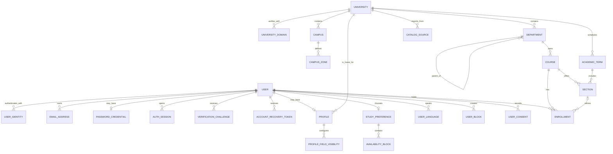
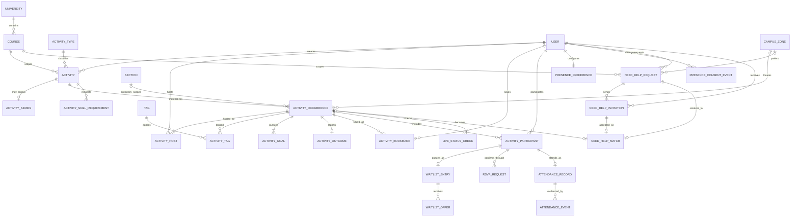
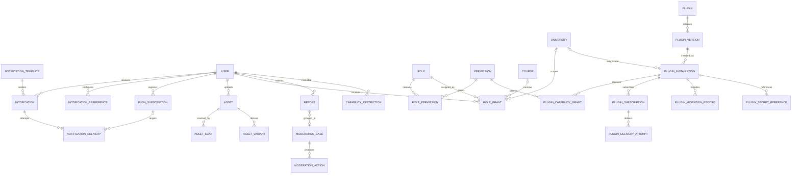
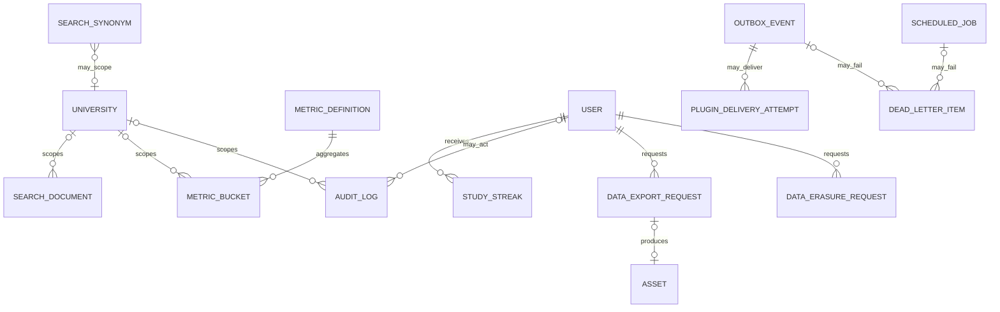
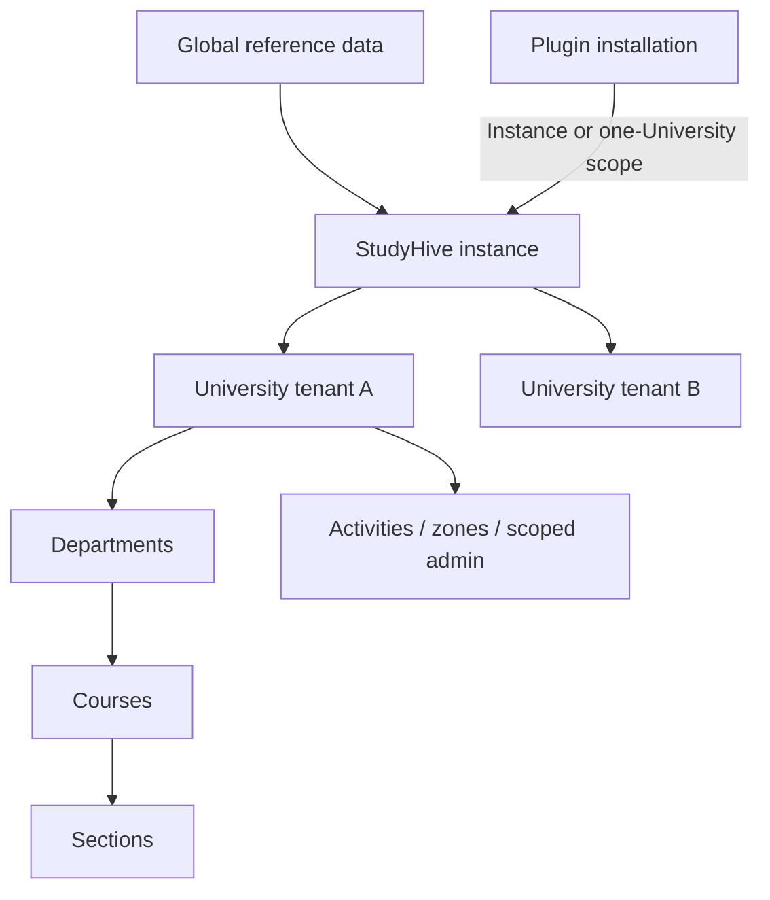

# Part 4 — Database Design Specification

**Product:** StudyHive / StudyHang (working name)  
**Status:** canonical data-layer engineering specification; no implementation code  
**Version:** 1.0 draft  
**Last updated:** 2026-08-04  
**Normative inputs:** finalized Parts 1–3

## 0. Scope and conventions

This document specifies the logical and physical-relational design of StudyHive data without providing SQL, SQLAlchemy models, or Alembic migrations. It preserves the modular-monolith, PostgreSQL-canonical, Redis-ephemeral, transactional-outbox, privacy, and plugin-isolation decisions in Parts 1–3.

### 0.1 Design principles

1. Normalize source facts; denormalize only rebuildable read projections or immutable historical snapshots.
2. Put business invariants in both domain policy and database constraints where PostgreSQL can express them safely.
3. Make tenant scope, ownership, lifecycle, audit, version, and deletion behavior explicit.
4. Keep external I/O outside database transactions; persist its intent first.
5. Treat Redis, search documents, recommendations, statistics, and scores as disposable projections.
6. Prefer UUID-compatible opaque keys, UTC instants, IANA timezones, controlled vocabularies, and explicit status transitions.
7. Preserve historical truth without retaining unnecessary personal or precise-location data.
8. Do not create generic polymorphic foreign keys for core integrity. Use typed bridge entities or validated extension boundaries.

### 0.2 Terminology

- **Tenant:** an instance-scoped university data boundary. The initial deployment may host one or many universities.
- **Canonical Activity occurrence:** the scheduled collaboration users discover and join. In storage it is `ActivityOccurrence`; product UI may call it an Activity.
- **Aggregate root:** the entity whose version controls a transactional consistency boundary.
- **Projection:** rebuildable data optimized for reads and never the sole source of a business fact.
- **Soft deletion:** logical removal with retention metadata; it is not anonymization or permanent erasure.
- **Restricted data:** authentication secrets, exact/private contact information, moderation evidence, device endpoints, and individual reliability details.

### 0.3 Global relational conventions

| Concern | Convention |
|---|---|
| Primary keys | Opaque UUID-compatible identifiers generated by the application or database; never expose sequential internal identifiers |
| Time | UTC timezone-aware instants; recurring wall-clock intent additionally stores IANA timezone and local day/time rule |
| Text | Unicode; normalized comparison fields stored separately only where needed; bounded lengths defined during implementation |
| Money | Not in current scope |
| Status | Controlled enum/check vocabulary with application state-machine enforcement |
| JSON | Reserved for bounded provider/plugin payloads, snapshots, and evolving configuration; not a substitute for core relationships |
| Tenant scope | `university_id` on university-owned roots and high-risk bridges/projections, even when derivable, to support safe scoped queries |
| Audit timestamps | `created_at`, `updated_at`; immutable facts use `occurred_at` and no mutable timestamp |
| Audit actors | `created_by_user_id`, `updated_by_user_id`, `deleted_by_user_id` where a human actor is meaningful; service actor captured in audit log |
| Version | Positive monotonic `version` on mutable aggregate roots and conflict-prone records; increment once per committed logical change |
| Soft delete | Nullable `deleted_at`, actor, and reason code on designated entities; active uniqueness uses a safe partial uniqueness strategy |
| External IDs | Provider/source plus provider-scoped identifier; never globally trust a provider identifier alone |
| Secrets | Only password hashes or secret-manager references; OAuth tokens, plugin secrets, and push endpoints are encrypted/restricted |

---

## 1. Domain model

| Domain | Purpose and responsibilities | Owned entities | Principal relationships | Future expansion |
|---|---|---|---|---|
| Identity | Internal identity, login methods, email verification, sessions, recovery, request idempotency | User, UserIdentity, EmailAddress, PasswordCredential, VerificationChallenge, AuthSession, AccountRecoveryToken, IdempotencyRecord | One User to many identities/emails/sessions | GitHub, Microsoft, university SSO, MFA, passkeys |
| Profiles and privacy | Student-facing profile, matching preferences, field visibility, availability, languages, blocks and consent | Profile, ProfileFieldVisibility, StudyPreference, AvailabilityBlock, UserLanguage, UserBlock, UserConsent | One User to optional Profile/preferences during onboarding; user-to-user block | Namespaced plugin panels, richer availability import |
| Academic catalog | University hierarchy, verification domains, campuses/zones, terms, courses, sections and membership | University, UniversityDomain, Campus, CampusZone, Department, AcademicTerm, Course, Section, Enrollment, CatalogSource | University contains catalog; Enrollment bridges User and Section/Course | SIS/LMS imports, cross-listed courses, consortiums |
| Activities | Authored Activity definition, recurrence, scheduled occurrences, hosts, tags, goals, outcomes and project-team requirements | ActivityType, Activity, ActivitySeries, ActivityOccurrence, ActivityHost, ActivityTag, Tag, ActivityGoal, ActivityOutcome, ActivitySkillRequirement, ActivityBookmark | Activity belongs to course; series expands to occurrences; participants join occurrences | Rich recurrence, templates, co-host transfer, persistent Project Teams |
| Participation and attendance | Capacity-bearing membership, waitlist/offers, RSVP prompts/responses, arrival and live-status evidence | ActivityParticipant, WaitlistEntry, WaitlistOffer, RSVPRequest, AttendanceRecord, AttendanceEvent, LiveStatusCheck | User joins occurrence; one attendance record per participant | Approval questions, richer check-in verification |
| Presence | Durable consent/preferences and campus-zone catalog; realtime state remains in Redis | PresencePreference, PresenceConsentEvent; CampusZone is catalog-owned | User chooses visibility/discoverability policy within University | Privacy-preserving federated campus signals; no movement history |
| Need Help Now | Short-lived help demand, bounded invitations and mutual acceptance | NeedHelpRequest, NeedHelpInvitation, NeedHelpMatch | Requester/course/zone; invitations target eligible Users; match creates an Activity occurrence | Richer group matching, office-hours/provider plugins |
| Reliability | Versioned evidence policy, immutable evidence, score projection, correction and appeal | ReliabilityPolicyVersion, ReliabilityEvidence, ReliabilityScore, ReliabilityAppeal | Evidence references participation/attendance; score belongs to User | Post-MVP reputation categories, fairness tooling |
| Compatibility and recommendations | Versioned deterministic policies, result projections, explanations and user controls | CompatibilityPolicyVersion, RecommendationProjection, RecommendationItem, RecommendationDismissal | Reads profile/catalog/Activity facts; projection belongs to User | Offline experiments and optional AI candidate generation |
| Messaging | Activity-scoped communication, membership, pins, attachments and moderation | Conversation, ConversationMember, Message, MessageAttachment, PinnedMessage | One occurrence to conversation; members/users; assets attach to messages | Course chat, direct messages, threads/reactions |
| Notes and resources | Versioned course resources, comments, reactions and bookmarks | Resource, ResourceVersion, ResourceAttachment, ResourceComment, ResourceReaction, ResourceBookmark | Resource belongs to course/author and optionally occurrence | Text extraction, collaborative notes, licensing workflows |
| Notifications | In-app notification, preferences, web-push subscriptions and channel delivery history | Notification, NotificationPreference, PushSubscription, NotificationDelivery, NotificationTemplate | Notification belongs to recipient and optional typed resource bridge | Firebase, Discord, Slack and digests |
| Storage | Provider-neutral asset metadata, quarantine/scan state and authorized ownership | Asset, AssetScan, AssetVariant | Assets attach through typed domain bridges | S3/MinIO/R2 lifecycle and CDN variants |
| Search | Rebuildable authorized search documents, terms and configuration | SearchDocument, SearchSynonym | Documents refer to one typed source entity | External engine checkpoint and indexing adapters |
| Administration | Scoped roles, permissions, reports, cases, actions and restrictions | Role, Permission, RolePermission, RoleGrant, Report, ModerationCase, ModerationAction, CapabilityRestriction | Grants bind users to scope; reports/cases target typed resources | Delegated safety teams, legal workflows |
| Plugins | Registry, versions, installation state, capabilities, config, subscriptions, delivery and migration history | Plugin, PluginVersion, PluginInstallation, PluginCapabilityGrant, PluginSubscription, PluginDeliveryAttempt, PluginMigrationRecord, PluginSecretReference | Installation is instance/university scoped; no core-table writes | Marketplace metadata, billing-free distribution, UI slots |
| Operations and audit | Durable events/jobs, dead letters, audit, exports and deletion workflows | OutboxEvent, ScheduledJob, DeadLetterItem, AuditLog, DataExportRequest, DataErasureRequest | References actors and opaque subjects without enforcing unsafe polymorphic FKs | External durable broker and compliance automation |
| Analytics | Privacy-safe metric definitions/buckets, streak and operational projections | MetricDefinition, MetricBucket, StudyStreak | Derived from canonical events/outcomes; university-scoped with suppression | Warehouse export, differential privacy, cohort analysis |

Domain ownership controls writes. Cross-domain reads go through application interfaces or documented projections; database foreign keys protect identity and tenant consistency but do not grant another module mutation rights.

---

## 2. Entity catalog

### 2.1 Lifecycle and deletion codes

| Code | Meaning |
|---|---|
| **Hard** | Delete when expired/revoked; no product history requires retention |
| **Soft** | Logical delete, restorable during retention, later purge/anonymize |
| **Immutable** | Append-only fact; corrected by a superseding fact, not mutation |
| **Projection** | Rebuildable and replaceable; delete whenever source/policy invalidates it |
| **Archive** | Retained historical record; operational payload may be reduced after retention |

### 2.2 Identity, profile, and academic entities

| Entity | Purpose and lifecycle | Ownership | Key relationships | Deletion strategy |
|---|---|---|---|---|
| User | Internal account and security state; pending → active → suspended/disabled → erased | Identity | Parent of profile, identities, memberships, content and grants | Soft; erasure pseudonymizes identity while preserving required facts |
| UserIdentity | Provider subject linked to User | Identity | Many identities → one User | Hard after safe unlink; retain audit fact |
| EmailAddress | Normalized email, verification and university-domain evidence | Identity | Many emails → User; optional UniversityDomain | Hard/anonymize on erasure unless retention required |
| PasswordCredential | Current password hash/security metadata | Identity | Zero/one → User | Hard on password disable or erasure |
| VerificationChallenge | One-time email/identity verification challenge | Identity | User/email | Hard after use/expiry; short retention for abuse telemetry |
| AuthSession | Revocable session family/device metadata | Identity | Many → User | Hard after expiry/revocation retention |
| AccountRecoveryToken | One-time password/account recovery proof | Identity | User/email | Hard after use/expiry |
| IdempotencyRecord | Stores stable result fingerprint for retryable operation | Identity/operations boundary | User/service principal + operation scope | Hard after operation-specific TTL |
| Profile | Public/scoped student information and discoverability | Profiles | Exactly one → User; optional University/major text | Soft with User; versioned |
| ProfileFieldVisibility | Per-field visibility override | Profiles | Many → Profile | Hard when reset/profile erased |
| StudyPreference | Controlled matching choices and preference version | Profiles | Exactly one → User | Soft/resettable; historical policy result keeps snapshots only |
| AvailabilityBlock | Coarse recurring available interval | Profiles | Many → StudyPreference | Hard on edit; audited via profile version/event |
| UserLanguage | Controlled/free normalized language association | Profiles | Bridge User ↔ language vocabulary | Hard on removal |
| UserBlock | Directional safety block | Profiles/safety | blocker User → blocked User | Soft only for audited unblock history; active edge hidden |
| UserConsent | Versioned acceptance/withdrawal of privacy/terms feature consent | Profiles/privacy | User + consent policy/version | Immutable events; latest derived status |
| University | Primary tenant/catalog root | Academic | Parent of campus, departments, terms, courses, roles | Soft/archive; restrict while active dependents exist |
| UniversityDomain | Approved email domain and verification policy | Academic | Many → University | Soft; never invalidates historical verification automatically |
| Campus | Physical/online campus grouping and timezone context | Academic | Many → University; parent of zones | Soft/archive |
| CampusZone | Approved coarse presence/Activity venue zone | Academic | Many → Campus/University | Soft/archive; references retained historically |
| Department | University hierarchy node | Academic | Many → University; self parent optional; courses | Soft/archive or merge redirect |
| AcademicTerm | University-local term/semester | Academic | Many → University; sections | Archive after end |
| Course | Stable course identity/catalog metadata | Academic | Department/University; many sections/enrollments/Activities | Soft/archive or merge redirect |
| Section | Term-specific course offering | Academic | Course + AcademicTerm; optional parent/cross-list group | Archive after term |
| Enrollment | User membership in course/section and verification source | Academic | Bridge User ↔ Course; optional Section | Archive membership history; active row may end |
| CatalogSource | Provenance/import cursor for catalog data | Academic | University and imported entities | Archive versions; secret refs external |

### 2.3 Activity, participation, presence, and help entities

| Entity | Purpose and lifecycle | Ownership | Key relationships | Deletion strategy |
|---|---|---|---|---|
| ActivityType | Stable controlled type such as Study Session or Project Team Formation | Activities/config | Referenced by Activity | Archive/deactivate; never rename stable key destructively |
| Activity | Authored collaboration definition and aggregate root | Activities | Course, creator, type, optional series; parent of occurrences | Soft for draft; archive after terminal occurrences |
| ActivitySeries | Weekly recurrence rule and revision | Activities | One Activity; many occurrences | Archive; preserve rule revision used by each occurrence |
| ActivityOccurrence | Canonical scheduled Activity instance and state | Activities | Activity, course/section snapshot, location/zone, hosts, participants | Archive; never erase to alter attendance history |
| ActivityHost | Host/co-host association and role | Activities | Bridge occurrence ↔ User | Archive with occurrence; end-dated transfer |
| Tag | Normalized discoverability label scoped globally or to university | Activities/config | Many-to-many with occurrences/resources | Soft/deactivate/merge |
| ActivityTag | Tag bridge | Activities | Occurrence ↔ Tag | Hard on current edit; change captured in occurrence audit/version |
| ActivityGoal | Required purposeful goal and estimate | Activities | One primary and optional secondary goals → occurrence | Archive with occurrence |
| ActivityOutcome | Factual completion outcome, topics and actual duration | Activities/live | Zero/one → completed occurrence; reporter User optional | Archive; correction creates revision/audit, not silent overwrite |
| ActivitySkillRequirement | Project Team Formation skill/opening requirement | Activities | Many → Activity/occurrence | Archive with Activity |
| ActivityBookmark | Private user save | Activities | User ↔ occurrence | Hard on removal/erasure |
| ActivityParticipant | Capacity-bearing participation aggregate | Participation | Unique User + occurrence; parent of RSVP/attendance | Archive; status transitions retained |
| WaitlistEntry | Ordered queue membership | Participation | Participant/occurrence | Archive terminal state long enough for fairness/audit |
| WaitlistOffer | Time-bounded offer for one vacancy generation | Participation | Entry, occurrence, participant | Immutable/Archive; never reuse an offer |
| RSVPRequest | Prompt generation, deadline and response | Participation | Participant + occurrence | Archive with participation; response fields immutable after finalization |
| AttendanceRecord | Current attendance outcome per participant | Attendance | Participant + occurrence | Archive; correction versioned and evidenced |
| AttendanceEvent | Append-only arrival/status/correction fact | Attendance | AttendanceRecord, actor, prompt | Immutable; retention follows reliability/audit policy |
| LiveStatusCheck | Continue/end prompt and response window | Attendance/live | Occurrence; optional responder | Archive after occurrence |
| PresencePreference | Durable default visibility intent, discoverability consent and duration | Presence | One → User/University policy | Soft/reset on account erasure |
| PresenceConsentEvent | Evidence of explicit visible/invisible/consent change; excludes exact location history | Presence/privacy | User + policy/version | Immutable short/regulated retention |
| EphemeralPresence | Redis-only live zone/intent/expiry record; not a PostgreSQL table | Presence | Opaque User, University, CampusZone | TTL/hard delete; missing means invisible |
| NeedHelpRequest | Short-lived course-scoped help demand | Need Help | Requester, course, optional zone; invitations/match | Archive minimal outcome; purge free-text by retention |
| NeedHelpInvitation | Bounded candidate invitation and response | Need Help | Request + candidate User | Archive compact status for caps/fairness; purge detail |
| NeedHelpMatch | Atomic mutual match and generated meetup reference | Need Help | Request, accepted invitation, occurrence | Archive with resulting Activity |

### 2.4 Reliability, recommendations, communication, and resources

| Entity | Purpose and lifecycle | Ownership | Key relationships | Deletion strategy |
|---|---|---|---|---|
| ReliabilityPolicyVersion | Immutable scoring policy parameters/effective window | Reliability | Referenced by evidence calculations/scores | Immutable |
| ReliabilityEvidence | One classified source outcome per policy/source | Reliability | User, occurrence, participation/attendance source | Immutable; supersede on correction |
| ReliabilityScore | Current private rebuildable score/band/evidence count | Reliability | One current projection per User/policy | Projection; replace/rebuild |
| ReliabilityAppeal | User appeal, review and correction decision | Reliability/moderation | User, evidence, case/reviewer | Archive under moderation retention |
| CompatibilityPolicyVersion | Immutable weights/adjacency/coverage rules | Recommendations | Used by projection/item explanations | Immutable |
| RecommendationProjection | Versioned result set for one user/context | Recommendations | User, policy, source generation | Projection with short retention |
| RecommendationItem | Ranked candidate and explanation snapshot | Recommendations | Projection → occurrence or permitted User candidate | Projection; cascade with projection |
| RecommendationDismissal | User feedback/control to suppress a candidate | Recommendations | User + typed candidate + expiry | Hard after expiry or erasure |
| Conversation | Activity-scoped communication channel | Messaging | Occurrence; members/messages | Archive; content retention configurable |
| ConversationMember | Authorized member and read state | Messaging | Conversation ↔ User | Archive membership; remove private read markers on erasure |
| Message | Authored message and moderation state | Messaging | Conversation, author, optional reply-to Message | Soft for user deletion; tombstone preserves thread |
| MessageAttachment | Typed asset bridge | Messaging/storage | Message ↔ Asset | Hard bridge; asset lifecycle reference-counted/policy-based |
| PinnedMessage | Pin association and actor | Messaging | Conversation ↔ Message | Hard on unpin; audit administrative pin changes |
| Resource | Course note/resource logical identity and metadata | Resources | Course, author, optional occurrence | Soft; archive or takedown state |
| ResourceVersion | Immutable content revision | Resources | Resource, asset/Markdown body, author | Immutable; purge binary only by policy/takedown |
| ResourceAttachment | Additional typed asset bridge | Resources/storage | ResourceVersion ↔ Asset | Hard bridge; asset handled separately |
| ResourceComment | Threaded bounded comment | Resources | Resource, author, optional parent comment | Soft/tombstone |
| ResourceReaction | Controlled reaction/like | Resources | User ↔ Resource | Hard on removal |
| ResourceBookmark | Private saved resource | Resources | User ↔ Resource | Hard on removal/erasure |

### 2.5 Notifications, storage, administration, plugins, and operations

| Entity | Purpose and lifecycle | Ownership | Key relationships | Deletion strategy |
|---|---|---|---|---|
| NotificationTemplate | Versioned type/channel rendering metadata | Notifications/config | Notification references template/version | Archive old versions |
| Notification | In-app recipient-owned actionable record | Notifications | Recipient User; optional typed context/action | Archive then purge by retention |
| NotificationPreference | User category/channel/quiet-hours policy | Notifications | User + category | Soft/resettable |
| PushSubscription | Encrypted web-push endpoint and key material | Notifications | User/device | Hard on revoke/invalid/erasure |
| NotificationDelivery | Per-channel attempt and provider result | Notifications | Notification + channel + attempt generation | Archive operational metadata; purge provider detail |
| Asset | Provider-neutral object metadata and state | Storage | Uploader/tenant; typed attachment bridges | Soft/quarantine cleanup; object purge when unreferenced/policy permits |
| AssetScan | Immutable scanner result/version | Storage | Asset | Archive security result; limit raw diagnostic retention |
| AssetVariant | Derived safe image/preview representation | Storage | Parent Asset | Cascade/hard with parent object purge |
| Role | Stable built-in or scoped role definition | Administration | Permissions and grants | Deactivate; built-in keys immutable |
| Permission | Stable capability vocabulary | Administration | Roles/plugins reference | Deactivate; stable keys immutable |
| RolePermission | Role-to-permission bridge | Administration | Role ↔ Permission | Hard on policy change with audit |
| RoleGrant | User role at instance/university/course scope | Administration | User, Role, exactly one valid scope | Soft/revoke; grant/revoke audited |
| Report | User-submitted safety/moderation report | Administration | Reporter; typed target; optional case | Archive restricted evidence; reporter deletion pseudonymizes |
| ModerationCase | Scoped triage/investigation aggregate | Administration | University/scope, reports, assignees, actions | Archive restricted; legal retention configurable |
| ModerationAction | Immutable action such as hide/remove/restrict | Administration | Case, actor, typed target | Immutable; reversal is another action |
| CapabilityRestriction | Time-bounded restriction on user capability/scope | Administration | User, case/action, permission key | Archive after expiry; active query optimized |
| Plugin | Stable plugin identity/publisher | Plugins | Versions/installations | Soft/delist; installations preserved |
| PluginVersion | Immutable manifest and compatibility metadata | Plugins | Plugin; installations/migrations | Immutable |
| PluginInstallation | Instance/university-scoped lifecycle/config root | Plugins | PluginVersion, installer, scope | Disable then archive/uninstall tombstone |
| PluginCapabilityGrant | Explicit capability and resource scope | Plugins | Installation + Permission/scope | Revoke/soft history; never implicit |
| PluginSubscription | Versioned event subscription/callback metadata | Plugins | Installation | Soft/disable with installation |
| PluginDeliveryAttempt | Signed event delivery attempt/result | Plugins | Installation/subscription/outbox event | Archive then purge operational payload |
| PluginMigrationRecord | Plugin-owned schema migration history | Plugins | Installation + version/migration key | Immutable |
| PluginSecretReference | Opaque secret-manager locator and rotation metadata | Plugins | Installation | Hard reference on uninstall; secret deleted externally |
| SearchDocument | Rebuildable typed search representation | Search | Typed source, tenant, source version | Projection; replace/delete on source event |
| SearchSynonym | Scoped normalized query synonym/config | Search | Instance/University optional scope | Soft/versioned config |
| OutboxEvent | Durable after-commit event publication record | Operations | Aggregate identity/version; producer module | Archive/partition then purge after replay horizon |
| ScheduledJob | Durable due work, lease, attempts and deterministic key | Operations | Optional typed subject; handler key | Hard/archive after completion retention |
| DeadLetterItem | Failed event/job/delivery requiring operator action | Operations | Source work/event, error class | Archive after resolution; redact payload |
| AuditLog | Append-only privileged/security/business audit fact | Audit | Actor principal, tenant, typed target | Immutable/partitioned; retention/pseudonymization policy |
| DataExportRequest | Asynchronous user export lifecycle and asset | Audit/privacy | Requesting User, output Asset | Purge export object quickly; retain request outcome |
| DataErasureRequest | Account deletion/erasure workflow and checkpoints | Audit/privacy | User, approvals/checks | Archive minimal compliance outcome |
| MetricDefinition | Stable privacy-safe metric key, unit and aggregation rule | Analytics | Metric buckets | Deactivate/version |
| MetricBucket | Time/scope aggregate with suppression metadata | Analytics | Metric, university/course optional scope | Projection/archive/partition |
| StudyStreak | Private rebuildable streak projection | Analytics | User + policy/source version | Projection; delete on erasure |

### 2.6 Future placeholders

Future capabilities are named for reservation and extension planning but do not receive empty production tables in the MVP: persistent `ProjectTeam`/`ProjectTeamMember`, direct-message conversation type, friend relationships, anonymous post-Activity feedback, category reputation scores, AI artifacts, calendar connections, LMS/SIS sync jobs, institution consortiums, and billing. A future module must supply its own PRD, privacy/threat model, ownership, lifecycle, migration, and deletion contract before adding entities.

### 2.7 Concept-to-entity mapping

Some planning terms intentionally do not create additional tables:

| Concept | Canonical representation |
|---|---|
| Activity occurrence | `ActivityOccurrence`; `Activity` holds the authored definition and optional `ActivitySeries` rule |
| Administrator | `User` plus scoped `RoleGrant`; there is no duplicate administrator identity |
| Compatibility profile | User `StudyPreference` plus Activity/Occurrence compatibility fields, evaluated under `CompatibilityPolicyVersion` |
| Search index | `SearchDocument` projection plus PostgreSQL indexes; it is not a second source entity |
| Presence record | `EphemeralPresence` in Redis; PostgreSQL stores only preference and consent facts |
| RSVP response | Final response fields and generation on `RSVPRequest`; one prompt has at most one final response |
| Participant history | Current `ActivityParticipant` plus immutable/archived prompt, offer and attendance facts |
| Activity location | Optional approved `CampusZone` plus an occurrence-safe display/modality snapshot; no student coordinate entity |

---

## 3. Entity relationship diagrams

The complete logical model is split into bounded diagrams so cardinality remains readable. Repeated entities are boundary references to the same canonical entity, not duplicate tables. Subtype-like behavior uses type/status fields and typed bridges rather than relational table inheritance unless a future subtype has distinct mandatory attributes.

### 3.1 Identity, profile, and academic catalog

### 3.2 Activities, participation, presence, and Need Help

### 3.3 Reliability, recommendations, messaging, and resources

```mermaid
erDiagram
    USER ||--o{ RELIABILITY_EVIDENCE : accumulates
    RELIABILITY_POLICY_VERSION ||--o{ RELIABILITY_EVIDENCE : classifies
    ACTIVITY_PARTICIPANT ||--o{ RELIABILITY_EVIDENCE : supports
    USER ||--o{ RELIABILITY_SCORE : has_projection
    RELIABILITY_POLICY_VERSION ||--o{ RELIABILITY_SCORE : calculates
    RELIABILITY_EVIDENCE ||--o{ RELIABILITY_APPEAL : may_be_appealed
    USER ||--o{ RELIABILITY_APPEAL : submits

    COMPATIBILITY_POLICY_VERSION ||--o{ RECOMMENDATION_PROJECTION : governs
    USER ||--o{ RECOMMENDATION_PROJECTION : receives
    RECOMMENDATION_PROJECTION ||--o{ RECOMMENDATION_ITEM : contains
    ACTIVITY_OCCURRENCE o|--o{ RECOMMENDATION_ITEM : may_recommend
    USER ||--o{ RECOMMENDATION_DISMISSAL : dismisses

    ACTIVITY_OCCURRENCE ||--o| CONVERSATION : owns
    CONVERSATION ||--o{ CONVERSATION_MEMBER : includes
    USER ||--o{ CONVERSATION_MEMBER : joins
    CONVERSATION ||--o{ MESSAGE : contains
    USER ||--o{ MESSAGE : authors
    MESSAGE o|--o{ MESSAGE : replies_to
    MESSAGE ||--o{ MESSAGE_ATTACHMENT : attaches
    ASSET ||--o{ MESSAGE_ATTACHMENT : backs
    CONVERSATION ||--o{ PINNED_MESSAGE : pins
    MESSAGE ||--o{ PINNED_MESSAGE : is_pinned

    COURSE ||--o{ RESOURCE : contains
    USER ||--o{ RESOURCE : authors
    ACTIVITY_OCCURRENCE o|--o{ RESOURCE : contextualizes
    RESOURCE ||--|{ RESOURCE_VERSION : versions
    RESOURCE_VERSION ||--o{ RESOURCE_ATTACHMENT : attaches
    ASSET ||--o{ RESOURCE_ATTACHMENT : backs
    RESOURCE ||--o{ RESOURCE_COMMENT : discusses
    USER ||--o{ RESOURCE_COMMENT : authors
    RESOURCE_COMMENT o|--o{ RESOURCE_COMMENT : parent_of
    USER ||--o{ RESOURCE_REACTION : reacts
    RESOURCE ||--o{ RESOURCE_REACTION : receives
    USER ||--o{ RESOURCE_BOOKMARK : saves
    RESOURCE ||--o{ RESOURCE_BOOKMARK : saved_as
```

### 3.4 Notifications, administration, storage, and plugins

### 3.5 Search, analytics, jobs, events, and audit

The typed targets on `SearchDocument`, `Notification`, `RecommendationItem`, `Report`, `ModerationAction`, `AuditLog`, `OutboxEvent`, and `ScheduledJob` use a constrained target type plus opaque target ID. These operational/projection entities deliberately cannot have one relational foreign key spanning many source tables. Application validation, producer ownership, tenant scope, and reconciliation protect those references. Core transactional relationships use real foreign keys.

---

## 4. Table specification

### 4.1 Shared column profiles

The profiles below prevent repeating boilerplate while still making every entity's requirements explicit.

| Profile | Required columns and rules |
|---|---|
| **Mutable aggregate** | PK `id`; `created_at`, `updated_at`; creator/updater when meaningful; positive `version` default 1; status; optional soft-delete triplet only when catalog says Soft/Archive |
| **Owned child** | PK `id`; required owner FK; timestamps; optional version only if edited independently; deletion follows relationship policy |
| **Immutable fact** | PK `id`; stable business/dedupe key; `occurred_at`; producer/actor; source/policy version; no `updated_at` except restricted operational annotations |
| **Bridge** | PK or composite logical identity; two required FKs; created timestamp/actor; unique active pair; status/end time if historical membership matters |
| **Projection** | PK `id`; owner/scope; source generation/policy version; `calculated_at`; expiry/stale marker; unique current projection identity; rebuildable |
| **Tenant-owned** | Required `university_id`; foreign keys and unique keys include/validate the same tenant; cross-tenant reference prohibited |

Implementation must not infer nullable behavior from an ORM default. Every column described as required is `NOT NULL` conceptually; optional means nullable. Defaults are server-side for timestamps/status/version and application-supplied for policy-sensitive values.

### 4.2 Identity and profile table specifications

| Entity / profile | Primary and business identity | Domain columns and nullable/default rules | Foreign keys, uniqueness, status, deletion |
|---|---|---|---|
| User / Mutable aggregate | PK `id`; public opaque `public_id` unique | required account status default `pending`, locale/timezone; optional last-authenticated time; version/audit | status controlled; soft-delete fields; public ID never reused |
| UserIdentity / Owned child | PK; business `(provider, provider_subject)` | provider, subject required; claims version; optional verified-at/display metadata | User required; provider+subject unique; hard unlink if another login remains |
| EmailAddress / Owned child | PK; business normalized email | original and normalized email required; primary flag default false; verified-at optional; verification source optional | User required; normalized email unique according to instance identity policy; at most one active primary/User |
| PasswordCredential / Mutable aggregate | PK; one per User | password hash/algorithm parameters required; changed-at; failed-security metadata; compromised-at optional | User required/unique; no soft delete; hard remove; versioned |
| VerificationChallenge / Immutable/expiring | PK; secret lookup digest unique | purpose, digest, expires-at, consumed-at optional, attempt count default 0 | User/email optional according to purpose; hard expiry; digest not raw token |
| AuthSession / Mutable aggregate | PK; session token digest/family ID unique | issued/expires/last-seen, revoked-at/reason optional, device label/IP risk digest optional | User required; status derived active/revoked/expired; hard purge after retention |
| AccountRecoveryToken / Immutable/expiring | PK; token digest unique | created/expires/consumed-at, purpose, request risk metadata | User required; hard purge; raw token never stored |
| IdempotencyRecord / Expiring | PK; business `(principal, operation, idempotency_key)` | request fingerprint, outcome status, response reference/safe snapshot, expires-at | User optional for service principal; unique business identity; hard TTL |
| Profile / Mutable aggregate | PK; User unique | display name required; photo Asset optional; University required after onboarding; major, graduation year, bio, study-time summary optional; discoverability default university-only | User/University required as applicable; versioned/soft with User |
| ProfileFieldVisibility / Bridge | PK; business `(profile, field_key)` | field key and visibility required; default inherited represented by row absence | Profile required; unique pair; hard reset |
| StudyPreference / Mutable aggregate | PK; User unique | controlled study style, interaction, pace, confidence, modality, duration, environment, learning method and preferred time values; matching enabled default true | User required; versioned; optional choices nullable to express missing coverage |
| AvailabilityBlock / Owned child | PK; business owner/day/start/end/timezone | weekday, local start/end, IANA timezone required; optional effective dates | StudyPreference required; no overlapping active blocks per owner; hard replace/edit |
| UserLanguage / Bridge | PK; business `(user, normalized_language)` | language key/label required; order optional | User required; unique pair; hard remove |
| UserBlock / Mutable relationship | PK; business `(blocker, blocked)` | created-at/reason category optional; ended-at optional; active default true | two User FKs, cannot self-block, at most one active directed pair; retain ended audit window |
| UserConsent / Immutable fact | PK; business `(user, policy_key, policy_version, event_generation)` | decision grant/withdraw, occurred-at, surface/source; optional evidence digest | User required; append-only; latest status derived; no raw location |

### 4.3 Academic catalog table specifications

| Entity / profile | Primary and business identity | Domain columns and nullable/default rules | Foreign keys, uniqueness, status, deletion |
|---|---|---|---|
| University / Tenant mutable aggregate | PK; public slug and canonical key unique | legal/display name, country, default IANA timezone required; logo Asset/support/policy URLs optional; status default pending | versioned/soft/archive; slug not silently reused |
| UniversityDomain / Tenant child | PK; business `(university, normalized_domain)` | domain, verification method/status, effective dates; source optional | University required; globally unique active domain unless explicitly shared/verified policy; soft |
| Campus / Tenant child | PK; business `(university, campus_key)` | name/key/timezone required; address/geo centroid optional and non-user-specific; status active default | University required; unique key in tenant; soft/archive |
| CampusZone / Tenant mutable aggregate | PK; business `(campus, zone_key)` | name, coarse description, zone type required; optional safe map geometry/provider place ID; presence enabled default true | Campus and same University required; unique key; versioned/soft/archive |
| Department / Tenant mutable aggregate | PK; business `(university, department_code)` | code/name required; parent optional; status active default; merge target optional | University required; parent/merge target same tenant and acyclic; versioned/soft |
| AcademicTerm / Tenant mutable aggregate | PK; business `(university, term_key)` | name/key/start/end/timezone required; status planned default | University required; unique key; date ordering; archive |
| Course / Tenant mutable aggregate | PK; business `(university, normalized_course_code)` | code/title required; description/level optional; status active; merge target optional | University/Department required and same tenant; unique active normalized code; versioned/soft/archive |
| Section / Tenant mutable aggregate | PK; business `(course, term, section_code)` | section code required; title/instructor display/source optional; status active | Course/Term required same tenant; unique business tuple; versioned/archive |
| Enrollment / Historical bridge | PK; business `(user, course, section-or-none, enrollment_kind, active-period)` | membership role/status, verification source, joined/ended-at; status active default | User/Course required; Section optional and must belong to Course; one active equivalent membership; archive/end, not destructive cascade |
| CatalogSource / Tenant mutable aggregate | PK; business `(university, source_key)` | source type/key/status, last cursor/sync times/error class; config JSON optional; secret reference optional | University required; unique key; versioned; archive |

### 4.4 Activity and participation table specifications

| Entity / profile | Primary and business identity | Domain columns and nullable/default rules | Foreign keys, uniqueness, status, deletion |
|---|---|---|---|
| ActivityType / Reference | PK; stable type key unique | localized label/description keys, enabled default true, policy flags; sort order | No tenant unless custom types are later allowed; deactivate, never recycle key |
| Activity / Tenant mutable aggregate | PK; public ID unique | title, description, visibility, modality, intended interaction, expected duration, capacity template and source timezone required; optional online/location text; status draft default | University, Course, creator, ActivityType required; Section optional; versioned/soft draft/archive later |
| ActivitySeries / Mutable aggregate | PK; Activity unique | frequency fixed weekly MVP, weekday/local start, duration, timezone, start/end/count, revision, materialization horizon; status active default | Activity required; valid max 16 occurrences/16 weeks; versioned/archive |
| ActivityOccurrence / Tenant mutable aggregate | PK; business `(activity, occurrence_key)` | scheduled start/end UTC, local date/time/timezone snapshot, title/description/capacity/visibility/modality/location snapshot, state default draft, check-in/live/end timestamps optional, series revision optional | Activity/Course/University required; Section/Zone optional same tenant; unique occurrence key; positive capacity; versioned/archive |
| ActivityHost / Historical bridge | PK; business `(occurrence, user, host_generation)` | host role primary/cohost, started/ended-at, granted-by; active default true | Occurrence/User required; exactly one active primary host; at least one active host for published nonterminal occurrence |
| Tag / Mutable reference | PK; business `(scope, normalized_key)` | label/key required; University optional for scoped tags; merge target/status | Optional University; unique active global or tenant key; soft/merge |
| ActivityTag / Bridge | PK or logical composite; business `(occurrence, tag)` | created-at/by only | Occurrence/Tag required; tenant scope compatible; unique pair; hard remove |
| ActivityGoal / Owned child | PK; business `(occurrence, ordinal)` | description and estimated minutes required; primary flag default false; status optional only after outcome | Occurrence required; at least one and exactly one primary for published; unique ordinal; archive |
| ActivityOutcome / Mutable historical fact | PK; Occurrence unique | goal status required default `not_reported`, actual duration/topics/team result optional, reported-at/by optional, reporting deadline and correction reason optional; version | Occurrence required and must be terminal/completed according to policy; versioned/archive, no delete |
| ActivitySkillRequirement / Owned child | PK; business `(activity, normalized_skill)` | skill label/key, openings required positive, proficiency optional, deadline optional | Activity required and type must permit; unique active skill; archive |
| ActivityBookmark / Bridge | PK; business `(user, occurrence)` | created-at; optional source surface | User/Occurrence required; unique pair; hard remove |
| ActivityParticipant / Mutable aggregate | PK; business `(occurrence, user)` | participation status, joined/left/removed timestamps, cancellation timing class, source, current RSVP generation, version | Occurrence/User required; unique pair; archive; one row reused through valid lifecycle rather than duplicate memberships |
| WaitlistEntry / Mutable child | PK; Participant unique | queue sequence, queued-at, status default queued, left/skipped-at and reason optional, version | Participant/Occurrence required; unique queue sequence per occurrence generation; archive terminal |
| WaitlistOffer / Immutable fact | PK; business offer token/generation unique | offered/expires/responded-at, response/status, vacancy generation required | WaitlistEntry/Participant/Occurrence required; one active offer per entry and vacancy generation; archive |
| RSVPRequest / Mutable prompt | PK; business `(participant, prompt_generation)` | requested/deadline/responded-at, response yes/no optional, delivery generation, removal-at optional, status pending default | Participant/Occurrence required; unique generation; final response immutable except audited correction |
| AttendanceRecord / Mutable aggregate | PK; Participant unique | current state, first check-in/arrival time, late estimate optional, finalized-at, correction version/reason optional; version | Participant/Occurrence/User consistency required; unique Participant; archive/no delete |
| AttendanceEvent / Immutable fact | PK; business `(attendance, event_generation)` | event type, occurred/recorded-at, actor type/ID, source, optional reason/evidence class | AttendanceRecord required; append-only; unique generation/source effect key |
| LiveStatusCheck / Mutable prompt | PK; business `(occurrence, check_generation)` | prompted/deadline/responded-at, response continue/end optional, responder optional, status pending default | Occurrence required; responder User optional and must be authorized; unique generation; archive |

### 4.5 Presence, Need Help, reliability, and recommendation specifications

| Entity / profile | Primary and business identity | Domain columns and nullable/default rules | Foreign keys, uniqueness, status, deletion |
|---|---|---|---|
| PresencePreference / Mutable aggregate | PK; User unique | default duration, intent, individually discoverable default false, Need Help invitation enabled, quiet hours/timezone optional, policy version | User/University required; versioned/soft reset; never stores current exact location |
| PresenceConsentEvent / Immutable fact | PK; business `(user, consent_generation)` | action visible/invisible/discoverability change, policy version, occurred-at, optional expiry; zone omitted or coarse only when audit requires | User required; append-only with bounded retention; no movement timeline product use |
| NeedHelpRequest / Tenant mutable aggregate | PK; public request ID unique | topic/description, mode, desired duration, expiry, status open default, matching generation, cancelled/closed reason optional; version | Requester/Course/University required; Zone optional same tenant; one active/requester enforced; archive then redact free text |
| NeedHelpInvitation / Mutable child | PK; business `(request, candidate, wave_generation)` | offered/expires/responded-at, response/status, rank reason codes, delivery generation | Request/Candidate required; unique tuple; invite caps indexed; archive compact result |
| NeedHelpMatch / Mutable aggregate | PK; Request unique | accepted-at, confirmed/cancelled/completed-at optional, status provisional/accepted/etc., matching policy version | Request/accepted Invitation/candidate/requester required; resulting Occurrence optional then unique; archive |
| ReliabilityPolicyVersion / Immutable config | PK; stable version key unique | effective window, event weights/decay/confidence/band parameters, config digest, published-at/by | Immutable; one active per effective instant; no delete after use |
| ReliabilityEvidence / Immutable fact | PK; business `(user, source_type, source_id, primary_classification_generation)` | classification, occurred/effective-at, weight input, corroboration/confidence, supersedes ID optional, excluded reason optional | User/Policy required; participant/attendance references where applicable; unique source effect; immutable |
| ReliabilityScore / Projection | PK; business `(user, policy, calculation_generation)` | score/band/evidence count/confidence, window start/end, calculated-at, source watermark, current flag | User/Policy required; one current/User; projection delete/rebuild; private |
| ReliabilityAppeal / Mutable aggregate | PK; public appeal ID unique | reason category/detail, status submitted default, submitted/resolved-at, decision/reason, version | User/Evidence required; reviewer/ModerationCase optional; archive restricted |
| CompatibilityPolicyVersion / Immutable config | PK; stable version key unique | weights, adjacency rules, minimum coverage default 60, formula/config digest, effective-at | Immutable after use; no delete |
| RecommendationProjection / Projection | PK; business `(user, context, policy, generation)` | context type/key, source watermark, calculated/expires-at, status ready default | User/Policy required; unique generation; short retention and replaceable |
| RecommendationItem / Projection child | PK; business `(projection, rank)` | candidate type/ID, rank, compatibility score nullable, coverage, reason codes/snapshot, rank components, eligibility checked-at | Projection required; candidate FK used when one type supports it, otherwise validated typed ref; unique rank and candidate/projection; cascade projection deletion |
| RecommendationDismissal / Expiring bridge | PK; business `(user, candidate_type, candidate_id)` | reason optional, created/expires-at, status active default | User required; typed candidate validated; unique active identity; hard after expiry/erasure |

### 4.6 Communication, resource, notification, and storage specifications

| Entity / profile | Primary and business identity | Domain columns and nullable/default rules | Foreign keys, uniqueness, status, deletion |
|---|---|---|---|
| Conversation / Mutable aggregate | PK; public ID unique | type activity default, status active, retention policy key; created/archived-at | Occurrence required and unique for Activity conversation; versioned/archive |
| ConversationMember / Historical bridge | PK; business `(conversation, user, membership_generation)` | role, joined/left-at, last-read-message/time optional, notification level | Conversation/User required; one active membership; archive, private cursor may purge |
| Message / Mutable content | PK; public ordered ID unique | body/type required, sent/edited/deleted-at, moderation status, client idempotency key, version | Conversation/author required; reply parent optional same conversation; unique client key/author/conversation; soft/tombstone |
| MessageAttachment / Bridge | PK; business `(message, asset)` | display order/caption optional | Message/Asset required; unique pair/order; hard bridge |
| PinnedMessage / Bridge | PK; business `(conversation, message)` | pinned-at/by | Message must belong to Conversation; unique pair; hard unpin with audit |
| Resource / Tenant mutable aggregate | PK; public ID unique | title, category/type, summary, visibility, status draft default, current version number, helpful count projection default 0 | Course/University/author required; Occurrence optional same course; versioned/soft/takedown/archive |
| ResourceVersion / Immutable child | PK; business `(resource, version_number)` | Markdown body optional, primary Asset optional, checksum/content type/size snapshot, change note, created-at/by | Resource required; at least body or Asset; unique version; immutable |
| ResourceAttachment / Bridge | PK; business `(resource_version, asset)` | purpose/order/caption optional | Version/Asset required; unique pair/order; hard bridge |
| ResourceComment / Mutable content | PK; public ID unique | body, created/edited/deleted-at, moderation status, version | Resource/author required; parent optional same Resource; soft/tombstone |
| ResourceReaction / Bridge | PK; business `(resource, user, reaction_type)` | type controlled, created-at | Resource/User required; unique tuple; hard remove |
| ResourceBookmark / Bridge | PK; business `(resource, user)` | created-at | Resource/User required; unique pair; hard remove |
| NotificationTemplate / Immutable config | PK; business `(template_key, version)` | category, supported channels, localization/render schema, priority/default TTL; enabled | Unique key/version; archive old; user content never embedded in template config |
| Notification / Mutable aggregate | PK; public ID unique | category, title/body-safe rendering data, priority, created/read/acted/expires-at, status created default, dedupe key, action type/ID optional | Recipient User/Template required; unique recipient+dedupe key when present; archive/purge |
| NotificationPreference / Mutable aggregate | PK; business `(user, category)` | in-app/web-push/email booleans, quiet-hours/timezone, digest mode; version | User required; unique category; default from policy when row absent; soft/reset |
| PushSubscription / Mutable aggregate | PK; endpoint digest unique | encrypted endpoint/key material, user agent/device label, created/last-used/invalid-at, status active | User required; endpoint globally unique; hard revoke/purge |
| NotificationDelivery / Mutable attempt group | PK; business `(notification, channel, delivery_generation)` | provider, status pending default, attempt count, next attempt, sent/delivered/failed-at, provider message ID/error class optional | Notification required; PushSubscription optional; unique generation; archive/purge detail |
| Asset / Mutable aggregate | PK; public asset ID unique | provider/key, original filename, declared/detected type, bytes/checksum, state quarantined default, visibility, created/ready/rejected/deleted-at, scan generation, version | Uploader User optional for system assets; University optional; provider+key unique; soft then object purge |
| AssetScan / Immutable fact | PK; business `(asset, scanner, definition_version, scan_generation)` | result, scanned-at, engine/definition, safe error class; raw report optional restricted/short-lived | Asset required; unique generation; archive |
| AssetVariant / Owned child | PK; business `(asset, variant_key, source_version)` | provider/key, type, bytes, checksum, width/height/pages optional, status | Asset required; provider+key unique; cascade object purge |

### 4.7 Authorization, moderation, and plugin specifications

| Entity / profile | Primary and business identity | Domain columns and nullable/default rules | Foreign keys, uniqueness, status, deletion |
|---|---|---|---|
| Role / Mutable reference | PK; stable role key unique | label, description, scope type, built-in flag, status active, version | Built-in role keys immutable; custom role University optional; deactivate/soft |
| Permission / Reference | PK; stable permission key unique | description, risk class, delegable flag, status active | No delete once referenced; deactivate |
| RolePermission / Bridge | PK; business `(role, permission)` | granted-at/by; optional constraint config | Role/Permission required; unique pair; hard change with audit |
| RoleGrant / Mutable historical bridge | PK; business grant ID unique | scope type, granted/expires/revoked-at, reason, status active, version | User/Role required; University/Course nullable according to scope and mutually constrained; no overlapping duplicate active grant; soft/revoke |
| Report / Tenant mutable aggregate | PK; public report ID unique | target type/ID, category, detail/evidence Asset optional, severity, status submitted default, created-at; version | Reporter User required; University/scope derived and required where applicable; archive restricted |
| ModerationCase / Tenant mutable aggregate | PK; public case ID unique | status open, severity, queue, summary, assigned-at/resolved-at, confidential notes location; version | University optional for instance cases; assignee User optional; archive restricted |
| ModerationAction / Immutable fact | PK; action ID unique | action type, target type/ID, reason code/detail, starts/ends-at, occurred-at, reversal-of optional | Case/actor required; typed target validated; immutable; reversal separate |
| CapabilityRestriction / Mutable aggregate | PK; business `(user, permission, scope, generation)` | starts/ends-at, reason, status active, version | User/Permission/Action required; optional scope FKs constrained; archive after expiry |
| Plugin / Mutable aggregate | PK; globally stable plugin key unique | publisher/name/description/homepage, trust status, created/updated, version | Soft/delist; key never reused |
| PluginVersion / Immutable child | PK; business `(plugin, semantic_version)` | manifest/schema digest, core compatibility range, artifact digest/signature, released-at, status | Plugin required; unique version; immutable/quarantine status may change with audit |
| PluginInstallation / Mutable aggregate | PK; public installation ID unique | scope type, status installed default, config encrypted/JSON bounded, installed/enabled/disabled-at, health, version | PluginVersion/installer required; University optional by scope; one active installation/plugin/scope; archive/uninstall |
| PluginCapabilityGrant / Mutable historical bridge | PK; business `(installation, permission, resource_scope, generation)` | constraint config, granted/revoked-at/by, status | Installation/Permission required; scope within installer ceiling; archive/revoke |
| PluginSubscription / Mutable aggregate | PK; business `(installation, event_type, callback_key)` | event major version, callback secret reference, status, created/disabled-at, version | Installation required; unique active subscription; soft/disable |
| PluginDeliveryAttempt / Mutable attempt | PK; business `(subscription, event, delivery_generation)` | status, attempt/next-attempt, HTTP/result class, sent/completed-at | Subscription/OutboxEvent required; unique generation; archive/purge payload |
| PluginMigrationRecord / Immutable fact | PK; business `(installation, migration_key)` | plugin schema version, checksum, started/completed-at, status, safe error class | Installation/PluginVersion required; unique key; immutable completion |
| PluginSecretReference / Mutable secret locator | PK; business `(installation, secret_key)` | secret-manager locator, rotated/last-used-at, status; no secret value | Installation required; unique key; hard reference on uninstall/rotation history audit |

### 4.8 Search, analytics, operations, and audit specifications

| Entity / profile | Primary and business identity | Domain columns and nullable/default rules | Foreign keys, uniqueness, status, deletion |
|---|---|---|---|
| SearchDocument / Projection | PK; business `(source_type, source_id, projection_version)` | tenant/scope, title/body/tags/code normalized fields, weighted search vector, visibility attributes, source version, indexed-at, status | University optional by public type; one current/source; projection replace/delete |
| SearchSynonym / Mutable config | PK; business `(scope, normalized_term, normalized_synonym)` | term/synonym, direction, locale, status active, version | University optional; unique active tuple; soft |
| MetricDefinition / Immutable/config | PK; metric key/version unique | name, unit, aggregation kind, dimensions allowlist, suppression threshold, retention class | Version immutable after bucket use; deactivate |
| MetricBucket / Projection | PK; business `(metric, bucket_start, bucket_size, dimension_hash, generation)` | bucket end, allowed dimension values, count/sum/min/max as applicable, suppressed flag, source watermark, calculated-at | Metric required; University/Course optional and consistent; unique business tuple; partition/archive |
| StudyStreak / Projection | PK; business `(user, policy_version)` | current/longest count, period boundaries, last qualifying date, calculated-at, source watermark | User required; one current policy projection; rebuild/delete |
| OutboxEvent / Immutable operational | PK event ID; business `(aggregate_type, aggregate_id, aggregate_version, event_type)` | producer module, event type/version, minimal payload, occurred/available-at, publish status/attempts/published-at | Unique business tuple; optional tenant; append-only then archive/partition |
| ScheduledJob / Mutable operational | PK; deterministic job key unique | handler, due-at, priority, payload/reference, state pending, lease owner/until, attempts/max, next-at, completed-at, source generation | Optional tenant/typed subject; version; hard/archive after completion retention |
| DeadLetterItem / Mutable operational | PK; business `(source_type, source_id, failure_generation)` | error class/redacted detail, first/last failed-at, attempts, status open, resolution/action | Optional Outbox/Job/Delivery refs; unique generation; archive |
| AuditLog / Immutable fact | PK time-sortable ID; business event ID unique | actor type/user/service, action, target type/ID, tenant/scope, outcome, reason, trace ID, bounded before/after metadata, occurred-at | User/University optional; append-only; no secret/private content; partition/retention |
| DataExportRequest / Mutable workflow | PK; public request ID unique | requested/started/completed/expires-at, status queued default, format, failure class, version | User required; output Asset optional; archive outcome, purge asset after expiry |
| DataErasureRequest / Mutable workflow | PK; public request ID unique | requested/verified/started/completed-at, status, retention exceptions summary, checkpoint/version | User required; archive minimal compliance proof; restricted |

---

## 5. Relationship and referential-action policy

### 5.1 Default actions

| Relationship class | On parent deletion | Reason |
|---|---|---|
| Canonical historical fact → User | Restrict physical deletion; pseudonymize User instead | Attendance, reliability and moderation history must remain truthful |
| Tenant catalog parent → active child | Restrict | Prevent orphan courses/sections/Activities and cross-tenant drift |
| Soft-deletable root → owned current child | Application-managed soft delete or retain | Database cascade cannot express retention/privacy policy safely |
| Ephemeral token/session → User | Cascade hard delete only during verified erasure workflow | These records have no independent historical value |
| Projection → projection item | Cascade hard delete | Rebuildable result set has no independent child value |
| Asset → variant/scan | Cascade only after object/reference purge eligibility | Prevent metadata/object orphaning |
| Optional contextual link | Nullify only when history remains understandable | Example: optional Activity link on a Resource; never nullify required tenant/owner |
| Bridge row | Restrict or end-date when relationship is historical; cascade when purely personal/rebuildable | Enrollment/host membership is history; bookmark/reaction is not |

Physical database cascades are limited to safe, tightly owned, non-audited children such as projection items, expired token children, or asset variants during a controlled purge. Business deletions use application workflows that can audit, notify, revoke, and enqueue object/search cleanup.

### 5.2 Many-to-many bridges

Bridges are first-class when the relationship carries state or history: Enrollment, ActivityHost, ActivityParticipant, ConversationMember, RoleGrant, PluginCapabilityGrant, and UserBlock have their own IDs, timestamps, statuses, and versions as needed. Pure bridges—ActivityTag, bookmarks, reactions, attachments, RolePermission—enforce a unique active pair and normally hard-delete on removal.

### 5.3 Self-references and hierarchies

- Department parentage is same-university, acyclic, and shallow by policy. Moving a node is versioned and audited.
- Message reply and ResourceComment parent links must remain within the same conversation/resource. Deleted parents become tombstones.
- Reliability evidence may reference `supersedes_evidence_id`; chains must be acyclic and only the latest valid classification contributes.
- Moderation actions may reference a reversed action; reversal never mutates the original fact.
- Course/Department merge targets must be same-university and cannot form loops. Queries resolve a bounded redirect chain.

### 5.4 Orphan handling

An orphan reconciler identifies unattached quarantined/ready Assets, stale projections, completed jobs beyond retention, typed references whose source was purged, plugin data after uninstall, and search documents behind/deleted sources. It never deletes based only on a missing cache entry. Material deletion requires source-state verification, retention eligibility, and an idempotent purge record.

---

## 6. Normalization

### 6.1 Normal forms

- **First normal form:** each core column stores one value. Multi-select preferences, languages, tags, hosts, participants, skills, deliveries and attachments use child/bridge rows. JSON is limited to bounded external/config/snapshot structures whose internal keys are not relational query dimensions.
- **Second normal form:** bridge attributes depend on the complete relationship identity. For example, Enrollment status depends on User + Course/Section membership, and ActivityTag has no occurrence-only descriptive fields.
- **Third normal form:** descriptive facts live with their owner. University timezone belongs to University/Campus, course title belongs to Course, profile belongs to User, template rendering belongs to NotificationTemplate, and plugin publisher metadata belongs to Plugin—not repeated in transactional children.
- **BCNF where useful:** provider identity is unique by provider + provider subject; course identity by University + normalized code; Section by Course + Term + section code; occurrence by Activity + occurrence key; participation by Occurrence + User; versioned policies by stable policy version.

### 6.2 Intentional denormalization

| Denormalized data | Why | Source and repair |
|---|---|---|
| `university_id` on high-risk roots/bridges | Fast, safe tenant-scoped queries and composite integrity | Derived from canonical parent; constraint/transaction validation and consistency job |
| Occurrence title/time/location/capacity/policy snapshot | Recurring occurrences must remain operationally independent and historically truthful | Copied from Activity/Series at materialization; later edits explicitly version selected occurrences |
| ActivityOutcome topic snapshot and actual duration | Preserves factual completion result | Report/correction workflow with version/audit |
| Current counts/status summaries | Avoid expensive dashboard/list aggregation | Projection updated from committed events; source-version watermark and reconciliation |
| ReliabilityScore, StudyStreak, recommendations | High-read deterministic calculations | Immutable evidence and versioned policy; fully rebuildable |
| SearchDocument | Text ranking across domains | Source events + periodic consistency sweep |
| MetricBucket | Admin dashboards without scanning facts | Outbox/domain events + scheduled recomputation; suppression metadata |
| Notification rendering data | Preserve what recipient was told even if source changes | Versioned template plus minimal safe context snapshot |
| Outbox minimal payload | Durable routing without cross-module synchronous read | Producer aggregate and version; consumers reload mutable detail |

No denormalized value is allowed to grant authorization. Hydration/search/recommendation reads re-check current source visibility and block/tenant policy.

---

## 7. Index strategy

Indexes are part of the query contract, not a checklist. Every production index must map to a measured/required access pattern, preserve tenant scope, and be verified with representative PostgreSQL query plans. Foreign keys do not automatically create supporting indexes and therefore receive explicit child-side indexes when parents are updated/deleted or joins are common.

### 7.1 Index classes

| Class | Use |
|---|---|
| Primary | Unique B-tree on every opaque PK; time-sortable IDs may improve append locality but are not required |
| Unique | Business identities, provider subjects, active bridges, idempotency keys, occurrence generation, source event effects |
| Composite | Equality tenant/scope/status fields first, then range/sort and stable ID tie-breaker |
| Partial | Active/nondeleted, unread, due, current, visible, pending/leased subsets to reduce size and write cost |
| GIN | PostgreSQL full-text vectors; selected array/JSON keys only if a real query cannot be normalized |
| Trigram | Names, course codes/titles, zone labels and tags for tolerant search/autocomplete |
| Covering | Small high-frequency projections where included columns avoid heap access; avoid sensitive/wide payloads |
| BRIN | Later for very large time-correlated append-only AuditLog/Outbox/MetricBucket partitions |

### 7.2 Required access-pattern indexes

| Query family | Leading key and order | Predicate / included data | Notes |
|---|---|---|---|
| User login by provider | provider, provider subject | active identities | Unique; constant-time lookup |
| Login by email | normalized email | verified/active as policy requires | Unique scope must match account-link policy |
| Session validation | session digest | active and expires-at > now | Digest unique; User/revoked lookup secondary |
| University catalog | university, status, normalized code/name | nondeleted | Department/Course/Term/Section each use stable ID tie-breaker |
| Course members | university, course, enrollment status, joined-at, user | active membership | Include section/role/verification class if it avoids extra read |
| Upcoming discovery | university, course optional, state, start-at, occurrence ID | visible/nondeleted/upcoming | Separate broad university and course-first variants only if both are hot |
| Host schedule | host User, state, start-at, occurrence | active ActivityHost | Partial active host bridge |
| Capacity/roster | occurrence, participation status, joined-at, participant ID | seat-bearing states | Capacity invariant uses transactional count/locked aggregate, not approximate index count alone |
| Waitlist | occurrence, status, queue sequence, entry ID | queued/active | Unique sequence within occurrence queue generation |
| Waitlist offer expiry | status, expires-at, offer ID | invited/active | Worker due scan |
| RSVP due/removal | status, deadline, request ID | pending | Worker claims in deadline order |
| Attendance roster | occurrence, current state, User | nondeleted | Host-authorized projection; index excludes private evidence payload |
| Live state clock | occurrence state, next transition due, ID | nonterminal | Due work normally in ScheduledJob; this supports reconciliation |
| Need Help active requester | requester, status | open/matching | Partial unique: one active request/requester |
| Need Help candidates/caps | candidate, created-at; request, wave, rank | active/recent | Supports hourly/daily caps and ordered wave responses |
| Presence durable prefs | User unique; university + invitation enabled | active | Live presence itself uses Redis keys/sets, not PostgreSQL indexes |
| Reliability current | User, current flag; policy, calculated-at | current projection | Unique current/User; evidence by User+effective time/source |
| Recommendations | User, context, current/expiry; projection+rank | current/nonexpired | Cover candidate type/ID, score/coverage/reasons only if bounded |
| Conversation messages | conversation, ordered sent-at/ID | visible/tombstone included | Cursor pagination; author/client key unique for idempotency |
| Notifications | recipient, read status, created-at desc, ID | nonexpired; unread partial | Delivery due by status/next-attempt |
| Moderation queue | university/scope, status, severity, created-at, case ID | open/in-review | Restricted index still requires authorization filters |
| Active restrictions | User, permission, scope, starts/ends | active/time-valid | Partial active; current time handled safely in query, not volatile predicate |
| Search | GIN weighted vector; trigram normalized title/code | current/visible projection, tenant/type | Authorization attributes remain query filters |
| Outbox | publish status, available-at, event ID | unpublished | Partial; aggregate type/ID/version unique |
| Scheduled work | state, due/next-at, priority, ID | pending/retry and unleased/expired lease | Claim batches in deterministic order |
| Audit/analytics | tenant, occurred/bucket-at, type/key | partition-local later | BRIN for time scans only after size justifies |

### 7.3 Index governance

- Migration review includes expected query, cardinality/selectivity, write amplification, index size class, build/rollback method, and tenant-prefix rationale.
- Stable cursor sorts always end with a unique key so pages neither duplicate nor skip tied rows.
- Partial uniqueness for soft-deleted entities applies only to active rows; a restore checks for replacement conflicts explicitly.
- `lower(column)` or normalized stored fields are used consistently; callers never alternate normalization strategies.
- JSON/config columns receive no blanket GIN index. Frequently queried keys graduate to normalized columns or a narrow expression index.
- Index usage, bloat, cache hit, write cost and duplicate indexes are reviewed periodically. Unused-index removal waits through a representative traffic window.

---

## 8. Query strategy

### 8.1 Query rules

All reads start with authorization scope: instance/university, membership, visibility, block relationships, lifecycle and moderation status. Pagination and ranking occur after those predicates. Application repositories expose intent-specific queries rather than arbitrary client-selected fields or generic unrestricted entity access.

| Workflow | Query path | Expected indexes / consistency |
|---|---|---|
| Login | Lookup UserIdentity by provider subject or EmailAddress by normalized email; load User status, credential/session and limited role bootstrap | Unique provider/email index; active sessions by digest; primary required, Redis session hints optional |
| Activity creation | Validate User verification/Enrollment, Course/Section/Zone same tenant, host restrictions and type; insert Activity/Occurrence/Goal/Host/outbox | Enrollment active composite; catalog PK + tenant; one short primary transaction |
| Activity discovery | Filter visible nonterminal Occurrences by university/course, time window, type/modality/tags/capacity; keyset sort by start and ID | Upcoming discovery partial composites, tag bridge; approximate counts may be projection but final state hydrated from primary/source |
| Nearby Activities | Resolve approved CampusZone or coarse proximity consent, then query occurrences by same University/Zone/time; never query student coordinates | Zone + occurrence start/state index; location is zone-level; presence is Redis-only |
| Course members | Active Enrollment scoped by Course/Section and profile discoverability; anti-join blocks/restrictions; stable member cursor | Course membership composite, UserBlock directional pairs, Profile tenant/status |
| Recommendations | Read current nonexpired projection by User/context; hydrate candidates and re-check current eligibility/visibility/capacity | Projection User/current/expiry and item rank; fallback uses discovery indexes |
| Need Help Now | Check one active Request/requester; candidate generation from course Enrollment/preferences/blocks plus Redis consented presence; invitations/caps queried by candidate/time | Partial unique active request; invitation candidate/time; course membership; primary for atomic match |
| Campus Presence | PostgreSQL reads consent/preferences and valid CampusZone; Redis reads opaque TTL presence and threshold aggregates | Unique preference/User and catalog PK; live presence never falls back to historical DB records |
| Search | Query tenant/type/visibility-scoped SearchDocument with GIN/trigram, rank, cursor; hydrate source and re-authorize | GIN vector, trigram name/code, tenant/type/current indexes |
| Notifications | Recipient-scoped unread/recent cursor; opening action re-authorizes source; deliveries claim due attempts | Recipient/read/created partial; delivery status/next-attempt |
| Admin dashboard | Read privacy-safe MetricBuckets and operational queue aggregates by scoped University/time; drilldown queries explicit cases, never raw location/reliability browsing | Metric key/scope/bucket; moderation queue composite; read replica permitted for stale-safe aggregates |

### 8.2 Pagination and batching

- Keyset pagination is default for Activities, messages, notifications, members, audit and admin queues. Cursor contains the ordered tuple, filter hash, tenant and projection generation where applicable.
- Offset pagination is limited to small stable configuration lists or admin pages where exact page numbers are valuable and bounded.
- ORM loading must avoid N+1 queries through explicit batch/select-in plans. Large one-to-many collections are paginated, never implicitly loaded with roots.
- Command transactions select only invariant-relevant columns and lock the narrowest deterministic rows.
- Analytics and backfills process bounded key ranges or time buckets, checkpoint progress, and yield between batches.

### 8.3 Read consistency

Read-after-write command responses use the primary transaction result. Capacity, participation, RSVP, attendance, authorization, plugin grants and security/session checks use the primary. Search, analytics, historical discovery and stale-tolerant projections may use replicas only with explicit lag bounds and primary fallback. A replica result never restores a permission or resource that the primary has revoked.

---

## 9. Transaction strategy

### 9.1 Transaction boundaries by workflow

| Workflow | Locks / checks | Atomic writes | After commit |
|---|---|---|---|
| Create Activity | Validate active User/Enrollment, same-tenant catalog, restriction, recurrence bounds | Activity, Series if any, first/materialized Occurrences, hosts, goals, audit and outbox; idempotency result | Schedule materialization/reminders, index and realtime invalidation |
| Edit Activity | Lock/version-check Activity/selected Occurrences; validate state and recurrence edit scope | New series revision and/or occurrence snapshots, audit/outbox, reschedule markers | Notify participants for material changes; rebuild search/recommendations |
| Join Activity | Lock Occurrence capacity boundary; check current state, duplicate participation, block/course/restriction | Participant confirmed or WaitlistEntry, audit/evidence intent/outbox/idempotency | Confirmation notification and live counts |
| Leave Activity | Lock Participant and Occurrence if seat-bearing; classify timing from server clock | Participant transition, attendance/RSVP closure as allowed, vacancy ScheduledJob, outbox/audit | Waitlist worker, notifications, realtime |
| Waitlist promotion | Claim job lease; lock Occurrence/vacancy and next eligible queued Entry | Close stale offer, create one offer for vacancy generation, update queue status/outbox | Send offer; schedule expiry |
| Accept waitlist | Lock Offer/Entry/Occurrence; verify deadline/capacity/eligibility | Offer accepted, Participant confirmed, vacancy consumed, RSVP work/outbox | Confirmation/realtime; duplicate acceptance returns original result |
| RSVP response/removal | Lock request and Participant; verify prompt generation/deadline/current state | Request response + Participant transition; on removal create vacancy work; outbox/audit | Roster update, notification/promotion |
| Attendance check-in | Lock Participant/Attendance; verify occurrence window and actor | Attendance event + current record/version + outbox | Host roster/reliability projection invalidation |
| Need Help creation | Lock/requester active-request key; verify caps/course/consent | Request/outbox/job/idempotency | Candidate wave query and invitations |
| Need Help acceptance | Lock Request and Invitation; verify candidate/requester/current expiry | Match winner, close competing invitations, optionally create Ad-Hoc Activity through same application transaction boundary, outbox | Notify parties/realtime |
| Recommendation update | No user command lock; read source watermark, compute outside write transaction | Short replace/upsert projection/items only if generation remains current | Cache/realtime invalidation |
| Plugin installation | Lock plugin/scope installation identity; validate compatibility and installer grant ceiling | Installation, capability grants, subscriptions, audit/outbox; secret references after secure provisioning protocol | Health check and separately controlled plugin migration/enable |
| Outbox publication | Claim batch with lease/skip-locked behavior | Mark attempt/progress after publish; event remains immutable | Consumers dedupe event ID; reconcile ambiguous publish result |

### 9.2 Consistency model

Canonical commands are strongly consistent within one PostgreSQL transaction. Cross-module derived views and external deliveries are eventually consistent through the outbox. The UI may optimistically display reversible intent, but seat assignment, waitlist offers, RSVP, attendance, Need Help match and reliability are server-confirmed.

External providers are never called while holding database locks. When a workflow requires provider setup before activation, it uses an intermediate state and compensation: for example an upload stays quarantined or a plugin stays installed/disabled until scan/health succeeds.

### 9.3 Isolation and deadlocks

Default isolation is read committed. Explicit row/advisory locks and unique/check constraints protect invariants. Lock order is: tenant/catalog root only if needed → Activity/Request/Installation aggregate → participant/offer child → operational job. Transactions do not lock user profile rows merely to read preferences. Deadlock/serialization errors receive a bounded whole-transaction retry with jitter and the same idempotency key.

---

## 10. Concurrency and idempotency

### 10.1 Optimistic locking

Mutable aggregate commands include the expected `version`. Updates match ID + expected version, increment once on success, and return a conflict with the current safe representation when zero rows match. This applies to Profile, StudyPreference, academic roots, Activity/Series/Occurrence, Participant, Attendance, NeedHelpRequest/Match, preferences, cases, plugin installations and workflows.

Child edits that alter an aggregate invariant increment the root version in the same transaction. Bulk administrative/import operations use source revision/checkpoint and explicit conflict policy rather than bypassing versions.

### 10.2 Race-condition controls

| Race | Resolution |
|---|---|
| Two students take last seat | Serialize on Occurrence capacity boundary; one confirms, next waitlists/rejects according to policy |
| Leave and join cross | Both lock the same Occurrence; vacancy generation prevents duplicate offer |
| Offer acceptance and expiry | Lock Offer then Occurrence; server deadline and current status select one terminal result |
| RSVP yes and auto-removal | Lock RSVPRequest/Participant; current prompt generation and deadline determine winner; removed seat is not resurrected |
| Attendance response and finalization | Lock AttendanceRecord; event generation and occurrence window; correction workflow after finalization |
| Host edit and clock transition | Expected Occurrence version/state; stale edit/clock job becomes conflict/no-op |
| Two Need Help candidates accept | Lock Request; only one transition to Matched; competing invitations close |
| User creates duplicate active Need Help | Partial unique active requester invariant plus idempotency record |
| Duplicate recurrence workers | Activity + occurrence key and series revision unique; second insert is no-op |
| Profile update during recommendation build | Worker stores source watermark and commits only if still current; otherwise refresh coalesced |
| Plugin enable and disable | Installation expected version/status; credentials granted/revoked in ordered lifecycle workflow |

Capacity is never enforced only through a cached counter. The database transaction counts/derives seat-bearing Participant states under the occurrence lock and checks against the authoritative occurrence capacity. A later physical schema may add a maintained seat counter if profiling proves necessary, but it remains protected by the same lock and reconciled.

### 10.3 Idempotency

Retryable creates/transitions accept a client idempotency key scoped to authenticated principal + logical operation. The database stores request fingerprint, in-progress/completed status and stable response reference for a bounded TTL. Reusing a key with a different fingerprint is a conflict. Worker/provider effects use deterministic keys—event ID + consumer, notification + channel + generation, job purpose + subject + schedule generation—and unique constraints make duplicates harmless.

At-least-once event consumers process old versions as no-ops, process the next expected version, and reload canonical state when a gap appears. Exactly-once external delivery is not claimed.

---

## 11. Soft deletion and retention

### 11.1 Policy by entity class

| Class | Examples | Behavior |
|---|---|---|
| User-managed soft delete | Profile, draft Activity, Message, Resource, Comment, Bookmark-independent roots | Hide immediately; preserve tombstone/relationships as needed; restore within retention if no conflict |
| Catalog archive | University, Campus, Zone, Department, Course, Section, ActivityType, Tag | Prevent new use while historical references render; merge redirect when applicable |
| Historical archive | Occurrence, Participant, Attendance, Outcome, Enrollment, ReliabilityEvidence | No ordinary delete/restore; retained/pseudonymized according to policy |
| Security hard expiry | Challenges, recovery tokens, old sessions, invalid push subscriptions, idempotency records | Permanently remove after short operational retention |
| Projection hard delete | Recommendations/items, SearchDocuments, current scores/streaks, stale cache metadata | Rebuild from source; delete on source/permission/policy invalidation |
| Restricted archive | Reports, cases, actions, appeals, AuditLog | Retain by safety/legal policy; tightly scoped; pseudonymize when possible |
| Object two-phase purge | Asset and variants | Mark deleted/unavailable, ensure no required references/holds, delete provider objects, retain minimal purge fact |

### 11.2 Restore and purge

Restore checks tenant status, parent existence, permissions, retention deadline, moderation/legal holds and active uniqueness conflicts. Restoring content does not restore expired sessions, presence, invitations, notification deliveries or old realtime state.

Permanent purge is an idempotent workflow with checkpoints: freeze/revoke access, identify retention exceptions, anonymize historical FKs where necessary, delete personal bridges/projections/search/cache, detach/purge eligible assets, request plugin export/erasure contracts, and record a minimal compliance outcome. Purge never rewrites attendance/reliability facts to misrepresent other users; it replaces the erased User's display identity with a non-reversible pseudonymous tombstone.

Retention durations are configuration backed by legal/product policy, not hardcoded in schema. Defaults must be documented before production and cannot be weakened per university below core safety/privacy minima.

---

## 12. Audit and history

### 12.1 Entity audit fields

Mutable business roots carry creation/update timestamps, actor IDs where applicable, and version. Soft deletion adds deleted timestamp/actor/reason. Administrative corrections add reason and source case/action. Immutable facts carry occurred-at, recorded-at when different, actor/service principal, source generation and policy version.

### 12.2 AuditLog coverage

Audit events are mandatory for authentication/recovery/session revocation; profile/privacy/consent and account export/erasure; catalog imports/merges; Activity publish/material edit/cancel/host transfer; participant administrative override; attendance correction; reliability policy/evidence correction/appeal; role/restriction changes; moderation; plugin lifecycle/capabilities/secrets reference rotation; and backup/migration administrative operations where the application observes them.

Audit metadata is bounded and redacted. It may store changed field names and safe before/after enums/IDs, but not passwords/tokens, message bodies, exact presence, raw provider responses, private appeal evidence, or plugin secrets. Detailed restricted evidence stays in its owner domain with separate access policy.

### 12.3 History strategy

- Aggregate `version` supports conflict detection, not full history.
- Important state transitions create domain facts/events in addition to AuditLog: AttendanceEvent, ReliabilityEvidence, ModerationAction, consent events, waitlist offers and outbox events.
- Ordinary profile/content edits rely on current row + audit field-change summary unless legal/product requirements later justify temporal history.
- Corrections append a superseding fact or create an audited new version; they do not erase the original security/business fact.
- AuditLog is append-only at the application role level and partition/retention ready. Access itself is security logged.

---

## 13. Alembic migration strategy

### 13.1 Workflow

1. Each schema change includes a single-purpose Alembic revision, design reference, ownership domain, compatibility analysis, lock/runtime class and test plan.
2. Feature branches rebase on the latest migration head before merge. The main branch normally maintains one head.
3. Concurrent legitimate heads require an explicit reviewed Alembic merge revision; developers do not edit applied revision identifiers.
4. CI creates an empty database, upgrades through every revision, validates metadata drift, and upgrades a representative previous-release snapshot.
5. Production runs an explicit migration job before traffic switches; application pods do not race to migrate on startup.

### 13.2 Expand–migrate–contract

- **Expand:** add backward-compatible nullable/default-safe columns, tables or indexes. Large indexes use PostgreSQL's online/concurrent mechanism where compatible with Alembic transaction behavior.
- **Migrate:** deploy dual-read/write when needed; backfill in resumable bounded batches with checkpoint, lag, error and row-count metrics.
- **Switch:** verify checksums/invariants and make new reads authoritative under a feature/release gate.
- **Contract:** in a later release, enforce non-null/constraints and remove obsolete structures after all supported versions stop using them.

### 13.3 Rollback and forward-only posture

Code rollback is supported across the documented compatibility window. Schema rollback is allowed only when demonstrably lossless and operationally safe. Destructive/data-transforming migrations are effectively forward-only: recover by fixing forward or restoring a verified backup, not by pretending irreversible data conversion can downgrade.

Every high-risk migration requires recent backup verification, estimated lock/disk impact, abort criteria, recovery procedure and self-host release note. Migrations do not fetch network resources or depend on mutable application services.

### 13.4 Data and seed migrations

Data migrations are idempotent, restartable, observable, ordered after structural expansion and separated from latency-sensitive DDL when large. They preserve original values until validation. Static baseline seeds use stable keys and upsert-like reconciliation through a dedicated seed command; business/user demo data is not embedded in schema migrations.

---

## 14. Seed data strategy

| Seed class | Initial contents | Ownership and update rules |
|---|---|---|
| Roles | Student, Host relationship semantics, Course Moderator, University Admin, Global/Instance Admin, service/plugin principal roles | Stable keys; built-in labels may localize; permission changes versioned and audited |
| Permissions | Profile, catalog, Activity, participation, attendance, presence, Need Help, moderation, admin and plugin capabilities | Deny by default; stable keys never recycled |
| Activity types | Study Session, Homework Group, Lab, Project Meeting, Project Team Formation, Exam Review, Research Discussion, Interview Practice, Office-Hours Meetup, Hackathon Prep, Ad-Hoc Help Meetup | Stable keys from PRD; deactivate rather than delete |
| Study vocabularies | Quiet Study, Discussion, Problem Solving, Coding, Exam Revision, Group Learning; interaction, pace, confidence, modality, duration, environment, learning method/time choices | Versioned controlled vocabulary; compatibility policy maps adjacency |
| Notification types/templates | Session confirmations/reminders, RSVP, waitlist, cancellation, attendance/live checks, Need Help, messages, security and moderation | Template versions immutable after use; locale fallback required |
| Reliability policy | Initial evidence classes, decay/confidence, New/bands and exclusions from finalized PRD | Immutable published policy version; deterministic fixtures |
| Compatibility policy | Weights totaling 100, adjacency, missing-value and minimum-coverage 60 rules | Immutable policy version; exact fixture outputs |
| System configuration | Retention classes, safe privacy thresholds/minima, quotas, job handlers, asset states | Instance overrides bounded by core safety requirements |
| Universities/departments | None beyond optional clearly marked development/demo fixture | Production supports any university; institutions enter via admin/import, never hardcoded |

Seed runs are repeatable: stable business keys identify records, checksum/version detects drift, and locally customized allowed fields are not overwritten silently. Production bootstrap creates the first instance administrator through a one-time secure flow, not a default credential.

---

## 15. Multi-tenancy

### 15.1 Boundary model

The self-hosted instance is the top operational boundary; University is the primary product tenant. Department and Course are authorization scopes inside a University, not separate database tenants. Global reference/config entities have no `university_id`; university-owned roots and sensitive bridges/projections carry it explicitly.

### 15.2 Isolation rules

- Tenant context derives from the authenticated membership/resource, never only from a request parameter.
- Foreign-key relationships between tenant-owned entities validate the same University, using composite constraints where useful or transactional checks plus reconciliation where physical design would become excessive.
- Repository list/search/update methods require an authorization scope and include `university_id` in predicates and leading indexes.
- Unique business identifiers are tenant-scoped unless globally meaningful (public opaque ID, provider subject, plugin key).
- Cross-university Activities, Enrollments, roles, zones and plugin grants are prohibited in MVP. Cross-scope moderation routes to an instance-level case without merging tenant data.
- Backups cover the instance database; tenant-level export/deletion is an application workflow, not a claim of physical tenant backup restoration.

PostgreSQL row-level security may be added as defense in depth for hosted SaaS after connection/service-role and operational implications are tested. Application authorization remains mandatory. Schema-per-tenant and database-per-tenant are rejected initially because migrations, connection pools, cross-instance operations and open-source support would become disproportionately complex.

### 15.3 Hosted SaaS readiness

Opaque IDs, explicit tenant columns, scoped uniqueness, tenant-aware indexes, per-tenant quotas/metrics, encryption key references and plugin installation scopes allow a hosted deployment. If regulatory or very large tenants later need stronger physical isolation, a tenant-placement directory can route selected Universities to separate databases without changing entity ownership; cross-database features would remain asynchronous and consented.

---

## 16. Plugin storage

### 16.1 Core-owned plugin metadata

Core PostgreSQL stores only registry/version/install/config metadata, capability grants, subscriptions, secret references, delivery attempts and migration status defined in Section 4. Plugin configuration is bounded, schema-validated, encrypted when sensitive and versioned. Secret values live in a secret manager or encrypted provider abstraction; the database stores opaque references.

### 16.2 Plugin-owned data

Plugins do not add foreign keys, triggers, columns or tables to core-owned schemas. Preferred isolation is a plugin-owned database. A self-host operator may offer a separate PostgreSQL schema/database with a distinct least-privilege role named by installation/plugin key; the core application role has no implicit write dependence on it.

Plugin records reference core objects only by opaque public IDs obtained through scoped APIs. Deletion/export/capability changes arrive as versioned events; plugins must implement idempotent retention/export/erasure contracts to qualify for relevant capabilities.

### 16.3 Plugin migrations and versions

- A PluginVersion declares its storage schema version and ordered migration checksums.
- Migrations run only during explicit install/upgrade while the plugin is disabled or in upgrading state.
- PluginMigrationRecord protects against duplicate/change-after-apply and records success/failure without exposing secrets.
- Failure leaves the plugin disabled and does not roll back a core release.
- Downgrade is supported only if the plugin declares a safe path; otherwise restore plugin-owned backup or fix forward.
- Uninstall revokes credentials/subscriptions first, then follows declared export/retention and operator-approved data purge.

Marketplace trust does not expand database rights. Plugin backup/restore compatibility and version range are displayed to the operator before upgrade.

---

## 17. Search storage

### 17.1 PostgreSQL representation

SearchDocument is a rebuildable, typed projection. It stores normalized title/code/body fragments, tags, weighted PostgreSQL full-text vector, tenant and visibility attributes, source version and indexing generation. Domain-specific source tables remain canonical. Student documents exclude hidden availability, exact reliability, email and presence. Location documents describe approved CampusZones, not user coordinates.

Tags remain normalized Tag + bridge relationships for filtering and integrity; their normalized labels also feed search documents. SearchSynonym provides reviewed locale/scope-specific expansion. Autocomplete queries use normalized code/name/tag fields with prefix/trigram indexes and minimum query/rate-limit rules.

### 17.2 Indexing lifecycle

1. Source transaction emits a versioned outbox event.
2. Search worker loads the current authorization-safe representation.
3. It replaces the document only when source version is newer, or removes it when deleted/hidden.
4. A periodic sweep compares source watermarks and repairs missed/stale documents.
5. Query hydrates source rows and re-checks current visibility before returning them.

Notes/resources enter content search only after ready/scan/moderation policy and text extraction. Extracted text is a derived Asset/Resource projection with retention linked to the source version.

### 17.3 External engine future

If PostgreSQL no longer meets measured relevance/latency/facet/language needs, the same SearchDocument contract is published to an external engine. Store engine document ID, indexed source version and checkpoint in the search module, not provider-specific IDs on every domain table. The engine is rebuildable and cannot be an authorization authority; deletion/privacy events receive highest-priority indexing and reconciliation.

---

## 18. Analytics storage

### 18.1 Metrics model

MetricDefinition controls unit, valid dimensions, aggregation, suppression threshold and retention. MetricBucket stores only approved time/scope aggregates and source watermark. It does not accept arbitrary high-cardinality dimension JSON. Individual product analytics remain in canonical facts/projections only where the user needs them, such as private StudyStreak and ReliabilityScore.

| Metric family | Canonical source | Stored aggregate examples | Privacy rule |
|---|---|---|---|
| Activity | Occurrence, Participant, Outcome | created/published/completed/cancelled, goal status, planned/actual duration | Suppress small tenant/course cohorts |
| Attendance | AttendanceRecord/Event | confirmation/arrival/no-show/correction rates | No admin individual productivity ranking |
| Need Help | Request/Invitation/Match | demand, time-to-match, acceptance/completion | Topic text excluded from default admin aggregates |
| Presence | Redis aggregate events, not raw paths | threshold-safe zone use/time windows | No individual history; small groups suppressed |
| Reliability | Evidence/appeals | policy coverage, confidence, appeal/overturn/fairness cohorts | Separate restricted fairness access; never leaderboard |
| Compatibility | Recommendation items/policy | score coverage bands, reason availability, join conversion | No public person ranking or hidden-preference dimension |
| Notifications | Delivery | delivery latency/failure/opt-out by category/channel | Provider endpoints and message bodies excluded |
| Operations | Jobs/outbox/API telemetry references | lag, retries, state-transition delay | Opaque IDs and short trace retention |

### 18.2 Aggregation and repair

Incremental consumers update or replace bounded buckets from committed events. A scheduled reconciliation recomputes closed/recent windows from canonical facts and source watermark. Late corrections update affected buckets through a new generation. Buckets are immutable per generation/current marker or versioned with deterministic inputs; silent manual edits are prohibited.

Study streak is a private projection based on qualifying completed collaboration dates and a published policy/timezone. It can be rebuilt and is deleted on erasure. Compatibility/recommendation statistics measure system quality/fairness rather than becoming student traits.

An external warehouse is deferred. If adopted, export only approved events/aggregates through a versioned privacy contract with deletion propagation, retention and tenant controls.

---

## 19. Archival and retention

| Data | Hot period behavior | Archive / purge behavior |
|---|---|---|
| Completed/cancelled/expired Activities | Queryable for user/course history, outcome, correction and reliability windows | Move old detail to historical partitions/read path only when volume requires; retain minimum factual snapshot |
| Participants/attendance/reliability evidence | Available through correction/appeal and private history | Pseudonymize erased users; retain policy-required facts; partition by occurrence/effective time later |
| Notifications/deliveries | Recent in notification center and retry operations | Archive compact status, then purge rendering/provider detail; unread does not imply indefinite retention |
| Presence | Current TTL only in Redis; durable consent events bounded | Expire/hard delete live state; retain only threshold-safe metric buckets and necessary consent proof |
| Need Help | Active through expiry/match and short support window | Redact/purge free text/invitation detail; retain compact outcome/cap/fairness facts |
| Messages/resources | Available according to Activity/course and moderation policy | Tombstone deleted content; archive/purge content/assets subject to reports/legal hold/user rights |
| Search/recommendation projections | Current and short stale fallback | Hard delete/rebuild; privacy/delete events prioritized |
| Outbox/jobs/DLQ | Hot through retry/replay/support horizon | Time-partition and purge after consumers/checkpoints and incident window permit |
| Audit/moderation | Restricted operational/legal window | Partition, encrypt/back up, pseudonymize where possible, purge by documented schedule/hold |
| Metric buckets | Recent dashboards at fine grain | Roll up older periods and remove fine-grained buckets; preserve suppression |

Archival is a lifecycle state/storage tier, not a change to Activity terminal state. Archived records remain subject to authorization, export, erasure exceptions, legal holds and restore tests. Archive jobs are idempotent, checkpointed and verify counts/checksums before source detail is removed.

---

## 20. Scalability

Registered-user counts are only planning markers; concurrency, hot-course density, message/presence rate, asset volume and retention determine actual capacity.

| Scale | Database posture | Likely data actions |
|---:|---|---|
| ~100 users | One PostgreSQL instance, conservative connection pool, automated backups | Normalized schema and ordinary B-tree/GIN indexes; no partitions/read replicas |
| ~1,000 users | Managed or well-operated PostgreSQL, PgBouncer-compatible pooling, slow-query review | Tune Activity/due-work/search indexes; move production objects to S3-compatible storage |
| ~10,000 users | HA primary, bounded per-runtime pools, replica for explicitly stale-safe reads | Partition only append-heavy audit/outbox/metrics if measured; archive notifications/events; worker batch tuning |
| ~100,000 users | HA/failover, read replicas, capacity-tested storage/IOPS, disciplined online migrations | Time partitions for large append streams, dedicated search if triggered, tenant/hot-key controls, warehouse export only if justified |

### 20.1 Growth strategy

- **Connection pooling:** set a global PostgreSQL connection budget, reserve operator/migration capacity, allocate per API/worker/realtime role, and queue/backpressure rather than multiplying pools with replicas. Transactions stay short; realtime gateways do not hold database connections per socket.
- **Read replicas:** only search hydration, historical discovery, analytics and other lag-tolerant reads. Primary handles permissions, sessions, capacity, participation, RSVP, attendance, matching and read-after-write.
- **Partitioning:** initially none. Later use time ranges for AuditLog, OutboxEvent, MetricBucket and possibly deliveries/attendance events when retention/vacuum/query evidence warrants. Keep current/due partial indexes small and partition pruning observable.
- **Archival:** roll up metrics, purge rebuildable projections and provider diagnostics, and preserve compact historical Activity facts before considering sharding.
- **Database maintenance:** monitor table/index growth, bloat, vacuum/analyze, long transactions, lock waits, checkpoint/WAL, connection saturation and replica lag. Load tests use realistic tenant/hot-course skew.
- **Bulk/import jobs:** checkpoint by stable keys, bound batches, yield, and avoid monopolizing locks/WAL. Large backfills are operational jobs, not one unbounded migration transaction.

### 20.2 Future sharding

Sharding is not an MVP strategy. If a single PostgreSQL cluster becomes the verified constraint, University is the natural placement key because most collaboration is university-scoped. A control-plane tenant directory would route requests and prohibit synchronous cross-shard transactions; global reference data would replicate, public opaque IDs remain globally unique, and instance-level moderation/search/analytics use asynchronous projections. Large-tenant isolation can precede general sharding.

Sharding is accepted only after vertical scaling, query/index repair, archival, pooling, replicas, partitioning and workload isolation no longer meet objectives. Its migration requires dual-routing/checkpoint/reconciliation design and a separate ADR.

---

## 21. Engineering decisions

| Decision | Why chosen | Alternatives considered | Tradeoffs and future improvement |
|---|---|---|---|
| One PostgreSQL database with module ownership | Strong cross-domain invariants and simple open-source operation | Database per module; NoSQL primary | Discipline enforced in code/reviews; physical extraction only on measured need |
| University as logical tenant | Matches product/admin/catalog boundary | Department tenant; instance-only scope; schema per university | Some instance-wide operations need explicit scope; tenant placement can later isolate large universities |
| Opaque UUID-compatible PKs plus separate business IDs | Safe public references and distributed creation | Sequential IDs only; natural-key PKs | Larger indexes than integers; choose ordered UUID variant only after benchmarking |
| Activity + ActivityOccurrence separation | Supports independent recurring capacity/RSVP/attendance/outcomes | One Activity row mutated weekly; duplicate standalone/recurring models | More joins/snapshots; prevents shared operational state and preserves history |
| Highly normalized source facts | Correct updates, constraints and migrations | Wide documents/JSON aggregates | More joins; projections handle high-read views |
| Typed bridges for core relationships | Relational integrity and clear ownership | Generic entity_type/entity_id everywhere | More tables; generic typed references limited to operations/projections where FK is impossible |
| PostgreSQL canonical, Redis presence ephemeral | Recoverable business state and self-expiring privacy | Store presence heartbeat history; Redis canonical | Redis loss hides presence; intentional privacy-safe degradation |
| Transactional outbox and durable jobs in PostgreSQL | Atomic state/event intent without another required broker | In-process callbacks; Redis queue; Kafka initially | Polling/storage overhead; dedicated broker can later consume outbox |
| Optimistic aggregate versions plus targeted locks | Clear conflicts and safe capacity/state transitions | Pessimistic locking everywhere; last-write-wins | Retry/conflict UX required; locks retained for contested invariants |
| At-least-once effects with idempotency records | Realistic crash/provider guarantees | Exactly-once claim; best-effort only | Storage/dedupe complexity; deterministic keys and retention policy required |
| Soft delete only where history/restoration needs it | Avoids universal hidden-row complexity | Soft delete every table; immediate hard delete | Per-entity policy is more explicit; purge orchestrator needed |
| Immutable evidence for attendance/reliability/moderation | Correctable without rewriting history | Editable score/status only; event sourcing entire system | Extra facts/projections; avoids full event-sourced application complexity |
| Rebuildable score/search/recommendation/analytics projections | Fast reads and policy evolution | Compute every request; treat projection as source | Reconciliation and watermark required; canonical sources remain auditable |
| PostgreSQL FTS/trigram for MVP | Minimal operations and tenant-aware filtering | External search immediately | Advanced relevance may require later engine; projection contract preserves migration path |
| Limited JSON for plugin/config/snapshots | Supports versioned extension boundaries | EAV model; JSON for whole domain | JSON schema/version validation required; queryable core fields stay relational |
| Plugins own separate persistence | Prevents schema/security coupling | Plugin columns/tables in core schema; arbitrary DB access | More operator/plugin complexity; reference SDK and optional isolated DB provisioning later |
| Alembic expand–migrate–contract | Safe rolling/self-host upgrades | Destructive in-place migrations; auto-migrate on app startup | More releases/temporary dual logic; substantially safer rollback posture |
| No partitioning at launch | Avoids operational complexity without volume evidence | Partition all event/history tables now | Later online conversion may require work; time-key conventions keep path open |
| Read replicas only for declared stale-safe queries | Prevents authorization/capacity anomalies | Route all reads to replicas | Less read offload; correctness takes priority |
| Configurable retention bounded by core minima | Supports self-host legal contexts | One hardcoded global policy; unlimited retention | Documentation/validation burden; prevents tenant config weakening safety/privacy |

### 21.1 Rejected shortcuts

- A single generic `activities` JSON document containing participants, goals, attendance and chat.
- Persistent exact Campus Presence or location history.
- Public reliability/compatibility ranking columns on User/Profile.
- Reusing a waitlist offer, RSVP prompt, attendance fact, notification delivery or outbox event after its generation ends.
- Database triggers that call networks/plugins or hide cross-module workflows.
- Plugin direct access to core tables.
- Hardcoded university/department production seed data.
- Treating a soft-delete flag as compliance erasure.
- Using a cache/search/replica result to authorize access.

### 21.2 Deferred physical decisions

Exact PostgreSQL types/lengths, enum-vs-check implementation, UUID variant, generated columns, composite tenant foreign keys, row-level security, index include lists, partition thresholds, numeric retention durations, encryption extension/provider, and pool sizes are selected during implementation with compatibility/load/security evidence. Their choices must preserve this document's identities, nullability, lifecycle, ownership, invariants and privacy model.

---

## Database implementation handoff checklist

Before data-layer implementation begins, the engineering team should translate this DDS into reviewed SQLAlchemy metadata and Alembic revisions while proving:

1. Every entity in Section 2 maps to a table, explicit deferred module, or documented Redis-only record.
2. Every table implements its Section 4 required/optional/default/unique/FK/status/audit/version/delete rules.
3. Cross-tenant references and duplicate active memberships/offers/requests fail under concurrent integration tests.
4. Capacity, waitlist, RSVP, attendance, Need Help and plugin lifecycle transactions match Sections 9–10.
5. Indexes have named query owners and representative query-plan fixtures.
6. Redis can be cleared and all durable business state/projections can recover appropriately.
7. Export, erasure, soft delete, archive and asset purge work across modules/plugins.
8. Migrations upgrade a blank database and supported previous-release snapshots without automatic destructive startup behavior.
9. ER diagrams, entity catalog and migration metadata change in the same review as material model changes.
