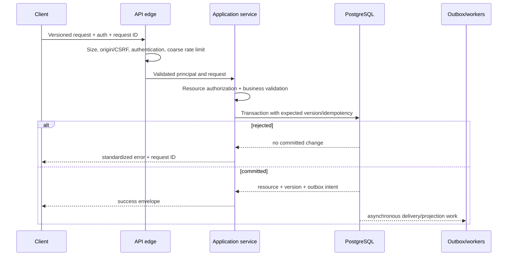
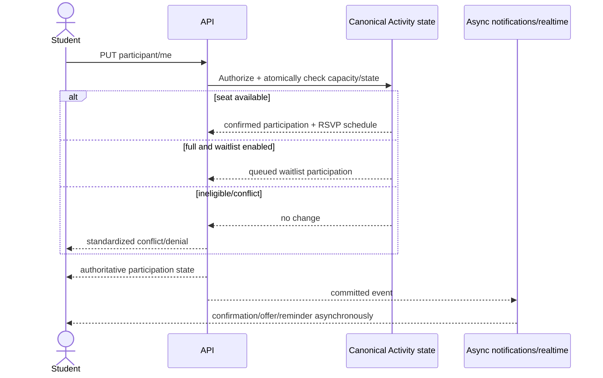
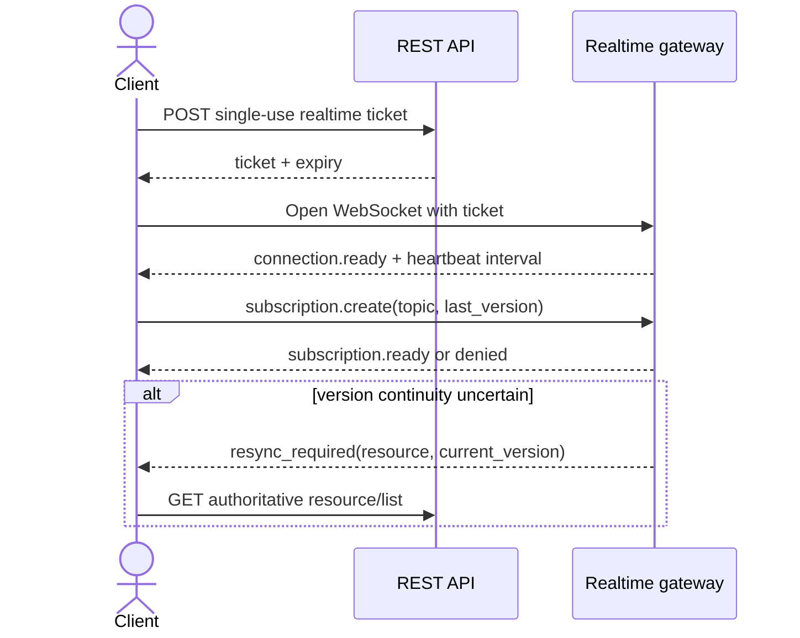
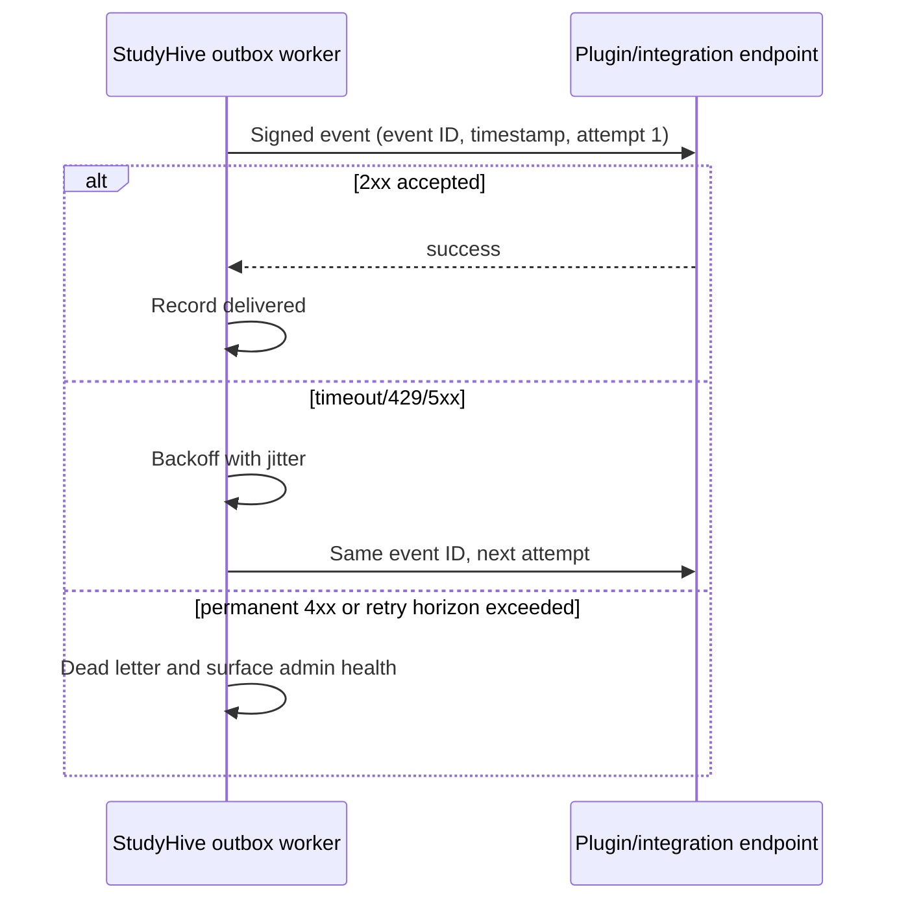

# Part 5 — API Specification

**Product:** StudyHive / StudyHang (working name)  
**Status:** canonical implementation-independent API contract  
**Version:** 1.0 draft  
**Last updated:** 2026-08-04  
**Normative inputs:** finalized Parts 1–4

## 0. Scope and contract language

This document defines the public and first-party HTTP/WebSocket contracts for StudyHive. It does not contain FastAPI route handlers, OpenAPI/Swagger documents, persistence code, or deployment configuration. Example JSON is normative for shape and semantics but illustrative for identifiers and values.

The words **MUST**, **MUST NOT**, **SHOULD**, and **MAY** define contract requirements. “Client” includes the first-party web app, future mobile apps, approved plugins, and third-party integrations operating under granted capabilities.

### 0.1 Contract boundaries

- REST responses are authoritative for business state.
- WebSocket messages provide low-latency invalidation/status and never replace authorization or canonical reads.
- Browser authentication uses secure server-managed sessions; plugins use scoped service credentials. Future mobile/public clients use the same resource contracts with an approved token profile.
- The product term **Activity** maps to the API resource `/activities`; storage-level Activity/Occurrence separation is not exposed as two competing public concepts.
- Campus Presence exposes a student's own state and privacy-safe aggregates. It never exposes exact location history.
- Compatibility and reliability are separate. Compatibility is viewer/context-specific; exact reliability is private and never globally searchable.

---

## 1. API overview

### 1.1 Base URL and versioning

All stable HTTP resources live below:

`https://{instance-host}/api/v1`

The major version appears in the path. Additive fields, new optional query parameters, new resource types, and new endpoints remain within `v1`. Removing/renaming a field, changing its meaning/type, tightening a previously valid request without a security reason, or changing lifecycle semantics requires a new major version or an explicit versioned media/operation contract.

Authentication browser redirects and infrastructure health probes may use documented non-resource paths, but their resulting API state uses `v1`. WebSocket envelopes and webhook events carry independent schema versions because they evolve differently from HTTP representations.

### 1.2 Naming conventions

| Concern | Convention |
|---|---|
| Paths | lowercase kebab-case; plural resource nouns; opaque IDs |
| JSON fields | lowercase snake_case |
| Resource types | stable singular snake_case, e.g. `activity`, `need_help_request` |
| Timestamps | UTC ISO 8601 with offset, normally `Z` |
| Timezones | IANA identifiers such as `America/Phoenix` |
| Durations | integer minutes for product durations; seconds only for protocol TTL/retry fields |
| Enums | lowercase snake_case stable keys; display labels localized by client/server metadata |
| Booleans | positive names where possible, e.g. `matching_enabled` |
| IDs | opaque strings; clients must not parse, sort, or infer type from them |
| Missing field | Unknown/not selected/not applicable according to field definition |
| Explicit `null` | Clear an optional mutable field when PATCH contract permits |

Pluralization uses ordinary stable English nouns (`activities`, `universities`, `people` is not used). Nested paths express ownership/action scope, not unlimited hierarchy. Paths generally stop at two nested resources.

### 1.3 HTTP semantics

| Method | Contract use | Idempotency |
|---|---|---|
| `GET` | Read/list/search; no business mutation | Safe and idempotent |
| `POST` | Create server-identified resource, command resource, or search too complex for query string | Retry only with `Idempotency-Key` where supported |
| `PUT` | Create/replace a client-addressable singleton or relationship, e.g. membership/presence/response | Idempotent by resource identity |
| `PATCH` | Partial update using documented fields and expected version | Idempotent only when repeated with same version/idempotency contract |
| `DELETE` | Remove relationship, revoke ephemeral resource, or request soft deletion | Idempotent; repeated success may return current terminal state |

Business transitions are modeled as resource updates or explicit command subresources when ordinary CRUD would obscure intent: cancellation, publication, waitlist response, moderation action, export, and erasure.

### 1.4 Authentication and authorization

The API accepts one principal profile per request:

1. **Anonymous:** only explicitly public discovery/bootstrap/auth operations.
2. **User session:** secure HttpOnly browser cookie plus CSRF protection for unsafe methods.
3. **Scoped bearer:** future mobile/user client or plugin service credential with audience, expiry, scopes, and installation identity.

Authorization combines role, relationship, resource attributes, tenant/university, verification, lifecycle, block/safety relationships, consent, and plugin capability. A successful list/search result is already filtered to authorized resources. Concealed resources return `404` rather than confirming existence.

### 1.5 Request lifecycle



Validation order avoids leaking concealed resources: authenticate, parse/coarse validate, derive authorization scope, load resource within scope, then apply resource-specific validation. External notifications/plugins never delay a successful domain transaction.

### 1.6 Response lifecycle

Every response includes a request ID. Success returns a resource/result envelope, appropriate cache validators, and no internal stack/provider details. Errors use one stable problem envelope. Mutations return the authoritative resource or operation state; clients do not need to guess which fields the server changed.

---

## 2. Resource catalog

| Resource | Canonical path | Scope/owner | Lifecycle summary |
|---|---|---|---|
| Session/authentication | `/auth/*` | Current principal | Login → active → refreshed/revoked/expired |
| Users | `/users` | Identity/Profile boundary | Active/suspended/erased; restricted public representation |
| Current profile | `/me/profile` | User | Create during onboarding → update → soft delete with account |
| Study preferences | `/me/study-preferences` | User | Optional → versioned update/reset |
| Availability | `/me/study-preferences/availability-blocks` | User | List/create/update/delete coarse blocks |
| Blocks | `/me/blocks` | User/safety | Active → removed; relationship remains safety-audited |
| Consents | `/me/consents` | User/privacy | Append grant/withdraw decisions |
| Universities | `/universities` | Academic catalog | Pending/active/archived/merged |
| Campuses/zones | `/universities/{id}/campuses`, `/campus-zones` | University | Active/archived |
| Departments | `/departments` | University | Active/archived/merged hierarchy |
| Courses | `/courses` | University/Department | Active/archived/merged |
| Sections | `/sections` | Course/term | Planned/active/archived |
| Enrollments | `/me/enrollments`, `/courses/{id}/members` | User/Course | Active/ended |
| Activity types/tags | `/activity-types`, `/tags` | Reference/University | Enabled/deactivated |
| Activities | `/activities` | Course/hosts | Draft → published/upcoming/check-in/live/ending → terminal/archive flag |
| Activity series | `/activity-series` | Host | Active/paused/ended/archived; weekly MVP |
| Hosts | `/activities/{id}/hosts` | Activity | Primary/co-host active/end-dated |
| Goals/outcome | `/activities/{id}/goals`, `/activities/{id}/outcome` | Activity | Goal required before publish; outcome after completion |
| Participants | `/activities/{id}/participants` | Activity/User | Confirmed/waitlisted/RSVP/attendance terminal states |
| Waitlists/offers | `/activities/{id}/waitlist`, `/waitlist-offers` | Activity/User | Queued → offered → accepted/expired/declined |
| RSVP | `/activities/{id}/participants/me/rsvp` | Participant | Pending → yes/no/removed |
| Attendance | `/activities/{id}/attendance` | Participant/Host | Not checked → arrived/late/cannot attend/no-show/completed |
| Live status checks | `/activities/{id}/live-status-checks` | Activity | Pending → continue/end/expired |
| Presence | `/me/presence`, `/presence/locations` | User/University | Invisible or temporary visible; TTL |
| Need Help requests | `/need-help-requests` | Requester/Course | Open/matching/matched/completed/cancelled/expired |
| Need Help invitations | `/need-help-invitations` | Candidate | Offered → accepted/declined/expired |
| Need Help matches | `/need-help-matches` | Matched users | Provisional/accepted/completed/cancelled |
| Reliability | `/me/reliability` | User/private | Versioned projection/history/appeal |
| Compatibility | `/compatibility` | Viewer/context | Deterministic computed result, not a public profile resource |
| Recommendations | `/recommendations` | User | Versioned projection and dismissals |
| Conversations/messages | `/conversations`, `/messages` | Authorized members | Active/archived; content may be tombstoned/moderated |
| Resources/notes | `/resources` | Course/author | Draft/ready/hidden/archived/taken down; versioned content |
| Assets/uploads | `/assets`, `/upload-intents` | Uploader/typed owner | Quarantine → scanning → ready/rejected/deleted |
| Notifications | `/notifications` | Recipient | Unread/read/acted/dismissed/archived/expired |
| Notification preferences | `/me/notification-preferences` | User | Category/channel preferences |
| Push subscriptions | `/me/push-subscriptions` | User/device | Active/revoked/invalid |
| Search/autocomplete | `/search`, `/search/autocomplete` | Authorized viewer | Read-only projections |
| Roles/permissions/grants | `/admin/roles`, `/admin/role-grants` | Scoped admins | Active/revoked; audited |
| Reports/cases/actions | `/reports`, `/admin/moderation-cases` | Reporter/scoped moderation | Submitted → triaged/in review/resolved/closed |
| Restrictions | `/admin/capability-restrictions` | Scoped admins | Scheduled/active/expired/revoked |
| Plugins/versions/installations | `/plugins`, `/admin/plugin-installations` | Operator/scoped admin | Discovered/installed/enabled/disabled/upgrading/uninstalled |
| Plugin capabilities/subscriptions | nested under installation | Installation | Granted/revoked, enabled/disabled |
| Webhook endpoints | `/admin/webhook-endpoints` | Operator/integration admin | Pending verification/active/disabled |
| Audit records | `/admin/audit-records` | Scoped admin | Append-only read/export under policy |
| Exports/erasure | `/me/data-exports`, `/me/data-erasure-requests` | User | Queued/running/ready/completed/failed |
| Admin metrics | `/admin/metrics` | Scoped admin | Read-only privacy-safe aggregates |

Internal outbox events, scheduled jobs, raw delivery attempts, raw search documents, and metric buckets are operational implementation resources and are not exposed to ordinary API clients. Restricted admin diagnostics may expose safe summarized views, not arbitrary database access.

---

## 3. Endpoint design

### 3.1 Shared endpoint contract profiles

Every endpoint row references the profiles below; resource sections add specific validation and business rules.

| Profile | Permissions | Validation/business rules | Success | Common failures | Idempotency / limit / future |
|---|---|---|---|---|---|
| **Public read** | Anonymous when explicitly marked; otherwise authenticated | Resource visibility and lifecycle filters applied before hydration | `200` resource/list; cache metadata where safe | `400`, concealed `404`, `429`, `503` | GET idempotent; public/IP limits; additive fields allowed |
| **Authorized read** | Authenticated plus relationship/scope | Block, tenant, privacy, state and field-level filtering | `200`; private cache controls | `401`, `403` or concealed `404`, `429` | GET idempotent; per-user read limit |
| **Create** | Verified User or scoped capability | Typed body, tenant relationships, quotas, restrictions and duplicate rules | `201` + `Location` + resource | `400`, `401`, `403`, `409`, `422`, `429` | `Idempotency-Key` required for retry-safe important creates; write limit |
| **Versioned update** | Owner/host/scoped admin | Allowed fields, `If-Match`/expected version, lifecycle and tenant invariants | `200` authoritative resource | `400`, `403/404`, `409`, `412`, `422`, `429` | Same key/body safe; future additive patch fields |
| **Relationship PUT** | Authorized principal | Relationship eligibility, current resource state, unique membership | `200` or `201` relationship state | `403/404`, `409`, `410`, `422`, `429` | Naturally idempotent by URL; contested effects server-confirmed |
| **Delete/revoke** | Owner or scoped admin | Deletion policy, holds/dependents, state | `200` terminal representation or `204` for contentless personal bridges | `403/404`, `409`, `410`, `429` | Repeated request returns/no-ops at same terminal state |
| **Transition command** | Relationship/scope-specific | Expected state/version, server time, prompt/offer generation | `200` operation/resource | `403/404`, `409`, `410`, `412`, `422`, `429` | Idempotency key or singleton command URL; strict limits |
| **Admin mutation** | Scoped moderator/admin with elevation when required | Tenant ceiling, reason, evidence, target state | `200/201` audited action | `401`, `403`, concealed `404`, `409`, `422`, `429` | Key required; lower limits; extensions cannot bypass audit |
| **Bulk** | Explicit admin/plugin capability only | Maximum batch, homogeneous scope/operation, item-level validation | `200` multi-result or `202` operation resource | Whole-request auth/shape errors; per-item status otherwise | Batch idempotency key; never available by default |

### 3.2 Collection conventions

All list endpoints support `page_size` and `page_after` unless explicitly small/unpaginated. Filters use documented repeatable parameters or comma-separated enum values, never arbitrary field expressions. Sorting uses an allowlisted `sort` value, prefixed with `-` for descending when supported. Bulk endpoints are omitted unless the catalog explicitly lists them; absence means unsupported, not an invitation to send arrays to create endpoints.

### 3.3 Identity, profile, and academic endpoints

| Method and path | Purpose/profile | Resource-specific contract |
|---|---|---|
| `GET /users/{user_id}` | Restricted profile view / Authorized read | University discoverability, shared course/context and blocks determine fields; never returns email, exact reliability, private availability or presence |
| `GET /users` | Discover permitted students / Authorized read | Requires University/course context; filters limited to course, study style/language/availability category; no reliability sorting; cursor paginated |
| `GET /me` | Current account bootstrap / Authorized read | Returns account state, verification, roles/scopes, profile completion and feature capabilities |
| `PATCH /me` | Locale/timezone and safe account settings / Versioned update | Does not edit role, email, University verification or reliability |
| `GET /me/profile` | Full own profile / Authorized read | Includes field visibility and completion warnings |
| `PUT /me/profile` | Create/replace onboarding profile / Create or versioned update | Display name and valid University required at onboarding completion; photo must be ready authorized Asset |
| `PATCH /me/profile` | Update selected profile fields / Versioned update | Controlled visibility and bounded content; moderation-hidden fields require correction flow |
| `DELETE /me/profile` | Not independently supported | Account erasure owns profile deletion; returns `405 method_not_allowed` with link to erasure resource |
| `GET/PUT/PATCH /me/study-preferences` | Read/create/update matching preferences | Missing values remain missing; controlled vocabulary; saving increments preference version and invalidates recommendations |
| `DELETE /me/study-preferences` | Reset optional preferences / Delete/revoke | Removes matching inputs, keeps consent/account; compatibility coverage falls accordingly |
| `GET/POST /me/study-preferences/availability-blocks` | List/create coarse blocks | Valid IANA timezone; non-overlap; bounded count; Create profile |
| `PATCH/DELETE /me/study-preferences/availability-blocks/{id}` | Edit/remove own block | Expected preference/version; no calendar event detail |
| `GET/POST /me/blocks` | List active own blocks; create block | Target User required; self-block invalid; creating is idempotent and immediately suppresses matching/direct interactions |
| `DELETE /me/blocks/{blocked_user_id}` | Unblock | Does not restore past invitations/messages automatically; audited safety history retained |
| `GET/POST /me/consents` | Read current policies; append grant/withdraw | Requires policy key/version; withdrawals trigger relevant cleanup such as presence invisible |
| `GET /universities` | Public/authorized catalog list | Public active directory; filters name/country/domain hint; no member counts below privacy policy |
| `GET /universities/{id}` | University metadata | Archived visibility depends on historical context/admin |
| `POST /admin/universities` | Create University / Global admin create | Normalized name/country/timezone; no hardcoded institutions; audited/idempotent |
| `PATCH /admin/universities/{id}` | Update policy/branding / Admin mutation | Cannot weaken core privacy/safety/accessibility; expected version |
| `POST /admin/universities/{id}/archive` | Archive / Admin transition | Restrict if active operation cannot safely continue; historical reads remain |
| `POST /admin/universities/{id}/restore` | Restore / Admin transition | Conflict if slug/domain reused or parent policy invalid |
| `GET/POST /universities/{id}/campuses` | List / scoped admin create campus | Public/authorized reads; writes require University admin; same tenant/timezone rules |
| `GET/PATCH/DELETE /campuses/{id}` | Read/update/archive campus | Delete means archive; referenced historical locations retained |
| `GET/POST /campuses/{id}/zones` | List/create coarse CampusZones | Presence-enabled zones require privacy-safe granularity and same University |
| `GET/PATCH/DELETE /campus-zones/{id}` | Read/update/archive zone | No live individual presence list endpoint exists |
| `GET /departments` | List departments | Requires University filter unless exact ID path/context; hierarchy and active/archive filter |
| `POST /universities/{id}/departments` | Create department / scoped admin | Code unique per University; parent same University and acyclic |
| `GET/PATCH/DELETE /departments/{id}` | Read/update/archive | Merge uses explicit transition below; deletion never cascades Courses |
| `POST /departments/{id}/merge` | Merge into same-tenant department | Body target ID/reason; asynchronous for large catalog, audited |
| `GET /courses` | List/search permitted course catalog | Filters University/Department/code/term/status; cursor or autocomplete contract |
| `POST /departments/{id}/courses` | Create course / scoped admin | Unique normalized code in University; Department same tenant |
| `GET/PATCH/DELETE /courses/{id}` | Read/update/archive course | Course member fields require membership; delete archives; historical Activities remain |
| `POST /courses/{id}/restore` | Restore archived Course | Checks Department/University and active code uniqueness |
| `POST /courses/{id}/merge` | Merge catalog identity | Admin reason; enrollments/Activities migrate by controlled operation, never client-side bulk edits |
| `GET/POST /courses/{id}/sections` | List/create section | Create requires admin; valid academic term and unique section code |
| `GET/PATCH/DELETE /sections/{id}` | Read/update/archive section | Course/term cannot cross tenant; archived term defaults section archive |
| `GET /me/enrollments` | List own memberships | Filters active/course/term; includes verification source class, not confidential import data |
| `PUT /courses/{id}/enrollment` | Join/request course membership | University verification and course policy; idempotent; Section optional in body |
| `DELETE /courses/{id}/enrollment` | Leave course | Conflict if active obligations require resolution; historical participation retained |
| `GET /courses/{id}/members` | List discoverable members | Course member/moderator only; block/privacy filters; no exact reliability or private availability |
| `POST /admin/enrollments/bulk` | Import/update scoped memberships / Bulk | Bounded batch or `202` import operation; each item has stable source key; no cross-University items |

### 3.4 Activity and participation endpoints

| Method and path | Purpose/profile | Resource-specific contract |
|---|---|---|
| `GET /activity-types` | List enabled stable types / Public read | Returns keys/labels/policy hints; deactivated types available only for historical rendering |
| `GET /tags` | List/autocomplete allowed tags | Scope by University/course; normalized query; rate-limited |
| `GET /activities` | Discover/list Activities / Authorized read | Filters University/course/section/state/type/tag/time/modality/zone/availability; sort upcoming/relevance/newest; visibility before pagination |
| `POST /activities` | Create standalone draft / Create | Verified course member; title/type/course/start/end/capacity/visibility/goal; optional section/zone/tags/compatibility fields; `Idempotency-Key` required |
| `GET /activities/{id}` | Read Activity details | Representation varies for browser, participant, host, moderator; includes viewer capabilities and version |
| `PATCH /activities/{id}` | Edit permitted fields | Host/scoped admin, `If-Match`; state/edit-window rules; material changes schedule notifications after commit |
| `DELETE /activities/{id}` | Delete draft only | Published/nonterminal Activities use cancellation; terminal Activities cannot be erased to alter history |
| `POST /activities/{id}/publication` | Publish valid draft / Transition | Exactly one primary goal, future valid time, host, capacity and catalog eligibility |
| `POST /activities/{id}/cancellation` | Cancel / Transition | Host/admin reason rules; body includes recurrence scope when relevant; closes participation/offers asynchronously after atomic transition |
| `POST /activities/{id}/archive` | Set terminal archive flag | Terminal only; hides from default history list, does not change terminal state |
| `POST /activities/{id}/restore` | Remove archive flag | Terminal history only; cannot restore cancelled/completed into upcoming |
| `POST /activities/{id}/duplicate` | Create new draft from safe fields | Never copies participants/chat/attendance/reliability/timestamps/private links; key required |
| `GET/POST /activity-series` | List host series / create weekly series | Create includes Activity template + weekly rule, timezone, count/end within 16-week/16-occurrence MVP bounds |
| `GET/PATCH /activity-series/{id}` | Read/edit series/future scope | Expected version; body explicitly selects one/future/all permissible scope; materialized exceptions preserved |
| `POST /activity-series/{id}/cancellation` | Cancel future occurrences | Does not alter completed/past independent occurrences; audited |
| `POST /activity-series/{id}/archive` | Archive ended series | No new materialization; occurrences retain state |
| `GET/POST /activities/{id}/hosts` | List/add co-host | Host list visibility policy; add requires primary host/admin and eligible User |
| `PATCH/DELETE /activities/{id}/hosts/{user_id}` | Transfer/change/end host role | Must retain one primary host for published nonterminal Activity; expected Activity version |
| `GET/POST /activities/{id}/goals` | List/add goal | Host; published Activity must retain exactly one primary; bounded goals |
| `PATCH/DELETE /activities/{id}/goals/{goal_id}` | Edit/remove goal | State/version rules; cannot remove sole primary goal while published |
| `GET /activities/{id}/outcome` | Read permitted outcome | Available after completion; attendance detail remains permission-filtered |
| `PUT /activities/{id}/outcome` | Report/replace outcome revision | Host within reporting/correction window; goal status includes `not_reported`; actual duration/topics bounded |
| `GET /activities/{id}/participants` | Host/participant roster | Public viewers get counts only; host gets confirmed/pending/declined/removed and coarse reliability band/evidence count |
| `PUT /activities/{id}/participants/me` | Join or rejoin | Relationship PUT; server atomically returns `confirmed` or `waitlisted`; cannot oversubscribe |
| `DELETE /activities/{id}/participants/me` | Leave/cancel own participation | Server classifies early/late; may create vacancy; idempotent |
| `PATCH /activities/{id}/participants/{user_id}` | Host/admin operational correction | Narrow actions only; reason and expected version; cannot fabricate attendance/reliability |
| `GET /activities/{id}/waitlist` | Read own position or host queue | Student sees own coarse position/offer; host sees authorized queue, no public list |
| `GET /waitlist-offers/{id}` | Read own offer | Recipient only; returns server expiry and current state |
| `PUT /waitlist-offers/{id}/response` | Accept/decline offer | Body `response`; offer generation and deadline; acceptance rechecks capacity atomically |
| `GET/PUT /activities/{id}/participants/me/rsvp` | Read/respond to current RSVP | Body yes/no and prompt ID/version; late response cannot resurrect removed seat |
| `GET /activities/{id}/attendance` | Authorized attendance view | Participant sees own; host sees operational roster; public sees privacy-safe counts/status only |
| `PUT /activities/{id}/attendance/me` | Arrival response | `arrived`, `running_late`, `cannot_make_it`; valid window and participant state; singleton idempotent update with generation |
| `PATCH /activities/{id}/attendance/{participant_id}` | Correct attendance / Host/moderator transition | Reason/evidence required; correction window/scope; creates new evidence, never silent overwrite |
| `GET /activities/{id}/live-status-checks/current` | Read current Continue/End prompt | Authorized live participants/host only; `404` if none |
| `PUT /activities/{id}/live-status-checks/{check_id}/response` | Continue/end response | Authorized actor, current generation/deadline; first valid terminal decision wins by policy |
| `GET/POST /activities/bulk` | GET unsupported; POST admin import only | Ordinary students/plugins cannot bulk create Activities; integration capability and bounded homogeneous tenant batch required |

### 3.5 Presence, Need Help, reliability, and recommendation endpoints

| Method and path | Purpose/profile | Resource-specific contract |
|---|---|---|
| `GET /me/presence` | Read own current state | Returns invisible/visible, expiry, intent, discoverability choice and safe zone label; never returns history |
| `PUT /me/presence` | Become/refresh visible | Verified University, explicit zone/intent/duration and discoverability consent; duration bounded; idempotent replacement; strict refresh limit |
| `DELETE /me/presence` | Go invisible | Immediate best-effort Redis removal plus durable consent/audit as required; repeated delete succeeds |
| `GET /presence/locations` | University presence aggregates | Verified member; returns only threshold-satisfied CampusZone/course aggregates and freshness; no individual list |
| `GET/POST /need-help-requests` | List own recent / create active request | One active/requester; verified course member; topic/mode/duration/expiry/optional zone; key required and cooldown/caps |
| `GET/PATCH/DELETE /need-help-requests/{id}` | Read/update limited fields/cancel | Requester/scoped moderator; edits only while open before invitations as policy allows; delete means cancel, not erase |
| `GET /need-help-invitations` | List current user's offers | Candidate only; filters active/recent; no browsable requester ranking |
| `GET /need-help-invitations/{id}` | Read safe invitation context | Hides exact location/contact; checks current eligibility/expiry |
| `PUT /need-help-invitations/{id}/response` | Accept/decline | Candidate; one response; acceptance atomically races other candidates and reconfirms modality/zone |
| `GET /need-help-matches/{id}` | Read mutual match | Matched parties/scoped safety only; safe mutual profile/contact rules |
| `PUT /need-help-matches/{id}/completion` | Acknowledge completion/cancellation | Matched parties; may link ordinary Ad-Hoc Help Activity outcome; ignore/decline has no reliability effect |
| `GET /me/reliability` | Read private current score | Score/band/evidence count/confidence/policy and constructive explanation; no public ranking |
| `GET /me/reliability/evidence` | Paginated private evidence | Redacts other users; shows classification, effect, source Activity and appeal eligibility |
| `POST /me/reliability/appeals` | Appeal evidence | One active appeal/evidence; bounded reason; idempotency key; no direct score edit |
| `GET /me/reliability/appeals/{id}` | Read own appeal | Moderator notes redacted; decision and reason exposed when allowed |
| `GET /compatibility/activities/{activity_id}` | Viewer-to-Activity compatibility | Eligibility first; returns percentage only at coverage ≥60, coverage and truthful reason codes; not public/cache-shared |
| `GET /compatibility/users/{user_id}` | Mutually discoverable partner compatibility | Requires permitted shared context; missing/hidden inputs remain undisclosed; exact preferences not returned as inference |
| `GET /recommendations/activities` | Ranked eligible Activity suggestions | Cursor/projection metadata; filters time/course/modality; deterministic policy version and explanations |
| `GET /recommendations/study-partners` | Ranked permitted partner suggestions | No global ranking; fairness rotation; presence only with consent/current TTL |
| `POST /recommendations/dismissals` | Dismiss candidate | Body candidate type/ID/reason optional/expiry; idempotent key; never affects candidate reputation |
| `DELETE /recommendations/dismissals/{id}` | Undo dismissal | Reappearance not guaranteed if no longer eligible |
| `POST /recommendations/refresh` | Request coalesced rebuild | Returns `202` operation metadata or current projection; rate-limited; ordinary reads do not require it |

### 3.6 Messaging, resources, assets, and notification endpoints

| Method and path | Purpose/profile | Resource-specific contract |
|---|---|---|
| `GET /conversations` | List authorized conversations | Membership-filtered; cursor by recent Activity/message; archived optional |
| `GET /conversations/{id}` | Read channel metadata/members | Current/historical membership policy; blocks suppress direct interaction, not required shared operations |
| `GET /conversations/{id}/messages` | Paginated messages | Cursor by ordered message ID/time; membership and moderation filters |
| `POST /conversations/{id}/messages` | Send message | Active member; bounded sanitized content/links; client key required; message rate limit |
| `PATCH/DELETE /messages/{id}` | Edit/tombstone own message | Time/policy bounds; moderator removal via action; attachments lifecycle reconciled |
| `POST/DELETE /conversations/{id}/pinned-messages/{message_id}` | Pin/unpin | Host/moderator capability; message same conversation; audited |
| `GET /resources` | List/search course resources | Course membership and visibility; filters type/tag/author/time; Notes phase flag |
| `POST /resources` | Create metadata/draft | Course member; title/category; optional ready Asset/upload intent; key required |
| `GET/PATCH/DELETE /resources/{id}` | Read/update/soft delete | Author/moderator; expected version; takedown differs from user delete |
| `GET/POST /resources/{id}/versions` | List/add immutable version | Author/editor; at least sanitized Markdown or ready Asset; checksum/version returned |
| `GET/POST /resources/{id}/comments` | List/create comments | Course member; pagination, moderation and content limits |
| `PATCH/DELETE /resource-comments/{id}` | Edit/tombstone comment | Author window or moderation action |
| `PUT/DELETE /resources/{id}/reactions/{reaction}` | Add/remove reaction | Course member; controlled reaction; idempotent; no reputation effect |
| `PUT/DELETE /resources/{id}/bookmark` | Save/unsave | Current User; private/idempotent |
| `POST /upload-intents` | Authorize upload | Declares owner purpose, bytes/type/checksum; quota/permission; returns bounded upload instructions, never storage credentials |
| `GET /assets/{id}` | Read metadata/download intent | Must be authorized through typed owner/context; quarantine/rejected assets unavailable |
| `POST /assets/{id}/completion` | Confirm upload completion | Checksum/size; transitions to scanning; key required; does not mark ready |
| `DELETE /assets/{id}` | Request deletion | Uploader/owner policy; conflict under moderation/legal hold; asynchronous object purge |
| `GET /notifications` | Notification center | Recipient only; filters unread/category/priority/archive; cursor chronological |
| `GET /notifications/{id}` | Read one notification | Recipient; re-authorizes actionable context; expired action returns warning/current state |
| `PUT /notifications/{id}/read` | Mark read | Recipient; idempotent; returns notification |
| `DELETE /notifications/{id}/read` | Mark unread | Recipient; allowed unless expired/archived policy; idempotent |
| `PUT /notifications/{id}/dismissal` | Dismiss from active center | Does not undo source action or delivery; idempotent |
| `POST /notifications/{id}/archive` | Archive | Recipient; terminal display state |
| `POST /notifications/{id}/restore` | Restore archived notification | Only before retention expiry; action may still be expired |
| `POST /notifications/bulk-read` | Mark bounded IDs/all-before cursor read | Recipient; homogeneous own scope; key required; returns count and skipped IDs |
| `GET/PUT /me/notification-preferences` | Read/replace category/channel preferences | Security/mandatory service messages cannot be disabled where policy requires; quiet timezone valid |
| `PATCH /me/notification-preferences/{category}` | Update category preference | Controlled categories/channels; versioned |
| `PUT/DELETE /me/notification-mutes/{scope_type}/{scope_id}` | Mute/unmute a supported category or Activity conversation | Owner/member only; optional `mute_until`; singleton idempotent; mandatory security service messages remain deliverable |
| `GET/POST /me/push-subscriptions` | List safe devices/register subscription | Endpoint/key material write-only/redacted; duplicate endpoint reassigned only with proof |
| `DELETE /me/push-subscriptions/{id}` | Revoke device | Idempotent hard revoke; current device or recent authentication for other device |

### 3.7 Administration and plugin endpoints

| Method and path | Purpose/profile | Resource-specific contract |
|---|---|---|
| `POST /reports` | Submit report | Authenticated; typed target/category/bounded detail/evidence Asset; optional block separate; key required |
| `GET /reports/{id}` | Read own safe report status | Reporter sees status/outcome allowed by policy, never confidential notes/other reports |
| `GET /admin/moderation-cases` | Scoped queue | Moderator/admin; University/scope/status/severity/time filters; cursor; aggregate scope first |
| `GET/PATCH /admin/moderation-cases/{id}` | Read/update assignment/status | Scoped moderator; expected version; confidential fields capability-gated |
| `POST /admin/moderation-cases/{id}/actions` | Apply moderation action | Admin mutation; typed action/target/reason/duration; cannot fabricate attendance/reliability |
| `POST /admin/moderation-actions/{id}/reversal` | Reverse action | Equal/higher scoped authority; reason; original immutable |
| `GET/POST /admin/capability-restrictions` | List/create restrictions | Scoped permission, User, start/end, case/action; installer/admin cannot exceed ceiling |
| `DELETE /admin/capability-restrictions/{id}` | Revoke early | Audited reason; does not delete history |
| `GET /admin/roles` | List roles/permissions | Scope-filtered; Permission vocabulary read-only to ordinary university admins |
| `POST /admin/roles` | Create permitted custom role | No capability beyond creator's delegable ceiling; key required and audited |
| `PATCH /admin/roles/{role_id}` | Update permitted custom role | Expected version; built-in keys immutable; permissions remain below actor's delegable ceiling |
| `GET/POST /admin/role-grants` | List/create scoped grants | University/Course scope; expiry optional; reason; key required |
| `DELETE /admin/role-grants/{id}` | Revoke grant | Cannot remove last required instance admin without recovery policy; audited |
| `GET /admin/audit-records` | Search scoped audit | High-risk permission; type/actor/target/time/outcome filters; cursor; no raw secret/body search |
| `GET /admin/metrics` | Read privacy-safe aggregates | University/time/metric filters; cohort suppression and freshness metadata |
| `GET /plugins` | Public/admin plugin registry | Trust/compatibility metadata; no secrets/install config |
| `GET /plugins/{plugin_id}/versions` | List compatible versions | Filters core compatibility/status; artifact digest/signature metadata |
| `GET/POST /admin/plugin-installations` | List/install | Operator/delegated admin; compatible version, scope, requested grants/config; `201` installed-disabled; key required |
| `GET/PATCH /admin/plugin-installations/{id}` | Read/update safe config | Expected version; secret fields write-only references; scope immutable after install |
| `POST /admin/plugin-installations/{id}/enable` | Health-check then enable | All capabilities granted, migrations complete, compatibility valid; may return `202` operation |
| `POST /admin/plugin-installations/{id}/disable` | Revoke active access/subscriptions | Immediate credential revocation; core continues; idempotent |
| `POST /admin/plugin-installations/{id}/upgrade` | Upgrade version | Compatibility/config/migration preflight; plugin disabled/upgrading during unsafe transition |
| `DELETE /admin/plugin-installations/{id}` | Uninstall | Disable first; retention/export choice explicit; leaves audited tombstone |
| `GET/PUT /admin/plugin-installations/{id}/capabilities` | Read/replace grants | Requested ∩ installer delegable scope; high-risk grants require explicit confirmation |
| `GET/PUT /admin/plugin-installations/{id}/event-subscriptions` | Read/replace event subscriptions | Only events permitted by capabilities; callback ownership/signature configuration verified |
| `GET/PUT /admin/plugin-installations/{id}/configuration` | Read redacted/write config | Manifest schema validation; secret references write-only; versioned |
| `POST /admin/plugin-installations/bulk` | Unsupported | Install/enable/upgrade remain individually reviewed; returns `405` |
| `POST /me/data-exports` | Request personal export | Recent authentication; one active request; key required; returns `202` workflow |
| `GET /me/data-exports/{id}` | Read status/download | Owner; ready download short-lived; output excludes other users/confidential notes |
| `POST /me/data-erasure-requests` | Request account erasure | Recent authentication; verification/cooling policy; returns workflow and retention exceptions |
| `GET /me/data-erasure-requests/{id}` | Read status | Owner while account/session permits; later status via secure recovery channel |

### 3.8 Unsupported generic operations

Resources do not automatically expose every CRUD verb. The following contract rules are deliberate:

- Users, attendance, reliability evidence, audit records, moderation actions and outcomes cannot be hard-deleted through generic endpoints.
- Presence has no history/list-of-individuals endpoint.
- Recommendations, compatibility, search and metrics are read projections, not client-created resources.
- Permissions and built-in Activity types are stable reference data; instances may deactivate permitted configuration but cannot recycle keys.
- Bulk endpoints exist only where explicitly listed and always enforce one tenant/scope plus per-item results.
- Restore applies only to soft-deleted/archive-display resources; it never rewinds terminal Activity, invitation, RSVP, attendance, Need Help or notification-action state.

---

## 4. Request format

### 4.1 Standard headers

| Header | Required | Meaning |
|---|---:|---|
| `Accept: application/json` | Yes for JSON API | Client accepts current `v1` JSON representation |
| `Content-Type: application/json` | Unsafe JSON requests | UTF-8 JSON; no charset ambiguity |
| `Authorization: Bearer …` | Scoped token clients only | User/mobile/plugin token with correct audience; browser normally uses secure session cookie |
| `X-CSRF-Token` | Unsafe cookie-authenticated requests | Bound to browser session/origin profile |
| `Idempotency-Key` | Required where endpoint says | Client-generated opaque key, unique per principal/operation; recommended UUID-like entropy |
| `If-Match` | Required for conflict-prone updates | Quoted resource version/ETag returned by API |
| `X-Request-ID` | Optional | Client correlation ID meeting length/character rules; server replaces invalid/colliding values |
| `Accept-Language` | Optional | Ordered locale preferences; server returns selected locale metadata |
| `Prefer` | Optional where documented | `respond-async` or minimal representation only when endpoint supports it |

Clients must not send University/role/plugin identity headers to assert authorization. Context comes from authenticated grants and resource IDs.

### 4.2 JSON body and PATCH semantics

Unknown fields are rejected by default for mutation bodies to catch client mistakes and prevent privilege fields from being silently ignored. Read responses are extensible; clients must ignore unknown response fields. `PATCH` is a documented partial object: omitted means unchanged, `null` clears only fields explicitly nullable/clearable, and arrays replace the addressed field unless a relationship has its own endpoint.

Example Activity create request:

```json
{
  "course_id": "crs_opaque",
  "activity_type": "exam_review",
  "title": "Exam 2 review",
  "description": "Work through practice problems together.",
  "starts_at": "2026-09-18T18:00:00Z",
  "ends_at": "2026-09-18T20:00:00Z",
  "timezone": "America/Phoenix",
  "capacity": 8,
  "visibility": "course",
  "modality": "in_person",
  "campus_zone_id": "zone_opaque",
  "primary_goal": {
    "description": "Complete the Exam 2 practice set",
    "estimated_minutes": 120
  },
  "tags": ["exam_review", "problem_solving"]
}
```

### 4.3 Pagination, filtering, sorting, and search

| Parameter | Contract |
|---|---|
| `page_size` | Default 20; normal maximum 100; endpoint may lower maximum for expensive/private collections |
| `page_after` | Opaque cursor from `meta.page.next_cursor`; must not be parsed/edited |
| `filter[field]` | Only documented fields; repeat for multi-value when allowed |
| `sort` | Allowlisted field; `-field` descending; default is endpoint-specific and stable |
| `q` | Normalized bounded search text; minimum/maximum length and rate limits apply |
| `include` | Allowlisted related representation; default none/minimal; never bypasses permissions |
| `fields[type]` | Optional sparse fields only for approved high-volume integrations; prohibited for security-sensitive representations |

Cursors bind to principal authorization segment, filters, sort, tenant and projection generation. Mismatch produces `400 invalid_cursor`; changed visibility may shorten a page, never reveal a removed item.

### 4.4 Localization and time

Enum keys and IDs are language-neutral. Responses may include localized display labels selected from `Accept-Language`, with `meta.locale`. User-authored content is not machine-translated by the API. Clients submit absolute timestamps plus IANA timezone when wall-clock meaning matters. Recurrence requests use local weekday/time + timezone + bounded end/count; the server returns materialized UTC instants and DST warnings.

---

## 5. Response format

### 5.1 Success envelope

Single resource:

```json
{
  "data": {
    "type": "activity",
    "id": "act_opaque",
    "version": 4,
    "attributes": {
      "title": "Exam 2 review",
      "state": "upcoming",
      "starts_at": "2026-09-18T18:00:00Z",
      "capacity": 8
    },
    "relationships": {
      "course": { "data": { "type": "course", "id": "crs_opaque" } }
    },
    "capabilities": ["read", "join", "bookmark"]
  },
  "meta": {
    "request_id": "req_opaque",
    "generated_at": "2026-08-04T18:00:00Z",
    "locale": "en-US",
    "warnings": []
  },
  "links": {
    "self": "/api/v1/activities/act_opaque"
  }
}
```

Collection:

```json
{
  "data": [
    { "type": "activity", "id": "act_1", "version": 2, "attributes": { "state": "upcoming" } }
  ],
  "meta": {
    "request_id": "req_opaque",
    "page": {
      "page_size": 20,
      "next_cursor": "cursor_opaque",
      "has_more": true
    },
    "warnings": []
  },
  "links": {
    "self": "/api/v1/activities?filter[course_id]=crs_opaque",
    "next": "/api/v1/activities?filter[course_id]=crs_opaque&page_after=cursor_opaque"
  }
}
```

`capabilities` is a convenience projection for UI behavior, not a durable authorization grant. Clients must still handle denial after state/permission changes.

### 5.2 Asynchronous operation envelope

Long imports, exports, erasure, some plugin upgrades, and large merges return `202`:

```json
{
  "data": {
    "type": "operation",
    "id": "op_opaque",
    "attributes": {
      "kind": "data_export",
      "status": "queued",
      "created_at": "2026-08-04T18:00:00Z",
      "expires_at": null
    }
  },
  "meta": { "request_id": "req_opaque", "warnings": [] },
  "links": { "self": "/api/v1/me/data-exports/op_opaque" }
}
```

### 5.3 Error envelope

```json
{
  "error": {
    "code": "activity_capacity_conflict",
    "message": "The Activity no longer has a confirmed seat available.",
    "status": 409,
    "request_id": "req_opaque",
    "details": [
      {
        "field": null,
        "code": "capacity_full",
        "message": "You can join the waitlist instead."
      }
    ],
    "retryable": false,
    "documentation_url": "/docs/api/errors#activity_capacity_conflict"
  },
  "meta": {
    "warnings": [],
    "rate_limit": null
  }
}
```

Errors never include stack traces, SQL/provider messages, secrets, hidden field values, or confirmation that a concealed resource exists. Validation details use stable machine codes and safe field paths.

### 5.4 Status codes, links, warnings, and caching

| Status | Meaning |
|---:|---|
| `200` | Successful read/update/transition |
| `201` | Resource created; `Location` supplied |
| `202` | Durable asynchronous operation accepted |
| `204` | Successful contentless deletion/revocation where current representation adds no value |
| `304` | Safe conditional GET unchanged |
| `400` | Malformed syntax/query/cursor/header |
| `401` | Missing/invalid/expired authentication |
| `403` | Authenticated but forbidden where revealing resource is safe |
| `404` | Missing or concealed resource |
| `405` | Method intentionally unsupported |
| `409` | Business state/uniqueness/capacity conflict |
| `410` | Addressed offer/prompt/action existed but expired/terminal and may be safely disclosed |
| `412` | `If-Match`/expected version failed |
| `422` | Structurally valid request violates field/domain validation |
| `429` | Rate limit/quota exceeded; `Retry-After` when meaningful |
| `500` | Unexpected internal failure with safe request ID |
| `502/503` | Required provider/dependency unavailable; retry guidance where safe |

Links are relative to the instance API origin and advisory; clients may construct only documented paths, not infer new relations. Warnings have stable code/message/severity and describe nonfatal conditions such as DST adjustment, stale recommendation projection, or action expiry. Private/personal responses use `Cache-Control: private, no-store` unless a narrower safe policy is documented. Public catalog resources may use ETag/conditional caching.

---

## 6. Authentication API

### 6.1 Authentication endpoint catalog

| Method and path | Purpose | Validation, security, response, failure, idempotency |
|---|---|---|
| `POST /auth/registrations` | Create email/password account | Email/password and required policy acknowledgements; generic duplicate handling; `201` pending User/session plus verification intent; key required; strict IP+email-digest limit |
| `POST /auth/login` | Email/password login | Body email/password; generic invalid-credential response; CSRF/origin profile; rotates session on success; `200` session bootstrap; strict IP+identifier limit; repeated calls create no duplicate account |
| `POST /auth/logout` | Revoke current session | Unsafe cookie request requires CSRF; bearer revokes presented session/token when allowed; idempotent `204`; notification/logout-all is separate |
| `POST /auth/logout-all` | Revoke all User sessions | Recent authentication required; keeps current session only when explicit body says and policy allows; `200` revoked count; key required |
| `GET /auth/session` | Validate/bootstrap current session | `200` principal/account/verification/capabilities/expiry; `401` if invalid; no refresh side effect |
| `POST /auth/session-refresh` | Rotate eligible session/token | Refresh proof profile depends on client; detects reuse; `200` with updated session metadata/cookie; `401 session_expired` or `session_reuse_detected`; idempotent only by rotation family protocol |
| `POST /auth/google/authorization` | Start Google OAuth | Body return path; server creates state/nonce/PKCE context; `201` authorization resource/URL; open redirect prohibited |
| `GET /auth/google/callback` | Complete provider redirect | Validates state, nonce, code and provider claims; maps/creates pending User; establishes rotated session; browser redirect to allowlisted app result; errors use safe callback page/code |
| `POST /auth/email-verifications` | Request verification | Authenticated or signed onboarding context; email/purpose; generic accepted response; bounded resend/cooldown; key/dedupe |
| `PUT /auth/email-verifications/{challenge_id}` | Consume verification | One-time code/token proof; expiry/attempt limits; `200` updated verification; repeated consumed challenge returns stable terminal outcome where safe |
| `POST /auth/password-recoveries` | Request recovery | Email; always `202` generic to prevent enumeration; strict abuse limit; provider delivery asynchronous |
| `PUT /auth/password-recoveries/{challenge_id}` | Set new password | One-time proof + new password; rotates/revokes sessions by policy; `200`; consumed/expired errors safe |
| `POST /auth/recent-authentication` | Establish short-lived elevation proof | Current password or provider reauth challenge; used for exports, erasure, roles, plugins; does not change roles |
| `GET /auth/providers` | List configured login methods | Public safe provider metadata and password availability; no provider secrets |

University email is an EmailAddress verification and UniversityDomain policy, not a separate authentication mechanism. Verification grants eligibility only after StudyHive maps it to a University under policy; a `.edu` suffix alone is neither required worldwide nor sufficient.

### 6.2 Email/password login example

Request:

```json
{
  "email": "student@example.edu",
  "password": "user-supplied-secret",
  "remember_me": false
}
```

Response body (session token remains in secure cookie):

```json
{
  "data": {
    "type": "session",
    "id": "ses_opaque",
    "attributes": {
      "expires_at": "2026-08-05T02:00:00Z",
      "account_status": "active",
      "university_verification": "verified",
      "recent_authentication_until": "2026-08-04T18:15:00Z"
    },
    "relationships": {
      "user": { "data": { "type": "user", "id": "usr_opaque" } }
    }
  },
  "meta": { "request_id": "req_opaque", "warnings": [] }
}
```

Passwords and verification tokens are write-only and never echoed, logged, included in error details, or available through export.

### 6.3 OAuth flow

```mermaid
sequenceDiagram
    actor U as User
    participant C as Client
    participant A as StudyHive API
    participant G as Google

    U->>C: Choose Google
    C->>A: POST authorization request with safe return path
    A-->>C: Short-lived authorization URL/state context
    C->>G: Browser authorization + PKCE
    G->>A: Callback code + state
    A->>A: Verify state/nonce/code/issuer/audience; map identity
    alt valid
        A-->>C: Rotate secure session; redirect to allowlisted result
    else invalid/expired
        A-->>C: Safe authentication failure; no session
    end
```

### 6.4 Session lifetime and rotation

- Idle and absolute expirations are instance-configurable within secure bounds and returned in session metadata.
- Privilege changes, password reset, suspicious recovery and OAuth account linking rotate or revoke session families.
- Browser JavaScript never receives the session secret. Mobile/public tokens, when introduced, use authorization code + PKCE and secure device storage; they do not reuse plugin credentials.
- Refresh/reuse detection fails closed and produces a security audit/notification as policy requires.
- Future GitHub, Microsoft and University SSO adapters use provider-specific start/callback resources but map into the same User, session, verification and error contracts.

---

## 7. Authorization contract

### 7.1 Roles and relationship capabilities

| Operation | Anonymous | Student | Activity Host | Course Moderator | University Admin | Global Admin | Plugin |
|---|---:|---:|---:|---:|---:|---:|---:|
| Public catalog/landing reads | ✓ | ✓ | ✓ | ✓ | ✓ | ✓ | Granted read |
| University member/profile discovery | — | Verified + policy | Same | Scoped | Scoped | Policy | Explicit capability |
| Edit own profile/preferences/privacy | — | Own | Own | — | Exceptional audited support only | Exceptional audited support only | No impersonation |
| Create/join Activity | — | Verified/course policy | Same | Scoped policy | Scoped policy | Policy | Explicit command capability |
| Edit/cancel Activity | — | Own host only | Own | Scoped moderation | Scoped | Global | Explicit narrow capability |
| Detailed roster/live operation | — | Own/participant-limited | Own Activity | Scoped | Scoped | Global | Explicit capability; reliability denied by default |
| Set/view Presence | — | Own; thresholded aggregate | Same | Same aggregate | Scoped aggregate | Policy aggregate | No individual presence by default |
| Need Help | — | Verified/course/policy | Same | Safety scope only | Aggregate/admin scope | Policy | Explicit bounded capability |
| Moderate/report | — | Submit report | Submit/manage own content | Scoped | Scoped | Global | Report capability only unless trusted moderation plugin |
| Catalog/roles/plugins | Public read only | Read | Read | Limited course | University ceiling | Global | Explicit management capability |

`Host` is a relationship to one Activity, not an account-wide role. `Global Admin` means instance operator/admin. Permissions are returned as current resource `capabilities` for convenience but evaluated again on every mutation/subscription.

### 7.2 Denial behavior

- `401` means no valid principal; it never implies whether the resource exists.
- `403` is used when the resource is already safely known but the operation is disallowed.
- `404` conceals private, cross-tenant, blocked, unshared or moderation-hidden resources.
- `409` means the principal may act in general but current state/invariants conflict.
- Field-level authorization omits/redacts fields with an optional `meta.warnings` reason; it never returns forbidden fields as `null` when null would reveal their existence.

### 7.3 Plugin principals

A plugin request identifies an installation, version, granted capabilities and resource scope. It cannot act as the installing administrator, widen tenant scope with headers, request undeclared sparse fields, or access User reliability/presence/message content by default. Disable/revocation invalidates credentials and realtime/webhook subscriptions promptly.

---

## 8. Activities API contract

Section 3.4 is the endpoint catalog; this section defines the shared Activity representations and workflow guarantees.

### 8.1 Activity representation

Required public attributes include type, title, course, primary goal, start/end, timezone, capacity, availability summary, modality/location-safe display, visibility, lifecycle state, tags, host summary, recurrence summary if any, version, and viewer capabilities. Host/participant representations add roster/RSVP/attendance fields only as authorized.

```json
{
  "type": "activity",
  "id": "act_opaque",
  "version": 7,
  "attributes": {
    "activity_type": "exam_review",
    "title": "Exam 2 review",
    "state": "upcoming",
    "starts_at": "2026-09-18T18:00:00Z",
    "ends_at": "2026-09-18T20:00:00Z",
    "timezone": "America/Phoenix",
    "capacity": 8,
    "confirmed_count": 6,
    "waitlist_available": true,
    "visibility": "course",
    "modality": "in_person",
    "location": { "kind": "campus_zone", "label": "Main Library" },
    "primary_goal": {
      "description": "Complete the Exam 2 practice set",
      "estimated_minutes": 120
    },
    "compatibility": {
      "score": 94,
      "coverage": 85,
      "label": "excellent_match",
      "reasons": ["same_course", "quiet_study", "evening_preference"]
    }
  },
  "relationships": {
    "course": { "data": { "type": "course", "id": "crs_opaque" } },
    "host": { "data": { "type": "user", "id": "usr_host" } }
  },
  "capabilities": ["read", "join", "bookmark", "share"]
}
```

Compatibility is omitted or marked insufficient when viewer-specific coverage is below 60. Counts can be slightly stale in discovery but join results are transactional.

### 8.2 Creation and update validation

- Creator must be verified, enrolled/eligible for the Course, unrestricted, and within quotas.
- Start precedes end, duration/capacity are policy-bounded, timezone is valid, and scheduled time is in the allowed future window.
- Published Activities require one primary goal and one active primary host.
- Section and CampusZone belong to the same University/Course context.
- Visibility cannot exceed host/course policy; private links are never copied by duplicate.
- Project Team Formation requires openings, skills and deadline fields but does not create a persistent team.
- Weekly recurrence has at most 16 occurrences and no end later than 16 weeks after first start. Each returned occurrence has a separate ID/version/participation lifecycle.
- PATCH rejects unknown/immutable fields and requires `If-Match`. A series edit states `edit_scope: this_occurrence | this_and_future` where supported.

### 8.3 Join, waitlist, and RSVP sequence



Join success response includes exactly one of `confirmed`, `waitlisted`, or the existing participation state. It never returns a “tentative confirmed” seat. Concurrent last-seat requests serialize; waitlist order is server-owned and not client-settable.

RSVP response body:

```json
{
  "prompt_id": "rsvp_opaque",
  "prompt_version": 1,
  "response": "yes"
}
```

The server returns the current participant state and deadlines. `410 prompt_expired` may include a safe next action such as rejoin/waitlist but cannot restore a removed seat.

### 8.4 Attendance and outcomes

Arrival response is accepted only during the configured check-in window for an eligible participant. `running_late` may include bounded `estimated_arrival_minutes`; it does not count as arrived. Host corrections require reason and produce a new factual revision/evidence effect.

Outcome request:

```json
{
  "goal_status": "partially_completed",
  "actual_duration_minutes": 105,
  "topics_covered": ["dynamic_programming", "graph_review"],
  "team_formation_result": null
}
```

`not_reported` is an explicit valid outcome and MUST NOT be converted to `not_completed`. Goal status does not directly change individual reliability.

### 8.5 Activity-specific errors

Stable codes include `activity_not_joinable`, `activity_capacity_conflict`, `already_participating`, `waitlist_disabled`, `waitlist_offer_expired`, `rsvp_prompt_expired`, `invalid_activity_transition`, `activity_version_conflict`, `attendance_window_closed`, `attendance_already_finalized`, `series_scope_required`, and `recurrence_limit_exceeded`.

---

## 9. Realtime API

### 9.1 Connection and authentication

The WebSocket endpoint is `/api/v1/realtime`. Cookie-authenticated browsers first request `POST /realtime-tickets`; the returned single-use, short-lived ticket may be supplied during WebSocket establishment without exposing the long-lived session to JavaScript. Approved non-browser clients use the negotiated scoped bearer profile. Origin, account status and rate limits are checked at handshake.



### 9.2 Message envelope

Server message:

```json
{
  "id": "rtm_opaque",
  "type": "activity.updated",
  "schema_version": 1,
  "occurred_at": "2026-08-04T18:00:00Z",
  "sequence": 42,
  "subject": { "type": "activity", "id": "act_opaque", "version": 8 },
  "payload": { "changed_fields": ["confirmed_count", "state"] },
  "trace_id": "trace_opaque"
}
```

Client control message:

```json
{
  "id": "client_message_opaque",
  "type": "subscription.create",
  "schema_version": 1,
  "payload": {
    "topic": "activity:act_opaque",
    "last_seen_sequence": 40,
    "last_seen_version": 7
  }
}
```

Every client message receives an acknowledgement or error correlated by client message ID. Unknown optional server fields are ignored; unsupported major schema closes or rejects with `unsupported_schema_version` and REST fallback guidance.

### 9.3 Topic catalog

| Topic pattern | Events | Authorization |
|---|---|---|
| `user:{self}` | notification created/read, waitlist offer, Need Help invitation/match, permission/session warning | Exact User only |
| `activity:{activity_id}` | state, safe counts, goal/outcome availability, live status | Current visibility; payload narrowed by relationship |
| `activity:{activity_id}:host` | participant RSVP/attendance roster changes | Active host/scoped moderator |
| `conversation:{conversation_id}` | message created/edited/deleted, pin, typing | Current authorized conversation member |
| `course:{course_id}` | Activity/resource/search invalidations | Current Course access |
| `presence:{university_id}` | threshold-safe CampusZone aggregate invalidations | Verified University member; never individual presence |
| `need-help:{request_id}` | matching progress, invitation accepted, match/expiry | Requester or accepted/matched candidate as state permits |
| `admin:{scope_id}` | moderation/operation summary invalidations | Scoped admin permission |

Subscriptions are server-authorized at creation and revalidated on role, membership, block, Activity or plugin changes. Topic strings are opaque contract identifiers, not permission grants.

### 9.4 Feature events

- **Activity/attendance/live:** contain changed field classes/current version; host topic may include participant ID and operational status, never private profile details.
- **Presence:** thresholded aggregate changed/version only. Individual visible/invisible status is sent solely on the User topic.
- **Typing:** client sends `typing.started/stopped` for a conversation; server rate-limits and expires it within seconds. It is best effort, never persisted, and omitted during backpressure.
- **Notifications/Need Help:** realtime event points to durable notification/request state. Client fetches/uses REST before acting.
- **Live counters:** may be coalesced. Final join/capacity result always comes from REST mutation.

### 9.5 Heartbeat, reconnect, recovery, and backpressure

Server advertises heartbeat interval; client responds to ping/control heartbeat. Missing intervals close connection and expire ephemeral typing/online state. Clients reconnect with exponential backoff + jitter, refresh authentication only on auth-specific close, and stop aggressive retry after server retry hint.

Redis Pub/Sub has no replay guarantee. `last_seen_sequence` helps detect continuity but does not promise replay. Any gap, gateway restart, buffer overflow, permission change or stale client receives `resync_required`; client GETs the authoritative resource/collection. Low-priority typing/presence refresh is dropped first, state updates coalesce by subject, and slow clients are disconnected before buffers grow without bound.

### 9.6 Close/error codes

Application close/error reasons include `authentication_required`, `ticket_expired`, `subscription_forbidden`, `rate_limited`, `unsupported_schema_version`, `resync_required`, `message_too_large`, `invalid_message`, `slow_consumer`, `service_restarting`, and `permission_revoked`. They carry safe retry guidance and request/trace correlation where available.

---

## 10. Notification API

### 10.1 Notification representation

```json
{
  "type": "notification",
  "id": "ntf_opaque",
  "version": 2,
  "attributes": {
    "category": "rsvp_reminder",
    "priority": "high",
    "title": "Confirm your Activity",
    "body": "Are you still attending Exam 2 review?",
    "created_at": "2026-09-18T15:00:00Z",
    "read_at": null,
    "expires_at": "2026-09-18T17:00:00Z",
    "action": {
      "type": "rsvp_response",
      "resource_id": "rsvp_opaque",
      "status": "available"
    }
  },
  "relationships": {
    "activity": { "data": { "type": "activity", "id": "act_opaque" } }
  },
  "capabilities": ["read", "mark_read", "dismiss"]
}
```

Opening an action requires current authorization/state. A notification can remain readable after its action expires, with `action.status: expired` and a warning. Notification text never becomes a substitute for authoritative seat/RSVP/attendance state.

### 10.2 Read, unread, mute, dismiss, and archive

- `filter[read]=false`, `filter[category]`, `filter[priority]`, and `filter[archived]` are supported; default sort is newest first with stable ID cursor.
- Mark-read/unread changes only notification-center state. It does not acknowledge RSVP, attendance, moderation, or Need Help.
- Dismiss removes an item from default active view but retains it through policy; archive is an explicit personal history state.
- Preferences control category/channel and quiet hours. `mute_until` may be supplied per category, Activity conversation, or supported scope via the relevant preference/membership endpoint.
- Security, account recovery and legally required service categories may ignore optional channel mutes but remain bounded and identified.

### 10.3 Delivery-channel behavior

Web Push subscriptions are write-only/redacted credentials. Email/push delivery status is not exposed as surveillance to ordinary senders/hosts. The recipient may see safe channel status/device management. Provider failures do not revert Notification creation; retry/fallback occurs asynchronously.

---

## 11. Search API

### 11.1 Unified search

`GET /search` parameters:

| Parameter | Contract |
|---|---|
| `q` | Required bounded text except for explicit filtered discovery; normalized Unicode |
| `types` | Repeat/comma allowlist: `user`, `activity`, `course`, `university`, `campus_zone`, `tag`, and feature-gated `resource` |
| `filter[university_id]` | Required/derived for member-scoped types; cannot exceed principal scope |
| `filter[course_id]` | Course context; membership/visibility enforced |
| `filter[activity_type]`, `filter[state]`, `filter[modality]`, `filter[tag]` | Activity filters |
| `filter[starts_after]`, `filter[starts_before]` | Absolute timestamps; bounded range |
| `filter[campus_zone_id]` | Approved location zone, never student coordinate |
| `sort` | `relevance` default, `upcoming`, `newest`; type compatibility validated |
| `page_size`, `page_after` | Stable authorization-bound cursor |

Result:

```json
{
  "data": [
    {
      "type": "search_result",
      "id": "sr_opaque",
      "attributes": {
        "result_type": "activity",
        "score_band": "high",
        "matched_fields": ["course_code", "title"],
        "highlights": [{ "field": "title", "text": "Exam 2 review" }]
      },
      "relationships": {
        "result": { "data": { "type": "activity", "id": "act_opaque" } }
      }
    }
  ],
  "meta": {
    "request_id": "req_opaque",
    "page": { "page_size": 20, "next_cursor": null, "has_more": false },
    "search": { "query": "CSE 340 exam", "types": ["activity"], "index_fresh_at": "2026-08-04T17:59:50Z" },
    "warnings": []
  }
}
```

Highlights are server-sanitized text fragments, not HTML. Exact internal numeric rank is not a public popularity score. Results omit reliability, hidden course membership, private availability and presence.

### 11.2 Typed search and autocomplete

Clients may use unified `/search?types=…` or typed collections (`/activities`, `/courses`, `/users`, `/universities`, `/resources`) when they need full representations/domain-specific filters. `GET /search/autocomplete` returns at most a small bounded set of authorized code/name/tag/zone suggestions after a minimum query length; it is more strictly rate-limited and contains no profile/presence inference.

The Notes/resource type returns only when the module is enabled and the viewer is an eligible Course member. External search engine adoption cannot change authorization, envelope, cursor, result types, or deletion semantics.

### 11.3 Search errors and degradation

Unsupported filter/type/sort combinations return `422 invalid_search_combination`. Invalid/stale cursors return `400 invalid_cursor` with a restart link. Search unavailability returns `503 search_unavailable`; it never falls back to an unfiltered database query. A safely stale index may return results with `search_index_stale` warning, followed by source hydration/authorization.

---

## 12. Recommendation and compatibility API

### 12.1 Recommendation item

```json
{
  "type": "recommendation",
  "id": "rec_opaque",
  "attributes": {
    "candidate_type": "activity",
    "rank": 1,
    "compatibility": {
      "score": 94,
      "coverage": 85,
      "policy_version": "compatibility_v1",
      "reasons": ["same_course", "quiet_study", "evening_preference"]
    },
    "reasons": ["starts_during_availability", "seats_available"],
    "generated_at": "2026-08-04T17:58:00Z",
    "expires_at": "2026-08-04T18:03:00Z"
  },
  "relationships": {
    "candidate": { "data": { "type": "activity", "id": "act_opaque" } }
  },
  "capabilities": ["read_candidate", "dismiss"]
}
```

Recommendation reads hydrate/re-authorize candidates. Removed/full/cancelled/blocked candidates may disappear between pages; cursors remain safe but page length may shrink.

### 12.2 Study partners, Activities, and Need Help

- `/recommendations/activities` uses course, availability, compatibility, time, capacity, history and diversity/freshness under the deterministic policy.
- `/recommendations/study-partners` is available only for mutually discoverable verified students. It never creates contact/membership or exposes hidden preference values.
- Need Help candidate ranking is not exposed as a browsable recommendation list. The requester sees matching progress and safe match/invitation status through Need Help resources; the matching service uses compatibility as one permitted signal.
- Compatibility endpoints compute only after hard eligibility. A score is returned only when comparable weight coverage is at least 60; otherwise the response contains `score: null`, coverage, and `status: insufficient_preferences`.
- Reliability is not included in the compatibility percentage. If used as a small recommendation tie-breaker, the API does not expose exact contribution or a student leaderboard.

### 12.3 Cold start, refresh, and control

Cold-start results identify `recommendation_mode: course_and_time_fallback` and never fabricate compatibility. Refresh requests are coalesced and may return `202`; the current safe projection remains readable with a staleness warning. Dismissals are private, reversible until expiry, and have no effect on the candidate's reliability/reputation.

### 12.4 Future AI compatibility

Future AI-generated candidates or explanations must fit the same resource envelope and be marked with a versioned `generation_method`. They remain behind deterministic eligibility/privacy, must provide safe reason codes/provenance, and cannot add hidden preference inference or change join authorization. Clients cannot assume AI exists; deterministic results remain the baseline/fallback throughout `v1`.

---

## 13. Plugin API

### 13.1 Interface model

Plugins are external, least-privilege service principals. They use:

1. Registry/version metadata for discovery and compatibility.
2. An installation lifecycle managed by an authorized administrator.
3. Explicit capability grants bounded by installation scope.
4. The same stable REST resources as other clients, filtered to plugin-safe representations.
5. Signed, at-least-once webhooks for after-commit events.
6. Sandboxed UI slots with a narrow message/context bridge outside this HTTP contract.

Plugins never load into the core process, access core PostgreSQL/Redis/storage credentials, inherit the installer’s identity, or register synchronous pre-commit hooks.

### 13.2 Registration and manifest

Registry publication is an operator/community workflow distinct from installing a plugin. A trusted registry maintainer may use `POST /admin/plugins` and `POST /admin/plugins/{id}/versions`; self-hosted instances may import equivalent signed metadata through an explicit admin operation.

Version manifest request shape:

```json
{
  "semantic_version": "1.3.0",
  "core_compatibility": ">=1.0 <2.0",
  "artifact": {
    "digest": "sha256:opaque_digest",
    "signature": "opaque_signature_reference"
  },
  "requested_capabilities": [
    "activities.read",
    "notifications.create"
  ],
  "event_subscriptions": [
    { "event_type": "activity.created.v1", "callback_key": "events" }
  ],
  "configuration_schema_version": 2,
  "storage_schema_version": 4,
  "ui_slots": ["activity_details_secondary"]
}
```

Manifest fields are bounded/validated; a manifest may request but never grant capabilities. A new version cannot silently expand an existing installation's grants.

### 13.3 Installation authentication

An enabled installation authenticates using a short-lived token minted from its installation credential profile. `POST /plugin-auth/token` accepts the configured proof (for example a signed client assertion) and returns a bearer token with installation ID, audience, expiry, capability/scope claims and token ID. Raw long-lived secrets are not returned after provisioning. Token endpoint rate limits and replay detection are strict.

Plugin requests additionally send `X-Plugin-Version`; it must fall within the enabled compatible version. The header selects compatibility telemetry, not authority.

### 13.4 Capability examples

| Capability | Permitted operations | Explicit exclusions |
|---|---|---|
| `catalog.read` | Approved Universities/Courses/Sections in scope | Member lists, verification evidence |
| `activities.read` | Visible Activity representations/events in scope | Hidden rosters, exact reliability, private chat |
| `activities.create` | Create Activities under declared host/service policy | Impersonating User, bypassing Course/tenant policy |
| `notifications.create` | Request approved template/category notification to eligible scoped recipients | Arbitrary recipient export, raw push/email credentials |
| `resources.read` | Ready permitted course resource metadata/content | Quarantine/moderation evidence |
| `resources.create` | Create resource/upload intent under plugin attribution | Executable/unsafe content or hidden ownership |
| `webhooks.manage` | Manage own installation subscriptions/endpoints | Other installation events/secrets |
| `admin.metrics.read` | Privacy-safe approved metrics in granted scope | Individual presence/reliability/productivity |

The permission vocabulary is discoverable at `GET /admin/plugin-installations/{id}/available-capabilities` to authorized installers. Each item states risk, delegability, scope types, data classes, and required operator confirmation.

### 13.5 Configuration, events, hooks, and isolation

- Configuration reads return a manifest-shaped redacted document. Secret fields return only `configured`, rotation metadata and secret reference ID; writes never echo values.
- Event subscriptions are versioned, signed and filtered by capability at delivery time. Removing a grant immediately prevents future delivery even if subscription metadata remains.
- Hooks are after-commit webhooks or explicit plugin-initiated REST commands. A plugin cannot veto/modify a core transaction synchronously.
- Plugin-created resources identify the installation as service creator and, where required, an accountable human initiator. They follow ordinary lifecycle/moderation and rate limits.
- Installation disable revokes token minting, current tokens, WebSocket topics and webhook delivery. Core resources it created remain governed by domain ownership/retention.
- Plugin errors use the common error model with `plugin_*` codes; provider-private diagnostics stay in plugin/operator logs.

### 13.6 Plugin API compatibility

The core publishes supported API/event major versions and a plugin compatibility matrix. Plugins declare minimum/maximum core versions and tolerate additive response fields. Capability removal/security revocation may occur faster than normal deprecation with operator notice. Plugin-specific extension data belongs to the plugin; core APIs expose only a namespaced, size-bounded opaque reference/summary when a declared UI slot needs it.

---

## 14. Webhooks

### 14.1 Endpoint management

| Method and path | Purpose | Contract |
|---|---|---|
| `GET /admin/webhook-endpoints` | List authorized integration endpoints | Redacted URL/secret state, subscriptions, health, scope |
| `POST /admin/webhook-endpoints` | Register endpoint | HTTPS URL, event allowlist, scope, signing mode; verifies ownership; key required |
| `GET/PATCH /admin/webhook-endpoints/{id}` | Read/update endpoint | Expected version; URL change returns to pending verification |
| `POST /admin/webhook-endpoints/{id}/rotate-secret` | Rotate signing secret | Recent authentication; overlapping bounded verification window; secret shown once |
| `POST /admin/webhook-endpoints/{id}/test` | Send non-production test event | Strict rate limit; clearly marked test; no real User content |
| `POST /admin/webhook-endpoints/{id}/disable` | Stop delivery | Immediate; idempotent; queued items become suppressed/DLQ by policy |
| `DELETE /admin/webhook-endpoints/{id}` | Unregister | Disable/revoke first; keeps audit/delivery summary; no future delivery |

Plugin installations normally manage equivalent endpoint/subscription configuration beneath their installation. Generic admin webhooks are optional for trusted first-party/institution integrations and require explicit capabilities.

### 14.2 Event catalog

| Event | Trigger | Minimum payload; default restrictions |
|---|---|---|
| `activity.created.v1` | Activity transaction commits | Activity/University/Course IDs, type, state, start, version; no roster |
| `activity.updated.v1` | Material Activity edit | ID, changed field classes, version; subscriber refetches if granted |
| `activity.started.v1` | Activity becomes live | Activity ID, started-at, version |
| `activity.ended.v1` | Activity completes | Activity ID, ended-at/reason class, outcome availability |
| `activity.cancelled.v1` | Cancellation commits | Activity ID, reason class, version; no private reason detail by default |
| `participant.joined.v1` | Confirmed/waitlisted membership commits | Activity and opaque participant ID only with roster capability; state class |
| `attendance.updated.v1` | Arrival/final/correction commits | Activity, opaque participant, state/version only with attendance capability |
| `presence.aggregate.changed.v1` | Threshold-safe zone aggregate changes | University/Zone ID and aggregate generation; never User presence |
| `need_help.created.v1` | Request commits | Request/Course/mode/expiry; topic only with explicit narrow capability |
| `need_help.matched.v1` | Mutual match commits | Request/match/Activity IDs; participant IDs only for approved integration purpose |
| `notification.sent.v1` | Channel provider accepts delivery | Notification/category/channel/status; no body/address/endpoint by default |
| `plugin.installed.v1` | Installation commits | Plugin/version/installation/scope IDs and granted capability keys |
| `moderation.action.created.v1` | Scoped action commits | Available only to explicitly trusted safety integration; minimal target/action class |

### 14.3 Delivery envelope and signatures

```json
{
  "id": "evt_opaque",
  "type": "activity.started.v1",
  "created_at": "2026-09-18T18:00:00Z",
  "attempt": 1,
  "tenant": { "university_id": "uni_opaque" },
  "subject": { "type": "activity", "id": "act_opaque", "version": 9 },
  "data": {
    "started_at": "2026-09-18T18:00:00Z"
  },
  "links": {
    "subject": "/api/v1/activities/act_opaque"
  }
}
```

Delivery includes `Webhook-ID`, `Webhook-Timestamp`, `Webhook-Signature`, event type/version, and User-Agent/installation identity headers. The signature covers the exact raw body, timestamp and delivery/event ID. Consumers verify with constant-time comparison, reject timestamps outside the replay window, and deduplicate by event ID.

### 14.4 Delivery guarantees



- Delivery is at least once; exactly once is not promised.
- Ordering is only per subject/aggregate version. Consumers detect gaps and GET current state if authorized.
- `2xx` accepts delivery. Redirects are not followed automatically. `429` may provide bounded `Retry-After`. Timeouts/selected `5xx` retry with exponential backoff/jitter. Permanent `4xx`, repeated signature/config errors, or exhausted horizon dead-letter and may disable the endpoint.
- Payload size, response time and connection limits are strict. Endpoint DNS/IP is revalidated to prevent SSRF/private-network access.
- Replay from dead letter retains original event ID and carries a new attempt/delivery identifier.

---

## 15. Error model

### 15.1 Error taxonomy

| HTTP | Error code examples | Client behavior |
|---:|---|---|
| `400` | `invalid_json`, `invalid_query_parameter`, `invalid_cursor`, `missing_header` | Correct request; do not retry unchanged |
| `401` | `authentication_required`, `session_expired`, `token_invalid`, `recent_authentication_required` | Authenticate/refresh/reauth as indicated |
| `403` | `permission_denied`, `account_suspended`, `university_verification_required`, `capability_not_granted` | Do not retry without a real authority/state change |
| `404` | `resource_not_found` | Treat as absent/concealed; do not probe alternate IDs |
| `405` | `method_not_allowed`, `bulk_operation_unsupported` | Use documented workflow |
| `409` | `duplicate_resource`, `invalid_state_transition`, `capacity_conflict`, `active_request_exists`, `idempotency_key_reused` | Fetch current state or follow safe alternative |
| `410` | `offer_expired`, `prompt_expired`, `action_expired` | Show terminal explanation and supplied next action |
| `412` | `version_mismatch` | Fetch current resource, reconcile, resubmit intentionally |
| `422` | `validation_failed`, `cross_tenant_reference`, `recurrence_limit_exceeded`, `invalid_filter_combination` | Correct highlighted domain fields |
| `429` | `rate_limited`, `quota_exceeded`, `invitation_cap_reached` | Respect retry/reset; do not rotate identities/keys |
| `500` | `internal_error` | Safe bounded retry only for idempotent request; report request ID |
| `502` | `external_provider_error`, `plugin_upstream_error` | Retry only when `retryable`/header says |
| `503` | `service_unavailable`, `search_unavailable`, `storage_unavailable` | Degrade feature and retry with backoff |

### 15.2 Validation details

```json
{
  "error": {
    "code": "validation_failed",
    "message": "Some fields are invalid.",
    "status": 422,
    "request_id": "req_opaque",
    "details": [
      {
        "field": "starts_at",
        "code": "must_be_before_ends_at",
        "message": "Start time must be before end time."
      },
      {
        "field": "capacity",
        "code": "outside_allowed_range",
        "message": "Capacity is outside the allowed range."
      }
    ],
    "retryable": false,
    "documentation_url": "/docs/api/errors#validation_failed"
  },
  "meta": { "warnings": [], "rate_limit": null }
}
```

Field paths use request JSON names and optional array indices. Messages are human-readable/localizable; clients branch only on stable codes/status. Multiple independent errors may be returned, but the server may stop early for security, size or parser limits.

### 15.3 Conflict and provider errors

Version conflicts may include current ETag/version and a link to refetch, but never hidden current fields. Idempotency conflicts identify key reuse, not the prior sensitive body. Plugin/external errors identify safe provider class, retryability and correlation ID; they never return upstream response bodies, URLs with secrets, stack traces or network topology.

---

## 16. Rate limiting and quotas

Limits are policy defaults for initial implementation, not guarantees of throughput. Instances may lower/raise ordinary limits based on capacity while respecting abuse/privacy guardrails. Responses expose standard limit/reset/retry metadata selected by implementation and always include `Retry-After` for a known temporary block.

### 16.1 Initial policy matrix

| Surface | Default policy dimension | Starting limit | Notes |
|---|---|---:|---|
| Login | IP + normalized account hint | 5 attempts / 15 min, progressive delay | Generic response; successful login does not erase abuse history immediately |
| Password recovery/verification resend | IP + email digest + User | 3 / hour per target; 10 / hour per IP | Always generic accepted response |
| OAuth start/callback | IP + browser context | 20 starts / 15 min; callback state single-use | Invalid callbacks counted separately |
| General authenticated reads | User + instance | 300 / min | Endpoint cost weights may apply |
| Search | User/IP + University | 60 / min | Autocomplete 120 / min with small results; expensive filters cost more |
| Activity create | User + University | 20 / hour | Recurring series counts by materialized/bounded cost |
| Activity edit/cancel | User + Activity | 60 / hour | Host UI burst allowed within abuse controls |
| Join/leave/RSVP/attendance | User + Activity | 30 / min | Duplicate transitions coalesced; capacity contention may add backoff |
| Need Help create | User | 5 / hour; one active | Cooldown and abuse policy may be stricter |
| Need Help invitation delivery | Candidate | 3 / hour, 10 / day by default | System-enforced; declines/busy reduce future invitations |
| Messages | User + Conversation | 60 / min; burst 10 / 10 sec | Content/recipient anti-spam limits also apply |
| Resource/upload intent | User + University | 20 intents / hour plus byte/storage quota | Scan/provider capacity separate |
| Notification center mutations | User | 120 / min | Bulk-read preferred over loops |
| Recommendation refresh | User | 6 / hour | Reads remain available; refresh coalesces |
| WebSocket connects | User/IP | 10 / min, small concurrent connection cap | Reconnect storm hints/backoff |
| WebSocket client messages | Connection + User + topic | 120 / min; typing lower burst | Server controls and heartbeat excluded/weighted separately |
| Plugin API | Installation + capability + tenant | Contracted quota; default 300 / min weighted | Cannot evade User/tenant limits by rotating tokens |
| Webhook test/replay | Admin + endpoint | 5 tests / hour; bounded replay batch | Recent auth for sensitive replay |
| Admin mutations | Admin + tenant | 60 / hour by class | Bulk/import uses async operation quotas |

### 16.2 Enforcement behavior

Rate-limit responses contain error code, limit policy key, safe reset/retry time, and no information about other users. Distributed counters may use Redis; security-critical login/recovery applies conservative local/provider fallback if Redis fails. Quotas such as storage bytes, active Activities, active Need Help, invitation fan-out and plugin scope are business limits and may return `429 quota_exceeded` or `409 active_resource_exists` as documented.

Clients must back off with jitter and must not retry unsafe requests without idempotency. Plugins repeatedly violating limits may be disabled through an audited policy action.

---

## 17. API security

### 17.1 Browser and transport controls

- HTTPS is mandatory outside explicit local development. HSTS and secure cookies apply at production edge.
- Cookie-authenticated unsafe methods require valid SameSite posture, allowed `Origin`/`Referer` and CSRF token. GET endpoints remain side-effect free.
- CORS is deny-by-default. Self-host operators allow exact trusted origins; credentials never pair with wildcard origin. Plugin backends use server-to-server bearer auth, not browser CORS exceptions.
- Session cookies are Secure/HttpOnly and rotated after authentication/privilege changes. Sensitive bearer tokens are never placed in URLs. The WebSocket ticket is single-use/short-lived and carries minimal authority.

### 17.2 Replay and idempotency protection

OAuth state/nonce/PKCE, one-time recovery/verification proofs, WebSocket tickets, webhook timestamp/signature/event ID, plugin token IDs and request idempotency keys each have scoped expiry and reuse detection. Idempotency makes a legitimate retry safe; it does not authorize a repeated request after permission/resource state changes unless the original committed result is being returned safely.

### 17.3 Input and output safety

- Bodies/query/header/path lengths, nesting, collection counts and upload declarations are bounded before expensive processing.
- Mutation schemas reject unknown fields; sort/filter/include/field names are allowlisted.
- User text is stored/rendered under plain-text/sanitized-Markdown policy. Search highlights are text, not trusted HTML.
- Resource URLs, plugin callbacks and import sources pass SSRF protections: HTTPS policy, DNS/IP revalidation, private-network rules, redirects disabled/bounded, size/time limits.
- File upload intents bind owner/purpose/type/size/checksum; assets remain unavailable until content sniffing/malware scan/promotion succeeds.
- Responses apply least-data field filtering. Logs/errors/audit exclude secrets, raw tokens, exact presence, message bodies and restricted moderation/reliability evidence.

### 17.4 Authorization and audit safeguards

Object authorization occurs after server-derived tenant scope and before resource existence/detail is revealed. Lists/search apply scope before pagination. Every admin/plugin capability change, moderation action, attendance correction, privacy/consent action, authentication recovery and export/erasure request creates an audit record with principal, scope, target, reason/outcome and request/trace IDs.

Mass assignment is prevented by endpoint-specific writable fields. Role/grant/plugin requests are intersected with the actor's delegable ceiling. No API accepts `is_admin`, exact reliability score, attendance credit, tenant ID override or provider subject as an ordinary profile mutation.

---

## 18. API observability

### 18.1 Correlation contract

Every HTTP response returns `X-Request-ID`; accepted valid client IDs may be preserved, otherwise server generates one. Errors repeat it in the body. Distributed tracing propagates a standards-compatible trace context internally and to explicitly trusted integrations; arbitrary clients cannot force sampling or inject trusted baggage.

WebSocket connection, subscription and messages have connection/message/trace IDs. Webhook delivery has event ID and delivery/attempt ID. Async operation resources link the originating request ID and expose safe current status.

### 18.2 Metrics and logs

| Signal | Dimensions allowed | Sensitive exclusions |
|---|---|---|
| Request rate/latency/status | route template, method, API major, principal class, instance/opaque tenant, release | Raw path IDs, query text, email, body |
| Validation/auth failures | stable error code, route, principal class, coarse risk bucket | Credential/token, hidden resource ID where unnecessary |
| Rate limiting | policy key, route group, principal class, action | Full IP/account hints in broad metrics |
| Database/provider timing | operation class, dependency, outcome | SQL values/provider response bodies |
| WebSocket | connections, handshake result, topic class, messages/drops/resync | Topic resource IDs and payload content in aggregate metrics |
| Webhooks/plugins | installation/endpoint opaque ID, event type, latency/status/retry | Secret, callback URL, payload personal data |

Structured logs record timestamp, level, release/service, request/trace ID, route template, outcome, latency and safe opaque actor/scope IDs only when operationally required. Sampling never drops security/audit records, while high-volume successful reads may be sampled.

### 18.3 Performance contract

API responses may include `Server-Timing` only with safe coarse components and environment policy. The service monitors latency percentiles, payload sizes, pagination depth, query count, cache behavior, worker lag, realtime resync and provider delivery. Numeric SLOs are established after representative load tests; clients should depend on explicit timeouts/retry hints, not assumed latency.

---

## 19. Backward compatibility

### 19.1 Compatibility rules

Within `v1`, servers MAY:

- add endpoints, optional response fields, enum values where fields are documented extensible, event types, warning codes, links and capabilities;
- add optional request fields only when omission preserves existing behavior;
- increase maximums or expose newly enabled resource modules;
- correct security/privacy bugs even when a previously unsafe request stops working.

Within `v1`, servers MUST NOT without a versioned transition:

- remove/rename fields or endpoints, change field types/required meaning, reinterpret enum values, change default sorting/cursor semantics materially, weaken idempotency, or alter terminal-state meaning;
- turn a formerly optional request field into required for existing operation variants;
- broaden data visibility or plugin capability implicitly;
- reuse identifiers, error codes, event names or capability keys for new meanings.

Clients MUST ignore unknown response fields/capabilities/warnings and handle unknown enum values with safe fallback display. Mutation requests reject unknown fields, so new clients should use feature/capability discovery before sending additions.

### 19.2 Deprecation lifecycle

1. Publish replacement, rationale, affected clients and compatibility window.
2. Add `Deprecation`/sunset/link-style response metadata and documentation to old operations where practical.
3. Provide usage telemetry to first-party/plugin maintainers without exposing other clients.
4. Maintain both contracts through at least the published support window and one stable migration path.
5. Remove only in a new major version unless emergency security action is required.

Plugin webhook/event major versions receive a documented support matrix. Event additive changes stay in the same major; semantic/removal changes publish a new event version with overlap.

### 19.3 Feature discovery and flags

`GET /capabilities` returns instance/API version, enabled modules, supported auth providers, upload limits, realtime/event schema versions and public feature keys. User/resource-specific authority still comes from `/me` and resource capabilities. Feature flags never change response field semantics silently; experimental resources use an explicit stability marker and are not required by stable clients.

### 19.4 Migration and breaking changes

Major-version migration documentation includes endpoint/field/error/event mapping, dual-stack window, test fixtures and rollback posture. Servers may host `v1` and `v2` concurrently. Clients send no arbitrary version header to opt into mixed semantics; one request belongs to one major path. Data migration remains internal and cannot change public IDs unnecessarily.

---

## 20. Engineering decisions

| Decision | Why | Alternatives | Tradeoffs / future improvement |
|---|---|---|---|
| Path-based major version `/api/v1` | Visible, cache/proxy/tool friendly and easy for self-hosting | Header/media-type only; unversioned | Parallel paths during migrations; event/realtime versions remain independent |
| Plural resource nouns with explicit transition subresources | Predictable REST while making lifecycle commands auditable | RPC action endpoints everywhere; pure CRUD status PATCH only | Some command nouns add endpoints; prevents ambiguous cancellation/offer semantics |
| Product Activity as one public resource | Keeps clients aligned with user language despite storage template/occurrence model | Expose Activity + Occurrence separately | Series APIs still reveal recurrence relationship; avoids clients joining templates accidentally |
| Server session cookie for browser | Protects long-lived credential from JavaScript and supports self-host security | Store JWT in browser; third-party auth-only | CSRF controls required; mobile/plugin use separate approved bearer profiles |
| Scoped service principal for plugins | Least privilege, revocable installation identity | Plugins inherit installer token; shared API key | Token/capability lifecycle complexity; safer isolation and audit |
| One success and one error envelope | Predictable clients/SDKs and metadata | Raw resource bodies; endpoint-specific errors | Slight payload overhead; stable request/pagination/warning surface |
| Opaque cursor pagination | Stable under concurrent changes and hides storage keys | Offset/page numbers | Cannot jump to page number; better performance/correctness at scale |
| `If-Match` for conflict-prone updates | Prevents silent overwrites and maps DDS versions | Last-write-wins; version in body only | Client conflict UX required; ETag reusable for caching |
| Idempotency keys for important POSTs | Safe retries after ambiguous network outcomes | Client-generated resource IDs everywhere; no retry | Storage/TTL/fingerprint rules required; relationship PUT remains naturally idempotent |
| Concealed `404` for sensitive resources | Limits enumeration/cross-tenant/block leakage | Always `403` | Debugging needs request IDs/admin audit; safer privacy boundary |
| REST authoritative, WebSockets for invalidation/status | Recoverable realtime across Redis/gateway loss | WebSocket-only commands/state; polling only | Two contracts to test; snapshot resync makes correctness durable |
| Single-use WebSocket ticket for browsers | Avoids putting session/bearer secret in JS or long-lived URL | Cookie-only handshake; token query string | Extra REST round trip; narrow/revocable handshake authority |
| At-least-once signed webhooks | Realistic delivery with durable outbox | Exactly-once promise; best effort | Consumers dedupe/reconcile; reliable integrations |
| Resource-specific writable schemas | Prevents mass assignment and catches client errors | Generic patch/EAV; ignore unknown writes | More contract maintenance; clearer security/evolution |
| Viewer-specific capabilities in representations | Simplifies accessible UI and communicates current options | Hardcode role behavior in clients | Advisory/stale; server reauthorizes every command |
| PostgreSQL/search implementation hidden | Allows engine/ORM changes without client churn | Expose search DSL/database fields | API must maintain stable filter/rank semantics; preserves architecture flexibility |
| Compatibility percentage only with coverage ≥60 | Preserves finalized explainability/uncertainty policy | Always return numeric score | Some responses show no score; avoids false precision |
| No generic CRUD/bulk for every entity | Protects state machines, audit and tenant invariants | Auto-generated CRUD API | More explicit endpoints; much lower accidental authority |
| Relative links and stable IDs | Works across self-host domains/proxies | Hardcoded absolute hosted URLs | Clients resolve against instance base; portable deployments |
| JSON now, generated OpenAPI later from approved contract | Keeps this phase implementation-independent | Handwritten OpenAPI as source now | A later API artifact must be mechanically checked against this specification |

### 20.1 Future extension rules

- Mobile/public OAuth clients add an authentication profile, not alternate resource semantics.
- Firebase/Discord/Slack add notification channels/provider status behind the same Notification/preferences resources.
- Dedicated search or AI recommendations preserve current authorization, result envelopes, explanations, version metadata and fallback.
- Persistent Project Teams, direct messages, anonymous feedback and AI resources require their finalized future PRDs before new endpoint groups.
- Plugin extensions use capabilities, namespaced config/UI/event contracts and ordinary domain APIs; they cannot add fields to core request bodies invisibly.

### 20.2 API review checklist

Any endpoint change must answer:

1. Who is the principal, tenant, owner and relationship actor?
2. Is resource existence safe to reveal?
3. Which fields are writable/readable, and are unknown writes rejected?
4. What are validation, lifecycle, concurrency/version and idempotency rules?
5. What is the rate/quota/abuse policy?
6. What success/error/status/envelope and retry behavior apply?
7. Is pagination stable and authorization applied before it?
8. What audit/outbox/realtime/webhook effects follow after commit?
9. Is the change additive in `v1`; if not, what migration/deprecation is required?
10. Can a plugin/mobile/self-host client use it without implementation knowledge?

---

## API implementation handoff

This document is the normative contract from which implementation-specific request models, FastAPI routes, generated OpenAPI, frontend/mobile clients, plugin SDKs and contract tests may later be derived. Those artifacts must not broaden permissions, expose database entities directly, weaken Activity/RSVP/attendance/presence/Need Help invariants, or change envelope/error/idempotency semantics without updating this specification through review.

Before implementation begins, contract fixtures should cover authentication/session rotation, profile authorization, Activity create/edit/join/last-seat concurrency, waitlist offer expiry, RSVP removal, attendance correction, Presence privacy thresholds, Need Help mutual acceptance, compatibility coverage, notification action expiry, search concealment, realtime resync, plugin capability denial and duplicate webhook delivery.
