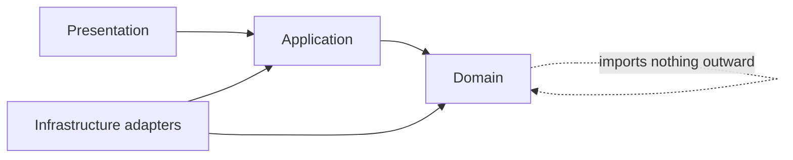

# Phase 5 — Folder Structure

> **Revision gate:** module names will use `activities`, `presence`, and `help_now` when Part 2 incorporates ADR-0003. The tree below predates that accepted decision.

## 1. Monorepo strategy

Use a single repository with `pnpm` workspaces and Turborepo for TypeScript tasks, plus `uv` for the Python workspace. Root task commands provide one contributor-facing interface. Application scaffolding begins only after planning approval.

```text
studyhang/
├── apps/
│   ├── web/                         # Next.js application
│   │   ├── app/                     # Route groups, layouts, error/loading states
│   │   ├── features/                # Vertical UI feature modules
│   │   ├── components/              # App-only compositions
│   │   ├── lib/                     # Client wiring, auth, configuration
│   │   ├── public/
│   │   └── tests/                   # Web integration and accessibility tests
│   └── api/                         # FastAPI + worker source
│       ├── src/studyhang/
│       │   ├── main.py              # Composition root only
│       │   ├── core/                # Config, errors, telemetry, security primitives
│       │   ├── db/                  # Engine, session, base metadata
│       │   ├── identity/
│       │   ├── academic/
│       │   ├── sessions/
│       │   ├── attendance/
│       │   ├── reliability/
│       │   ├── notifications/
│       │   ├── discovery/
│       │   ├── moderation/
│       │   ├── community/           # P1, absent until milestone begins
│       │   ├── integrations/        # Auth, storage, push, email, and maps adapters
│       │   └── worker/              # Job entry point and task registry
│       ├── migrations/
│       └── tests/
│           ├── unit/
│           ├── integration/
│           ├── contract/
│           └── fixtures/
├── packages/
│   ├── ui/                          # Shared React primitives/design tokens
│   ├── api-client/                  # Generated OpenAPI TypeScript client
│   ├── event-schemas/               # Versioned integration-event schemas
│   ├── plugin-sdk/                  # Manifest, permissions, API/event helpers
│   ├── types/                       # UI-only shared types; no duplicate API DTOs
│   ├── utils/                       # Small runtime-agnostic TypeScript utilities
│   ├── config-eslint/
│   ├── config-typescript/
│   └── test-utils/
├── docs/
│   ├── decisions/                   # ADRs
│   ├── runbooks/                    # Operational procedures
│   ├── api/                         # Generated/published API guides
│   └── ...                          # Planning phases
├── docker/
│   ├── api.Dockerfile
│   ├── worker.Dockerfile
│   └── compose.yaml                 # Local infrastructure
├── scripts/                         # Portable repository maintenance commands
├── plugins/
│   ├── first-party/                 # Reviewed optional integrations
│   └── examples/                    # SDK reference plugins
├── .github/
│   ├── ISSUE_TEMPLATE/
│   ├── workflows/
│   ├── CODEOWNERS
│   ├── dependabot.yml
│   ├── labels.yml
│   └── pull_request_template.md
├── pyproject.toml                   # Python workspace/tool configuration
├── pnpm-workspace.yaml
├── turbo.json
├── package.json
├── Makefile                         # Discoverable cross-language commands
├── .env.example
├── README.md
├── CONTRIBUTING.md
├── CODE_OF_CONDUCT.md
├── SECURITY.md
└── LICENSE
```

This is a target structure, not a command to create empty folders. Directories are added when an owning module begins so the repository never fills with placeholders.

## 2. Backend module anatomy

Each domain module follows the same internal shape where useful:

```text
sessions/
├── domain/
│   ├── entities.py                  # Domain behavior and state rules
│   ├── events.py
│   ├── policies.py
│   └── errors.py
├── application/
│   ├── commands.py
│   ├── queries.py
│   ├── services.py
│   └── ports.py                     # Repository/provider interfaces
├── infrastructure/
│   ├── models.py                    # SQLAlchemy persistence models
│   ├── repositories.py
│   └── event_handlers.py
├── presentation/
│   ├── routes.py
│   ├── schemas.py                   # Pydantic request/response schemas
│   └── dependencies.py
└── tests/
```

Use this structure to clarify dependency direction, not to manufacture one file per class. Small modules can combine files until complexity warrants separation.

Dependency rule:



The domain layer does not import FastAPI, SQLAlchemy, Redis, or any identity, notification, storage, or maps provider SDK. Application ports let tests replace external effects.

## 3. Frontend feature anatomy

```text
features/sessions/
├── api/                             # Thin generated-client wrappers/query keys
├── components/                      # Feature compositions
├── hooks/                           # Feature interaction/state hooks
├── routes/                          # Route-level view compositions if useful
├── schemas/                         # Client form schemas only
├── test/                            # Feature tests and fixtures
└── index.ts                         # Curated public boundary
```

Rules:

- `app/` composes routes and metadata; business UI belongs in `features/`.
- Shared primitives graduate to `packages/ui` only after a second real consumer.
- Components never call `fetch` directly; feature API modules use the generated client.
- Query keys are feature-owned factories.
- Server and client components are chosen deliberately; no global `"use client"` boundary.
- Loading, empty, error, permission, and stale states are part of every route implementation.
- Framer Motion is progressive enhancement and respects reduced motion.

## 4. Package ownership

| Package | May contain | Must not contain |
| --- | --- | --- |
| `ui` | accessible primitives, tokens, stories/tests | domain fetching, StudyHang business rules |
| `api-client` | generated DTO/client plus tiny transport adapter | hand-maintained duplicate DTOs |
| `types` | branded UI types, route helpers | server entities or database types |
| `utils` | pure, tested cross-app helpers | dumping-ground feature functions |
| config packages | shared lint/TS settings | runtime code |
| `test-utils` | factories/render wrappers | production imports |

There is no TypeScript `packages/database` when FastAPI owns persistence. Naming an empty package to match the initial sketch would imply unsafe frontend/backend database sharing.

## 5. Test layout and pyramid

- Domain unit tests: fast state transitions, scoring, policies, and time calculations.
- Repository integration tests: real PostgreSQL, migrations, locks, constraints, and query plans.
- API contract tests: FastAPI dependency overrides only at external providers.
- Web component/feature tests: user-visible behavior and accessibility.
- End-to-end tests: a small number of critical journeys using real API/database and provider fakes.
- Load/chaos tests: join race, due-job spikes, WebSocket reconnect, and provider failure.

Tests live near ownership when that improves discoverability; cross-module end-to-end suites remain centralized.

## 6. Configuration

- Typed settings fail fast at startup.
- `.env.example` documents names and safe local defaults, never secrets.
- Environment variables use a consistent `STUDYHIVE_` prefix where project-owned.
- Browser-exposed variables are explicitly prefixed and reviewed.
- External providers are configured through adapters; local fakes allow offline contribution.
- Feature flags have owner, purpose, expiry/removal issue, and safe default.

## 7. Developer commands

The eventual root interface should expose:

| Command | Outcome |
| --- | --- |
| `make bootstrap` | check/install documented tool dependencies and hooks |
| `make dev` | run web, API, worker, and local infrastructure |
| `make test` | all fast unit/integration suites |
| `make lint` | Python/TypeScript lint and formatting checks |
| `make typecheck` | mypy/pyright policy plus TypeScript |
| `make db-upgrade` | apply local migrations |
| `make db-reset-demo` | explicit local-only reset and demo seed |
| `make api-client` | regenerate TypeScript client from OpenAPI |
| `make check` | contributor pre-push parity with required CI |

Exact commands are implemented during foundation work and must work on macOS, Linux, and dev containers where supported.

## 8. CI boundaries

Path-aware jobs may optimize time, but required checks cannot be bypassed by changing only shared contracts. Planned jobs:

- repository hygiene and documentation links;
- secret/license/dependency checks;
- web lint, types, unit, build, accessibility smoke;
- API lint, types, unit, PostgreSQL integration, migration checks;
- OpenAPI/API-client drift;
- end-to-end critical path;
- container build and vulnerability scan;
- preview deployment smoke.

## 9. Ownership and CODEOWNERS policy

Begin with maintainers as broad owners. Add module teams only when real maintainers exist; avoid fictional handles. Sensitive paths—auth, migrations, reliability, moderation, deployment, and security workflows—require an experienced maintainer review.

## 10. Structure acceptance checklist

- [ ] A contributor can identify the owner of a change from its path.
- [ ] Domain rules are not duplicated in routes, workers, and frontend.
- [ ] API DTOs are generated rather than hand-copied to TypeScript.
- [ ] No package imports an application to create circular ownership.
- [ ] Local provider fakes permit contribution without paid accounts.
- [ ] Empty future modules are not scaffolded before their milestone.
