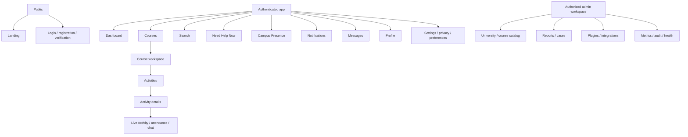
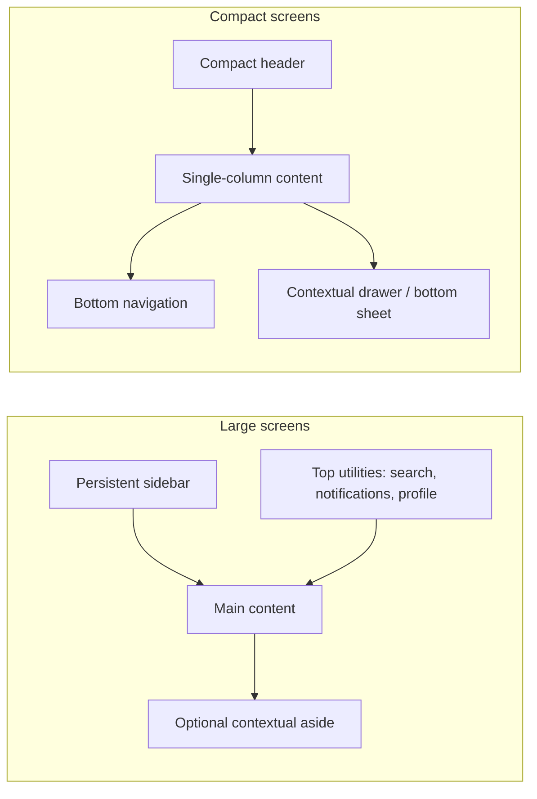
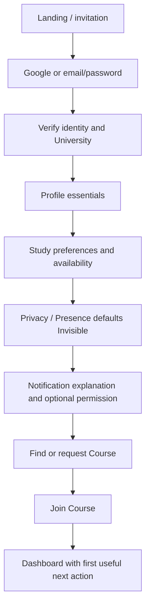
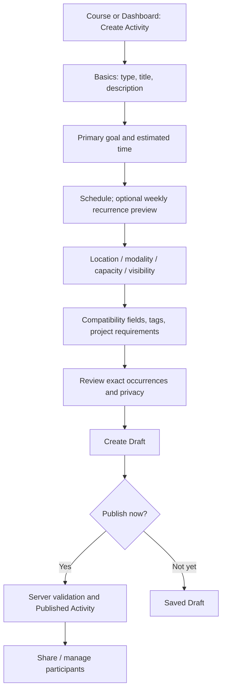
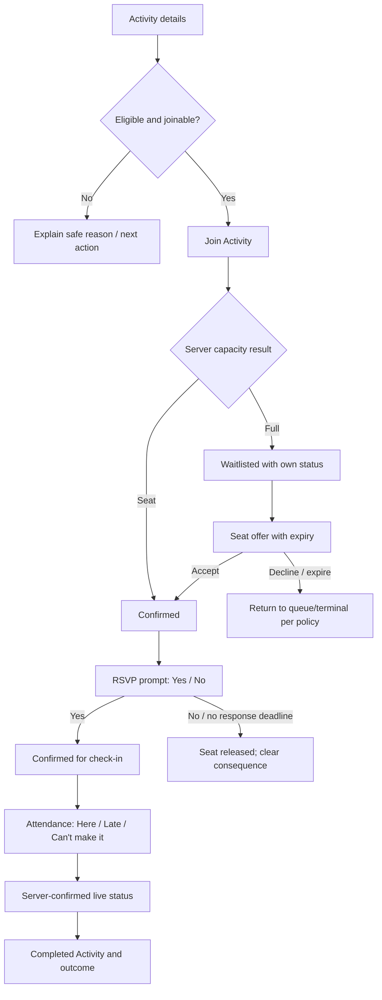
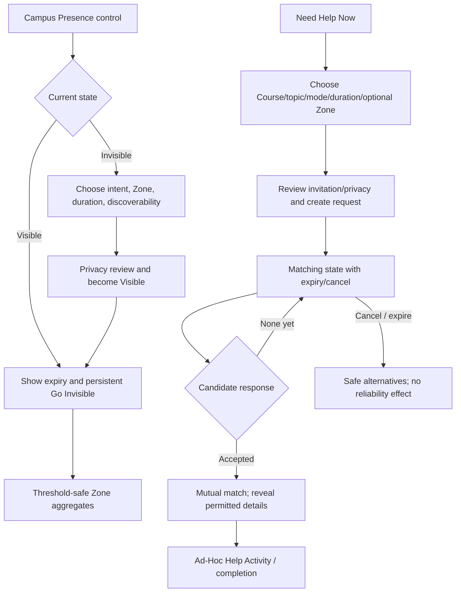
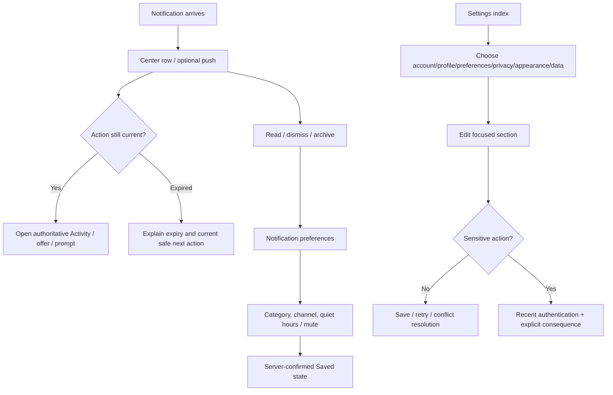

# Part 7 — Design System & Product Design Specification

**Product:** StudyHive / StudyHang (working name)  
**Status:** canonical visual, interaction and product-design specification  
**Version:** 1.0 draft  
**Last updated:** 2026-08-04  
**Normative inputs:** finalized Parts 1–6

## 0. Scope and design contract

This document defines StudyHive’s visual language, interaction behavior, information architecture, responsive rules, accessibility requirements and frontend handoff contract. It does not contain CSS, React components, Figma files or implementation code.

The design system serves students under time pressure, in unfamiliar courses, on crowded mobile screens and unreliable networks. It must make current state, privacy, deadlines and next actions easy to understand without turning academic collaboration into a noisy social feed.

### 0.1 Priority order

When design goals conflict, use this order:

1. Safety, privacy and truthful state.
2. Accessibility and task completion.
3. Clear hierarchy and predictable behavior.
4. Responsive performance and resilience.
5. Brand expression and delight.

### 0.2 Design acceptance

A design is ready for implementation only when it specifies:

- content hierarchy and primary/secondary actions;
- all responsive layouts and navigation behavior;
- default, interaction, loading, empty, error, disabled and disconnected states;
- keyboard, focus, screen-reader and reduced-motion behavior;
- server-confirmed versus optimistic feedback;
- privacy/permission variants and concealed data;
- token/component usage without one-off styling;
- localization, long content, timezone and realistic data extremes;
- analytics/experiment needs without dark patterns.

---

## 1. Design philosophy

| Principle | Design behavior | Why it exists |
|---|---|---|
| Minimal | Show what supports the current academic task; defer secondary controls; avoid decorative panels | Students need action and orientation, not interface density for its own sake |
| Calm | Restrained color/motion, generous rhythm, neutral surfaces and bounded notifications | Study planning should reduce anxiety rather than compete for attention |
| Focused | One clear page purpose and primary action; preserve user context during transitions | Complex RSVP/attendance flows become unsafe when priority is ambiguous |
| Fast | Perceived response within moments, skeletons that preserve layout, optimistic feedback only when reversible | Students often use the app between classes or during a live session |
| Readable | Strong typography, plain language, scannable metadata and controlled line lengths | Course codes, deadlines and locations must be understood at a glance |
| Accessible | Native patterns, visible focus, robust contrast, reduced motion and screen-reader-aware status | Accessibility is core product quality and a release gate |
| Academic | Course-first language, purposeful goals/outcomes and quiet institutional cues | The product should feel credible in universities without imitating an LMS |
| Professional | Consistent components, truthful states, precise copy and restrained branding | Trust depends on clarity around identity, privacy, reliability and attendance |
| Community-driven | Warm human presence, mutual consent, inclusive empty states and transparent control | The product helps classmates collaborate, not accumulate followers |
| Humane | No streak anxiety, public reliability ranking, shame colors, manipulative urgency or engagement traps | Accountability must remain constructive and fair |

### 1.1 Experience signature

StudyHive should feel like a quiet, responsive academic workspace with moments of community. A user should recognize:

- course and Activity context before social identity;
- plain surfaces separated by whitespace and borders, not card walls;
- indigo actions for intent, teal accents for collaborative presence, and semantic colors only for status;
- direct verbs such as “Join Activity,” “Confirm attendance,” and “Go invisible”;
- subtle motion that explains change rather than celebrates routine taps;
- clear privacy cues wherever location, discoverability or matching is involved.

---

## 2. Visual identity

### 2.1 Brand personality

| Trait | Express through | Avoid |
|---|---|---|
| Intelligent | Precise hierarchy, useful detail, excellent defaults | Dense academic jargon or elitist tone |
| Welcoming | Warm copy, human avatars, supportive empty states | Juvenile illustrations or forced friendliness |
| Dependable | Stable layout, explicit status/deadlines, predictable controls | Surprise gestures, shifting navigation, vague success |
| Collaborative | Shared goals, participant context, subtle interconnected motifs | Popularity counts, follower mechanics, public leaderboards |
| Independent | Open-source transparency, neutral university support | One-campus identity or proprietary-service aesthetic |
| Energetic when needed | Clear live/urgent states and decisive primary actions | Constant saturated color, animation or notification badges |

Voice is concise, respectful and action-oriented. Use “you” and specific objects. Never blame: prefer “Your seat was released because confirmation expired” over “You failed to respond.”

### 2.2 Visual language

- Interfaces are primarily flat and border-led. Elevation indicates layering, not importance.
- One dominant surface per region; avoid nested cards. Lists use dividers/spacing before independent card containers.
- Course codes and time/location metadata form a consistent scan line.
- Status combines text, icon/shape and restrained semantic color.
- Dense admin/data screens may use compact tables; student screens favor readable lists and progressive disclosure.
- Illustrations are optional, simple and inclusive. They never replace instructions or imply a specific university/culture.

### 2.3 Shape language

Corners are softly rounded, not pill-shaped by default. The system uses:

- 8 px for buttons, inputs, compact controls and menus;
- 12 px for cards, popovers, drawers and structured panels;
- 16 px for dialogs and large onboarding/marketing surfaces;
- full radius only for avatars, status dots, segmented chips and intentionally pill-like labels.

Avoid mixed corner families in one component. Large radius does not signal friendliness when it reduces density or creates “bubble UI.”

### 2.4 Borders, depth and elevation

Borders are the primary separation mechanism: 1 px neutral border, stronger on interactive/selected boundaries. Shadows are soft, low-opacity and reserved for floating elements. Elevation levels:

| Level | Purpose | Treatment |
|---|---|---|
| 0 | Canvas and inline sections | No shadow; spacing/divider only |
| 1 | Cards and sticky regions | Border; optional barely visible ambient shadow |
| 2 | Menus, date pickers, popovers | Border + small ambient/key shadow |
| 3 | Drawers/dialogs | Stronger ambient shadow over scrim |
| 4 | Critical overlay only | Reserved; never stack multiple level-4 surfaces |

Selected/important content is not raised merely to attract attention; use hierarchy and state tokens.

### 2.5 Whitespace and density

Default density is comfortable: 16 px component padding, 24 px group spacing and 32–48 px section spacing. Compact density is available for admin tables, rosters and message lists but preserves 44 px minimum interactive targets. Marketing surfaces may use 64–96 px vertical sections on desktop.

Whitespace groups related information. It must not push critical RSVP/attendance actions below the fold unnecessarily.

### 2.6 Glass and texture

Glass effects are not a general surface style. A translucent blur MAY appear on a sticky navigation bar or mobile bottom control when content scrolls beneath, with an opaque fallback and verified contrast. Never use glass for forms, cards, menus, dialogs, status or text-heavy content. No gradients behind body text. Subtle brand gradients are limited to decorative landing-page backgrounds and must not convey state.

### 2.7 Academic aesthetic

Academic character comes from course codes, structured schedules, goal/outcome clarity, editorial typography rhythm and library/campus context—not mortarboards, parchment, textbook clip art or university-specific branding. University theme tokens may affect logo and a bounded accent area, never core semantic colors, focus, safety language or contrast.

### 2.8 Brand mark and imagery

Because the product name remains temporary, implementation begins wordmark-first. A future mark should express several study nodes forming one coherent place—an abstract modular hexagon/cell or open-page negative space—without a literal cartoon bee, graduation cap or campus crest. It must work in one color, at 16 px, in light/dark, without text, and remain distinguishable from university/provider logos.

Photography, when used on the landing page, shows authentic varied study contexts without implying endorsement by a specific institution. Avoid staged stock imagery, visible private student information and imagery that represents only one field, culture or study style.

---

## 3. Color system

### 3.1 Color model

Components consume semantic tokens, never raw palette names. Brand indigo communicates action/navigation; collaboration teal supports presence/community accents; green/amber/red/blue are reserved for semantic feedback. Reliability uses neutral text/bands and evidence context, not red–green judgment.

### 3.2 Light theme tokens

| Token | Value | Use |
|---|---:|---|
| `color.canvas` | `#F8FAFC` | App background |
| `color.surface` | `#FFFFFF` | Primary content surface |
| `color.surface.subtle` | `#F1F5F9` | Secondary grouped region |
| `color.surface.raised` | `#FFFFFF` | Floating surface with elevation |
| `color.surface.inverse` | `#0F172A` | High-contrast inverse surface |
| `color.text.primary` | `#0F172A` | Main text |
| `color.text.secondary` | `#475569` | Supporting text |
| `color.text.muted` | `#64748B` | Metadata/captions that remain readable |
| `color.text.inverse` | `#F8FAFC` | Text on inverse surface |
| `color.border.subtle` | `#E2E8F0` | Dividers/noninteractive boundaries |
| `color.border.default` | `#CBD5E1` | Inputs/cards |
| `color.border.strong` | `#94A3B8` | Selected/hovered neutral boundaries |
| `color.action.primary` | `#4F46E5` | Primary action/link emphasis |
| `color.action.primary.hover` | `#4338CA` | Hover |
| `color.action.primary.pressed` | `#3730A3` | Pressed |
| `color.action.primary.soft` | `#EEF2FF` | Selected/subtle brand background |
| `color.action.primary.text` | `#FFFFFF` | Text/icons on primary fill |
| `color.action.secondary` | `#334155` | Neutral secondary-action foreground/border |
| `color.action.secondary.soft` | `#F1F5F9` | Secondary-action subtle/hover surface |
| `color.accent` | `#0F766E` | Collaboration and Presence accent |
| `color.accent.hover` | `#115E59` | Accent hover |
| `color.accent.soft` | `#CCFBF1` | Presence/collaboration subtle surface |
| `color.focus` | `#4F46E5` | Focus ring |
| `color.selection.surface` | `#E0E7FF` | Selected row/tab/chip background |
| `color.selection.text` | `#312E81` | Selected text |
| `color.success` | `#15803D` | Successful factual state |
| `color.success.surface` | `#DCFCE7` | Success banner/badge surface |
| `color.success.text` | `#14532D` | Text on success surface |
| `color.warning` | `#A16207` | Warning icon/border |
| `color.warning.surface` | `#FEF3C7` | Warning banner surface |
| `color.warning.text` | `#713F12` | Text on warning surface |
| `color.danger` | `#B91C1C` | Destructive/error action |
| `color.danger.surface` | `#FEE2E2` | Error banner/surface |
| `color.danger.text` | `#7F1D1D` | Text on danger surface |
| `color.info` | `#0369A1` | Informational icon/border |
| `color.info.surface` | `#E0F2FE` | Informational surface |
| `color.info.text` | `#0C4A6E` | Text on info surface |
| `color.disabled.surface` | `#F1F5F9` | Disabled control fill |
| `color.disabled.text` | `#94A3B8` | Disabled label; always paired with disabled semantics |
| `color.scrim` | `#0F172A` at 48% | Dialog/drawer backdrop |

### 3.3 Dark theme tokens

| Token | Value | Use |
|---|---:|---|
| `color.canvas` | `#0B1020` | App background |
| `color.surface` | `#111827` | Primary content surface |
| `color.surface.subtle` | `#172033` | Secondary grouped region |
| `color.surface.raised` | `#1F2937` | Floating surface |
| `color.surface.inverse` | `#F8FAFC` | Inverse light surface |
| `color.text.primary` | `#F8FAFC` | Main text |
| `color.text.secondary` | `#CBD5E1` | Supporting text |
| `color.text.muted` | `#94A3B8` | Metadata |
| `color.text.inverse` | `#0F172A` | Text on inverse/bright fill |
| `color.border.subtle` | `#1E293B` | Dividers |
| `color.border.default` | `#334155` | Inputs/cards |
| `color.border.strong` | `#64748B` | Selected/hovered neutral boundaries |
| `color.action.primary` | `#818CF8` | Primary action/link |
| `color.action.primary.hover` | `#A5B4FC` | Hover |
| `color.action.primary.pressed` | `#6366F1` | Pressed |
| `color.action.primary.soft` | `#252A5A` | Selected/subtle brand background |
| `color.action.primary.text` | `#0F172A` | Text/icons on bright primary fill |
| `color.action.secondary` | `#CBD5E1` | Neutral secondary-action foreground/border |
| `color.action.secondary.soft` | `#1E293B` | Secondary-action subtle/hover surface |
| `color.accent` | `#2DD4BF` | Collaboration and Presence accent |
| `color.accent.hover` | `#5EEAD4` | Accent hover |
| `color.accent.soft` | `#123D3B` | Presence/collaboration subtle surface |
| `color.focus` | `#A5B4FC` | Focus ring |
| `color.selection.surface` | `#2B3270` | Selected row/tab/chip background |
| `color.selection.text` | `#E0E7FF` | Selected text |
| `color.success` | `#4ADE80` | Successful factual state |
| `color.success.surface` | `#123524` | Success surface |
| `color.success.text` | `#BBF7D0` | Text on success surface |
| `color.warning` | `#FBBF24` | Warning icon/border |
| `color.warning.surface` | `#3F2D12` | Warning surface |
| `color.warning.text` | `#FDE68A` | Text on warning surface |
| `color.danger` | `#F87171` | Destructive/error action |
| `color.danger.surface` | `#451A1A` | Error surface |
| `color.danger.text` | `#FECACA` | Text on danger surface |
| `color.info` | `#38BDF8` | Information icon/border |
| `color.info.surface` | `#0C3148` | Information surface |
| `color.info.text` | `#BAE6FD` | Text on info surface |
| `color.disabled.surface` | `#1E293B` | Disabled control fill |
| `color.disabled.text` | `#64748B` | Disabled label with disabled semantics |
| `color.scrim` | `#020617` at 68% | Overlay backdrop |

### 3.4 Interactive color rules

- Hover/pressed are visible changes in surface/border plus cursor/shape when appropriate; never color alone for selection.
- Links use action color and a non-color affordance on hover/focus; body links are underlined by default or visibly distinguishable in context.
- One filled primary button per action group. Secondary actions are outlined/subtle; tertiary actions are text/ghost.
- Destructive red is used only when the action can remove, cancel or cause irreversible harm. “Leave Activity” may be neutral-warning depending on timing; “Cancel Activity for everyone” is destructive.
- Success green confirms completed system action, not student worth, goal achievement quality or reliability rank.
- Warning amber indicates attention/time sensitivity, not generic decoration.
- Presence visible uses teal plus text/icon and an explicit expiry. Invisible is neutral, not danger.
- Live Activity may use a teal/blue pulse only when reduced motion permits; text “Live” is always present.

### 3.5 Contrast requirements

- Normal text meets at least 4.5:1; large text at least 3:1; meaningful controls, boundaries, icons and focus indicators at least 3:1 against adjacent colors.
- Focus indication includes a high-contrast ring and shape/offset, not only a subtle border-color shift.
- Disabled controls remain identifiable but are exempt from normal contrast only when native disabled semantics prevent interaction; explanatory text uses normal readable tokens.
- University branding is automatically constrained/falls back when contrast fails.
- Every semantic pair is tested in light, dark and high-contrast/forced-colors behavior. Color never carries meaning alone.

---

## 4. Typography

### 4.1 Font families

| Role | Family | Rationale |
|---|---|---|
| Interface/content | Inter Variable, followed by platform UI sans-serif fallbacks | Open, highly legible, broad language support and neutral professional character |
| Monospace | JetBrains Mono, followed by platform monospace fallbacks | Distinguishes code/course technical content with readable punctuation |
| Marketing accent | Same interface family | One family keeps performance and product cohesion; hierarchy comes from scale/weight |

Fonts are self-hosted in production where licensing permits, subset responsibly without dropping supported scripts, and loaded with a system-font fallback that prevents invisible text. User content is never forced into monospace except code/preformatted blocks.

### 4.2 Type scale

| Token | Desktop size / line | Mobile size / line | Weight | Use |
|---|---:|---:|---:|---|
| `type.display` | 56 / 64 | 40 / 48 | 700 | Landing hero only |
| `type.heading.1` | 36 / 44 | 30 / 38 | 700 | Major page/marketing title |
| `type.heading.2` | 30 / 38 | 26 / 34 | 650–700 | Page section title |
| `type.heading.3` | 24 / 32 | 22 / 30 | 600 | Panel/major group |
| `type.heading.4` | 20 / 28 | 18 / 26 | 600 | Card/list section heading |
| `type.body.large` | 18 / 28 | 18 / 28 | 400 | Intro/important readable copy |
| `type.body` | 16 / 24 | 16 / 24 | 400 | Default content/form text |
| `type.body.small` | 14 / 20 | 14 / 20 | 400 | Dense rows/supporting text |
| `type.label` | 14 / 20 | 14 / 20 | 500–600 | Form/control labels |
| `type.caption` | 12 / 16 | 12 / 16 | 400–500 | Nonessential metadata only |
| `type.button` | 14 / 20 | 14 / 20 | 600 | Controls; labels use sentence case |
| `type.code` | 14 / 22 | 13 / 20 | 400 | Code blocks/inline technical content |

No essential content is below 12 px. Browser text zoom and user font settings remain effective.

### 4.3 Hierarchy and usage

- One visible `heading.1`-level page title per route; semantic heading levels follow structure, not visual size.
- Titles use tight but not compressed tracking: display/headings approximately −0.02em to −0.01em; body normal; uppercase micro-labels are discouraged.
- Body line length targets 55–75 characters; dense tables may be wider, long-form notes use a readable column.
- Body uses 400; labels/emphasis 500–600; headings 600–700. Avoid 800/900 and excessive bold.
- Buttons/tabs use sentence case, never all caps. Course codes retain institutional capitalization.
- Numeric time/capacity may use tabular numerals when alignment helps scanning.
- Captions cannot hold required instructions, deadlines, errors or privacy disclosure.

### 4.4 Responsive and localized typography

Display/page headings reduce at mobile breakpoints; body/control sizes remain stable. Layout wraps rather than truncates titles. Truncation is allowed only for repeatable list metadata with accessible/full reveal. Support 30% text expansion without overlap and unbounded user names/course titles through wrapping. Locale-sensitive line breaking and script fallback are tested before declaring a language supported.

---

## 5. Spacing system

### 5.1 Base scale

| Token | Value | Typical use |
|---|---:|---|
| `space.0` | 0 | Reset only |
| `space.1` | 4 px | Icon/text micro-gap, compact divider offset |
| `space.2` | 8 px | Related inline items, compact control interior |
| `space.3` | 12 px | Dense row gap, chip groups |
| `space.4` | 16 px | Default control/card padding, mobile page gutter |
| `space.5` | 20 px | Comfortable list/card internal group |
| `space.6` | 24 px | Component groups, tablet gutter |
| `space.8` | 32 px | Major content groups, desktop gutter |
| `space.10` | 40 px | Page section separation |
| `space.12` | 48 px | Large section separation |
| `space.16` | 64 px | Marketing/page-level rhythm |
| `space.24` | 96 px | Landing sections on wide screens only |

### 5.2 Spacing rules

- Use the smallest token that preserves grouping and target size; do not create arbitrary 5/7/18 px gaps.
- Related label/control/help/error: 4–8 px. Separate form fields: 16–24 px. Form sections: 32–40 px.
- Cards: 16 px mobile/compact, 20–24 px desktop. Cards in the same list use 12–16 px gaps.
- Page gutters: 16 mobile, 24 tablet, 32 desktop, up to 48 on large editorial/marketing layouts.
- Primary page title to first content group: 24–32 px. Major sections: 40–64 px.
- Dividers supplement, not replace, spacing. Avoid divider + excessive whitespace + card boundary together.
- Fixed bottom actions account for device safe areas and never cover content/focus.

---

## 6. Grid system

### 6.1 Breakpoints and columns

| Range/token | Width | Columns | Gutter | Typical shell |
|---|---:|---:|---:|---|
| `compact` | 320–639 px | 4 | 16 px | Single-column; bottom navigation; full-width sheets |
| `small` | 640–767 px | 4–6 | 20 px | Single-column with wider cards; bottom navigation |
| `medium` | 768–1023 px | 8 | 24 px | Collapsible rail/drawer; optional two-column detail |
| `large` | 1024–1279 px | 12 | 24–32 px | Persistent sidebar + content; optional aside |
| `wide` | 1280–1599 px | 12 | 32 px | Persistent sidebar + centered max-width content |
| `ultrawide` | 1600 px and above | 12 | 32–48 px | Content capped; secondary aside, never stretched prose |

Breakpoints respond to available layout space, not device names. Components use container-aware behavior where supported.

### 6.2 Containers

| Container | Maximum | Use |
|---|---:|---|
| Application shell | 1,600 px | Sidebar, main and optional context rail |
| Standard page | 1,280 px | Dashboard, Course, Search, Admin |
| Reading/form | 720 px | Settings, onboarding, resource content, focused forms |
| Dialog | 480 / 640 / 800 px | Confirmation / standard / complex; size chosen by content |
| Live workspace | 1,440 px | Activity live roster/chat without overexpansion |

### 6.3 Layout behavior

- Main content spans 8–9 columns on large screens; optional aside spans 3–4 with 24–32 px gap.
- Sidebar is 240–272 px expanded and 64–72 px compact where labels remain accessible by tooltip; no icon-only rail on touch-first widths.
- Lists switch to multi-column cards only when each card remains at least 300 px and reading order stays logical.
- Forms remain one column by default; pair short related fields such as start/end only at medium+ and preserve linear keyboard order.
- Tables may horizontally scroll within their region with sticky first/essential columns and a mobile list alternative for critical workflows.
- Large displays add whitespace/context, not more simultaneous primary actions.

---

## 7. Design tokens

### 7.1 Token architecture

Tokens have three levels:

1. **Foundation:** raw palette/measure values owned by the system, not consumed directly by product components.
2. **Semantic:** intent such as `color.text.primary`, `space.4`, `motion.duration.fast`.
3. **Component:** rare aliases such as `button.primary.background.default`, derived only from semantic tokens.

Product screens use semantic/component tokens. University themes may override only documented brand aliases, never semantic status, focus, text contrast or privacy/safety tokens.

### 7.2 Radius, elevation, blur and opacity

| Group | Tokens |
|---|---|
| Radius | `radius.none` 0; `radius.xs` 4; `radius.sm` 6; `radius.md` 8; `radius.lg` 12; `radius.xl` 16; `radius.2xl` 24; `radius.full` 9999 |
| Elevation | `elevation.0` none; `1` bordered ambient; `2` popover; `3` dialog/drawer; `4` critical overlay |
| Border | `border.width.default` 1; `strong` 2; focus uses separate ring, not layout-changing border |
| Blur | `blur.none` 0; `blur.navigation` 12; `blur.overlay` 16 maximum; always opaque fallback |
| Opacity | `opacity.disabled` 0.55 visual only; `subtle` 0.72; `scrim.light` 0.48; `scrim.dark` 0.68 |

Shadow aliases are `shadow.none`, `shadow.card`, `shadow.popover`, `shadow.modal` and `shadow.critical`, mapped one-to-one to elevation 0–4. `shadow.card` is optional and border-first; `shadow.popover` uses a short key plus soft ambient shadow; `shadow.modal`/`critical` use wider ambient separation over a scrim. Exact rendered shadow colors/opacity adapt by theme and are defined once during token implementation, not copied into feature designs. Shadows disappear in forced-colors mode.

### 7.3 Motion tokens

| Token | Value | Use |
|---|---:|---|
| `motion.duration.instant` | 0–80 ms | Press/color acknowledgement |
| `motion.duration.fast` | 120 ms | Hover, focus-adjacent visual state |
| `motion.duration.standard` | 180 ms | Tabs, small expansion, toast |
| `motion.duration.slow` | 240 ms | Drawer/dialog/navigation |
| `motion.duration.emphasis` | 320 ms max | Rare onboarding/large spatial explanation |
| `motion.easing.standard` | Smooth ease-out | Enter/change |
| `motion.easing.exit` | Faster ease-in | Exit |
| `motion.easing.spring` | Low-overshoot only | Optional direct-manipulation return; never routine navigation |

Reduced-motion tokens replace spatial movement with immediate state or short opacity transition under 100 ms.

### 7.4 Typography and icon tokens

Typography tokens are defined in Section 4. Icon tokens: `icon.xs` 12, `sm` 16, `md` 20, `lg` 24, `xl` 32; default interface icon is 20, compact control 16, feature illustration icon 24–32.

### 7.5 Z-index layers

| Token | Layer |
|---|---:|
| `layer.base` | Page content |
| `layer.sticky` | Sticky headers/controls |
| `layer.dropdown` | Menus/date pickers/tooltips |
| `layer.scrim` | Modal/drawer backdrop |
| `layer.modal` | Dialog/drawer |
| `layer.toast` | Toast region |
| `layer.critical` | Rare global safety/system interruption |

Components use layer tokens, never arbitrary large numbers. Nested overlays are avoided; a dialog cannot open another full dialog except a narrowly approved destructive/security step.

---

## 8. Iconography

StudyHive uses **Lucide** as the single product icon system. It is open, consistent, tree-shakeable and aligned with the restrained interface. Custom icons are limited to the StudyHive mark, partner/provider logos and concepts Lucide cannot represent without ambiguity.

### 8.1 Icon rules

| Context | Size | Stroke | Label behavior |
|---|---:|---:|---|
| Dense metadata/input adornment | 16 px | 2 px optical | Decorative when adjacent text names meaning |
| Standard button/navigation | 20 px | 1.75–2 px | Visible text preferred; accessible name required |
| Standalone toolbar control | 20–24 px | 1.75–2 px | Tooltip + accessible name; touch target remains 44 px |
| Status/empty state | 24–32 px | 1.75 px | Paired with heading/text |
| Marketing illustration | Up to 48 px | Consistent optical stroke | Decorative/supporting, never product-state control |

- Outline icons are default. Filled icons are reserved for the StudyHive brand or a documented selected/state variant and never mixed casually.
- Do not use emoji as functional icons; platform differences harm consistency/accessibility. Emoji may appear in user content.
- Choose icons by meaning, not visual decoration. Avoid ambiguous icon-only actions such as a bare lightning bolt for Need Help.
- Icons inherit semantic foreground color. Semantic status includes text and, where helpful, shape/icon.
- Mirroring follows locale/direction for directional icons; universal media/status icons remain stable.
- Decorative icons are hidden from assistive technology. Informative icons have accessible text through the control/adjacent label, not duplicate announcements.

---

## 9. Component library

### 9.1 Component principles

- Prefer a semantic native control/pattern before a custom composite.
- A component owns anatomy, tokens, states, keyboard behavior, responsive behavior and content guidance.
- Variants express meaning, not one-off appearance. New variants require system review and multiple legitimate uses.
- Components do not embed product business rules. Product composites combine primitives with domain content.
- Every component supports light/dark, localization, 200% zoom, high contrast/forced colors and reduced motion.
- Minimum interactive target is 44 × 44 px; dense visual controls may appear smaller only inside a 44 px hit area.

### 9.2 Actions and inputs

| Component | Variants/anatomy | Usage and behavior |
|---|---|---|
| Button | Primary, secondary, subtle, ghost, destructive, link; text + optional leading/trailing icon; small/medium/large visual sizes | One primary per action group. Use verbs. Loading preserves width, shows spinner and label such as “Joining…” when space allows. Icon-only only for universal repeated actions with accessible name/tooltip |
| Icon button | Ghost/subtle/destructive; icon centered in 44 px target | Toolbars/repeated controls only. Tooltip on hover/focus; selected state uses pressed semantics |
| Button group | Related peer actions with independent or segmented selection | Segmented only for mutually exclusive view/filter choices; never place unrelated primary/destructive actions in one segment |
| Text input | Label, required indicator, input, optional prefix/suffix, help, character count, error/success | Persistent visible label. Placeholder is example, not instruction. Clear button announced and keyboard reachable when present |
| Textarea | Same as input; resizable; character count | Bios, descriptions, report details. Sensible minimum height; grows or resizes without trapping page scroll |
| Select | Label, trigger, value/placeholder, popover list, help/error | Use native select where practical. Custom select supports typeahead and single selection; do not use for search across large remote datasets |
| Combobox | Input + filtered list + loading/empty/create-option where permitted | Courses, Universities, tags, locations. Announces result count/selection; typed value is not committed until selected/validated |
| Dropdown menu | Trigger + labeled grouped actions + optional separators/descriptions | Secondary actions. No complex forms; destructive item separated and confirmed according to risk |
| Search field | Search icon, label/accessibly hidden visible context, query, clear, optional keyboard hint | Enter submits when needed; debounced suggestions do not steal focus. Recent searches private/local only when policy permits |
| Checkbox | Box, label, optional description/error | Independent multi-selection. Entire label row clickable; indeterminate state only for parent selection |
| Radio group | Group label, choices, optional descriptions/error | Mutually exclusive choices. Arrow-key behavior follows native pattern; one default only when safe |
| Switch | Label + current on/off state + optional description | Immediate binary setting only, not submit/confirm. Use checkbox when selection is part of a form |
| Date picker | Text entry + calendar trigger/popover + selected date/help/error | Supports typing, locale formats and keyboard grid. Server timezone context shown for Activity scheduling |
| Time picker | Text entry/segmented time selection + timezone label | Supports keyboard/24-hour locale and explicit timezone. Never infer recurrence timezone silently |
| Calendar | Month grid, previous/next, day states, today/selected/range/unavailable | Scheduling aid, not sole representation; selected dates remain in form fields. Disabled reasons available |
| File picker/upload | Drop/select area, file rows, progress, scan/status, retry/remove | Keyboard-operable input. Declared and detected constraints; quarantine/scanning/ready/rejected are explicit |

### 9.3 Navigation and disclosure

| Component | Variants/anatomy | Usage and behavior |
|---|---|---|
| Global navbar | Brand, desktop search, utility actions, notifications, profile menu | Marketing/unauthenticated top bar or compact app top region; does not duplicate persistent sidebar landmarks |
| Sidebar | Logo/workspace, primary nav, Course shortcuts, footer/account; expanded/collapsed desktop | Persistent at large widths. Current item text/icon/surface. Collapse is remembered; icon-only state has tooltips |
| Bottom navigation | 4–5 primary destinations, icon + label, optional badge | Compact widths only. Stable destinations: Home, Courses, Search, Activity/Create action according to approved IA, Profile/More; no horizontal scroll |
| Tabs | Label, optional count/icon; underline or contained style | Peer views within one resource. Arrow navigation; URL reflects meaningful tabs. On mobile may wrap into select/menu only when labels cannot fit |
| Breadcrumbs | Linked ancestors + current page | Desktop/complex admin/catalog hierarchy. Mobile shows back label plus current title; never rely on breadcrumbs as only back path |
| Pagination | Previous/next and optional page numbers for admin; cursor “Load more” for feeds | Accessible labels/current state. Infinite scroll only when task benefits and URL/return position are preserved |
| Accordion | Heading trigger + panel; single/multiple behavior declared | Secondary details/FAQ/settings. Not for hiding primary actions/errors. Trigger includes expanded state |
| Command palette | Search input + grouped permitted navigation/actions | Desktop efficiency enhancement; keyboard shortcut discoverable; never only route to a feature |

### 9.4 Surfaces, data display and identity

| Component | Variants/anatomy | Usage and behavior |
|---|---|---|
| Card | Optional header/content/footer/media; interactive or static | Use for independent bounded object such as Activity. Interactive card has one primary link; nested actions remain separate keyboard targets. Avoid nested cards |
| Activity card | Course/type, title, time, location/modality, goal, capacity, compatibility when eligible, host, status, actions | Upcoming scan order is course → title/goal → time/location → status/capacity → action. Live/ending/completed variants remain truthful |
| Course card/row | Code/title, term/membership, Activity count summary, action | Row on dense desktop; card on mobile. Counts do not create popularity competition |
| Avatar | Image/initials; user/group/bot/plugin shape metadata | Sizes 24/32/40/48/64/96. Alt/name provided by adjacent identity text; status indicator never color-only. Respect hidden/removed identity |
| Avatar group | Overlap-limited faces + “+N” text | Small participant preview only; count text accessible; does not replace roster or expose hidden identities |
| Badge | Semantic status label with optional icon/dot | Noninteractive. Short factual states such as Live, Waitlisted, Pending. Reliability bands remain neutral, not success/danger |
| Chip | Removable filter/tag/input token; optional selected state | Interactive chips use button semantics; removable control is separately named. Tags are not status badges |
| Data table | Caption, headers, rows, sort, selection, actions, pagination, empty/loading | Admin/roster/data density. Sticky headers optional. Responsive alternative/scroll; row actions keyboard accessible; selection count explicit |
| List/row | Leading identity/icon, primary/secondary metadata, trailing state/action | Default for notifications, messages, settings and Courses. Entire row link only when trailing controls do not conflict |
| Stat | Label, value, context/change | Private dashboard/admin aggregates. No decorative KPI grids or public productivity/reliability rankings |
| Progress | Determinate bar/steps; label/current/total | Only when measurable. Indeterminate work uses spinner/skeleton. Color plus text/position; no fake progress |
| Timeline | Ordered events with time/title/details/status | RSVP/attendance/history. Factual, compact, no gamified celebration |

### 9.5 Feedback and overlays

| Component | Variants/anatomy | Usage and behavior |
|---|---|---|
| Inline message | Info/success/warning/error; icon, title/body, optional action | Preferred feedback near affected content. Persistent until resolved/dismissed where safe |
| Toast | Brief success/info/warning; text, optional undo/action, dismiss | Noncritical confirmation. Does not contain required errors, deadlines, RSVP or Need Help offers. Pauses on hover/focus |
| Tooltip | Plain short text | Supplementary explanation for icons/abbreviations; hover/focus, not essential content or interactive controls |
| Popover | Anchored small interactive content | Filters, details, date picker. Focus managed; closes on outside/Escape when safe |
| Modal dialog | Title, description, content, actions, close | Blocking decision/short form only. Focus trapped/restored. Destructive action explicit; no stacked dialogs |
| Alert dialog | Consequence-focused confirmation with safe/destructive actions | Irreversible/high-impact actions such as cancel for everyone, erase account. Requires explicit object/consequence, not generic “Are you sure?” |
| Drawer/sheet | Header/content/actions; side desktop or bottom mobile | Secondary detail/filters/forms that benefit from context. Full page when workflow is long or deep-linkable |
| Banner | Page/system-level status with action | Offline, degraded realtime, verification, maintenance. Not stacked; priority rules determine one or combined summary |

### 9.6 Loading and structural components

| Component | Variants/anatomy | Usage and behavior |
|---|---|---|
| Spinner | 16/20/24; label when not obvious | Short local indeterminate action. Not centered alone for whole page without message after delay |
| Skeleton | Text/row/card shapes matching final layout | Initial load over ~200 ms. No shimmering under reduced motion; does not mimic unavailable controls as interactive |
| Empty state | Optional restrained icon, heading, explanation, primary/secondary action | Specific to permission/context; never blames user. See Section 16 |
| Divider | Horizontal/vertical subtle line | Separates related groups when spacing alone is insufficient; vertical only where height/context is clear |
| Scroll area | Native page/region scroll with visible overflow cues | Nested scroll areas avoided. Preserve focus and return position |

### 9.7 Composite product components

| Composite | Required contents/behavior |
|---|---|
| RSVP prompt | Activity/time, deadline countdown in text, Yes/No actions, consequence disclosure, current delivery/offline status |
| Waitlist offer | Seat availability, expiry, Accept/Decline, current position/context, no reliability consequence for decline/expiry |
| Attendance prompt | Activity, current start context, I’m Here/Running Late/Can’t Make It, server-confirmed result |
| Presence control | Visible/Invisible text, intent, Zone, discoverability choice, expiry, persistent Go Invisible action |
| Need Help composer | Course/topic, mode, duration/Zone, privacy/invitation summary, active-request replacement state |
| Compatibility summary | Percentage only with adequate coverage, coverage/context, 2–4 truthful reasons, “not a guarantee” supporting copy where needed |
| Reliability summary | Private percentage/band, evidence count/confidence/New state, explanation/history/appeal link; neutral visual treatment |
| Live Activity header | Course/title, Live/Ending state, elapsed time, location, participant count, host controls and connection status |

---

## 10. Component states

### 10.1 Universal state model

State visuals are additive and do not shift layout unexpectedly.

| State | Visual | Interaction/accessibility |
|---|---|---|
| Default | Semantic surface/text/border | Ready; name/role/value exposed |
| Hover | Subtle surface or border emphasis | Pointer devices only; never reveals the only access to content/action |
| Pressed | Stronger surface/scale-free feedback | Immediate, 0–80 ms; exposed as pressed only for toggle controls |
| Focused | 2 px high-contrast focus ring with offset; component state remains visible | Keyboard/programmatic focus; not suppressed on mouse if user preference requires |
| Loading | Preserve dimensions; spinner/skeleton/progress; descriptive label | Prevent duplicate destructive/contested actions; announce only meaningful state |
| Disabled | Muted surface/text, normal readable explanation nearby when needed | Native disabled where possible; not focusable unless discoverability/reason requires read-only pattern |
| Error | Danger border/icon/message plus existing label/value | Message associated to control; focus first invalid field on submit summary behavior |
| Success | Subtle success icon/message; normal surface returns after confirmation | Never rely on green; avoid permanent success border on ordinary valid fields |
| Selected | Selection surface + border/icon/check and semantic selected state | Distinct from hover/focus; keyboard and screen reader state exposed |
| Empty | Stable component frame with explanation/action or omitted when optional | Never render a blank unlabeled region |

### 10.2 Component-state matrix

| Component family | Hover / pressed | Focus | Loading | Disabled | Error / success | Selected / empty |
|---|---|---|---|---|---|---|
| Buttons | Fill/border progression; no bounce | Ring outside shape | Spinner + action-progress label; width fixed | Disabled only when action truly unavailable; otherwise explain denial | Failure appears inline/toast with retry; success usually toast/inline | Toggle/icon button uses pressed state; ordinary button never remains selected |
| Inputs/textarea | Border stronger | Focus ring + active border | Read-only/skeleton for initial; suffix spinner for async validation | Muted with persistent value/label | Inline message/icon after interaction/submit; success only when confirmation valuable | Selected text remains native; empty uses placeholder plus label |
| Select/combobox | Trigger/list option surface | Trigger and active option focus visible | Results spinner and status announcement | Trigger disabled with reason | Field error; load error row with retry | Checkmark + selected semantics; “No results” with query/action |
| Checkbox/radio/switch | Control/label surface | Ring on control | Disable during committed async switch and show adjacent status | Native disabled/read-only variant | Group error; successful save separate | Check/dot/position + semantics; indeterminate explicitly shown |
| Tabs/navigation | Subtle surface | Ring/underline remains | Content skeleton, tab remains operable where safe | Rare; hidden if permanently unavailable, explained if temporary | Panel error belongs in panel | Active text + indicator + current-page state; empty panel state |
| Cards/list rows | Border/surface only if interactive | Ring around primary link/card target | Shape-matched skeleton | Read-only state rather than faded entire content | Inline status/banner, retry if load/action fails | Selected row has check/surface; empty collection uses Section 16 |
| Menus/popovers | Option/trigger surface | Roving focus/visible ring | Loading item/status, keep trigger context | Disabled option readable with reason where helpful | Error row/inline; never silent close on failure | Selected option check; empty search result row |
| Dialog/drawer | Close/action feedback | Initial meaningful focus, trapped, restored | Preserve shell; action spinner; prevent duplicate close only when unsafe | Actions individually disabled | Error near action/form + summary | Empty content means design error unless intentional explanatory state |
| Toast/banner | Pause/dismiss hover | Action/dismiss focus | Not used as loading container | N/A | Semantic icon/text/action | Empty means component absent |
| Table/pagination | Row/action hover | Cell/link/control focus | Row skeleton or progress outside table header | Unavailable action explained | Error row/banner; success announcement for bulk action | Selected rows count; empty table state with maintained headers/context |
| Calendar/date/time | Day/control hover | Grid roving focus + ring | Month/availability loading status | Unavailable date with reason | Field-level error/success | Today and selected are distinct; empty availability explains range |
| Upload | Drop target emphasis | Input/button focus | Per-file progress/scan state | Quota/permission explanation | Rejected file reason/retry; ready state with text/icon | Empty drop/select prompt |

### 10.3 State priority

When states overlap: disabled/read-only overrides hover/pressed; error persists with focus; focus remains visible over selected; loading preserves previous selected/error context only when still valid; critical server state overrides optimistic local state. A component must never appear enabled while the server capability is known to be denied.

### 10.4 Async and realtime states

Components distinguish `saving`, `saved`, `failed`, `stale`, `offline`, `reconnecting` and `server_conflict`. “Saved” appears only after server confirmation. Realtime counter updates animate minimally and announce only if task-relevant. A disconnected badge/banner explains that live data may be stale and provides retry/status without erasing the last safe snapshot.

---

## 11. Page layouts and information architecture

### 11.1 Screen hierarchy

### 11.2 Navigation model

Primary authenticated destinations are Home, Courses, Search, Messages/Notifications as validated by usage, and Profile/More. Need Help and Create Activity are contextual high-value actions, not necessarily permanent navigation destinations: surface them on Dashboard, Course and empty states. Campus Presence remains visible from Dashboard and a persistent status control while active.

Admin navigation is visually distinct and permission-gated. Entering Admin changes sidebar context with a clear “Back to StudyHive” route; it does not mix moderation actions into student navigation.

### 11.3 Application shell

| Region | Large | Medium | Compact |
|---|---|---|---|
| Primary navigation | Persistent expanded sidebar; optional collapse | Compact rail + expandable drawer | Bottom navigation + More sheet |
| Global search | Top utility/command shortcut | Top field/icon opens search | Search destination/full-screen route |
| Page title/actions | In main header; actions right aligned | Same, may wrap | Title first; primary action full-width/sticky only when essential |
| Context aside | Optional 280–360 px | Drawer or below main | Bottom sheet or inline after primary content |
| Notifications/profile | Top utility | Top utility | Header/More destination |
| Status banners | Below shell header, above page content | Same | Full-width below compact header; account for safe area |

The shell preserves route focus, scroll restoration and landmark structure. Sticky controls never obscure anchors/errors/focused content.

### 11.4 Page specifications

#### Landing page

Purpose: explain the academic collaboration problem, show credible product behavior and move a student/operator to the right next step.

- Header: brand, Product, Open source, Documentation, Sign in; one primary “Get started.”
- Hero: direct outcome statement, supportive description, primary/secondary action and real product UI illustration—not fake social proof.
- Evidence sections: find classmates, purposeful Activities, reliable RSVP, Campus Presence and Need Help; each focuses on one problem/benefit.
- Open-source/self-host section: transparent architecture/community links without competing with student onboarding.
- Footer: docs, GitHub/community, security, accessibility, license, status.
- Mobile: single-column, actions full width, no autoplay video/parallax. Large: max readable hero, optional product visual beside it.

#### Dashboard

Purpose: answer “What should I do now?”

Order:

1. Urgent action rail: waitlist offer, pending RSVP, attendance/live prompt or Need Help match—only actionable items.
2. Today’s Activities timeline/cards.
3. Campus Presence status/control and privacy-safe nearby counts.
4. Upcoming Activities and suggested Activities with compatibility.
5. Active Need Help state or create prompt.
6. Course activity.
7. Private study streak/reliability summary, visually quiet.

Desktop uses main + contextual aside only if urgent items benefit; mobile keeps one chronological priority stack. Empty Dashboard guides Course join, preferences and first Activity/Need Help—not generic engagement.

#### Course workspace

Header includes course code/title, term/membership, settings/leave where permitted and primary Create Activity/Need Help. Tabs show Activities by default; later Resources/Notes/Discussion appear only when enabled. Filters stay below header and can collapse into a mobile sheet. Course member discovery is secondary and privacy-filtered. No empty tabs for unshipped modules.

#### Activity discovery/list

List header: context/title, result count when meaningful, create action, search/filter/sort. Activity cards prioritize course/title/goal/time/location/capacity/status. Filters appear in side panel at wide widths and drawer on compact. Applied filters are visible as removable chips with Clear all. Preserve position/filter state when returning from details.

#### Create/edit Activity

Focused form container up to 720 px with logical sections: basics; course/type; goal; schedule/recurrence; location/modality; capacity/visibility; compatibility/tags; review. Draft autosave/status is explicit. A persistent summary appears at large widths only if it does not duplicate form. Recurrence preview lists each occurrence/timezone/DST and clearly labels edit scope. Mobile uses step groups, not a hidden multi-screen wizard unless research proves it improves completion.

#### Activity details

Top: breadcrumb/back, course/type/status, title, goal, time, location, host and primary action. Main: description, compatibility, tags/requirements, participants/privacy-safe roster, updates/chat preview. Aside: join/waitlist/RSVP status, capacity and share/bookmark; sticky on large only. Mobile places the current primary action near top and optionally sticky bottom with safe-area padding. Host actions live in an explicit menu/management section and destructive cancellation is separated.

#### Live Activity

Persistent Live header with connection state, elapsed time, location and End/Continue authority. Main area favors attendance/status roster and session goal; chat is adjacent/tabbed depending on width. Host sees confirmed/arrived/late/cannot/no-show groupings using text/icons, not only color. Participant sees own attendance action prominently until confirmed. Ending Soon/Completed transition is explicit; no confetti.

#### Need Help Now

Start as a focused composer with Course, topic, modality, expected duration and optional Zone, plus clear invitation/privacy explanation. After submit, replace the form with one active search state: elapsed/expiry, editable/cancel action, matching progress without naming unconsented candidates. Invitation recipients see a time-bounded card with safe requester/course/topic context and Accept/Decline. Match screen reveals only mutually permitted details and next steps.

#### Campus Presence

Top control always states Invisible or Visible until time, with intent, Zone and individual-discoverability choice. A concise privacy explanation appears before first enable and remains accessible. Aggregate location list/map alternative shows Zone name, total thresholded students and Course distribution; never exact individuals unless separately consented partner suggestion flow. Map is optional and must have equivalent list. Go Invisible remains persistent while active.

#### Notifications

Header with unread/all/archived filters and notification preferences. Group by Today/Earlier or date, not category silos. Each row has category icon, clear text, time, read state and action status. Urgent offers/prompts show deadline/action but action rechecks server state. Bulk mark read is secondary. Empty state points to preferences without implying missed activity.

#### Messages

Large: conversation list + active conversation split view; medium/compact: separate routes with back navigation. Header anchors Activity/course context and membership. Message list preserves reading position, groups by sender/time, supports files/links/pins, typing indicator and connection state. Composer remains accessible above keyboard/safe area. No direct messages until product phase enables them.

#### Search

Search field receives focus only on explicit navigation, not every load. Results use typed tabs/filters: All, Activities, Courses, Students, Universities, Locations and later Resources. Show why matched without internal score/reliability. Desktop filters aside; compact sheet. Recent queries remain local/private if enabled. Zero results offers filter adjustment or contextual create/Need Help actions.

#### Settings

Reading/form width with left subsection navigation on large and list/detail routes on compact. Sections: Account, Profile, Study preferences, Availability, Privacy/Presence, Notifications, Appearance, Accessibility, Connected apps/plugins, Data export/delete. Save behavior is consistent per section; dangerous account deletion is isolated at end with recent-auth flow.

#### Profile

Own profile: edit action, visibility preview, identity/course context, study preferences summary, hosted/joined/resource counts only where not gamified, private reliability/streak cards, history. Other profile: only permitted fields/shared context and block/report actions. Compatibility is contextual, not a permanent global profile score.

#### Admin workspace

Desktop-first but responsive. Distinct admin shell, current scope selector, role indication and audit-aware actions. Dashboard uses privacy-safe aggregates/health; catalog uses tables/forms; moderation uses queue + case detail; plugins use lifecycle/capability panels; audit uses filterable table. High-risk actions require reason and explicit scope, with no individual Presence dashboard or reliability leaderboard.

#### Error pages

`404`: “Page not found or unavailable,” safe back/Home action, no existence disclosure. `403` when safe: explain permission/verification and next action. `500`: acknowledge failure, retry and request ID/support path. Auth errors preserve safe return location. Full-page errors use minimal shell; route errors retain navigation/context where safe.

#### Offline mode

Persistent banner with Offline/Reconnecting and last-safe data time. Read cached recent data where privacy policy permits, visually mark stale, disable server-dependent contested actions with explanation, preserve eligible drafts locally and retry only with idempotency. Never show cached Presence as currently visible after certainty expires. Reconnection resyncs before clearing status.

---

## 12. Motion design

### 12.1 Motion principles

Motion explains spatial relationship, confirms direct manipulation and preserves continuity. It does not reward routine actions, create urgency, hide latency or compete with study content.

| Pattern | Duration/token | Behavior |
|---|---:|---|
| Hover/focus color | 80–120 ms | Color/border only; no lift for every card |
| Button press | 0–80 ms | Immediate tonal feedback; avoid scale when layout/text may blur |
| Tab/content switch | 120–180 ms | Indicator moves/fades; content change minimal |
| Accordion | 180 ms | Height/opacity with content accessible throughout final state |
| Popover/menu | 120–180 ms | Small origin-aware fade/translate; no bounce |
| Toast/banner | 180 ms | Enters near region and remains long enough; exit faster |
| Dialog/drawer | 180–240 ms | Scrim fade + short spatial movement; focus only after ready |
| Page navigation | 0–180 ms | Usually immediate with skeleton; optional subtle content fade, not sliding entire app |
| Realtime count/status | 120 ms | Brief highlight, no repeated pulse/announcement |
| Skeleton | Static or subtle opacity | No fast shimmer; reduced motion static |

### 12.2 Specific flows

- Joining/bookmarking may update optimistically only where reversible; confirmation settles without celebration. Seat/waitlist status waits for server.
- Presence visible uses one subtle transition and persistent state; no continuously pulsing location marker.
- Live status may use a restrained dot pulse with text; stop in reduced motion/background and never flash.
- Modal/drawer origin helps orientation; nested spatial transitions are prohibited.
- List insertion/removal preserves neighboring position and focus. Undo removal keeps a temporary placeholder where useful.
- Drag-and-drop is never the only reorder/input mechanism and is avoided unless a real workflow requires it.

### 12.3 Reduced motion and performance

Reduced motion removes parallax, scale, spring, large translation, looping pulses and animated skeleton shimmer. State changes become immediate or use opacity under 100 ms. Functional timers/progress continue numerically/textually.

Motion uses compositor-friendly transform/opacity where implementation permits, avoids layout-triggering animation on large lists and maintains smooth interaction on modest devices. Stop offscreen/background animation. Never delay navigation/action until animation finishes.

---

## 13. Responsive design

### 13.1 Responsive strategy

Design from the compact content hierarchy outward. Responsive behavior changes layout and disclosure, not capability or terminology. Every feature defines compact, medium and large behavior before handoff.

| Pattern | Compact | Medium | Large/wide |
|---|---|---|---|
| Navigation | Bottom nav + More sheet | Compact rail/drawer | Persistent sidebar |
| Page actions | Primary full-width or top; secondary menu | Header wrap | Header-aligned group |
| Filters | Full-width bottom sheet; applied chips inline | Drawer or collapsible bar | Persistent side panel/toolbar |
| Detail aside | Inline after essential content or bottom sheet | Drawer/below | Sticky right rail |
| Tables | Priority-column list/cards or contained horizontal scroll | Scroll/selected columns | Full table with density controls where approved |
| Split view | Separate list/detail routes | Optional split when ≥768 and content fits | Persistent list/detail |
| Dialog | Full-width bottom sheet for simple tasks; full-page for complex | Center dialog/drawer | Center dialog with capped width |
| Forms | One column | Related short fields pair | One/two columns only by semantic grouping |
| Cards | One column | 1–2 columns | 2–3 when minimum width maintained |

### 13.2 Mobile and touch

- Support 320 px width without clipped essential content; primary target design width 360–430 px.
- Account for notches, browser chrome, virtual keyboard and safe-area insets.
- Fixed/sticky bottom actions do not cover last content and move above the keyboard when relevant.
- Do not require hover, precision pointer, right-click or horizontal gestures without visible alternatives.
- Full-screen forms retain progress/context and allow back without accidental draft loss.
- Long press is optional enhancement only.

### 13.3 Tablet and landscape

Tablet portrait generally uses compact/medium single-column with rail/drawer. Landscape may use split views only when each pane remains readable and touch targets intact. Do not assume landscape means desktop hover/keyboard. Live Activity and Messages can use split roster/chat or conversation/detail at sufficient width.

### 13.4 Large displays

Cap reading and application content; use extra space for an optional contextual aside, not stretched text or six-column card walls. Keep primary task near the visual center and navigation reachable. Admin tables may expand columns but retain maximum scan widths and sticky identifiers.

### 13.5 Content resilience

Test the longest course code/title, large text, 30% localization expansion, zero/one/hundreds of participants, multiple status badges, timezone names, unavailable images, empty metadata and slow/offline state. Wrapping is preferred; truncation includes full accessible reveal and never hides deadline/state/action.

---

## 14. Accessibility

StudyHive targets WCAG 2.2 AA across supported flows. Section 17 of the Engineering Handbook defines release gates; this section defines product-design behavior.

### 14.1 Keyboard navigation

- Native tab order follows visual reading order; no positive `tabindex`.
- Skip link moves to main content. Landmarks label primary navigation, main, contextual aside and footer.
- Composite widgets follow established arrow/Home/End/Escape patterns with visible roving focus.
- Every pointer action has a keyboard equivalent; drag/swipe has buttons/menu alternative.
- Focus returns after dialog/sheet, remains on affected item after inline action and moves to error summary/first invalid field after failed submit without trapping.
- Route changes announce/navigate to page heading or logical main start according to client routing behavior.

### 14.2 Screen readers and semantics

- Semantic headings, lists, tables, forms, buttons, links and dialogs are designed first; ARIA only fills a real semantic gap.
- Labels, help and errors are programmatically associated. Required/invalid/state are communicated in text/semantics.
- Live regions are limited: confirmations/errors/deadlines/connection status announce politely or assertively by urgency; typing/count animations do not spam.
- Cards expose a clear primary link, not an inaccessible nested clickable container.
- Status, compatibility and reliability provide readable text and explanation, not icon/color/percentage alone.
- Visual reordering never contradicts DOM/reading order.

### 14.3 Focus appearance

Focus uses `color.focus`, at least 2 px visible ring and spacing/offset sufficient against component/background. Selected/error states remain visible simultaneously. Focus is not clipped by overflow, sticky headers or rounded containers. Forced-colors mode uses system focus/selection colors.

### 14.4 Contrast and non-color cues

Section 3.5 contrast applies to every theme/state. Error includes text/icon, selection includes shape/check/current state, live includes text, capacity includes numbers/label, attendance includes labels. Charts include direct labels/patterns/table alternative where necessary.

### 14.5 Touch, target and motor accessibility

Interactive targets are at least 44 × 44 px with spacing that reduces accidental activation. Destructive and adjacent actions receive separation/confirmation. Timed RSVP/offer controls show remaining time in text, warn before expiry when possible and do not require rapid response beyond product policy.

### 14.6 Cognitive accessibility

- Use consistent terms/actions and one primary action.
- Break long forms into titled groups, preserve input after error and show progress only when meaningful.
- Explain consequences before confirmation, especially Presence, waitlist/RSVP, cancellation and erasure.
- Avoid countdown-only urgency, unexplained scores, idioms, all-caps text and dense paragraphs.
- Never use shame, blame or comparative ranking to motivate attendance/study behavior.

### 14.7 Media, motion and responsive access

Respect reduced motion as Section 12.3. Videos require controls/captions/transcript and never autoplay with sound. Support 200% zoom/reflow and text spacing without loss at 320 CSS px equivalent. Map/visual content has a list/data alternative.

---

## 15. Interaction patterns

### 15.1 Action hierarchy

Each view has one primary next action, supported by secondary and tertiary actions. Primary actions use filled brand treatment; secondary uses outline/subtle; tertiary uses ghost/link. Destructive actions are never primary unless the entire surface is a destructive confirmation.

Labels name the outcome: “Create Activity,” “Join waitlist,” “Confirm attendance,” “Go invisible.” Avoid “Submit,” “OK,” “Yes” outside a question where the action remains unambiguous to assistive technology.

### 15.2 Confirmation, undo, delete and archive

| Action risk | Pattern | Examples |
|---|---|---|
| Easily reversible, private | Act immediately + optional toast/undo | Bookmark, mark notification read, dismiss recommendation |
| Reversible with side effects | Inline confirmation or explicit action label + undo when server supports it | Leave Course, remove tag, archive notification |
| Time/capacity consequence | Explain consequence before/with action; server-confirmed result | Leave Activity near deadline, decline waitlist offer, RSVP No |
| Destructive to others | Alert dialog with object, scope, consequence and reason when needed | Cancel Activity/series, remove participant, moderation action |
| Irreversible/security/legal | Dedicated flow, recent authentication, typed/explicit confirmation where justified | Account erasure, revoke all sessions, plugin uninstall with data purge |

Confirmation copy names scope: “Cancel this occurrence” versus “Cancel this and future occurrences.” A generic “Are you sure?” is insufficient. Focus starts on the safe action unless user research/pattern dictates otherwise. Escape/close never executes the action.

Undo is time-bounded and announced, but does not claim reversibility where capacity/state may have changed. If undo conflicts, show the current state and safe next option.

Archive removes from default view while preserving history. Delete language is reserved for true soft/hard removal; terminal Activity history is archived, not deleted.

### 15.3 Search

Search begins on submit or after a deliberate debounced threshold for suggestions. Preserve query/filter state in URL when safe/shareable; do not put private query context in URLs if it exposes sensitive user intent. Results identify type/context and why they match in plain text. Keyboard shortcut is optional enhancement.

Search never silently expands to hidden Courses, exact Presence, reliability or private profiles. Correct spelling suggestions and autocomplete are clearly suggestions, not automatic query replacement.

### 15.4 Filtering and sorting

- Default filters reflect the current context, not hidden personalization.
- Applied filters remain visible as chips/summary and can be cleared individually/all.
- Desktop panel changes may apply immediately with result count/loading; mobile sheet uses Apply when multiple changes prevent disruptive background updates.
- Show unavailable/zero-result filter choices only when they help explain context; otherwise omit.
- Sort label names order: “Soonest,” “Most relevant,” “Newest,” never ambiguous “Best.”
- Reliability is never a public filter/sort. Compatibility may sort the viewer’s permitted recommendations with clear context, not global people search.
- Returning from detail preserves query/filter/sort/scroll.

### 15.5 Forms

- Use a visible title, short purpose, logical field groups and one submit action.
- Put labels above fields for scan/localization. Mark optional rather than every required field when most are required.
- Help appears before error and explains format/consequence; placeholder shows example only.
- Validate format locally after interaction/blur where useful and all business rules on submit/server. Avoid red errors while the user is still typing incomplete valid input.
- On submit failure, show a summary for multi-field forms, focus summary/first invalid field and preserve all safe input.
- Save states are explicit: Unsaved, Saving, Saved, Failed/Retry. Never show Saved before server confirmation.
- Destructive changes and navigation with unsaved data warn; autosave shows last saved and offline draft status.

### 15.6 Notifications and interruptions

Use the least interruptive pattern that still protects the task:

1. Inline status for local field/content.
2. Toast for noncritical confirmation/undo.
3. Banner for page/system connectivity/verification/degradation.
4. Notification center/push for asynchronous updates.
5. Dialog only for immediate required decision the user initiated or a critical session state.

Waitlist offers, RSVP and attendance prompts may appear prominently because they expire, but they remain accessible, explain deadline/consequence and do not repeatedly steal focus. Notification badges show bounded counts (`9+`) or dot where exact count adds no value.

### 15.7 Progressive disclosure

Show the information needed for the current decision; reveal advanced recurrence, compatibility detail, moderation history, provider diagnostics and admin configuration on demand. Do not hide privacy consequences, fees (none currently), required fields, destructive scope, deadlines or errors behind disclosure.

Accordions are for optional detail, drawers for contextual secondary tasks, dedicated pages for long/deep/linkable workflows. Tooltips are never the only source of instructions.

### 15.8 Sharing and clipboard

Share produces a permission-safe link and explains visibility. Copy confirms briefly without replacing selected content. Private Activity links do not bypass authorization and should not imply access. Native share sheet is preferred on supported mobile devices with clipboard fallback.

---

## 16. Empty states

### 16.1 Empty-state anatomy

An empty state contains a specific heading, one-sentence explanation, one primary next action when permitted, optional secondary help/import action, and a restrained icon only when useful. It distinguishes “none exist,” “none match filters,” “not permitted,” “not configured,” and “still loading.”

| Context | Heading/message direction | Primary action | Secondary/notes |
|---|---|---|---|
| Courses: no enrollments | “Join your first course” — Courses connect you with relevant classmates and Activities | Find a course | Request missing University/course; do not show fake Courses |
| Course: no Activities | “No upcoming Activities yet” | Create Activity | Need Help Now; subject to permissions |
| Activities: no filter results | “No Activities match these filters” | Clear/adjust filters | Keep query/context visible; do not encourage unrelated creation immediately |
| Activities: no University results | “Nothing scheduled yet” | Create Activity | Set Campus Presence or Need Help if eligible |
| Search: no results | “No results for ‘…’” | Adjust search | Suggest removing a specific filter; request catalog item when applicable |
| Notifications | “You’re all caught up” | None | Link to notification preferences only if useful; avoid celebratory pressure |
| Need Help: no active request | “Need help right now?” with privacy/matching summary | Ask for help | Explain one-active-request rule |
| Need Help: no candidates yet | “Still looking for someone available” | Keep searching/cancel | Show expiry, safe alternatives; never list rejected/unconsented candidates |
| Chat/messages | “Start the Activity conversation” | Focus composer | Offer a prompt tied to goal; no forced social icebreaker |
| Dashboard | “Build your StudyHive home” | Join a Course | Then preferences/create Activity/Presence in ordered checklist, not seven cards |
| Profile: incomplete | “Help classmates know how you study” | Complete profile/preferences | Preview visibility and explain optional fields |
| Presence aggregates suppressed | “Not enough people to show a safe count yet” | Keep visible/go invisible as state permits | Explain privacy threshold; do not show zero if people exist below threshold |
| Admin queue | “No reports in this queue” | None | Show active filters/scope and last refresh |
| Plugin list | “No plugins installed” | Browse/install plugin | Operator only; explain capabilities before install |

Empty states never shame inactivity, invent testimonials/data, expose hidden counts or use mascots to soften serious privacy/error contexts.

---

## 17. Error states

### 17.1 Error hierarchy

| Error | Surface | Content and recovery |
|---|---|---|
| Field validation | Under field + form summary when multiple | Specific correction; preserve value; associate programmatically |
| Business conflict | Inline near action/object | Current truthful state and next action: join waitlist, refresh, reconcile edit |
| Network timeout | Inline/banner depending scope | “Couldn’t connect,” Retry; preserve draft/idempotency; do not claim server failed to save if ambiguous |
| Offline | Persistent banner + action restrictions | Last safe data time, saved local draft, reconnect; no stale live/Presence certainty |
| Unauthorized/expired session | Full/route overlay only when needed | Sign in/refresh; preserve safe return path/draft; no resource existence leak |
| Forbidden/verification required | Inline/full page | Explain required University verification/permission when safe; link next step |
| 404/concealed | Safe full/route error | “Page not found or unavailable,” Back/Home; no permission/existence inference |
| 500/unexpected | Route/full error boundary | Apology without blame, Retry, request ID, status/support path |
| Dependency degradation | Feature banner/inline | Feature unavailable, core state retained, retry/status; e.g. search/storage/notifications |
| Plugin failure | Plugin slot boundary | Plugin name, unavailable/disabled, Retry/admin details; core page remains usable |
| Realtime disconnected | Banner/status at live surface | Reconnecting, data may be stale, REST refresh option; do not discard stable content |

### 17.2 Validation copy

State the rule and correction: “End time must be after start time,” not “Invalid input.” For security-sensitive login/recovery, use intentionally generic errors. Do not expose raw API codes/provider messages, but include request ID in expandable support detail for unexpected errors.

### 17.3 Ambiguous mutation recovery

When the network fails after a mutation may have reached the server, keep the pending action, retry with the same idempotency key or fetch current state before offering retry. Copy says “Checking whether your Activity was created…” rather than inviting duplicate submission.

### 17.4 Error boundaries

Boundaries isolate plugin slots, charts/admin panels, route features and the application shell. A failed recommendation panel does not replace Dashboard; a failed realtime stream retains REST state. Boundary recovery restores focus to a clear heading/retry and records safe correlation context.

---

## 18. Loading states

### 18.1 Loading hierarchy

| Duration/context | Pattern |
|---|---|
| Under ~150 ms expected | No indicator; avoid flash |
| ~150 ms–1 s local action | Button/control pending state or compact spinner |
| Initial structured page/list | Shape-matched skeleton preserving header/navigation |
| Determinate upload/import/export | Progress bar with percent/items and cancel when safe |
| Long indeterminate task | Status text, elapsed/context, optional leave-and-notify behavior |
| Pagination/lazy list | Skeleton rows after current results or “Load more” pending control |

Skeletons match real structure and count, avoid overly detailed fake content and remain static under reduced motion. Never replace a populated page with full skeleton during background refresh; retain content with subtle stale/refresh status.

### 18.2 Optimistic UI policy

| May be optimistic | Must wait for server confirmation |
|---|---|
| Bookmark/reaction, mark notification read, reversible local preference toggle with rollback | Join/confirmed seat, waitlist acceptance, RSVP removal/confirmation, attendance, Need Help match, Presence visibility certainty, reliability, moderation, role/plugin capability |

Optimistic changes visibly settle on success and roll back with accessible error/retry. They use idempotency/version and never mask a conflict.

### 18.3 Realtime updates

Realtime update uses small highlight or text change without moving focus. Lists do not reorder while the user is reading unless the event is urgent; show “New updates” control. Host attendance roster updates in place and preserves grouping/focus. On sequence gap, show stale/reconnecting and fetch authoritative snapshot.

### 18.4 Lazy loading and media

Load below-fold images/media lazily with reserved dimensions. Critical text/actions never wait on avatars/illustrations. Paginated collections expose load status and end of results; infinite scroll has keyboard-accessible load control/footer access and return-position restoration.

### 18.5 Saving and background work

Forms distinguish local draft, saving, server saved and failed. Background recommendation/search indexing does not block ordinary discovery; show staleness only when decision-relevant. Export/plugin upgrade/import uses an operation screen/row that can be revisited, not a blocking modal.

---

## 19. Screen-level design principles

Every screen is reviewed against these seven laws:

| Principle | Review questions |
|---|---|
| Consistency | Does it reuse tokens/components/terms/patterns? Are exceptions justified? |
| Hierarchy | Can a user identify purpose, current state and primary action in five seconds? |
| Feedback | Does every action show immediate intent and server-confirmed result/error? |
| Clarity | Are labels, deadlines, privacy, scope and consequences explicit? |
| Predictability | Do Back/Close/Save/Delete and realtime updates behave like elsewhere? |
| Efficiency | Can frequent tasks be completed with few decisions while remaining understandable to newcomers? |
| Accessibility | Does the full task work with keyboard, screen reader, zoom, reduced motion, mobile and errors? |

### 19.1 Product-specific guardrails

- Course/academic task precedes social metrics.
- One primary action per state; urgency is factual and time-bound.
- Reliability remains private/neutral; compatibility remains contextual/explainable; neither becomes popularity.
- Presence always shows current self-state, expiry and Go Invisible; aggregates respect thresholds.
- Need Help never exposes candidates before consent or implies availability guarantees.
- Activity capacity, RSVP, waitlist, attendance and live state are server-confirmed and worded precisely.
- Goal outcome includes Not Reported and does not shame incomplete work.
- Empty/error/loading/permission states are designed, not left to implementation defaults.
- Admin screens expose only scoped operational need, not surveillance dashboards.

### 19.2 Five-second and interruption tests

For every screen, test:

1. What page/object is this?
2. What is its current state?
3. What should/can I do next?
4. What deadline/privacy/consequence matters?
5. What happens if connection, permission or data changes now?

If answers depend on color, hover, a tooltip, previous screen memory or scrolling past unrelated content, redesign.

---

## 20. User flows

### 20.1 Student onboarding and first Course

Design requirements: show progress and save safely; explain why each required field exists; optional fields are skippable; browser notification prompt appears only after value explanation/user action; no Campus Presence enable by default. Missing University/Course offers request/review without dead end.

### 20.2 Create Activity

Design requirements: default from Course context, preview every occurrence/timezone, one primary goal, clear draft/published status, preserve form on error, never copy private/participant state when duplicating.

### 20.3 Join Activity, waitlist, RSVP and attendance

Design requirements: never imply seat before server; show offer/RSVP deadline as time and accessible text; decline/expiry has no shame; late response cannot visually resurrect released seat; offline action explains uncertainty and resyncs.

### 20.4 Need Help Now and Campus Presence

Presence and Need Help are related but independent. A student can ask remotely while Invisible; Presence does not prove attendance. Exact people/location remain concealed until a permitted mutual suggestion/match.

### 20.5 Notifications and settings

Design requirements: notification read state is not response state; expired actions remain understandable; mandatory security messages are clearly distinguished; settings preserve unsaved input and never hide account deletion among ordinary toggles.

### 20.6 Flow-wide requirements

- Each flow is deep-linkable where privacy permits and returns to meaningful prior context.
- Back/close never silently discards input; cancellation outcome is explicit.
- Server conflicts show current state and reconcile, not generic failure.
- Analytics track completion/friction without recording sensitive field content or dark-pattern experiments.
- Keyboard/screen-reader focus follows step/route changes; deadlines and live state announce without repetition.
- All flows include slow, offline, session-expired, permission-changed, empty and error variants before handoff.

---

## 21. Engineering handoff and design governance

### 21.1 Component naming

Component names use singular PascalCase domain-neutral nouns: `Button`, `TextField`, `Select`, `Dialog`, `ActivityCard`, `PresenceControl`. Variant names describe intent/size/state (`primary`, `destructive`, `compact`, `selected`), not colors (`purpleButton`) or pages (`dashboardCardBlue`).

Primitive and composite boundaries:

- primitives: Button, Input, Badge, Dialog, Tabs;
- patterns: FilterBar, FormSection, EmptyState, DataTable;
- domain composites: ActivityCard, RSVPPrompt, WaitlistOffer, PresenceControl;
- page layouts remain feature-owned, not exported as universal components.

### 21.2 Token naming

Token names use dot-separated lowercase semantic hierarchy: `category.role.variant.state`. Examples: `color.text.primary`, `space.4`, `radius.md`, `motion.duration.fast`, `button.primary.background.hover`. Names do not include hex, light/dark, brand shade number, screen or temporary project language.

Foundation tokens may be palette-specific internally; only semantic/component tokens reach product designs. Theme files map the same semantic name to light/dark values. Token removal/rename follows versioning/deprecation.

### 21.3 Frontend design organization

| Design concern | Engineering owner/location intent |
|---|---|
| Foundation tokens/themes | `packages/ui` token/theme area; generated platform artifacts from one source |
| Primitive components | `packages/ui`; accessibility contract/tests/docs |
| Shared patterns | `packages/ui` only after proven reuse and stable semantics |
| Domain composites | Owning frontend feature under `apps/web`; may graduate after multiple consumers |
| Page/route layouts | Feature/route ownership under `apps/web` |
| Icons | Central Lucide wrapper/mapping; custom approved brand/provider assets |
| Product copy | Feature-owned with shared terminology/content guidance |
| Visual/interaction tests | Component/feature tests plus cross-flow accessibility/E2E suites |

Design files/tools, when introduced later, mirror token/component names and do not become a separate contradictory source. This Markdown specification remains canonical until an approved governance decision establishes synchronized design tooling.

### 21.4 Handoff package for a feature

Every feature handoff includes:

- user/problem/flow and relevant canonical requirements;
- screen hierarchy and responsive variants at compact/medium/large;
- content model with realistic/edge/long/localized examples;
- component inventory and token/variant usage;
- interaction/state table including permissions, loading, empty, error, offline, stale and success;
- keyboard/focus/screen-reader/live-region behavior;
- motion/reduced-motion behavior;
- API data dependencies and server-confirmed/optimistic boundaries;
- analytics intent/privacy constraints;
- acceptance criteria and visual/accessibility test evidence plan.

Redlines are expressed through tokens and component specs, not pixel-by-pixel screenshots alone. Engineers raise missing states/constraints before inventing local styles.

### 21.5 Design system versioning

The design system uses Semantic Versioning for published tokens/components/pattern contracts:

- patch: visual/accessibility bug fix without intended consumer change;
- minor: additive token/component/variant or backward-compatible behavior;
- major: removed/renamed token, changed component anatomy/interaction requiring consumer work.

Deprecations identify replacement, migration examples, owner and removal release. Accessibility/security fixes may override normal timelines with clear notice. Product and design-system releases record compatibility.

### 21.6 Contribution and review

Design changes follow the Engineering Handbook PR/RFC process. Required review:

| Change | Review |
|---|---|
| Feature composition using existing system | Feature design + frontend owner |
| New primitive/token/component variant | Design-system + accessibility + frontend owner |
| Color/type/motion/focus/navigation foundation | Design-system, accessibility and Core/Product review; RFC when broad |
| Privacy/reliability/Presence/Need Help interaction | Product, safety/privacy, accessibility and engineering owners |
| Breaking design-system behavior | RFC, migration/deprecation and major version |

Design review evaluates hierarchy, content, all states, responsive/accessibility behavior, token reuse, API truthfulness and research evidence—not personal taste or resemblance to fashionable products.

### 21.7 Design decision records and research

Cross-cutting design decisions use a Design Decision Record or RFC linked to relevant product/architecture ADRs. Record context, user evidence, decision, alternatives, accessibility/privacy impact, tradeoffs and validation plan. Supersede rather than erase history.

Usability research prioritizes comprehension of RSVP consequences, Presence visibility/discoverability, Need Help disclosure, compatibility percentage/coverage, reliability explanation and recurring edit scope. Research may tune presentation/policy through approved product decisions; it cannot introduce public shaming, hidden surveillance or dark patterns.

### 21.8 Design quality checklist

- [ ] Uses approved semantic tokens and component variants; no unexplained one-off style.
- [ ] Hierarchy, primary action, current state, privacy/deadline/consequence are clear.
- [ ] Compact, medium, large, landscape, large text and localization variants exist.
- [ ] Default, hover, pressed, focus, loading, disabled, error, success, selected, empty, offline and stale states are covered.
- [ ] Keyboard, focus, screen reader, contrast, touch, reduced motion and zoom/reflow pass.
- [ ] API/capability/state is represented truthfully; contested actions wait for server.
- [ ] Presence, reliability, compatibility, attendance and moderation follow privacy/humane guardrails.
- [ ] Copy is concise, constructive, specific and does not blame or overpromise.
- [ ] Motion explains change and has a reduced-motion equivalent.
- [ ] Engineering handoff and acceptance/test plan are complete.

---

## Design implementation handoff

Before frontend implementation begins, the team should create token and component artifacts from this specification, validate all color pairs and interactive states, and build the application shell/critical composites in isolation with accessibility tests. Feature work should then compose those approved pieces rather than redefining visual rules.

The first implementation acceptance slice should prove the design language across light/dark and compact/large layouts using: authentication/onboarding, Dashboard, Activity card/details/create/join/waitlist/RSVP/attendance, Presence control, Need Help state, notification row/action, form validation, offline/realtime banner, dialog/drawer and empty/error/loading states.
