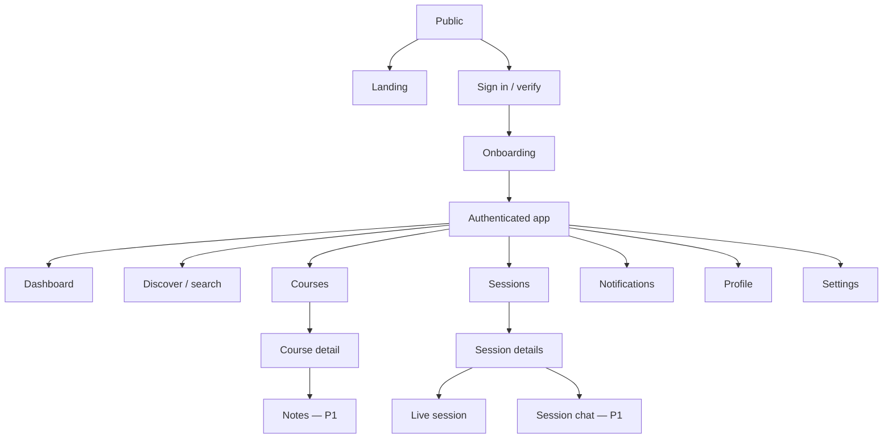

# Phase 6 — UI/UX Specification and Wireframes

## 1. Experience strategy

StudyHang should feel calm, trustworthy, and immediately useful—not like a noisy social network. The interface emphasizes time, place, course, capacity, and attendance state before avatars or activity counts.

### Design principles

1. **The next decision is obvious.** Pending confirmation, approaching session, and host attendance actions outrank generic content.
2. **State is written, not implied by color.** “Confirmed,” “2 seats,” and “Starts in 45 min” remain legible without color.
3. **Time is never ambiguous.** Display local date, timezone on detail/edit surfaces, and relative time only beside an absolute value.
4. **Trust is contextual.** Reliability is explained privately and shown to hosts only when needed.
5. **No empty dead ends.** Empty course/session results offer create, suggest, adjust filters, or invite-link actions.
6. **Mobile coordinates; desktop organizes.** Core RSVP and arrival actions need one-handed mobile use; dense host tools adapt for desktop.

## 2. Information architecture



### Global navigation

Desktop left rail: Home, Discover, Courses, Sessions, Notifications; profile/settings at bottom. Mobile bottom bar: Home, Discover, Create, Courses, Inbox. Profile/settings live under avatar menu. A persistent create button opens session creation, not a generic post composer.

## 3. Design system direction

- Use semantic design tokens for background, surfaces, text, border, focus, success, warning, danger, and course/session states.
- Light, dark, and system themes; contrast tested in both themes.
- One type family optimized for UI and broad scripts; 16px body baseline; no essential text below 12px.
- 4px spacing base with restrained density. Touch targets at least 44×44 CSS px.
- Cards are used for distinct actionable objects, not every container.
- Course identity may use a user-selectable accent, but meaning never depends on hue.
- Motion is short and functional: list insertion, confirmation change, sheet transition. No looping streak or score animations; honor `prefers-reduced-motion`.
- Icons accompany labels for important actions; icon-only actions require accessible names and tooltips on desktop.

## 4. Responsive application shell

### Desktop

```text
┌──────────────┬──────────────────────────────────────┬───────────────────┐
│ StudyHang    │ Page title             Search  [+]  │ Context panel     │
│              ├──────────────────────────────────────┤ (optional)        │
│ Home         │                                      │ pending actions,  │
│ Discover     │ Primary route content                │ roster summary,   │
│ Courses      │ max readable width for feeds/forms   │ or filters        │
│ Sessions     │                                      │                   │
│ Inbox   (3)  │                                      │                   │
│              │                                      │                   │
│ Avatar       │                                      │                   │
└──────────────┴──────────────────────────────────────┴───────────────────┘
```

The context panel appears only when it materially helps, such as session host controls or desktop filters. It is not an ad/sidebar.

### Mobile

```text
┌─────────────────────────────┐
│ Page title        Search  ● │
├─────────────────────────────┤
│                             │
│ Primary content             │
│ Single column               │
│ Sticky action only when     │
│ needed for current task     │
│                             │
├─────────────────────────────┤
│ Home Discover  +  Courses ▣ │
└─────────────────────────────┘
```

Bottom navigation does not overlap content or device safe areas. On-screen keyboard and 200% zoom must not trap controls.

## 5. Shared objects

### Session card hierarchy

1. Course code and written status.
2. Title.
3. Absolute/relative start time and duration.
4. Venue summary and accessibility indicator.
5. Capacity: “4 of 6 confirmed · 2 seats.”
6. Study styles/tags, limited to the most useful two plus overflow count.
7. Primary contextual action: View, Confirm, Join, Join waitlist, or Check in.

Avatar piles are optional secondary evidence and cap visible faces; they never replace participant counts.

### State components

- `StatusBadge`: icon + text with semantic token.
- `PendingAction`: deadline, reason, primary/secondary buttons.
- `EmptyState`: explanation + one primary recovery action + optional link.
- `InlineProblem`: plain-language failure, retained input, retry/support ID.
- `Skeleton`: matches final structure and stops animation for reduced motion.
- `ReliabilitySummary`: score/band, confidence/new state, “How this works.”

## 6. Landing page

**Goal:** explain the coordination problem and get a qualified student to sign in without promising unsupported universities.

```text
┌──────────────────────────────────────────────────────────────────────┐
│ StudyHang                       How it works  Open source  Sign in   │
├──────────────────────────────────────────────────────────────────────┤
│ Find classmates who actually    [ Find your study group ]           │
│ show up.                         [ View the source       ]           │
│ Course-based sessions, smart                                         │
│ confirmations, live attendance.  [Today: Exam review · 4 confirmed] │
├──────────────────────────────────────────────────────────────────────┤
│ 1 Join your courses  →  2 Find/create  →  3 Confirm and check in    │
├──────────────────────────────────────────────────────────────────────┤
│ Built for student privacy │ Any university │ Open source            │
│ FAQ · Safety · Accessibility · GitHub · License                     │
└──────────────────────────────────────────────────────────────────────┘
```

Requirements: semantic headings; no autoplay media; real product state illustration rather than fake testimonials; public privacy/safety links; honest “pilot/pre-alpha” status while applicable.

## 7. Login and onboarding

### Sign in

Centered, narrow panel with “Continue with Google,” university-email option, terms/privacy notice, and help. Do not imply all Google accounts are verified university identities.

### Onboarding steps

1. **Identity:** display name and verified institutional email status.
2. **University:** search globally; request missing university.
3. **Academic:** major, graduation year, join at least one course; section optional.
4. **Study preferences:** multi-select study styles and preferred time blocks.
5. **Privacy and notifications:** explain visibility; ask push permission only after showing its session value.

```text
Step 3 of 5 — Your courses
[ Search by code or title________________ ]

Selected
[ CSE 340  Introduction to Programming Languages   Remove ]

Results
CSE 355  Introduction to Theoretical CS             [Add]

Can't find it?  [Suggest a course]
                                      [Back] [Continue]
```

Progress is saved. Back does not erase fields. Skip is allowed only for nonessential preferences. Missing university/course requests show moderation status and a useful interim path.

## 8. Dashboard

**Goal:** answer “What do I need to do, and where can I study next?”

```text
┌─────────────────────────────────────────────────────────┬──────────────┐
│ Good afternoon, Maya                                    │ Your week    │
│                                                         │ Reliability │
│ ACTION NEEDED                                            │ 94% Usually │
│ Confirm CSE 340 by 2:00 PM       [Yes] [Can't attend]   │ reliable    │
│                                                         │ [Details]   │
│ TODAY                                                   ├──────────────┤
│ 3:00 PM  CSE 340 Exam review · Library · Confirmed      │ Quick links │
│ 6:30 PM  MAT 267 Homework · 2 seats             [View]  │ Saved       │
│                                                         │ Host tools  │
│ SUGGESTED FOR YOUR COURSES                              │              │
│ [session card] [session card]                           │              │
│                                                         │              │
│ COURSE ACTIVITY                                         │              │
│ CSE 340 · New session tomorrow                          │              │
└─────────────────────────────────────────────────────────┴──────────────┘
```

Priority order: pending action, session within two hours, today, suggested, course activity. Study streak is P1 and must not push critical actions down. Empty dashboard offers join course and create session. Partial failure lets sections retry independently.

## 9. Student profile

### Own profile

Header: avatar, name, university, major/year, edit and privacy preview. Sections: study preferences, course visibility, upcoming sessions, hosting/attendance summary, uploaded notes (P1), reliability detail link.

### Another student's profile

Show only permitted university-scoped fields, mutual courses, study styles, and visible upcoming hosted sessions. Reliability is a coarse label only when the viewer has a legitimate session context; otherwise omit it. Actions: view shared course or report/block from overflow. No follower count.

### Reliability detail (own)

Explain current band, confidence/new state, recent eligible outcomes, decay, exclusions, and appeal. Avoid star animation and red punitive history. Each event uses neutral copy: “No check-in recorded for CSE 340 on Aug 2 — request review.”

## 10. Course page

```text
┌──────────────────────────────────────────────────────────────────────┐
│ CSE 340 · Programming Languages                  [Joined ▾]         │
│ State University · Fall 2026 · Section optional                    │
├──────────────────────────────────────────────────────────────────────┤
│ Overview  Sessions  Discussion  Notes  Resources                    │
├──────────────────────────────────────────────────────────────────────┤
│ Next study sessions                         [Create session]         │
│ [session row] [session row]                                          │
│                                                                      │
│ Course activity / selected tab                                      │
│ Structured feed with filters and pagination                         │
└──────────────────────────────────────────────────────────────────────┘
```

MVP tabs: Overview and Sessions, plus lightweight Discussion if retained by final scope. Notes/Resources are labeled unavailable or omitted until P1—never dead tabs. Joining shows section selector when terms exist. Catalog corrections use “Suggest an edit.”

## 11. Session discovery (“Study Sessions”)

Desktop uses search/results with a filter side panel; mobile uses a filter sheet and visible applied-filter chips.

Filters: my courses, date/range, starting soon, active now, study style/tag, location, has seats/waitlist, visibility. Sort: recommended, soonest, newest. “Recommended” includes a short reason on cards (“In CSE 340 · matches discussion style”).

Map view is future/P1 unless verified location quality justifies it. A list is the accessible default.

No results states distinguish:

- no sessions exist → create session;
- filters exclude results → clear specific filters;
- course not joined → search courses;
- university not verified → finish verification.

## 12. Create/edit study session

Use one page on desktop and one continuous mobile form with anchored error summary, not a long modal.

Sections:

1. Course and purpose: course, title, description, tags, study style.
2. When: date, start, end, visible timezone, duration preview.
3. Where: approved location search, accessible details, location reveal policy.
4. People: capacity, visibility, join policy (when released).
5. Review: plain-language summary and notification implications.

```text
Create study session

Course*       [CSE 340____________________]
Title*        [Exam 2 problem-solving_____]
Description   [What should people bring?__]
Tags          [Exam review ×] [Problem solving ×]

Date* [Aug 5, 2026] Start* [3:00 PM] End* [4:30 PM]
Timezone: America/Phoenix

Location* [Search approved campus locations________]
Capacity* [6]     Visibility* [Course members ▾]

[Save draft]                              [Review session]
```

Material edits show a confirmation dialog listing affected people and reminders that will be rescheduled. Cancellation is separate, destructive, reasoned, and never placed beside ordinary Save without visual separation.

## 13. Session details

```text
┌──────────────────────────────────────────────────────┬─────────────────┐
│ CSE 340 · Scheduled                                  │ 4 of 6 confirmed│
│ Exam 2 problem-solving                               │ 2 seats         │
│ Wed Aug 5 · 3:00–4:30 PM · America/Phoenix          │                 │
│ Hayden Library · Floor 2 · Accessible entrance       │ [Join session]  │
│                                                      │ [Bookmark]      │
│ What we're covering / what to bring                  │ [Share]         │
│                                                      │                 │
│ Host · study styles · tags                           │ Host sees roster│
├──────────────────────────────────────────────────────┴─────────────────┤
│ About  Updates  Chat (P1)                                             │
└────────────────────────────────────────────────────────────────────────┘
```

Action state variants:

- join available → “Join session”;
- full → “Join waitlist · 2 waiting”;
- confirmed → written status plus “Leave session” in secondary menu;
- pending → confirmation panel with deadline;
- offered → “Seat available—accept by 2:15 PM”;
- live and eligible → “Check in”; unaffiliated viewer sees “Request to join” only if policy allows;
- completed/cancelled → no active join action, clear historical status.

Host context panel groups roster by action-needed status; exact reliability details require deliberate disclosure and are not used as decorative badges.

## 14. RSVP confirmation surface

Notifications deep-link to a compact session context, not a contextless dialog:

```text
Are you still attending?
CSE 340 Exam review
Today, 3:00–4:30 PM · Hayden Library

Please answer by 2:00 PM. No response releases your seat.

[ Yes, I'll be there ]   [ No, release my seat ]
```

After response, announce status through an ARIA live region and provide undo only when the server policy genuinely supports it. Confirmation buttons are never ambiguous thumbs icons.

## 15. Live session

### Participant view

Before arrival: large check-in choices, session venue/time, host contact path through group chat (P1), and safety/report controls. After arrival: active status, elapsed time, participant count, continuation prompt when due, and End/Leave semantics clearly distinguished.

### Host view

```text
┌──────────────────────────────────────────────────────────────────────┐
│ LIVE · CSE 340 Exam review · started 12 min ago      [End session]  │
├──────────────────────────────────────────────────────────────────────┤
│ Arrived 4   Running late 1   No response 1                           │
│                                                                      │
│ ARRIVED           LATE              NOT CHECKED IN                   │
│ Maya · 3:02       Ravi · 3:08       Jordan        [Mark status ▾]   │
│ Lina · 3:04                                                         │
│                                                                      │
│ Activity prompt appears at +1h: Is the session still active?        │
│ [Continue] [End session]                                             │
└──────────────────────────────────────────────────────────────────────┘
```

Realtime changes preserve focus and announce concise count updates without re-reading the whole roster. Connection loss shows “Updates paused—reconnecting” and refetches authoritative state.

## 16. Chat (P1)

Session-scoped only. Header retains session name/status and pinned-message access. Timeline uses cursor loading upward, date separators, sender/time, edited/deleted states, and safe link/file previews. Composer supports text, then files/images only after upload scanning exists.

Mobile keeps composer above keyboard/safe area. Keyboard shortcuts are documented and never required. New-message indicator does not steal scroll position. Report/block is available on message context. Completed sessions become read-only after a policy-defined period.

## 17. Notes (P1)

### Course notes library

Search, type filter, sort (recent/helpful), and cards/rows containing title, file type, contributor, updated date, description/tags, and moderation status. Likes are framed as “Helpful,” not popularity.

### Note detail

Metadata and safe preview/download; version/source statement; comments; bookmark/helpful actions; report. PDFs/slides have an accessible download and extracted-text path where possible. Upload requires rights attestation and academic-integrity reminder.

### Upload

Intent → direct upload progress → scanning → ready/rejected. Navigation does not silently cancel an upload. Failure retains metadata and offers retry. Never claim a file is published before scan completion.

## 18. Settings

Routes/sections:

- Account: identity status, university email, sign-out sessions, delete account.
- Profile: public fields and preview.
- Privacy: field-level visibility, blocks, data export.
- Notifications: category × channel, quiet hours, test push state.
- Appearance and accessibility: theme, reduced motion follows system, time format.
- Safety: reports submitted and support links where policy permits.

Danger zone is last, visually distinct, and uses re-authentication for destructive account actions.

## 19. Notifications inbox

Grouped by Today/Earlier with All and Unread filters. Each row has category icon, full text, absolute/relative time, read state, and one contextual action. RSVP and waitlist rows show deadlines. Mark-all-read uses a timestamp boundary so newly arriving notifications remain unread.

Empty state explains which important notifications appear and links to preferences. Push permission status is a small setting prompt, not a blocking banner.

## 20. Search

Global search uses a full page on mobile and command-style overlay only for quick desktop navigation. Results are grouped into Courses, Sessions, Students, Universities, and Locations; each group respects privacy and offers “See all.”

```text
Search StudyHang
[ cse 340 exam__________________________________ ]

SESSIONS
CSE 340 · Exam review · Tomorrow 3 PM · 2 seats

COURSES
CSE 340 · Programming Languages · State University

STUDENTS (same university only)
Maya Chen · shared course: CSE 340
```

Recent searches remain local/private by default. Search does not expose email, hidden course membership, private/unlisted sessions, blocked users, or reliability.

## 21. Error, empty, loading, and offline behavior

Every screen has:

- initial skeleton matching content structure;
- zero-data state with next step;
- filtered-zero state with filter recovery;
- inline recoverable error retaining inputs;
- full route error boundary with request ID;
- permission state that does not leak concealed resources;
- stale/offline indicator when cached data is displayed;
- optimistic state only where rollback is safe.

Critical commands display server-confirmed status. If a join request times out, the UI says “Checking your status…” and reads the participant resource before inviting a retry.

## 22. Accessibility requirements

- WCAG 2.2 AA target and documented exceptions only with owner/expiry.
- One logical `h1`; landmarks and skip link; native controls first.
- Full keyboard operation with visible focus and no traps.
- Status never color-only; badges include text/icon.
- Live roster uses restrained ARIA live messages and focus stability.
- Dialogs name themselves, trap focus correctly, and return focus.
- Forms have persistent labels, descriptions, field errors, and top error summary.
- Dates use semantic `<time>` equivalents and readable text.
- Motion honors reduced-motion; no flashing or auto-advancing carousels.
- 200% zoom and 320px width without two-dimensional scrolling except legitimate data tables.
- Touch targets, contrast, screen-reader names, and alternative content for document previews.

## 23. Content design

- Use “session,” “participant,” and “host” consistently.
- Say what happened and what the user can do: “Your seat was released because the confirmation deadline passed.”
- Avoid blame: “No arrival was recorded” instead of “You failed to show.”
- Pair every deadline with consequence.
- Use course code plus title where ambiguity exists.
- Never use only “Yes/No” when the prompt can scroll away; button labels carry meaning.

## 24. Usability validation plan

Before implementation: five moderated prototype sessions across commuter, residential, international, and accessibility perspectives. Test onboarding, discover/join, confirmation, host roster, arrival, and missing-course recovery.

Before pilot: task-based tests on mobile and desktop, screen-reader/keyboard audit, timezone comprehension test, and notification-copy comprehension. Success criteria derive from the PRD and include misclick/error recovery, not only task completion.

## 25. UI acceptance checklist

- [ ] Every requested screen has a defined purpose, hierarchy, primary action, and responsive behavior.
- [ ] P1 screens are clearly separated from MVP navigation.
- [ ] Host and participant states cover all legal lifecycle values.
- [ ] Empty/error/loading/offline/permission states are designed.
- [ ] Reliability and attendance copy passes dignity review.
- [ ] Critical flows pass keyboard, screen reader, zoom, contrast, and reduced-motion checks.
