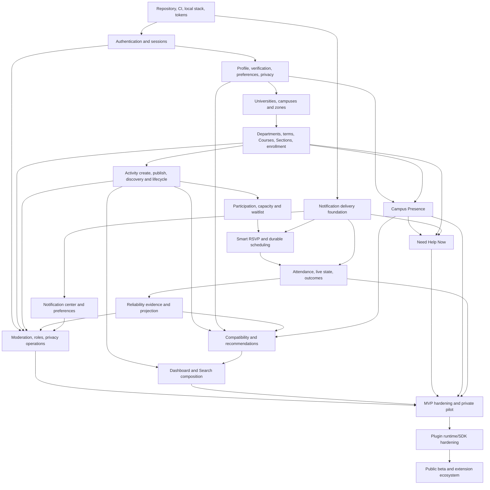
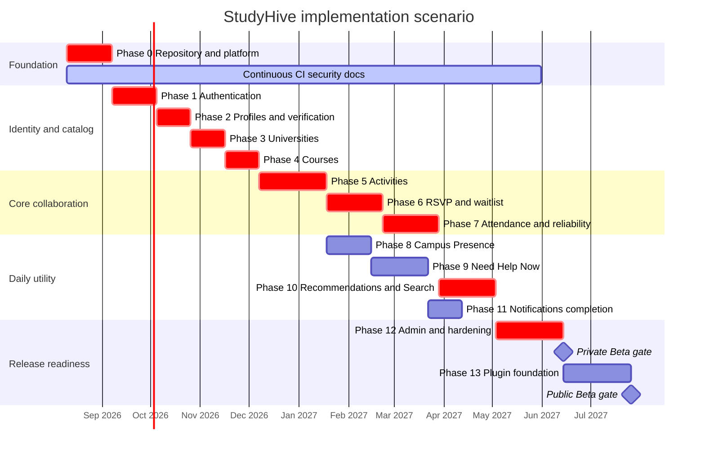
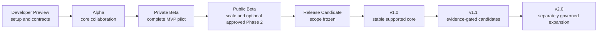
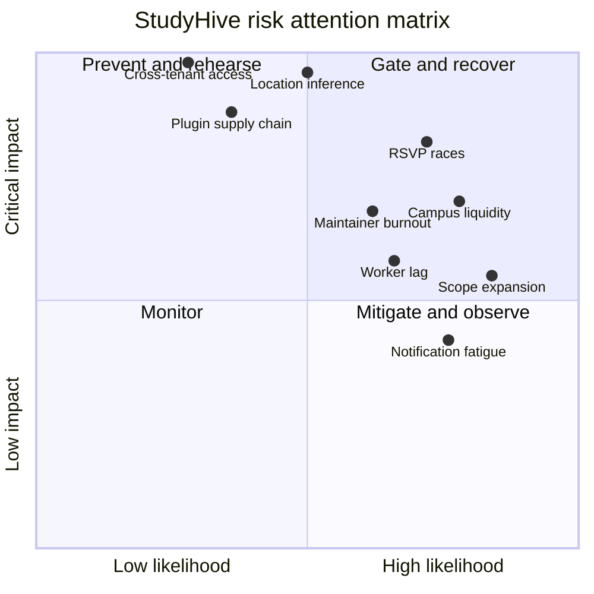
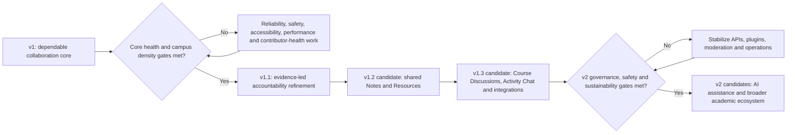

# Part 8 — Implementation Roadmap & Project Execution Plan

**Product:** StudyHive  
**Status:** final planning artifact before implementation  
**Version:** 1.0  
**Planning date:** 2026-08-05  
**Normative inputs:** finalized Parts 1–7

## 0. Planning frame

This document turns the approved product, architecture, data, API, engineering and design specifications into executable work. It does not change scope or contain implementation code, workflow configuration, React/FastAPI code or infrastructure definitions.

### 0.1 Baseline team and estimate model

The sequencing assumes a small funded core team with open-source contributors:

| Capability | Baseline availability |
|---|---|
| Product/technical leadership | 1 product-minded technical lead/maintainer |
| Backend | 2 engineers, one comfortable with PostgreSQL/concurrency/workers |
| Frontend/full stack | 2 engineers, one design-system/accessibility owner |
| Product design/research | 0.5–1 designer/researcher across critical flows |
| QA/security/DevOps | Shared specialists or 1–2 combined roles, increasing near pilot |
| Community/documentation | Maintainer rotation plus contributors; dedicated support before public beta |

Sprints are two weeks. Estimates are relative complexity, not promises:

| Size | Meaning |
|---|---|
| S | Isolated, known pattern, normally one owner and focused review |
| M | One vertical slice or cross-layer change with ordinary risks |
| L | Multiple owners/contracts, meaningful failure/accessibility/security cases |
| XL | Several slices or a stateful/concurrent/security-critical capability; split before assignment |

The initial calendar is a scenario for dependency planning. Rebaseline after Sprint 0, each release gate, staffing changes and material research findings. Volunteer work accelerates only when scoped and reviewed; it is never assumed for the critical path.

### 0.2 Release boundary

The **MVP/private pilot** is exactly the finalized PRD boundary: authentication, verified profiles, University/Course graph, Activities, RSVP/waitlist, attendance/live state, Campus Presence, Need Help Now, reliability, focused Dashboard/Search/recommendations, notifications, moderation/privacy/accessibility and self-hostable operations.

Activity chat, Course discussions, Notes/resources, direct messages, persistent Project Teams, reputation categories, anonymous feedback, AI, marketplace/tutoring/mentorship/research/career modules, deep LMS/calendar integrations and native mobile apps are not MVP. Architecture and contracts may reserve clean extension points, but implementation does not build empty speculative modules.

### 0.3 Execution gates

Every phase exits only when its vertical slice works through UI → API → domain → PostgreSQL/Redis as applicable → observability → documentation/tests. A percentage-complete phase with broken end-to-end behavior does not unlock dependent work.

Release gates are cumulative:

1. **Contract gate:** approved behavior/data/API/design, no undocumented deviation.
2. **Correctness gate:** state, concurrency, idempotency, migration and recovery tests pass.
3. **Safety gate:** authorization, tenant, privacy, abuse and accessibility acceptance pass.
4. **Operations gate:** metrics/logs/alerts/runbooks/backup/rollback work.
5. **Evidence gate:** user research/pilot metrics support expanding exposure.

---

## 1. Implementation philosophy

### 1.1 Vertical slice development

Build the smallest complete user outcome across all layers, then extend it. For example, “student creates a standalone draft Activity and sees it on the Course page” includes the database migration, repository/application policy, API contract, web form/list, permissions, error/loading/accessibility behavior, tests, telemetry and documentation. It does not mean finishing every Activity table, every backend route and then beginning the UI months later.

Vertical slices are preferred because they:

- expose API/data/design mismatches while changes are still small;
- produce demonstrable outcomes every sprint;
- exercise deployment, authentication, observability and testing continuously;
- let contributors work on bounded issues with visible context;
- reduce large integration phases and “90% done” frontend/backend silos;
- make research feedback influence the next slice rather than a completed subsystem.

Frontend and backend specialists still own depth, but collaborate on one acceptance journey. Foundation work is time-boxed and justified by the next slice.

### 1.2 Continuous integration

Every pull request runs formatting, lint/type, unit, architecture and focused security checks; affected integration/contract/accessibility suites run before merge. `main` remains releasable. Broken/flaky checks are treated as defects, not bypassed. Migrations and generated contracts are verified from canonical sources.

### 1.3 Continuous delivery and deployment

Every merge produces an immutable tested artifact and deploys automatically to a shared staging environment when healthy. Pull requests receive safe preview environments where feasible. Production/pilot promotion is deliberate and gated; “continuous deployment” begins with low-risk environments and expands only after rollback, monitoring and staffing are proven.

### 1.4 Documentation-driven development

Issues link to the canonical product/system/database/API/design clauses. Contract/decision updates precede or accompany implementation. A slice includes user, contributor and operator documentation. Generated OpenAPI/clients later derive from the approved API contract and must pass drift checks.

### 1.5 Test-driven mindset

Before implementation, define acceptance, denial, conflict, offline, accessibility and failure cases. Pure policies/state machines are often test-first. Bugs receive a failing regression test. Coverage is a guardrail, while concurrency/property/model/security tests prove the risks that percentages miss.

### 1.6 Feature flags

Flags separate deployment from exposure. Use them for incomplete multi-sprint journeys, pilot cohorts, risky algorithms/provider changes and fast rollback. Every flag has an owner, safe default, scope, metrics, removal issue and expiry. Flags never bypass authentication, authorization, migrations, privacy, accessibility or safety controls.

### 1.7 Incremental releases

Developer preview validates setup/contracts; Alpha validates complete internal journeys; Private Beta validates MVP with selected University cohorts; Public Beta validates operational/community scale and separately approved Phase 2 candidates; RC freezes scope; v1.0 establishes the stable supported baseline.

### 1.8 Backward compatibility

Use expand–migrate–contract database changes, stable `/api/v1`, versioned events/realtime/webhooks, additive token/component changes and documented plugin compatibility. Old/new clients are contract-tested during overlap. Breaking work requires an approved major version/migration rather than silent implementation drift.

### 1.9 Work-in-progress policy

- One active primary issue per engineer plus limited review/incident work.
- No phase begins at full capacity before its blocking acceptance gate; preparatory research/docs/tests may start earlier.
- Pull requests target one reviewable outcome and normally remain under the handbook size signal.
- Blocked work is made visible within one working day with blocker, owner and next decision.
- Maintenance, security, accessibility and documentation capacity is reserved every sprint; roadmap features do not consume 100%.

---

## 2. Project dependency graph

### 2.1 Critical dependency graph

The critical path is repository/authentication → profile/verification → academic graph → Activities → participation/RSVP → attendance/live/outcomes → reliability → integrated Dashboard/Search/recommendations → moderation/hardening → private pilot. Presence and Need Help form a parallel critical branch after profile/Course; notification infrastructure begins early and expands with each feature.

### 2.2 Dependency register

| Capability | Depends on / blocked by | Unlocks | Critical path |
|---|---|---|---:|
| Repository/local stack | Approved monorepo/tool versions, ownership and secrets policy | Every implementation slice | Yes |
| CI/artifact baseline | Repository, test services, lockfiles | Safe merge, preview/staging, releases | Yes |
| Design-system foundation | Final Part 7 tokens/components, web scaffolding | Consistent/authenticated UI slices | Yes |
| Authentication/session | User/identity migration, email provider abstraction, security review | Every authenticated feature | Yes |
| University verification | Auth, email/domain policy, moderation fallback | Course enrollment, Presence, Need Help, discovery | Yes |
| Profile/preferences/privacy | Auth, verification context, storage avatar flow later | Compatibility, discoverability, blocks, personalized Dashboard | Yes |
| Academic catalog | Auth/admin scope, tenant constraints | Enrollment, Activities, Search, Presence zones | Yes |
| Course enrollment | Catalog, verification, permissions | Course workspace, Activities, member discovery | Yes |
| Outbox/durable jobs | PostgreSQL foundation, worker runtime, idempotency | Notifications, recurrence, RSVP, lifecycle clocks | Yes |
| Notification delivery foundation | Outbox/jobs, email/Web Push adapters, templates | Confirmation/reminders/security delivery | Yes |
| Activity core | Course, design/API contracts, storage/location references | Participation, search, recurrence, live feed | Yes |
| Recurring Activities | Activity core, durable jobs, timezone/DST tests | Repeated collaboration | Yes but can follow standalone slice |
| Participation/capacity | Activity state, locking/idempotency | Waitlist, RSVP, roster | Yes |
| Waitlist/offers | Participation, durable jobs, notification delivery | Accurate capacity utilization | Yes |
| Smart RSVP | Participation, jobs, notifications, server clocks | Reliable confirmed roster | Yes |
| Attendance/live/outcome | RSVP/participant state, realtime, jobs | Reliability, completed collaboration metric | Yes |
| Reliability | Finalized attendance evidence, policy fixtures, appeals/admin | Host context, recommendation tie-breaker | Yes |
| Campus Presence | Verified profile, University/CampusZone, Redis/realtime/privacy thresholds | Live campus utility, Need Help signal | Parallel critical |
| Need Help Now | Course, blocks/preferences, Presence optional, jobs/notifications | Immediate collaboration and Ad-Hoc Activities | Parallel critical |
| Compatibility | Preferences, Activity compatibility inputs, policy fixtures | Explainable Activity/partner matching | Yes for MVP differentiation |
| Recommendations | Compatibility, Activities, permissions, Presence/reliability bounded signals | Suggested Activities/partners, Dashboard | Yes |
| Search | Academic/Activity/Profile sources, authorized projection/indexing | Global discovery and Dashboard fallbacks | Yes |
| Dashboard | RSVP/attendance/help/presence/search/recommendation read models | First coherent home experience | Yes |
| Notification center | Delivery foundation, feature event intents, preferences | In-app action hub | Yes |
| Moderation/roles/reports | Auth, tenant scopes, content targets, audit | Minimum safe pilot operations | Yes |
| Export/erasure/audit | All data owners, storage/plugins contracts, recent auth | Privacy readiness and production gate | Yes |
| Self-host deployment | All runtime entry points, migrations/config, backup/restore | External contributors/operators | Yes |
| Plugin runtime/SDK | Stable API/events/capabilities, admin, secrets, isolation | Integrations and future marketplace | Post-MVP unless an approved pilot integration requires it |
| Activity chat/Course discussion | Activity/Course membership, storage/moderation/notifications | Phase 2 coordination | No; deferred |
| Notes/resources | Course, storage scanning, search/moderation/rights | Phase 2 knowledge library | No; deferred |

### 2.3 Parallel work lanes

While one vertical slice is critical, supporting lanes proceed without violating dependencies:

| Lane | Continuous responsibility |
|---|---|
| Product/design/research | Validate next two sprints, content/states, pilot comprehension and accessibility |
| Platform/DevOps | Local stack, CI, previews, staging, release artifacts, backups, observability |
| Backend/data | Current slice domain/API/migration plus next slice spikes/fixtures |
| Frontend/design system | Current slice UI/accessibility plus approved primitive foundation |
| QA/security | Test matrices, threat models, automation and release evidence from Sprint 0 |
| Docs/community | Setup/reference guides, issue readiness, onboarding, triage and contributor support |

---

## 3. Implementation phases

### 3.1 Phase overview

| Phase | Capability | Release contribution | Complexity |
|---:|---|---|---:|
| 0 | Repository and engineering foundation | Developer preview foundation | XL |
| 1 | Authentication and sessions | Developer preview | XL |
| 2 | Profiles, verification and preferences | Developer preview/Alpha | L |
| 3 | Universities, campuses and zones | Alpha | L |
| 4 | Courses, Sections and enrollment | Alpha | L |
| 5 | Activities and recurrence | Alpha | XL |
| 6 | Participation, capacity, waitlist and RSVP | Alpha/Private Beta | XL |
| 7 | Attendance, live state, outcomes and reliability | Private Beta | XL |
| 8 | Campus Presence | Private Beta | L |
| 9 | Need Help Now | Private Beta | XL |
| 10 | Compatibility, recommendations, Search and Dashboard | Private Beta | XL |
| 11 | Notification center/preferences and delivery hardening | Private Beta | L |
| 12 | Administration, moderation, privacy and production hardening | Private Beta/RC | XL |
| 13 | Plugin runtime/SDK and integration readiness | Post-MVP/Public Beta candidate | XL |

Notification/outbox primitives begin in Phase 0 and support each later slice; Phase 11 completes the user-facing notification system. Administration primitives begin with tenant catalog ownership and audit; Phase 12 completes minimum safe operations.

### 3.2 Phase 0 — Repository setup

| Field | Plan |
|---|---|
| Purpose | Make one-command development, review, testing and release evidence possible before product code scales |
| Goals | Monorepo layout; pinned runtimes/dependencies; local PostgreSQL/Redis/storage/mail; config/secrets validation; baseline web/API/worker/realtime shells; design tokens; CI/security/docs skeleton |
| Deliverables | Repository ownership/commands; local and container setup; health/readiness contract; migration/seed harness; test fixtures; architecture boundary checks; preview/staging artifact pipeline plan; contributor quick start |
| Dependencies | Parts 1–7, selected tool versions and hosting accounts/sandbox providers |
| Acceptance criteria | Fresh contributor reaches healthy web/API/worker/realtime and test suite from docs; no production secrets; empty migration upgrades; baseline accessibility/security/contract checks run |
| Definition of done | Setup tested on supported macOS/Linux and container path; CI artifacts deterministic; CODEOWNERS/templates/security policy live; observability and backup smoke paths documented |
| Risks | Overbuilding platform, cross-OS drift, slow CI, dependency/licensing issues |
| Complexity | XL; time-box platform choices and build only what Phase 1 exercises |

### 3.3 Phase 1 — Authentication

| Field | Plan |
|---|---|
| Purpose | Establish secure internal identity and session boundary for every later feature |
| Goals | Email/password registration/login/logout/refresh/recovery/verification; Google OAuth; session rotation/revocation; recent authentication; auth abuse controls |
| Deliverables | Identity/session schema; auth application/API adapters; accessible auth/onboarding shell; email templates/provider fake; audit/log/metrics; contract/security/E2E tests |
| Dependencies | Phase 0, identity provider credentials/sandbox, email delivery abstraction, threat model |
| Acceptance criteria | Happy and negative flows match Part 5; account enumeration/replay/CSRF/session reuse tests pass; provider failure degrades safely; browser secret remains HttpOnly |
| Definition of done | Google and email login usable end to end; logout-all/recovery audited; docs/config/runbook complete; dependency/security review approved |
| Risks | Account linking takeover, provider drift, email deliverability, session/CORS/CSRF mistakes |
| Complexity | XL; security-critical and release-blocking |

### 3.4 Phase 2 — Profiles

| Field | Plan |
|---|---|
| Purpose | Create verified, privacy-aware student identity and matching inputs |
| Goals | University verification request/status; profile; field visibility; study preferences/availability; blocks/consents; avatar storage slice |
| Deliverables | Profile/preference/privacy models/APIs; onboarding steps; profile/edit/visibility preview; block behavior; search-safe projection foundation; test fixtures |
| Dependencies | Phase 1; University placeholder/request flow from Phase 3 designed; storage quarantine minimum for avatars |
| Acceptance criteria | Incomplete/verified/suspended states; hidden fields/blocks; controlled preference values; timezone/nonoverlap; avatar scan fallback; screen-reader onboarding pass |
| Definition of done | A new User completes onboarding without enabling Presence; own/other profile field filtering works; compatibility fixtures can consume preferences later |
| Risks | Verification dead ends, privacy inference, optional-field friction, preference overcollection |
| Complexity | L |

### 3.5 Phase 3 — Universities

| Field | Plan |
|---|---|
| Purpose | Establish tenant-safe academic and campus foundation without hardcoding one institution |
| Goals | University/domain/campus/CampusZone/Department/Term catalog; scoped admin bootstrap; request missing institution; catalog provenance |
| Deliverables | Tenant constraints and APIs; public/verified catalog UI; admin catalog forms; safe branding bounds; seed only controlled reference data; import extension contract |
| Dependencies | Phases 0–2, first instance-admin flow, University research fixtures |
| Acceptance criteria | Two-University tests prove zero cross-tenant references/search; archive/restore/merge rules; zones are coarse/privacy-safe; branding maintains contrast |
| Definition of done | An admin can configure a new University/campus/zone/department/term and a student can verify/request it; audit/permissions/docs complete |
| Risks | Global University data quality, domain ambiguity, tenant leakage, overbuilt imports |
| Complexity | L |

### 3.6 Phase 4 — Courses

| Field | Plan |
|---|---|
| Purpose | Give every collaboration a verified academic context |
| Goals | Course/Section catalog, enrollment join/leave, Course workspace, member privacy, scoped moderation basics |
| Deliverables | Course/Section/enrollment data/API/UI; Course search/autocomplete; admin create/archive/merge; membership permission tests |
| Dependencies | Phase 3 and verified profile |
| Acceptance criteria | Course/Section same-tenant constraints, one active membership, blocked/hidden member filtering, archived Course behavior, accessible empty states |
| Definition of done | Student finds/joins first Course and sees functional Course workspace ready for Activities; admin catalog operations audited |
| Risks | Duplicate/cross-listed courses, privacy of enrollment, catalog moderation workload |
| Complexity | L |

### 3.7 Phase 5 — Activities

| Field | Plan |
|---|---|
| Purpose | Deliver the core purposeful academic collaboration object |
| Goals | Standalone Activity create/draft/publish/edit/cancel/archive/duplicate/discovery; goals; types/tags; weekly recurrence and independent occurrences |
| Deliverables | Activity/series/occurrence/goal/host models; state machine; APIs; Course/list/details/create/edit/host UI; outbox/indexing; timezone/DST/permission tests |
| Dependencies | Phase 4, durable jobs/outbox minimum, design-system forms/cards/dialogs |
| Acceptance criteria | Published Activity has primary goal; valid transitions/versions; recurrence ≤16/16 weeks and independent state; material changes notify intent; Project Team Formation fields do not create persistent team |
| Definition of done | User creates/discovers/opens/manages standalone and weekly Activities end to end; all empty/error/loading/responsive/accessibility states and operator docs complete |
| Risks | Scope explosion, recurrence/DST errors, state drift, copied private data, slow discovery queries |
| Complexity | XL; split into standalone then recurrence slices |

### 3.8 Phase 6 — RSVP, waitlist and capacity

| Field | Plan |
|---|---|
| Purpose | Keep participant lists accurate and capacity fair under concurrency |
| Goals | Join/leave/bookmark/share; atomic seat assignment; waitlist ordering/offers/expiry; Smart RSVP timeline; automatic removal/promotion; host roster |
| Deliverables | Participant/waitlist/offer/RSVP models and locks; durable scheduled work; notification templates; participant/host UI; realtime roster updates; concurrency/fake-clock tests |
| Dependencies | Phase 5, notification delivery foundation, worker/outbox/realtime foundations |
| Acceptance criteria | Last-seat race never oversubscribes; duplicate calls idempotent; offer/RSVP race deterministic; no-response removal/promotes next; late response cannot resurrect seat; decline/expiry no reliability impact |
| Definition of done | Full join → waitlist → offer → RSVP/removal/promotion journey works through server-confirmed accessible UI and survives worker restart |
| Risks | Race conditions, timer drift, notification delays, unfair queue skips, confusing consequences |
| Complexity | XL; highest correctness risk with Attendance |

### 3.9 Phase 7 — Attendance, live Activities, outcomes and reliability

| Field | Plan |
|---|---|
| Purpose | Establish factual arrival/live/completion and constructive accountability |
| Goals | Check-in Here/Late/Can’t; host live roster; Continue/End/inactivity; outcomes; reliability evidence/score/New state/history/appeal |
| Deliverables | Attendance/events/live checks/outcomes/reliability policy/projections; live workspace; realtime recovery; corrections/appeals; metrics and fairness fixtures |
| Dependencies | Phase 6 and administration case foundation for appeals/corrections |
| Acceptance criteria | Page/Presence/chat never count as attendance; automatic completion yields Not Reported; one source creates one primary evidence; corrections supersede; exact reliability private/no ranking |
| Definition of done | Scheduled Activity progresses through check-in/live/ending/completed with accurate outcome/reliability after restart/disconnect; accessibility/security/fairness tests pass |
| Risks | False attendance, punitive UX, evidence duplication, clock/realtime failure, fairness/bias |
| Complexity | XL |

### 3.10 Phase 8 — Campus Presence

| Field | Plan |
|---|---|
| Purpose | Answer “Is anyone studying now?” with deliberate temporary privacy-safe presence |
| Goals | Invisible default; intent/discoverability consent; Redis TTL/heartbeat; thresholded Zone/Course aggregates; self state/Go Invisible; realtime invalidation |
| Deliverables | Presence preferences/consent; Redis representation/aggregation; APIs/UI; privacy threshold/config; expiry/recovery/load tests |
| Dependencies | Phases 2–4, Redis/realtime, CampusZones, privacy review |
| Acceptance criteria | Redis clear makes everyone invisible; no exact history/individual aggregate leak; blocks and thresholds work; visibility expires; Go Invisible prompt; not attendance evidence |
| Definition of done | Verified student safely enables/refreshes/disables Presence and sees accessible thresholded campus counts across reconnect/failure |
| Risks | Location inference, stale visibility, Redis memory/cardinality, misunderstood discoverability |
| Complexity | L with mandatory privacy/security sign-off |

### 3.11 Phase 9 — Need Help Now

| Field | Plan |
|---|---|
| Purpose | Create immediate course-scoped collaboration without formal scheduling friction |
| Goals | One active request; eligibility/ranking waves; bounded invitations; accept race; mutual match; Ad-Hoc Help Activity; cancellation/expiry |
| Deliverables | Request/invitation/match models/APIs/jobs; composer/search/invitation/match UI; notification/realtime; abuse/rate/fairness/timeout tests |
| Dependencies | Phases 4, 6 foundations and 8 optional Presence signal; blocks/preferences/notifications |
| Acceptance criteria | Only eligible candidates; invitation caps 3/hour and 10/day defaults; one winner under concurrent accept; no pre-consent exact identity/location; decline/ignore/expiry no reliability effect |
| Definition of done | Requester creates/cancels/expires/matches end to end; candidate accepts/declines accessibly; resulting collaboration can enter ordinary Activity attendance |
| Risks | Spam/fatigue, safety, no candidate liquidity, privacy inference, match races |
| Complexity | XL |

### 3.12 Phase 10 — Compatibility, recommendations, Search and Dashboard

| Field | Plan |
|---|---|
| Purpose | Make relevant collaboration discoverable and explainable from one focused home |
| Goals | Deterministic compatibility/coverage/reasons; Activity/partner recommendations; authorized search; focused Dashboard priority composition |
| Deliverables | Versioned policy/projections/indexing; search endpoints/UI; recommendation cards/dismissal; Dashboard sections; evaluation fixtures/metrics |
| Dependencies | Profiles, Courses, Activities, Reliability, Presence, Need Help/notification states |
| Acceptance criteria | Exact PRD weight fixtures; no score below 60 coverage; authorization before ranking/pagination; no reliability in compatibility; cold-start fallback; urgent Dashboard order correct |
| Definition of done | Student can find/suggest/join a relevant Activity/partner with truthful reasons; search never leaks hidden membership/presence/reliability; projection failure degrades safely |
| Risks | False precision, bias/result concentration, stale/full results, search authorization, slow queries |
| Complexity | XL; implement compatibility and authorized Activity search before broader recommendations |

### 3.13 Phase 11 — Notifications

| Field | Plan |
|---|---|
| Purpose | Complete the bounded action-focused communication system built incrementally since Phase 1 |
| Goals | In-app center; read/unread/dismiss/archive; category/channel/quiet preferences; Web Push/email hardening; action expiry; provider retry/DLQ |
| Deliverables | Notification resources/deliveries/subscriptions/preferences; center/settings UI; service-worker/push permission UX; provider dashboards/runbooks |
| Dependencies | Outbox/delivery foundation and all feature notification intents |
| Acceptance criteria | Deduplication and action reauthorization; quiet/mandatory rules; invalid device cleanup; provider failure does not alter domain state; fatigue/delivery metrics; accessible live announcements |
| Definition of done | Every MVP notification category works in-app and through configured allowed channels, with retries/fallback/privacy/preferences tested |
| Risks | Notification fatigue, deliverability, duplicate/late prompts, browser permission denial, provider lock-in |
| Complexity | L because primitives exist, but cross-feature regression is broad |

### 3.14 Phase 12 — Administration and production hardening

| Field | Plan |
|---|---|
| Purpose | Make the MVP safe, operable, self-hostable and pilot-ready |
| Goals | Roles/grants/restrictions; reports/cases/actions; audit; privacy export/erasure; admin metrics; backups/restore; performance/security/accessibility hardening; deployment/release docs |
| Deliverables | Admin workspace/API; moderation/privacy workflows; scoped metrics; production configuration; Docker/self-host path; runbooks/alerts; pilot support process |
| Dependencies | All MVP domains and specialist reviews |
| Acceptance criteria | Cross-tenant/IDOR/security suite; critical journeys WCAG 2.2 AA; restore drill; migration/rollback; load targets; zero known critical/high untreated risks; moderation/export/erasure end-to-end |
| Definition of done | Private Beta checklist and pilot operator training pass; incident/backup/release/on-call ownership active; known risks accepted explicitly |
| Risks | Late security/accessibility discovery, moderation overload, operational immaturity, scope pressure |
| Complexity | XL; begins incrementally in Phase 0, closes after integrated testing |

### 3.15 Phase 13 — Plugins

| Field | Plan |
|---|---|
| Purpose | Turn stable extension boundaries into a safe contributor/integration platform after MVP proves core contracts |
| Goals | Registry/version/install lifecycle; capabilities; external runtime/SDK; signed webhooks; config/secrets; migration/test harness; reference plugin |
| Deliverables | Plugin admin flows, SDK/contracts, isolated runner guidance, compatibility matrix, event replay/DLQ, publication/security review process |
| Dependencies | Stable v1 API/events, administration/secrets/audit, production operations; separate plugin threat review |
| Acceptance criteria | No direct core database access; least-privilege grants; disable revokes; duplicate/gap/migration/failure tests; core continues during plugin outage; reference plugin self-hosts |
| Definition of done | One reviewed reference integration completes install → enable → event/API use → upgrade → disable/uninstall with export/erasure and docs |
| Risks | Supply chain, capability escalation, ecosystem support burden, contract premature freeze |
| Complexity | XL; post-MVP/Public Beta candidate, not allowed to delay private pilot |

### 3.16 Illustrative implementation Gantt

The dates below assume Sprint 0 starts 2026-08-10 and the baseline team. Release gates, not dates, control exposure.

The Gantt shows principal sequencing, not full resource allocation. Presence/Need Help, notification delivery, admin/security and design/QA lanes overlap where their blockers permit.

---

## 4. Sprint plan

### 4.1 Sprint operating model

Each two-week sprint reserves approximately 70% for roadmap slices, 15% for defects/security/accessibility/performance, 10% for reviews/community support and 5% for discovery/spikes. The percentages are capacity guardrails, not time tracking. An incident or release blocker overrides planned work.

Sprint planning selects only Ready issues with acceptance/design/contract/dependency clarity. Sprint review demonstrates the end-to-end slice in the shared environment. Retrospective changes one or two measurable team practices, not the canonical product scope.

### 4.2 MVP sprint roadmap

| Sprint | Objective and features | Backend/database | Frontend/design | Docs, QA and DevOps | Exit evidence | Stretch only |
|---:|---|---|---|---|---|---|
| 0 | Development environment and repository skeleton | Workspace boundaries; PostgreSQL/Redis/storage/mail services; migration/seed/test harness; health contracts | Next.js shell; approved token/theme primitives; error/loading shell | Quick start; CI/security/license baseline; local containers; CODEOWNERS/templates | Fresh setup on supported paths; all baseline checks/artifacts pass | PR preview proof-of-concept |
| 1 | Email/password registration, login, session validation/logout | User/identity/email/password/session models; secure cookie/CSRF; audit/rate limits | Accessible auth forms and session bootstrap/error states | Auth threat model; contract/security/unit/E2E; email sink | Register/login/logout/session works with generic errors and no secret exposure | Logout-all UI |
| 2 | Google OAuth, recovery/verification, profile onboarding | OAuth identity link; recovery/verification; Profile/StudyPreference/consent models | OAuth/recovery; onboarding profile/preferences/privacy; theme/accessibility | Provider config/runbook; account-link/replay tests; onboarding research | Both auth methods and incomplete/complete profile journeys pass | Avatar upload draft |
| 3 | Universities, campus Zones and verification | University/domain/campus/zone/department/term models; scoped admin; verification mapping | University chooser/request; verification status; basic admin catalog | Multi-tenant test suite; catalog admin docs; synthetic fixtures | Two-University isolation, new University setup and verification path pass | CSV catalog import spike |
| 4 | Courses, Sections and enrollment | Course/Section/enrollment constraints/APIs; search projection seed | Course search/join/leave/workspace; member privacy/empty states | Catalog/membership docs; tenant/authorization/accessibility tests | Student joins first Course; admin archive/merge behavior proven | Course shortcuts on Dashboard shell |
| 5 | Standalone Activity vertical slice | Activity/type/occurrence/goal/host; create/draft/publish/read/edit/cancel; outbox | Activity create form, Course list/card, details/host actions | State/API/migration docs; permission/version/timezone tests | Create → publish → discover → edit/cancel works end to end | Duplicate draft |
| 6 | Recurrence and scalable Activity discovery | Series/materialization/jobs; weekly exceptions; indexes/search projection | Recurrence preview/edit scope; filters/sort/pagination; responsive list | DST/property/load plans; worker recovery; query-plan fixtures | ≤16 independent occurrences survive retries/DST and discovery meets budget | Project Team Formation skill fields |
| 7 | Participation, atomic capacity and waitlist | Participant/seat locking; join/leave; waitlist ordering/offers; idempotency | Join/leave/bookmark/share; own waitlist status; host roster baseline | Last-seat/property/concurrency tests; copy research | No oversubscription; duplicate requests safe; first offer journey works | Host participant export intentionally excluded |
| 8 | Smart RSVP and notification delivery foundation | Durable prompts/second reminder/removal/promotion; notification intents/email/Web Push adapters | RSVP prompt/status/deadline; offer actions; host confirmed/pending/declined/removed | Fake-clock/crash/provider tests; delivery dashboards/runbook | Timeline fires correctly across restart; no-response removal promotes next | Notification preference draft |
| 9 | Attendance, live Activity and outcomes | Attendance records/events; lifecycle clocks; Continue/End/auto-complete; outcomes | Check-in actions; live roster/workspace; Ending/Completed/outcome form | WebSocket recovery; accessibility; state/property/security tests | Here/Late/Can’t + auto-completion/Not Reported work under disconnect/restart | Co-host operational controls |
| 10 | Reliability | Policy/evidence/score/New state; correction/appeal foundation | Private summary/history/explanation; host coarse band; appeal form | Deterministic fixtures/fairness/threat review; docs | One-source-one-evidence, correction and privacy rules reproduce fixtures | Fairness admin aggregate prototype |
| 11 | Campus Presence | Redis TTL/heartbeat/threshold aggregate; durable consent; realtime | Persistent Visible/Invisible control; intent/Zone/expiry; aggregate list | Privacy/adversarial/load/Redis-loss tests; comprehension research | Invisible default, threshold safety, expiry and Redis-clear behavior pass | Optional map only if list complete/accessibility proven |
| 12 | Need Help Now | Request/invitation waves/caps/accept race/match/Ad-Hoc Activity | Composer, active matching, invitation, mutual match, expiry/cancel | Abuse/fairness/concurrency/E2E; pilot liquidity instrumentation | One active request, caps, one winner, consent-safe disclosure pass | Matching wave tuning admin config |
| 13 | Compatibility and authorized Search | Versioned formula/coverage/reasons; SearchDocument/indexing; typed search | Compatibility summary; global/typed search/filter/autocomplete | Exact fixtures; search leakage/performance/accessibility | Formula/coverage and authorization-before-pagination tests pass | Partner recommendation candidate preview |
| 14 | Recommendations, Dashboard and notification center | Candidate/rank/projection/dismissal; dashboard aggregation; notification center/preferences | Priority Dashboard; Activity/partner suggestions; notification/settings | Cold-start/bias/concentration; action expiry; E2E | First useful collaboration journey and all urgent Dashboard ordering pass | Saved searches explicitly deferred |
| 15 | Moderation, roles and privacy workflows | Roles/grants/restrictions; reports/cases/actions; audit; export/erasure orchestration | Admin scope/queue/case/catalog; report/block; export/erasure status | IDOR/cross-tenant/moderation/accessibility; operator docs | Minimum safe admin, appeal, export/erasure flows pass | Admin workflow keyboard shortcuts |
| 16 | Self-hosting and production hardening | Migration/backfill checks; pooling; backup/restore; rate/quotas; performance fixes | Critical-state polish; offline/reconnect; long/localized content | Full security/accessibility/load/recovery; deploy/rollback/runbooks | Restore drill, supported upgrade, critical journeys, risk gate pass | Managed cloud reference profile |
| 17 | Private Beta stabilization | Only pilot blockers, instrumentation and safe feature-flag tuning | Research-driven comprehension/accessibility fixes | Pilot onboarding/support; release candidate artifacts; incident rehearsal | Private Beta exit criteria approved; no known critical blockers | None—protect stabilization |

### 4.3 Post-MVP plugin/public-beta sprints

| Sprint | Objective | Core work | Exit evidence |
|---:|---|---|---|
| 18 | Plugin registry/install/capabilities | Registry/version/install models; admin install/disable; scoped credentials and audit | Capability escalation and disable/revoke tests pass |
| 19 | Events, SDK and isolation | Signed webhook delivery, versioned SDK/contracts, external storage/migration harness | Duplicate/gap/failure/core-continuity tests; reference plugin receives event and calls scoped API |
| 20 | Upgrade/uninstall/publication readiness | Upgrade/config/secrets/export/erasure/uninstall; compatibility matrix; publishing review | Full reference lifecycle and self-host documentation pass; marketplace remains deferred |

### 4.4 Sprint readiness and completion

An issue is Ready when it has an owner type, acceptance criteria, relevant designs/contracts, dependency status, test/security/accessibility notes and complexity ≤L. XL work is split into demonstrable slices.

A sprint item is complete only when merged to `main`, deployed to staging, demonstrated end to end, documented, observed and accepted. Unmerged or hidden-flag work may be useful progress but does not count as delivered capability.

---

## 5. Epics

### 5.1 Epic catalog

Priorities: P0 release/security blocker, P1 MVP critical, P2 MVP supporting/quality, P3 post-MVP. Labels use the taxonomy in Section 7.

| Epic | Key tasks/outcome | Dependencies | Priority | Complexity | Suggested labels |
|---|---|---|---:|---:|---|
| E00 Repository bootstrap | Workspaces, runtimes, commands, ownership, config and local services | Canonical docs | P0 | L | `type:maintenance`, `area:infra`, `devex` |
| E01 CI and artifact baseline | Fast checks, integration services, security/license, deterministic artifacts | E00 | P0 | L | `area:ci`, `security`, `devex` |
| E02 Design-system foundation | Tokens, themes, primitives, accessibility test harness | E00, Part 7 | P1 | L | `area:web`, `design`, `accessibility` |
| E10 Email authentication | Registration/login/logout/session/password hashing/abuse controls | E00–E01 | P0 | L | `area:api`, `security`, `feature` |
| E11 OAuth and account linking | Google flow, state/nonce/PKCE, identity mapping/link protection | E10 | P0 | L | `area:api`, `security`, `feature` |
| E12 Recovery and verification | Email verification/recovery/recent auth/session revocation | E10, notification adapter | P0 | L | `area:api`, `security`, `notifications` |
| E20 Profile and visibility | Profile CRUD, visibility, own/other representation, onboarding | E10 | P1 | L | `area:profiles`, `frontend`, `backend` |
| E21 Study preferences | Controlled choices, availability blocks, matching consent | E20 | P1 | M | `area:profiles`, `recommendations`, `design` |
| E22 Blocks and consent | Directional blocks, consent events, immediate suppression | E20, authz | P0 | L | `privacy`, `security`, `area:profiles` |
| E30 University tenancy | University/domain/campus/Zone constraints and scoped admin | E10, E22 | P0 | XL | `area:catalog`, `database`, `security` |
| E31 Academic hierarchy | Departments, terms, Courses, Sections, archive/merge | E30 | P1 | L | `area:catalog`, `database`, `api` |
| E32 Enrollment | Find/join/leave Course, verification and member privacy | E20, E31 | P1 | L | `area:courses`, `frontend`, `backend` |
| E40 Activity core | Types, standalone occurrence, goals, hosts, lifecycle and API | E32, E02 | P0 | XL | `area:activities`, `database`, `api` |
| E41 Activity experience | Create/edit/details/list/filter/host responsive UI | E40 | P1 | XL | `area:web`, `area:activities`, `accessibility` |
| E42 Activity recurrence | Weekly series/materialization/exceptions/DST | E40, E50 | P1 | XL | `area:activities`, `workers`, `database` |
| E43 Activity discovery | Authorized indexes/search projection/pagination | E40, E31 | P1 | L | `search`, `performance`, `area:activities` |
| E50 Outbox and durable jobs | Transactional outbox, leases, retries/DLQ, reconciliation | E00 | P0 | XL | `area:api`, `workers`, `database` |
| E51 Notification delivery foundation | Templates/intents, email/Web Push adapters, retries/dedupe | E50, E12 | P0 | XL | `notifications`, `workers`, `security` |
| E60 Participation and capacity | Join/leave, locking/idempotency, roster | E40 | P0 | XL | `area:activities`, `database`, `concurrency` |
| E61 Waitlist | Ordered queue, vacancy offers, expiry/acceptance | E60, E50–E51 | P0 | XL | `area:activities`, `workers`, `concurrency` |
| E62 Smart RSVP | Prompts/reminders/removal/promotion, host states | E60–E61, E51 | P0 | XL | `rsvp`, `notifications`, `workers` |
| E70 Attendance | Arrival states/events/corrections and live roster | E62 | P0 | XL | `attendance`, `realtime`, `database` |
| E71 Live lifecycle/outcomes | Start/Continue/End/auto-complete and goal outcomes | E70, E50 | P0 | XL | `area:activities`, `workers`, `realtime` |
| E72 Reliability | Policy/evidence/score/privacy/corrections/appeals | E70–E71, E120 | P0 | XL | `reliability`, `privacy`, `security` |
| E80 Realtime foundation | Auth ticket, subscriptions, Redis Pub/Sub, heartbeat/resync | E10, E00 | P0 | XL | `realtime`, `backend`, `performance` |
| E81 Campus Presence | TTL/consent/threshold aggregates/self control | E20, E30, E80 | P0 | XL | `presence`, `privacy`, `realtime` |
| E90 Need Help request | Request lifecycle, caps, composer/search state | E32, E22, E50–E51 | P0 | L | `need-help`, `frontend`, `backend` |
| E91 Need Help matching | Candidate waves, Presence signal, accept race, match/Ad-Hoc Activity | E90, E60, E81 optional | P0 | XL | `need-help`, `recommendations`, `concurrency` |
| E100 Compatibility | Versioned formula/coverage/reasons and fixtures | E21, E40 | P0 | L | `recommendations`, `testing`, `privacy` |
| E101 Search | Authorized student/Course/Activity/University/Zone search | E20, E31, E43 | P1 | XL | `search`, `performance`, `security` |
| E102 Recommendations | Candidate generation/ranking/fairness/dismissal/projections | E72, E81, E100–E101 | P1 | XL | `recommendations`, `workers`, `privacy` |
| E103 Dashboard | Urgent priority, today/upcoming, Presence/Help/recommendations/private stats | E62, E70, E81, E91, E102 | P1 | L | `area:web`, `dashboard`, `accessibility` |
| E110 Notification center | Center/read/dismiss/archive/actions/preferences/push device | E51 and feature intents | P1 | L | `notifications`, `area:web`, `api` |
| E120 Roles and moderation | Roles/grants/restrictions, report/case/action/reversal | E30, E40, E22 | P0 | XL | `admin`, `security`, `moderation` |
| E121 Audit and privacy ops | Audit search, export/erasure, retention/object cleanup | All data owners, E120 | P0 | XL | `privacy`, `admin`, `database` |
| E122 Admin metrics | Privacy-safe operational/product aggregates | MVP domain events, E120 | P2 | L | `admin`, `analytics`, `privacy` |
| E130 Self-host and releases | Containers/config/migrations/backups/restore/upgrade/release | All runtimes | P0 | XL | `area:infra`, `documentation`, `release` |
| E131 Security/accessibility/performance gate | Full cross-cutting audits/load/recovery/remediation | All MVP epics | P0 | XL | `security`, `accessibility`, `performance` |
| E140 Plugin lifecycle | Registry/version/install/enable/disable/upgrade/uninstall | Stable v1, E120–E130 | P3 | XL | `plugin`, `admin`, `security` |
| E141 Plugin SDK/events | Capabilities, signed webhooks, SDK, migration/storage/test harness | E140, stable events | P3 | XL | `plugin`, `api`, `documentation` |
| E142 Reference plugin/publication | One reference integration and review process | E141 | P3 | L | `plugin`, `good first issue` only for docs/tests, `security` |

### 5.2 Epic issue template

Every epic issue includes: user/operator outcome; in/out of scope; linked requirements/design/API/DDS; dependency/blocker graph; slice plan; acceptance journeys; migration/compatibility; security/privacy/accessibility; observability/rollout/rollback; test matrix; documentation; owner/DRI; target release; risks; child issue checklist.

Epics are not closed when code exists; they close when all acceptance evidence is linked and the release capability is operable.

---

## 6. Engineering task breakdown

### 6.1 Task ownership rules

Each task has one directly responsible owner type. Pairing/review may cross roles. Priority inherits the epic unless the row is a release gate. Difficulty is assignment guidance; split any task discovered to be XL before work begins.

### 6.2 Foundation, identity and catalog tasks

| ID | Epic | Description | Owner type | Priority | Difficulty | Expected deliverable |
|---|---|---|---|---:|---:|---|
| T001 | E00 | Establish approved monorepo paths, ownership boundaries, package entry points and contributor commands | DevOps | P0 | M | Healthy repository skeleton and ownership checks |
| T002 | E00 | Provide validated local PostgreSQL, Redis, storage and mail development profile with safe configuration | DevOps | P0 | L | Reproducible local stack and setup verification |
| T003 | E01 | Define pull-request check stages, caching/artifact policy and deterministic dependency installation | DevOps | P0 | L | CI plan implemented later with measured fast path |
| T004 | E01 | Establish secret/license/vulnerability/static-analysis baselines and suppression governance | QA/Security | P0 | M | Passing security baseline and triage policy |
| T005 | E02 | Translate approved light/dark tokens, typography, spacing, icon and motion contracts into an implementation backlog | Frontend | P1 | M | Token inventory with acceptance fixtures |
| T006 | E02 | Specify/build-test backlog for core accessible primitives and visual state gallery | Frontend | P1 | L | Primitive coverage plan and accessibility fixtures |
| T007 | E10 | Define identity/session migration and transaction invariants from DDS | Backend | P0 | M | Reviewed migration/model task set and constraints |
| T008 | E10 | Deliver email registration/login/logout/session vertical slice with rate limits/audit | Full stack | P0 | L | End-to-end email auth journey |
| T009 | E11 | Deliver Google OAuth start/callback and safe provider identity mapping | Backend | P0 | L | Provider journey with negative/security tests |
| T010 | E11 | Design/test protected account-link and provider-error user experience | Full stack | P0 | M | Account-link flow and accessibility evidence |
| T011 | E12 | Deliver verification/recovery/recent-auth/session-revocation state and notification intents | Backend | P0 | L | Complete recovery/security state machine |
| T012 | E12 | Create accessible verification/recovery/logout-all surfaces and operator/user guidance | Frontend | P0 | M | Tested recovery experience and docs |
| T013 | E20 | Define Profile/visibility models, safe representations and authorization matrix | Backend | P1 | L | Own/other profile API/data behavior |
| T014 | E20 | Deliver onboarding/profile/edit/visibility preview across compact and large layouts | Full stack | P1 | L | Complete profile vertical slice |
| T015 | E21 | Deliver controlled Study Preferences and availability validation/version behavior | Backend | P1 | M | Preference APIs and exact validation fixtures |
| T016 | E21 | Deliver preference/availability UI with missing-value and privacy explanations | Frontend | P1 | M | Accessible preference journey |
| T017 | E22 | Define/apply block and consent behavior across profile/discovery extension points | Backend | P0 | L | Immediate idempotent suppression contract |
| T018 | E22 | Build block/consent privacy UX and cross-feature negative test matrix | QA | P0 | M | Safety regression suite and user guidance |
| T019 | E30 | Define University/Campus/Zone tenancy constraints, indexes and authorization scopes | Backend | P0 | L | Multi-tenant catalog data/API foundation |
| T020 | E30 | Deliver University verification/request and scoped admin bootstrap surfaces | Full stack | P0 | L | New-University and verification journeys |
| T021 | E31 | Deliver Department/Term/Course/Section catalog lifecycle, archive/merge and provenance | Backend | P1 | L | Catalog management vertical slice |
| T022 | E31 | Deliver responsive catalog browse/search/admin forms with contrast-safe branding | Frontend | P1 | L | Student/admin catalog experiences |
| T023 | E32 | Deliver Enrollment join/leave/active-history and Course-member privacy queries | Backend | P1 | L | Enrollment state and permission behavior |
| T024 | E32 | Deliver find/join Course and Course workspace with empty/error/loading states | Full stack | P1 | L | First-Course end-to-end journey |

### 6.3 Activity, scheduling and accountability tasks

| ID | Epic | Description | Owner type | Priority | Difficulty | Expected deliverable |
|---|---|---|---|---:|---:|---|
| T025 | E40 | Define Activity/type/occurrence/goal/host schema, constraints and migration sequence | Backend | P0 | L | Reviewed Activity persistence foundation |
| T026 | E40 | Deliver standalone Activity command/query/state-machine and API contract fixtures | Backend | P0 | L | Draft/publish/edit/cancel/archive service |
| T027 | E41 | Deliver Activity form, card, list and details using approved design states | Frontend | P1 | L | Responsive standalone Activity UI |
| T028 | E41 | Integrate host actions, permissions, version conflicts and material-change feedback | Full stack | P1 | L | Complete host management slice |
| T029 | E42 | Deliver weekly Series/materialization/exception and deterministic occurrence identity | Backend | P1 | L | Recurrence service and durable work |
| T030 | E42 | Build recurrence preview/edit-scope UX and DST/property/E2E coverage | Full stack | P1 | L | Independent-occurrence recurrence journey |
| T031 | E43 | Define authorized Activity discovery access patterns/index/query plans | Backend | P1 | M | Measured query/index fixtures |
| T032 | E43 | Deliver filter/sort/cursor/search projection and return-position UX | Full stack | P1 | L | Scalable Activity discovery slice |
| T033 | E50 | Deliver transactional outbox publication, leases, idempotent consumer ledger and metrics | Backend | P0 | L | Durable at-least-once event foundation |
| T034 | E50 | Deliver scheduled-job claim/retry/DLQ/reconciliation/fake-clock harness | Backend | P0 | L | Crash-safe worker foundation |
| T035 | E51 | Define notification template/intent/dedupe/delivery data and provider ports | Backend | P0 | L | Provider-neutral notification foundation |
| T036 | E51 | Deliver development email/Web Push adapter tests, dashboards and failure runbook | DevOps | P0 | L | Observable retryable delivery path |
| T037 | E60 | Define Participant states, capacity lock order, idempotency and concurrency tests | Backend | P0 | L | Proven no-oversubscription invariant |
| T038 | E60 | Deliver join/leave/bookmark/share and host roster baseline with server-confirmed UI | Full stack | P0 | L | Participation vertical slice |
| T039 | E61 | Deliver ordered Waitlist/Vacancy/Offer/expiry/accept transactions and jobs | Backend | P0 | L | Fair crash-safe waitlist service |
| T040 | E61 | Deliver own waitlist/offer/host queue UI with deadline and decline copy | Frontend | P0 | M | Accessible waitlist journey |
| T041 | E62 | Deliver 3h/2h/1h RSVP schedule, response/removal and promotion orchestration | Backend | P0 | L | Smart RSVP state machine |
| T042 | E62 | Deliver participant RSVP and host roster states plus clock/provider/restart tests | Full stack | P0 | L | Complete Smart RSVP journey |
| T043 | E70 | Define AttendanceRecord/Event/correction invariants and evidence source identity | Backend | P0 | L | Factual attendance data/service |
| T044 | E70 | Deliver Here/Late/Can’t and live host roster with realtime resync/accessibility | Full stack | P0 | L | Attendance vertical slice |
| T045 | E71 | Deliver Activity clock start/active-check/Continue/End/inactivity completion | Backend | P0 | L | Recoverable live lifecycle |
| T046 | E71 | Deliver Live/Ending/Completed workspace and Outcome/Not Reported flow | Full stack | P0 | L | Live Activity and outcome journey |
| T047 | E72 | Deliver immutable Reliability policy/evidence/projection/correction calculations | Backend | P0 | L | Deterministic reliability fixtures and projection |
| T048 | E72 | Deliver private summary/history, host coarse view and appeal UX/fairness review | Full stack | P0 | L | Constructive privacy-safe reliability journey |

### 6.4 Realtime, daily utility and intelligence tasks

| ID | Epic | Description | Owner type | Priority | Difficulty | Expected deliverable |
|---|---|---|---|---:|---:|---|
| T049 | E80 | Deliver single-use realtime ticket, gateway auth/subscription policy and envelopes | Backend | P0 | L | Authenticated WebSocket foundation |
| T050 | E80 | Deliver Redis Pub/Sub fan-out, heartbeat/backpressure/gap detection and multi-node tests | Backend | P0 | L | Reconnect/resync-safe realtime service |
| T051 | E81 | Define Presence preference/consent and Redis key/TTL/threshold aggregate contract | Backend | P0 | L | Privacy-reviewed Presence model |
| T052 | E81 | Deliver Visible/Invisible/expiry/aggregate UI and Redis-loss/privacy/accessibility tests | Full stack | P0 | L | Campus Presence vertical slice |
| T053 | E90 | Deliver Need Help Request lifecycle, one-active/cooldown/cap rules and jobs | Backend | P0 | L | Request and invitation foundation |
| T054 | E90 | Deliver composer/active-search/cancel/expiry experience with privacy copy | Frontend | P0 | M | Requester vertical slice |
| T055 | E91 | Deliver eligible candidate generation/waves and atomic mutual acceptance | Backend | P0 | L | Match service with concurrency/fairness controls |
| T056 | E91 | Deliver invitation/match/reveal/Ad-Hoc Activity journey and abuse/E2E tests | Full stack | P0 | L | Complete Need Help collaboration |
| T057 | E100 | Encode versioned compatibility weights/adjacency/coverage and exact fixtures | Backend | P0 | M | Deterministic compatibility service |
| T058 | E100 | Deliver compatibility summary/insufficient-coverage/reason UI with comprehension test | Frontend | P0 | M | Explainable matching presentation |
| T059 | E101 | Deliver authorization-safe SearchDocument indexing/reconciliation and query service | Backend | P1 | L | Typed authorized search backend |
| T060 | E101 | Deliver global/typed search, filters/autocomplete/cursors and no-results UX | Full stack | P1 | L | Search vertical slice |
| T061 | E102 | Deliver bounded candidate generation/rank/projection/dismissal and policy watermarks | Backend | P1 | L | Recommendation backend/fallback |
| T062 | E102 | Deliver Activity/partner recommendation UI and bias/concentration evaluation | Full stack | P1 | L | Explainable recommendation slice |
| T063 | E103 | Define Dashboard priority/read model and degradation/freshness contract | Backend | P1 | M | Coherent dashboard query composition |
| T064 | E103 | Deliver urgent/today/Presence/Help/recommendation/private-summary Dashboard | Frontend | P1 | L | Focused responsive Dashboard |
| T065 | E110 | Deliver notification center/read/dismiss/archive/action/preferences/device APIs | Backend | P1 | L | Complete notification resources |
| T066 | E110 | Deliver center/settings/push permission/action-expiry UI and delivery regression suite | Full stack | P1 | L | End-to-end notification experience |

### 6.5 Administration, release and plugin tasks

| ID | Epic | Description | Owner type | Priority | Difficulty | Expected deliverable |
|---|---|---|---|---:|---:|---|
| T067 | E120 | Deliver scoped Roles/Permissions/Grants/Restrictions with ceilings and audit | Backend | P0 | L | Tenant-safe authorization administration |
| T068 | E120 | Deliver report/case/action/reversal API/admin workspace and moderation runbook | Full stack | P0 | L | Minimum safe moderation workflow |
| T069 | E121 | Define cross-domain audit, retention, export and erasure orchestration checkpoints | Backend | P0 | L | Privacy operations workflow |
| T070 | E121 | Deliver user export/erasure status and admin audit search with restricted access tests | Full stack | P0 | L | End-to-end privacy/audit operations |
| T071 | E122 | Deliver approved MetricDefinition/Bucket aggregation and suppression | Backend | P2 | M | Privacy-safe admin metrics source |
| T072 | E122 | Deliver scoped admin metric/health views with no individual surveillance | Frontend | P2 | M | Operational aggregate dashboard |
| T073 | E130 | Deliver reference self-host runtime/config/migration/reverse-proxy/storage profiles | DevOps | P0 | L | Reproducible supported deployment path |
| T074 | E130 | Prove backup/restore/upgrade/rollback/release artifact and operator documentation | DevOps | P0 | L | Restore drill and release runbook evidence |
| T075 | E131 | Execute full threat/authorization/dependency/container/abuse review and remediation | QA/Security | P0 | L | Security gate report with no untreated blockers |
| T076 | E131 | Execute critical accessibility, load/reconnect/contention and recovery qualification | QA | P0 | L | Pilot readiness quality report |
| T077 | E140 | Deliver Plugin/Version/Installation lifecycle and compatibility state | Backend | P3 | L | Plugin registry/install service |
| T078 | E140 | Deliver capability grant/token/revoke/admin lifecycle and escalation tests | Full stack | P3 | L | Least-privilege install/disable experience |
| T079 | E141 | Deliver versioned signed event subscriptions/delivery/replay/DLQ contract | Backend | P3 | L | At-least-once plugin event path |
| T080 | E141 | Deliver plugin SDK/manifest/config/storage-migration test harness and docs | Documentation/Full stack | P3 | L | Versioned contributor-ready SDK package |
| T081 | E142 | Build one bounded reference integration through public contracts only | Full stack | P3 | L | Demonstrable external reference plugin |
| T082 | E142 | Define publication/provenance/license/security/maintenance review and compatibility matrix | Documentation/Security | P3 | M | Repeatable plugin publication process |

### 6.6 Task assignment and splitting

Task IDs are planning identities and become linked GitHub issues during project setup. An owner may split one task into several issues, but each child retains the parent acceptance/priority/dependency and delivers a reviewable outcome. Do not combine multiple listed tasks merely to reduce issue count.

---

## 7. GitHub Project structure

### 7.1 Project views and fields

Use one public organization-level project for product/engineering work, with saved views by MVP, current sprint, area, release, contributor-ready, security-private links and blocked work. Security vulnerabilities remain in the private advisory process; the public project may show only a redacted remediation placeholder when safe.

Custom fields:

| Field | Values/use |
|---|---|
| Status | Ideas, Backlog, Ready, In Progress, Review, Testing, Done, Blocked, Cancelled |
| Priority | P0, P1, P2, P3 |
| Size | XS, S, M, L, XL; XL must split before Ready |
| Type | Bug, Feature, Enhancement, Documentation, Maintenance, RFC, Security |
| Area | Web, API, Database, Realtime, Activities, Presence, Need Help, Recommendations, Notifications, Admin, Plugins, Infra, Docs, Design |
| Target | Developer Preview, Alpha, Private Beta, Public Beta, RC, v1.0, v1.1+, Unscheduled |
| Sprint | Current/planned sprint number or None |
| Risk | Normal, Security, Privacy, Accessibility, Migration, Breaking, Operational |
| Epic | Linked E-number |
| Blocked by | Issue/decision/external dependency link |
| DRI | One directly responsible person/team; assignees may include collaborators |

### 7.2 Workflow columns

| Column | Entry criteria | Exit criteria / policy |
|---|---|---|
| Ideas | Problem/opportunity worth preserving but not validated/scoped | Triage into Backlog or close; not promised on roadmap |
| Backlog | Accepted problem aligned with scope; owner/target may be unknown | Requirements/dependencies/acceptance/size/labels prepared |
| Ready | Unblocked, ≤L, design/contract/test notes available, owner type clear | Pulled into sprint with DRI; oldest/highest priority first within capacity |
| In Progress | DRI actively working; branch/PR or status note linked | PR opened or work returned/blocked; WIP limit one primary item per engineer |
| Review | Reviewable PR/design/docs with self-checks and required reviewers | Approved/checks pass → Testing; changes requested → In Progress |
| Testing | Merged/staged or release candidate undergoing acceptance/QA | Evidence attached and accepted → Done; defect → In Progress/linked bug |
| Done | Definition of Done, docs/telemetry/release target complete | Terminal; reopen only with clear regression/scope correction |
| Blocked | Cannot progress due to named dependency/decision/external condition | Owner and next check/date required; return to prior status when cleared |
| Cancelled | Intentionally stopped/superseded/out of scope | Reason and replacement/decision linked; never used to hide unfinished work |

Project WIP is reviewed weekly. Blocked work is not left in In Progress. Done reflects delivered evidence, not merged code alone.

### 7.3 Label taxonomy

Labels are lowercase, mutually understandable and composable. Avoid duplicate synonyms such as `frontend` and `web` unless migration requires aliases.

| Dimension | Labels |
|---|---|
| Type | `type:bug`, `type:feature`, `type:enhancement`, `type:documentation`, `type:test`, `type:maintenance`, `type:rfc`, `type:security` |
| Area | `area:frontend`, `area:backend`, `area:api`, `area:database`, `area:realtime`, `area:design`, `area:docs`, `area:devex`, `area:infra`, `area:plugin` |
| Domain | `domain:auth`, `domain:catalog`, `domain:activities`, `domain:rsvp`, `domain:attendance`, `domain:presence`, `domain:need-help`, `domain:recommendations`, `domain:notifications`, `domain:admin` |
| Impact | `security`, `privacy`, `accessibility`, `performance`, `breaking-change`, `migration`, `self-hosting` |
| Priority | `priority:p0`, `priority:p1`, `priority:p2`, `priority:p3` |
| Status/help | `status:needs-triage`, `status:needs-design`, `status:needs-info`, `status:blocked`, `good first issue`, `help wanted`, `mentor available` |
| Release | `target:developer-preview`, `target:alpha`, `target:private-beta`, `target:public-beta`, `target:v1.0`, `target:post-v1` |

Use `bug`/`feature` only as temporary aliases if community tooling requires the unprefixed examples. The canonical labels above prevent collisions and allow filtering.

### 7.4 Issue templates

| Template | Required content |
|---|---|
| Bug | Version/environment, expected/actual, reproduction, impact, logs/screenshots redacted, regression range, accessibility/security flag |
| Feature/enhancement | Problem/users, evidence, scope/non-goals, relevant canonical docs, acceptance, risks/dependencies |
| Documentation | Audience, missing/incorrect content, location, source of truth, acceptance/link checks |
| Good first issue | Context, exact files/area, bounded steps, expected output, tests/docs, mentor/contact, non-goals |
| RFC | Governance template from Part 6 with migration/security/privacy/accessibility/operations |
| Plugin proposal | Use case, capabilities/events/config/storage, threat/privacy, maintenance/license/compatibility |

Security report template links directly to private reporting and prevents public details.

### 7.5 Triage and automation policy

- New public issues enter `status:needs-triage` and Backlog/Ideas within seven days.
- Confirmed P0 security/data-loss/outage follows incident/security process immediately.
- Automation may synchronize PR status, required fields, stale information requests and release milestones; it does not auto-close valid issues merely for age.
- `good first issue` is applied only after maintainer verification that the issue is Ready, bounded, unblocked and safe for a newcomer.
- Each current sprint/release has a named triage maintainer and backup.

---

## 8. Good First Issues

The following 56 issues are deliberately bounded and avoid security-critical policy, contested transactions, migrations with production data, and architecture changes. Each issue should be created only when its referenced foundation exists and a maintainer can mentor/review it.

### 8.1 Documentation — 8 issues

| ID | Issue title and expected outcome | Prerequisite | Size | Labels |
|---|---|---|---:|---|
| GFI-DOC-01 | Add a glossary page linking Activity, occurrence, participant, Presence, Need Help, compatibility and reliability definitions | Docs site skeleton | S | `type:documentation`, `area:docs`, `good first issue` |
| GFI-DOC-02 | Create a “Choose the right development command” troubleshooting table for web/API/worker/realtime | Phase 0 commands stable | S | `type:documentation`, `area:devex`, `good first issue` |
| GFI-DOC-03 | Document common local PostgreSQL/Redis health-check failures using safe sample output | Local stack available | S | `type:documentation`, `area:infra`, `good first issue` |
| GFI-DOC-04 | Add a timezone and DST contributor guide with three synthetic Activity examples | Activity design approved | M | `type:documentation`, `domain:activities`, `good first issue` |
| GFI-DOC-05 | Add API cursor-pagination client guidance using implementation-neutral examples | API client baseline | S | `type:documentation`, `area:api`, `good first issue` |
| GFI-DOC-06 | Create a privacy-safe test-data guide explaining prohibited real student data | Test factories exist | S | `type:documentation`, `privacy`, `good first issue` |
| GFI-DOC-07 | Add a Mermaid diagram contribution checklist and accessible text-alternative example | Docs lint exists | S | `type:documentation`, `accessibility`, `good first issue` |
| GFI-DOC-08 | Document how to report UI copy/terminology inconsistencies with canonical terms | Issue templates live | S | `type:documentation`, `area:design`, `good first issue` |

### 8.2 Frontend — 8 issues

| ID | Issue title and expected outcome | Prerequisite | Size | Labels |
|---|---|---|---:|---|
| GFI-FE-01 | Add a reusable visually hidden text primitive with focused accessibility tests | E02 primitives | S | `area:frontend`, `accessibility`, `good first issue` |
| GFI-FE-02 | Add a token-driven Divider primitive with horizontal/vertical stories and forced-colors test | E02 tokens | S | `area:frontend`, `area:design`, `good first issue` |
| GFI-FE-03 | Add a semantic Spinner with size variants, accessible labeling guidance and reduced-motion behavior | E02 primitives | S | `area:frontend`, `accessibility`, `good first issue` |
| GFI-FE-04 | Build the generic EmptyState pattern and examples for no data versus no filter results | E02 primitives | M | `area:frontend`, `area:design`, `good first issue` |
| GFI-FE-05 | Add a request-ID copy control to the generic unexpected-error detail | Error boundary exists | S | `area:frontend`, `type:enhancement`, `good first issue` |
| GFI-FE-06 | Add course-code truncation/wrapping fixtures for long localized content | Course card exists | S | `area:frontend`, `accessibility`, `good first issue` |
| GFI-FE-07 | Add “New updates” control to a demo paginated list without automatic scroll theft | List pattern exists | M | `area:frontend`, `area:realtime`, `good first issue` |
| GFI-FE-08 | Add theme preview rows for success/warning/danger/info token pairs | Token gallery exists | S | `area:frontend`, `area:design`, `good first issue` |

### 8.3 Backend — 8 issues

| ID | Issue title and expected outcome | Prerequisite | Size | Labels |
|---|---|---|---:|---|
| GFI-BE-01 | Add a pure validator for supported IANA timezone presence with table-driven tests | Validation package exists | S | `area:backend`, `type:enhancement`, `good first issue` |
| GFI-BE-02 | Add a stable health-response release/version field and contract test | Health endpoint exists | S | `area:backend`, `area:api`, `good first issue` |
| GFI-BE-03 | Add validation for normalized Course code whitespace/case using synthetic fixtures | Catalog value objects exist | S | `area:backend`, `domain:catalog`, `good first issue` |
| GFI-BE-04 | Add an allowlisted sort-value parser with unit tests and safe error codes | Query utilities exist | S | `area:backend`, `area:api`, `good first issue` |
| GFI-BE-05 | Add deterministic page-size bounds tests for one low-risk catalog collection | Catalog API exists | S | `area:backend`, `area:api`, `good first issue` |
| GFI-BE-06 | Add a redaction test ensuring configured secret values never appear in configuration diagnostics | Config layer exists | M | `area:backend`, `security`, `good first issue` |
| GFI-BE-07 | Add stable enum-label metadata for Activity types without changing wire keys | Activity types exist | S | `area:backend`, `domain:activities`, `good first issue` |
| GFI-BE-08 | Add a bounded plain-text normalization helper for search suggestions with Unicode fixtures | Search utility exists | M | `area:backend`, `search`, `good first issue` |

### 8.4 Testing — 8 issues

| ID | Issue title and expected outcome | Prerequisite | Size | Labels |
|---|---|---|---:|---|
| GFI-TEST-01 | Add table-driven tests for the complete ActivityType stable-key seed set | Seed harness exists | S | `type:test`, `domain:activities`, `good first issue` |
| GFI-TEST-02 | Add tests proving invalid pagination cursors return one documented error envelope | API test harness exists | S | `type:test`, `area:api`, `good first issue` |
| GFI-TEST-03 | Add test factories for two Universities with Courses and synthetic Users | Integration fixtures exist | M | `type:test`, `area:database`, `good first issue` |
| GFI-TEST-04 | Add a regression test that unknown mutation fields are rejected | One mutation endpoint exists | S | `type:test`, `area:api`, `good first issue` |
| GFI-TEST-05 | Add light/dark token contrast regression checks for documented semantic pairs | Token artifacts exist | M | `type:test`, `accessibility`, `area:design`, `good first issue` |
| GFI-TEST-06 | Add tests that disabled notification categories preserve mandatory security messages | Preference policy exists | M | `type:test`, `domain:notifications`, `good first issue` |
| GFI-TEST-07 | Add a fake-clock test for an already-expired low-risk operation resource | Job/test clock exists | M | `type:test`, `workers`, `good first issue` |
| GFI-TEST-08 | Add a documentation link-check fixture for relative canonical-doc links | Docs CI exists | S | `type:test`, `area:docs`, `good first issue` |

### 8.5 Accessibility — 8 issues

| ID | Issue title and expected outcome | Prerequisite | Size | Labels |
|---|---|---|---:|---|
| GFI-A11Y-01 | Audit and correct heading hierarchy on the public landing skeleton | Landing shell exists | S | `accessibility`, `area:frontend`, `good first issue` |
| GFI-A11Y-02 | Add keyboard/focus tests for the generic Accordion primitive | Accordion exists | M | `accessibility`, `type:test`, `good first issue` |
| GFI-A11Y-03 | Add an accessible text alternative to the token/color preview page | Token gallery exists | S | `accessibility`, `area:design`, `good first issue` |
| GFI-A11Y-04 | Verify and document 200% zoom behavior for auth forms | Auth UI exists | S | `accessibility`, `domain:auth`, `good first issue` |
| GFI-A11Y-05 | Add reduced-motion fixtures for Spinner/Skeleton/Toast patterns | Components exist | M | `accessibility`, `area:frontend`, `good first issue` |
| GFI-A11Y-06 | Add screen-reader names to icon-only demo controls and regression tests | Component gallery exists | S | `accessibility`, `area:frontend`, `good first issue` |
| GFI-A11Y-07 | Add a long-error-message and 30% text-expansion form fixture | Form gallery exists | S | `accessibility`, `area:design`, `good first issue` |
| GFI-A11Y-08 | Add forced-colors verification guidance for focus rings and selected states | Token/component docs exist | S | `accessibility`, `type:documentation`, `good first issue` |

### 8.6 Design — 8 issues

| ID | Issue title and expected outcome | Prerequisite | Size | Labels |
|---|---|---|---:|---|
| GFI-DES-01 | Create a content inventory for every generic EmptyState example | Design handbook adopted | S | `area:design`, `type:documentation`, `good first issue` |
| GFI-DES-02 | Audit button labels for vague “Submit/OK” copy and propose canonical verbs | First UI slices exist | S | `area:design`, `area:frontend`, `good first issue` |
| GFI-DES-03 | Document long University/Course/User-name stress cases for visual tests | Design fixture template exists | S | `area:design`, `accessibility`, `good first issue` |
| GFI-DES-04 | Add a state inventory for the Course card/row pattern | Course design implemented | S | `area:design`, `domain:catalog`, `good first issue` |
| GFI-DES-05 | Audit semantic icon choices against the Lucide usage rules | Icon wrapper exists | S | `area:design`, `area:frontend`, `good first issue` |
| GFI-DES-06 | Create a copy matrix for Offline, Reconnecting and Resynced banners | Realtime design exists | M | `area:design`, `area:realtime`, `good first issue` |
| GFI-DES-07 | Document date/time/timezone display examples for three locales | Date format utility exists | M | `area:design`, `accessibility`, `good first issue` |
| GFI-DES-08 | Review one responsive page against the five-second test and file bounded follow-ups | Page available in preview | S | `area:design`, `help wanted`, `good first issue` |

### 8.7 Developer Experience — 8 issues

| ID | Issue title and expected outcome | Prerequisite | Size | Labels |
|---|---|---|---:|---|
| GFI-DX-01 | Add a preflight command that reports missing supported runtime tools without installing them | Phase 0 scripts | M | `area:devex`, `type:enhancement`, `good first issue` |
| GFI-DX-02 | Improve one local-service startup error with an actionable port/conflict message | Local stack exists | S | `area:devex`, `area:infra`, `good first issue` |
| GFI-DX-03 | Add a contributor command reference generated from workspace scripts | Commands stable | M | `area:devex`, `area:docs`, `good first issue` |
| GFI-DX-04 | Add a safe synthetic data reset confirmation and dry-run help text | Seed/reset tool exists | M | `area:devex`, `area:database`, `good first issue` |
| GFI-DX-05 | Add issue-template links to the relevant canonical documentation sections | Templates live | S | `area:devex`, `area:docs`, `good first issue` |
| GFI-DX-06 | Add a CI failure guide mapping check names to local focused commands | CI checks stable | S | `area:devex`, `area:ci`, `good first issue` |
| GFI-DX-07 | Add a repository script help linter requiring description and safe-usage text | Script framework exists | M | `area:devex`, `type:test`, `good first issue` |
| GFI-DX-08 | Measure and document clean versus warm focused-test startup time | Test commands stable | S | `area:devex`, `performance`, `good first issue` |

### 8.8 Good-first-issue maintenance

Each issue has a maintainer mentor, expected files/outputs, setup/test command, non-goals and acceptance checklist. Close/relabel if dependencies drift or hidden complexity appears. A newcomer who discovers complexity is not blamed; maintainers split or reclassify the issue and preserve contributor credit.

---

## 9. MVP definition

MoSCoW categories describe release commitment, not desirability. All finalized PRD MVP capabilities are Must Have. “Should/Could” items cannot consume capacity needed for a Must Have gate.

### 9.1 Must Have — private pilot release blockers

| Area | Explicit scope |
|---|---|
| Foundation | Self-hostable web/API/worker/realtime; PostgreSQL/Redis/storage abstraction; migrations/seeds; configuration; backups/restore; logs/metrics/tracing; rate limits; secure release artifacts |
| Authentication | Google OAuth; email/password; verification/recovery; secure session rotation/revocation; recent authentication; abuse controls |
| Profiles/privacy | Profile/visibility; University verification; study preferences/availability; block/report; consent; export/erasure; avatar safe flow |
| Academic graph | Any University; campuses/Zones; Departments/Terms/Courses/Sections; enrollment; scoped administration; no ASU hardcoding |
| Activities | All approved Activity types including Project Team Formation; goal; standalone and weekly recurrence; create/draft/publish/edit/cancel/archive/duplicate/discovery; independent occurrences |
| Participation | Join/leave/bookmark/share; atomic capacity; waitlist ordering/offers/expiry/promotion; accurate host roster |
| Smart RSVP | Join confirmation, morning reminder, 3-hour prompt, 2-hour reminder, 1-hour automatic removal and promotion; confirmed/pending/declined/removed states |
| Attendance/live | Here/Late/Can’t; live host roster; Live/Ending/Completed; Continue/End/inactivity; factual outcome including Not Reported |
| Reliability | Single private Reliability score/New state, evidence/confidence, host coarse context, corrections/appeals; no public shame/ranking |
| Campus Presence | Invisible default; explicit visible intent/discoverability; coarse Zones; TTL; thresholds; aggregate Courses; Go Invisible; Redis-loss safety |
| Need Help Now | One active request; course/mode/topic/expiry; eligibility/waves/caps; invitation/accept/decline; one mutual match; Ad-Hoc Help Activity |
| Discovery | Authorized Search for MVP domains; deterministic compatibility with exact weights/coverage/reasons; Activity/partner recommendations; cold start; focused Dashboard |
| Notifications | In-app center; read/dismiss/archive/action; preferences/quiet hours; Web Push and email; retries/dedupe/action expiry |
| Administration/safety | Roles/grants/restrictions; reports/cases/actions/reversal; audit; privacy-safe metrics; no surveillance view |
| Cross-cutting quality | Responsive light/dark; WCAG 2.2 AA critical journeys; optimistic-only-when-safe; skeleton/empty/error/offline; security/tenant/privacy/load/recovery qualification |

### 9.2 Should Have — targeted before v1.0, not private-pilot scope expansion

- Fast admin bulk enrollment/catalog intake using safe bounded formats if pilot setup cost demands it; no deep LMS integration.
- Improved installation diagnostics, backup status and operator health summary.
- Additional localization-ready copy/tooling and at least one non-default locale validation if community capacity exists.
- Richer recommendation quality/fairness dashboards using privacy-safe aggregates.
- More contributor examples, synthetic demo datasets and contract client examples.
- Installable web-app metadata/offline draft polish where it does not imply full offline operation.

### 9.3 Could Have — only after Must Have gates remain green

- Optional Campus Presence list/map visualization, only with equivalent accessible list and privacy review.
- Additional first-party University catalog import adapter behind the approved abstraction.
- Calendar export file/download that requires no delegated provider access.
- More Dashboard personalization of section order, without hiding urgent actions.
- Additional approved notification templates/provider diagnostics.
- One reference plugin during Public Beta preparation; no marketplace.

### 9.4 Won’t Have in MVP

- Activity chat, Course discussions, direct messages, social graph/friend requests.
- Notes/resources uploads/library/comments/helpful reactions beyond assets required for profile/core operation.
- Persistent Project Teams; MVP includes Project Team Formation Activities only.
- Reputation categories, anonymous feedback or public reviews.
- AI matching, summaries, flashcards, quizzes, exam plans or generated content.
- Marketplace, paid tutoring, mentorship, commercial ranking or payments.
- Clubs, broad events, hackathon spaces, research/career communities.
- Deep LMS/SIS, calendar, conferencing, Discord, Slack, Firebase or Teams integrations.
- Native iOS/Android apps; responsive web comes first.
- Background/exact location tracking, individual Presence history, attendance from page/Presence.
- Public reliability/compatibility/streak leaderboards or protected-trait/reliability filtering.
- Multi-region active-active, microservices or database sharding without evidence.
- Plugin marketplace/runtime work that delays private pilot; stable API/event boundaries are sufficient for MVP.

### 9.5 MVP go/no-go rule

MVP is not “feature complete” until every Must Have critical journey, cross-tenant/privacy guardrail, backup/restore path and moderation/support workflow passes. A feature may remain behind a disabled flag if it is not in Must Have; a Must Have cannot be declared complete while hidden from the pilot cohort it is meant to serve.

---

## 10. Release roadmap

### 10.1 Release sequence

### 10.2 Release gates and contents

| Release | Objective/features | Exit criteria | Success metrics |
|---|---|---|---|
| Developer Preview | Repository/local stack, auth/profile/catalog/Course foundations; contributor docs; unstable internal implementation but approved contracts | Fresh setup succeeds; auth/Course journey; CI/security baseline; migrations and test fixtures; no support promise beyond documented preview | Setup success ≥80% in observed contributor trials; median setup <45 min after prerequisites; CI reliability ≥95%; first external contributions reviewed |
| Alpha | Activity create/discovery/recurrence, participation/waitlist/RSVP, attendance/live/reliability in controlled test environment | Critical state/concurrency/time/recovery tests; accessible core flows; staging observability; known limitations documented | ≥90% scripted journey pass; zero capacity invariant failures; crash/retry fixtures pass; research comprehension meets defined thresholds |
| Private Beta | Complete finalized MVP including Presence, Need Help, Search/recommendations/Dashboard/notifications/admin/privacy/self-host hardening for selected University cohorts | All Must Have gates; security/accessibility/load/restore review; moderation/support/on-call; pilot agreements/consent; no untreated critical/high risk | Weekly dependable collaborations baseline; RSVP accuracy/attendance/support metrics; zero cross-tenant/Presence disclosure incidents; acceptable notification fatigue/report rate |
| Public Beta | Expand self-service/community/operational scale; plugin foundation; only separately approved Phase 2 chat/resources candidates behind gates | Capacity/support/moderation for public cohort; upgrade/rollback and compatibility; docs/community governance; beta risk review | Stable activation/retention/support and incident trends; contributor response targets; upgrade success; no safety guardrail regression |
| Release Candidate | Freeze v1.0 scope; remediation only; release artifact, migration and documentation qualification | Two consecutive candidate qualification runs; no P0/P1 release blockers; supported upgrades/restore; final compatibility/SBOM/advisory review | No release-blocking regression; error/latency/worker lag within objectives; docs/setup validation passes |
| v1.0 | Stable self-hostable academic collaboration core with published support/security/upgrade policy | Signed immutable artifacts/tags; release notes; on-call/maintenance ownership; rollback/incident readiness | 30/60/90-day stability, successful supported upgrades, healthy collaboration/safety/community metrics |
| v1.1 | Evidence-gated candidates from PRD: reputation categories, structured anonymous feedback, persistent Project Teams; only after separate design/privacy gates | Each candidate has separate PRD/threat model/research and does not weaken Reliability/consent; may ship independently | Comprehension/safety/fairness/adoption target per module; no retaliation/ranking/privacy guardrail regression |
| v2.0 | Major contract/product evolution only if required; possible opt-in AI/marketplace/mobile/ecosystem work remains separately approved | Major-version RFC, migration/deprecation, financial/legal/safety/privacy/evaluation and sustainable staffing | Module-specific utility plus guardrails; core remains usable without AI/commercial modules |

Release metric numbers are initial hypotheses. Sprint 0 assigns owners and exact collection definitions; Alpha establishes baselines; changing a target requires documented rationale, not silent goalpost movement.

### 10.3 Earliest planning scenario

| Gate | Earliest scenario from 2026-08-10 start | Commitment status |
|---|---|---|
| Developer Preview | End of Sprint 4 — approximately October 2026 | Planning target only |
| Alpha | End of Sprint 10 — approximately January 2027 | Planning target only |
| Private Beta | End of Sprint 17 — approximately May 2027 | Gate-controlled |
| Public Beta | After Sprints 18–20 plus pilot evidence — approximately July 2027 earliest | Evidence/capacity-controlled |
| RC | After stable public-beta window — no earlier than August 2027 | Not committed |
| v1.0 | After RC qualification — no earlier than September 2027 | Not committed |

No external launch date is announced before Private Beta evidence and operating capacity support it.

---

## 11. Testing roadmap

### 11.1 When each test type begins

| Test type | Begins | Expands | Release gate |
|---|---|---|---|
| Unit | Sprint 0 tooling; with first policy | Every slice | All merges; changed domain logic target from Part 6 |
| Property/model | Phase 1 token/session invariants; substantial in Activity/RSVP | Recurrence, capacity, state, idempotency, reliability | Alpha and later |
| PostgreSQL integration | Sprint 0 migration/fixture harness | Every repository/transaction/migration | Every phase exit |
| Redis/storage/provider integration | Sprint 0 adapters | Realtime/Presence/uploads/notifications | Relevant phase and release |
| API contract | Sprint 1 auth envelopes | Every endpoint/error/pagination/version | Developer Preview onward |
| WebSocket/realtime | E80 foundation before Attendance/Presence | Multi-node, gap, reconnect, slow consumer | Alpha/Private Beta |
| Accessibility automated | Sprint 0 component/shell | Every UI PR | All releases |
| Accessibility manual/screen reader | Sprint 1 auth; critical journey per phase | Full critical-journey matrix | Private Beta/RC |
| Security static/dependency/secret | Sprint 0 | Every PR/nightly/release | All releases |
| Security dynamic/adversarial | Auth/tenant phases | IDOR, CSRF/XSS/SSRF/upload/plugin/abuse | Alpha/Private Beta/RC |
| Performance micro/query | Course/Activity indexes | Search/recommendations/dashboard/workers | Phase exit where relevant |
| Load/concurrency | Participation Sprint 7 | RSVP/attendance/realtime/Presence/Need Help/reconnect | Private Beta/RC |
| End-to-end | Sprint 1 login | One journey per vertical slice | Developer Preview onward |
| Recovery/chaos | Outbox/jobs foundation | Redis/provider/worker/storage/database/restore | Private Beta/RC |
| Regression | First fixed bug | Permanent categorized suite | Every merge/release |

### 11.2 Test environments

| Environment | Purpose | Data/providers |
|---|---|---|
| Local focused | Fast unit/component and selected integration | Synthetic factories; local services/fakes |
| CI integration | Deterministic real PostgreSQL/Redis/storage emulator/provider contracts | Ephemeral isolated data; no external production access |
| PR preview | Manual/E2E UI and accessibility for one change | Synthetic seeded tenant; sandbox providers only |
| Staging | Full migration/contract/E2E/load-smoke/release rehearsal | Production-like topology, synthetic identities, dedicated providers |
| Release qualification | Immutable candidate, supported upgrades, restore, load/security/accessibility | Isolated snapshots generated for compatibility; no copied personal production data |
| Pilot production | SLO/safety/product monitoring and controlled experiments | Real consented pilot data under retention/access policy |

### 11.3 Phase test gates

- **Auth/Profile:** account enumeration, CSRF/OAuth replay/linking, recovery/session rotation, field visibility/block.
- **Catalog/Course:** two-tenant constraints, archive/merge, membership concealment and authorized pagination.
- **Activity:** transition/model, recurrence/DST, version conflict, visibility, query-plan and responsive/accessibility.
- **RSVP/Attendance:** last-seat/offer/removal races, fake-clock schedule, worker crash/duplicate, realtime gap, correction/evidence.
- **Presence/Need Help:** TTL/Redis loss, thresholds/inference, blocks/consent, caps/fairness, accept race/expiry.
- **Search/Recommendations:** authorization before rank/page, exact formula, missing coverage, stale projection, result concentration/performance.
- **Admin/Release:** IDOR/role ceiling, moderation/audit/export/erasure, migration/backfill, backup/restore, full critical journeys.

### 11.4 Defect policy

P0 security/data corruption/cross-tenant/Presence disclosure blocks all exposure and triggers incident process. P1 critical-journey or invariant defects block the affected release. P2 may ship only with understood bounded workaround/owner/target. Flaky tests have the same priority as the behavior they obscure and cannot be normalized through retries.

---

## 12. CI/CD roadmap

### 12.1 Pipeline progression

```mermaid
flowchart LR
    PR["Pull request"] --> FAST["Format, lint, type, unit, architecture"]
    FAST --> SAFE["Secrets, dependencies, licenses, static security"]
    SAFE --> INT["Affected PostgreSQL/Redis/API/component integration"]
    INT --> PREVIEW["Preview build and focused E2E/accessibility"]
    PREVIEW --> REVIEW["Required review and merge"]
    REVIEW --> MAIN["Immutable main artifact"]
    MAIN --> STAGE["Automatic staging deployment"]
    STAGE --> QUAL["Migration, smoke, contract, security and release qualification"]
    QUAL --> APPROVE{"Release approval"}
    APPROVE -->|"Promote"| PROD["Pilot / production deployment"]
    PROD --> VERIFY["Post-deploy health, SLO and journey verification"]
    VERIFY -->|"Healthy"| DONE["Release complete"]
    VERIFY -->|"Unsafe"| ROLLBACK["Flag rollback, artifact rollback or fix-forward/restore runbook"]
```

### 12.2 Pipeline stages by maturity

| Stage | Developer Preview | Alpha/Private Beta | Public Beta/v1 |
|---|---|---|---|
| Lint/format/type/architecture | Required | Required, incremental optimization | Required; protected checks |
| Unit/component | Required | Required + changed-risk coverage | Required + baseline nonregression |
| Integration/API | Auth/catalog affected suites | Full affected suite + nightly broad | Full release qualification and compatibility |
| Security/license | Secrets/dependency/static baseline | Container/dynamic/threat-focused | SBOM/provenance/advisory/backport process |
| Build/artifact | Web/backend/container smoke artifacts | Immutable versioned staging artifacts | Signed/checksummed release artifacts |
| Preview | Optional for docs/UI first | Standard for UI/product PRs | Standard with safe synthetic data and expiry |
| Staging | Per-main deployment | Production-like with migrations/providers | Required canary/rehearsal environment |
| Production | None | Manual pilot promotion | Staged/canary promotion with approval and metrics |
| Release | Manual preview tags | Automated candidate assembly, manual approval | SemVer notes/tags/artifacts/compat matrix |
| Rollback | Recreate environment | Flag/artifact rollback and migration compatibility | Tested artifact/flag/fix-forward/PITR runbooks |

### 12.3 Performance targets for the pipeline

- PR fast feedback target: ≤10 minutes for format/lint/type/unit/security basics.
- Focused integration target: ≤20 minutes; longer suites run parallel/nightly/release.
- Preview availability target: ≤15 minutes after eligible PR update.
- Flaky infrastructure rate target: <1% of runs; distinguish product failure from runner outage.
- `main` red duration target: <2 working hours with named owner; release branches remain protected.

Targets are measured after Sprint 0 and adjusted with evidence. Speed never removes required security/contract tests; optimize caching/sharding/test architecture first.

### 12.4 Deployment and rollback policy

- Build once, promote the same immutable artifact through environments.
- Production secrets/config are injected at runtime and validated; previews use separate least-privilege credentials.
- Migrations run as an explicit job before compatible application promotion; destructive contract follows later release.
- Workers may be paused/drained during recovery/migration; event/job reconciliation runs after promotion.
- Feature exposure expands from maintainers → synthetic/test University → pilot cohort → percentage/University groups → general.
- Stop conditions include SLO/error burn, invariant/security alert, queue lag, notification abuse, accessibility blocker or support overload.
- Rollback order: disable flag/traffic, roll back compatible artifact/config, pause workers, assess data, fix forward or restore only per verified runbook, then reconcile.

The roadmap specifies behavior, not GitHub Actions or deployment implementation.

---

## 13. Open-source execution strategy

### 13.1 Repository launch sequence

| Stage | Repository posture | Community objective | Required assets and gates |
|---|---|---|---|
| Private preparation | Maintainers and invited reviewers | Remove avoidable contributor friction before public attention | License, governance, security policy, contribution path, architecture index, local setup, issue/PR templates, CI, seeded roadmap and code ownership |
| Public Developer Preview | Public, explicitly unstable | Recruit design partners and early contributors around bounded work | Public roadmap, support boundaries, compatibility warning, Discussions, at least 15 maintained Good First Issues, contributor recognition and response rotation |
| Alpha | Public development; selected deployments | Validate installability, core contracts and maintainer process | Versioned setup docs, architecture decision log, release notes, migration guide, triage metrics, security intake and first contributor office hour |
| Private Beta | Public source; allowlisted real campuses | Learn safely from real academic collaboration | Pilot agreement, privacy/moderation playbooks, on-call ownership, incident communications, feedback synthesis and release qualification |
| Public Beta | Public source and broader hosted access | Grow usage without losing support quality | Capacity plan, support tiers, known limitations, public status path, localization guidance and sustainable moderation coverage |
| v1 and maintenance | Stable supported release line | Establish trust, predictable releases and distributed maintenance | Compatibility policy, supported versions, backport policy, published release cadence, maintainer succession and audited release process |

Opening the repository is a release, not a file visibility change. Public launch waits until a new contributor can understand the product boundary, run the supported stack, find suitable work and receive a timely response.

### 13.2 Community surfaces

| Surface | Use | Ownership and policy |
|---|---|---|
| Repository README and docs site | Canonical product, architecture, setup, operations and contributor knowledge | Documentation owners; every release checks links and versioned instructions |
| GitHub Issues | Accepted, actionable work and reproducible defects | Weekly triage rotation; templates are aids, not rejection mechanisms |
| GitHub Discussions | Questions, proposals, show-and-tell, deployment help and RFC incubation | Default asynchronous community home; accepted decisions move into durable docs/issues |
| Security advisory channel | Private vulnerability reporting | Security response team only; acknowledgment and disclosure policy apply |
| Community calls/office hours | Recurring onboarding, design review and roadmap context | Recorded notes and decisions published asynchronously; attendance never gates contribution |
| Discord, later | High-volume social/support conversation | Launch only when moderation coverage, code of conduct enforcement, archival norms and escalation routes are staffed |

GitHub Discussions precedes Discord. A chat community without moderation and durable decision capture would increase support load and exclude contributors in other time zones.

### 13.3 Contributor journey

1. A contributor reads the scope, Code of Conduct and contribution guide, then runs the documented setup check.
2. They choose an unassigned issue whose prerequisites, expected result and verification steps are explicit.
3. A maintainer confirms scope or suggests a smaller slice; the contributor opens a draft pull request early.
4. Automated checks and a reviewer provide specific, educational feedback. Maintainers avoid silently rewriting a contributor’s work.
5. The pull request documents behavior, tests, accessibility/security impact and any operational change.
6. After merge, the contributor is credited in release notes and invited to a next issue matching their interests.
7. Repeated contributors can progress through documented reviewer, triager and maintainer responsibilities.

### 13.4 Triage and review service levels

| Item | Target | Escalation |
|---|---|---|
| New issue acknowledgment | Within 3 business days | Triage lead rebalances weekly queue |
| Classification and next action | Within 7 calendar days | Maintainer meeting reviews aging items |
| Good First Issue scope question | Within 2 business days | Backup onboarding maintainer responds |
| First pull-request review | Within 3 business days | Review captain assigns domain backup |
| Follow-up review | Within 2 business days | Author may flag `needs-review` in the Project |
| Security report acknowledgment | Within 2 business days; faster for credible critical reports | Security lead activates incident workflow |
| Code of Conduct report | Prompt confidential acknowledgment; initial risk assessment within 2 business days | Conduct committee follows documented process |

Targets are service goals, not promises to accept a proposal. Automated stale closure is not used for security, accessibility, data-loss, governance or claimed work without a human review.

### 13.5 Maintainer model and rotation

| Responsibility | Primary rotation | Backup | Succession evidence |
|---|---|---|---|
| Issue triage | Weekly rotating triager | Release captain | Labels, decisions and queue report recorded |
| Pull-request review | Domain reviewer rotation | Cross-domain maintainer | Ownership map and review checklist kept current |
| Release | Per-release captain | Previous captain | Dry run, signed checklist and retrospective |
| Security | Named security response pair | Project lead | Private runbook, contact test and tabletop |
| Conduct/moderation | At least two trained people | Foundation/project steward | Confidential case procedure and recusal rules |
| Documentation | Monthly docs gardener | Domain owners | Broken-link/setup reports and aging-doc queue |
| Community onboarding | Biweekly office-hour host | Triage rotation | Starter issue health and response metrics |

No maintainer is permanently on call. Access follows least privilege, two-person review protects releases and high-impact governance, and inactivity/offboarding removes credentials promptly. Reviewer and maintainer promotion criteria emphasize judgment, reliability, respectful collaboration and documentation—not commit count.

### 13.6 Contributor recognition

- Credit meaningful code, documentation, design, research, translation, testing, moderation and security work in release notes.
- Maintain an opt-in contributor record and use preferred names/links; never require public identity disclosure.
- Highlight first contributions and community-led features in periodic updates.
- Offer reviewer/triager pathways instead of treating merge volume as the only status signal.
- Record institutional adopters only with permission; do not turn university participation into an endorsement claim.

### 13.7 Plugin marketplace readiness

The plugin foundation is post-MVP. A public marketplace opens only after manifest validation, permission disclosure, isolation boundaries, provenance/signature policy, dependency scanning, review/removal procedure, incident kill switch, compatibility contract and maintainer staffing exist. The first release should provide a small reference plugin and private/manual installation before community discovery or one-click installation. Plugin popularity cannot override safety review.

---

## 14. Risk register

### 14.1 Scoring model and matrix

Likelihood and impact use a three-point scale: Low = 1, Medium = 2 and High/Critical = 3. Score is likelihood × impact. Scores 1–2 are monitored, 3–4 require an owned mitigation plan, and 6–9 require a release gate and tested recovery.

The diagram communicates relative attention; the table below is authoritative.

### 14.2 Technical and data risks

| ID | Risk | Likelihood | Impact | Score | Prevention/mitigation | Recovery/contingency | Owner |
|---|---|---:|---:|---:|---|---|---|
| T01 | Concurrent RSVP, waitlist or Need Help actions violate capacity/state invariants | High | Critical | 9 | Database constraints, transaction design, idempotency, version checks and concurrency tests | Freeze affected actions, reconcile from audit/events, notify impacted users and deploy verified repair | Participation lead |
| T02 | Recurrence, daylight-saving or campus-time-zone errors create wrong Activities | Medium | High | 6 | Store canonical instants plus IANA zones, bounded recurrence and fake-clock/property tests | Disable recurrence expansion, correct future instances without rewriting completed records and notify participants | Activity lead |
| T03 | Search, Dashboard or recommendation queries degrade with campus growth | Medium | High | 6 | Query budgets, indexed access paths, pagination, projections and representative load tests | Reduce expensive features by flag, serve bounded fallbacks, add indexes/backfill safely | Data/backend lead |
| T04 | Redis/realtime outage produces stale presence or misleading live state | Medium | High | 6 | TTLs, durable source-of-truth boundaries, health checks, reconnect/gap protocol and degraded-mode UX | Mark realtime data unavailable/stale, fall back to refresh/polling and rebuild projections | Realtime lead |
| T05 | Migration or backfill corrupts/blocks production data | Low | Critical | 3 | Expand/migrate/contract, dry runs, checksums, time limits, backups and restore rehearsal | Stop promotion, roll back compatible artifact, fix forward or execute verified point-in-time restore | Release captain |
| T06 | Notification provider semantics cause duplicate, missing or delayed messages | High | Medium | 6 | Outbox, idempotency keys, attempt ledger, preference resolution, templates and provider contracts | Pause channel, deduplicate/reconcile, switch adapter or expose in-app fallback | Notifications lead |
| T07 | Post-MVP plugins destabilize core or create supply-chain exposure | Medium | Critical | 6 | Explicit permissions, isolation, provenance, review, compatibility tests and kill switch | Delist/disable plugin, revoke keys, notify deployments and publish advisory | Plugin/security lead |

### 14.3 Product and safety risks

| ID | Risk | Likelihood | Impact | Score | Prevention/mitigation | Recovery/contingency | Owner |
|---|---|---:|---:|---:|---|---|---|
| P01 | A campus lacks enough simultaneous users for Presence, matching or Activities to feel useful | High | High | 9 | Cohort-based launches, course ambassadors, recurring Activities and density instrumentation | Concentrate pilots on fewer courses/times, emphasize planned Activities and pause expansion | Product lead |
| P02 | Smart RSVP feels punitive or users misunderstand Pending/Removed states | Medium | High | 6 | Plain language, predictable timeline, early cancellation credit, accessible controls and user testing | Allow host correction/appeal, revise copy/timing and suspend auto-removal by flag | Product/design lead |
| P03 | Campus Presence enables location inference, stalking or unsafe encounters | Medium | Critical | 6 | Opt-in visibility, coarse approved places, thresholds, short TTL, blocks and no exact coordinates/history | Disable Presence per campus/system, expire data, investigate logs and contact affected users | Safety/privacy lead |
| P04 | Reliability score stigmatizes users or encodes unequal circumstances | Medium | High | 6 | Narrow behavioral inputs, private context, bounded effects, corrections, explainability and fairness review | Hide/freeze score, recalculate from corrected events and run policy review | Trust/product lead |
| P05 | Scope expands into chat, notes, teams, AI or marketplace before core accountability works | High | Medium | 6 | Public MoSCoW boundary, release gates, ADR/RFC requirement and feature-request triage | Move work to post-v1 roadmap, stop incomplete branches and refocus sprint capacity | Product/tech leads |
| P06 | University/course catalog data is incomplete, duplicated or misleading | High | Medium | 6 | Provenance, aliases, steward workflow, merge/archive tools and campus validation | Mark unverified data, merge safely, repair memberships and publish corrections | Catalog lead |
| P07 | Need Help creates spam, pressure or unwanted contact | Medium | High | 6 | Opt-in availability, rate/cap limits, blocks/reports, safe decline and no exact proximity | Suspend requester/account/campus feature, preserve evidence and adjust matching rules | Safety lead |
| P08 | Notification load causes fatigue and disables the very reminders needed for accountability | High | Medium | 6 | Preference center, deduplication, quiet hours, bundling and per-trigger metrics | Reduce defaults, disable low-value campaigns and provide digest/in-app fallback | Product/notifications lead |

### 14.4 Community and governance risks

| ID | Risk | Likelihood | Impact | Score | Prevention/mitigation | Recovery/contingency | Owner |
|---|---|---:|---:|---:|---|---|---|
| C01 | Maintainer burnout slows review and incidents | High | High | 9 | WIP limits, rotations, explicit support levels, no volunteer critical path and regular load review | Reduce scope/releases, recruit backups, pause low-priority surfaces and communicate delay | Project lead |
| C02 | Slow or inconsistent reviews drive contributors away | Medium | High | 6 | Review SLAs, captain rotation, ownership map, small PR guidance and educational review norms | Reassign aging PRs, hold review sprint and publish capacity status | Review captain |
| C03 | Harassment or toxic behavior overwhelms moderation | Medium | Critical | 6 | Enforced Code of Conduct, trained pair, confidential reporting, rate limits and evidence retention | Restrict community surfaces, remove access/content and follow appeal/escalation policy | Conduct committee |
| C04 | Good First Issues become stale, oversized or already solved | High | Medium | 6 | Monthly verification, reservation expiry, prerequisites and mentor ownership | Unlabel/close/split promptly, apologize to contributor and offer equivalent reserved work | Onboarding maintainer |
| C05 | Knowledge and release authority concentrate in one person | Medium | Critical | 6 | Runbooks, paired releases, shared ownership, least privilege and succession criteria | Activate backup maintainers, rotate credentials and temporarily narrow release scope | Steering maintainers |

### 14.5 Security, privacy and operational risks

| ID | Risk | Likelihood | Impact | Score | Prevention/mitigation | Recovery/contingency | Owner |
|---|---|---:|---:|---:|---|---|---|
| S01 | Account takeover or unsafe OAuth/password recovery | Medium | Critical | 6 | Provider/state/nonce validation, secure sessions, rate limiting, credential hygiene and recovery tests | Revoke sessions/tokens, lock risky flows, notify users and conduct incident review | Security/auth lead |
| S02 | IDOR or tenant-boundary error exposes another university’s data | Low | Critical | 3 | Central authorization, deny-by-default repositories/services, two-tenant tests and audit logging | Disable route/feature, revoke access, assess exposure and follow breach process | Security/backend lead |
| S03 | Stored profile/activity data exceeds declared retention or visibility | Medium | Critical | 6 | Field-level policy, minimization, retention jobs, export/erasure and access tests | Restrict processing, purge per policy, notify as required and amend controls | Privacy lead |
| S04 | Uploaded content or dependencies introduce malware/secret/license risk | Medium | High | 6 | Type/size validation, quarantine/scanning, private storage, dependency/license/secret checks | Quarantine/delete artifact, rotate exposed secret, block package/version and issue advisory | Security/platform lead |
| S05 | Abuse/spam automation overwhelms Activities, invites or support | High | High | 9 | Layered rate limits, trust signals, anomaly metrics, moderation tools and provider caps | Tighten limits, challenge/suspend actors, disable abused action and clear queues | Trust/platform lead |
| O01 | Backups exist but cannot restore within objectives | Low | Critical | 3 | Encrypted automated backups, restore drills, ownership and measured RPO/RTO | Declare incident, restore last verified point, reconcile durable events and communicate loss window | Operations lead |
| O02 | Queue lag causes late RSVP, waitlist or notification actions | High | High | 9 | Lag SLOs, per-job deadlines/priorities, autoscaling/caps, idempotency and alerts | Scale/drain, suppress expired jobs, reconcile state and send corrected communication | Operations/workers lead |
| O03 | Email, push, storage or hosting provider outage blocks a critical journey | Medium | High | 6 | Adapters, timeouts/circuit breakers, channel fallback, status monitoring and provider budgets | Degrade visibly, queue within validity window, switch provider where rehearsed | Platform lead |
| O04 | Growth or abuse creates unsustainable hosting/notification costs | Medium | High | 6 | Cost attribution, quotas, budgets/alerts, caching and pilot capacity gates | Cap expensive features/campuses, reduce retention/frequency and revise hosted offering | Project/operations lead |
| O05 | Incident/support volume exceeds team capacity during campus launch | Medium | Critical | 6 | Staged cohort launch, launch checklist, support schedule, status templates and stop criteria | Halt invitations/exposure, disable risky features and concentrate team on recovery | Release/product leads |

### 14.6 Risk review cadence

- Review scores at sprint planning, phase exit and release go/no-go; review security/privacy/safety risks after every relevant incident or policy change.
- Every score of 6–9 must have a named owner, observable warning signal, release gate and recovery evidence.
- Closed risks become assumptions or operational controls; they are not deleted from decision history.
- Pilot expansion pauses when any critical risk lacks an owner or its recovery has not been exercised.

---

## 15. Success metrics

### 15.1 North-star and guardrail model

The north-star metric is **weekly dependable academic collaborations**: distinct Activities or accepted Need Help connections in a week that reach a legitimate collaborative start and have sufficient attendance/outcome evidence. A raw RSVP, notification delivery, page view or Presence impression is not a collaboration.

The north star is interpreted with guardrails: privacy/safety incidents, no-show and correction rates, notification opt-out, accessibility completion, support load and recommendation concentration. Growth that worsens these guardrails does not qualify as success.

### 15.2 Product and community outcome metrics

Initial targets below are pilot hypotheses. Alpha establishes baselines; Private Beta validates or revises targets before they become public commitments.

| Metric | Initial hypothesis/gate | Measurement | Cadence | Owner |
|---|---|---|---|---|
| Weekly dependable academic collaborations | Sustained growth for four weeks in each expanding pilot cohort | Privacy-safe qualified Activity/Need Help outcomes, deduplicated by collaboration | Weekly | Product/data |
| Weekly/Monthly Active Users | Establish healthy cohort baselines; never optimize activity without collaboration/safety guardrails | Distinct consented users completing a meaningful authenticated action in 7/30 days; report WAU:MAU as context | Weekly/monthly | Product/data |
| Activation | ≥60% of verified pilot users join at least one course and complete essential study preferences in 7 days | Cohort funnel; no public profile requirement | Weekly | Product |
| Time to first collaboration | Median <7 days for users in sufficiently dense pilot courses | Verification to first qualified collaboration | Weekly | Product |
| Activities created | Track created, published, started and completed separately; target is set after Alpha quality baseline | Distinct Activities by lifecycle state, type and sufficiently large campus/course cohort | Weekly | Activity owner |
| Activity completion | ≥70% of started pilot Activities receive a valid completed/ended outcome | Activity state/outcome events | Weekly | Activity owner |
| Confirmed arrival | ≥75% of confirmed participants report arrival or are host-corrected as present | Confirmed roster vs attendance evidence | Weekly | Accountability owner |
| RSVP response | ≥80% response to still-attending requests before the deadline | Eligible requests and final responses | Weekly | Accountability owner |
| No-show improvement | ≥20% relative reduction versus Alpha baseline in comparable cohorts | Predefined cohort/time comparison; report uncertainty | Per release | Product/data |
| Waitlist conversion | Track offers accepted before expiry without excess churn; set target after Alpha | Offer/accept/expiry timeline | Weekly | Participation owner |
| Need Help match latency | Median <15 minutes when at least five eligible, available peers exist | Request to accepted match, segmented by supply | Weekly | Need Help owner |
| Need Help success | ≥50% of accepted matches report a legitimate collaboration start in sufficiently supplied cohorts | Accepted match plus outcome/attendance signal | Weekly | Need Help owner |
| Compatibility coverage | ≥70% of active pilot users have enough consented preferences for an explanation | Eligible profiles with explainable score | Weekly | Recommendations owner |
| Recommendation usefulness | Acceptance/saves improve over course-only baseline without concentration regression | Controlled cohort comparison | Per experiment | Product/data |
| Presence usefulness | Users correctly understand visibility and campus aggregation in ≥90% of moderated usability tasks | Usability study plus visibility/error telemetry | Each pilot phase | Design/privacy |
| Notification health | Critical reminder delivery within validity window ≥98%; opt-out/complaint trends within agreed guardrail | Attempt ledger and preference events by channel | Daily/weekly | Notifications owner |
| Moderation safety | 100% credible critical reports receive timely human risk assessment | Confidential case system | Monthly/release | Safety lead |

### 15.3 Engineering, quality and operations metrics

| Metric | v1 target/gate | Notes |
|---|---|---|
| Deployment frequency | At least weekly to staging; production as readiness permits | Frequency is not rewarded at the expense of gates |
| Lead time for changes | Median merge-to-staging <1 business day | Segment docs, UI and backend changes |
| Change failure rate | <10% of production deployments require rollback, hotfix or incident | Count product, migration and configuration failures |
| Mean time to restore | <60 minutes for rehearsed feature/artifact rollback; data recovery follows measured RTO | Time starts at confirmed impact |
| CI fast feedback | p90 ≤10 minutes | Track queue separately from execution |
| CI flake rate | <1% | Quarantine has owner/deadline and cannot hide required coverage |
| Defect resolution time | P0 mitigated immediately under incident process; P1 median time-to-fix <2 business days; aging P2 reviewed weekly | Measure report-to-mitigation and report-to-verified-fix separately, by severity |
| Test coverage | 100% of documented critical state transitions and authorization rules mapped to tests; changed-code line/branch coverage cannot regress below the Sprint 0 baseline | Line coverage is a gap signal, not a quality target by itself |
| Critical state invariant violations | 0 unresolved | Capacity, waitlist, attendance, reliability and tenant boundaries |
| Cross-tenant or exact-location disclosure | 0 | Any occurrence is P0 and stops exposure |
| Critical-journey accessibility | 100% automated and manual gate completion for target matrix | Includes keyboard, screen reader, zoom/reflow and reduced motion |
| Release-blocking vulnerabilities | 0 known Critical/High without explicit documented exception | Exceptions are time-bound and not permitted for exploitable critical risk |
| Backup/restore evidence | Successful staging restore at least quarterly and before v1 | Record achieved RPO/RTO and reconciliation |
| Worker timeliness | ≥99% deadline-bound critical jobs execute before their validity deadline | Expired duplicate execution is also a failure |
| Supported setup success | ≥80% of observed clean setup attempts succeed without maintainer intervention before Alpha; ≥95% by v1 | Use consented contributor test sessions/diagnostics |

### 15.4 Open-source health metrics

| Metric | Initial target | Interpretation |
|---|---|---|
| New issue classification | Median ≤7 days | Exclude private security/conduct data from public reports |
| First PR review | Median ≤3 business days | Segment community and maintainer PRs |
| Good First Issue health | ≥90% reviewed within previous 30 days; no stale prerequisites | Quantity without maintenance is harmful |
| First-contribution completion | Establish Developer Preview baseline, then improve release over release | Measure opened-to-merged/closed with reason |
| Second contribution | ≥25% of merged first-time contributors return within two releases, after baseline validation | A signal of belonging and maintainability, not an individual quota |
| Non-maintainer contribution share | Track code, docs, design, testing, translation and moderation | Avoid commit-count bias |
| Reviewer distribution | No single maintainer performs >50% of community reviews across two releases | A bus-factor and burnout signal |
| Contributor setup support | Top three repeated blockers resolved or documented each release | Qualitative feedback accompanies count |
| Open/closed issue flow | Publish opened, closed, median age and aging-by-priority; no fixed closure quota | Closure rate is interpreted with scope, duplicates and contributor experience |
| Active contributors | Establish Developer Preview baseline, then increase the number of distinct contributors and reviewer/triager distribution without review-SLA regression | Count code, docs, design, testing, research, translation, moderation and security contributions |
| GitHub stars and forks | Measure release-over-release reach; no numerical target or go/no-go use | Segment campaign/release spikes; never infer deployment or student value |

GitHub stars, forks, social impressions and repository traffic are reach indicators. They are useful for communication planning but are never release gates, north-star metrics or substitutes for dependable collaborations and contributor health.

### 15.5 Measurement governance

- Publish a metric dictionary covering eligibility, event source, deduplication, retention, segmentation and known bias before Beta decisions.
- Collect the minimum data needed; use coarse campus/location dimensions and avoid individual surveillance dashboards.
- Small cohorts display uncertainty and suppress identifying breakdowns. Universities never receive individual reliability/attendance analytics without a separately reviewed policy and user expectation.
- Experiments require a hypothesis, guardrails, stop rule, exposure log and deletion/retention plan.
- Metric definition changes are versioned; historical comparisons identify discontinuities rather than silently rewriting meaning.

---

## 16. Post-v1 roadmap

Post-v1 labels describe candidate sequencing, not promises. A module enters implementation only when the previous stable line is healthy, its problem evidence is current, the privacy/safety model is approved, and maintainers can support it without weakening core accountability.

### 16.1 Candidate release sequence

### 16.2 Version candidates and gates

| Candidate | Candidate scope | Evidence required before commitment | Architectural dependencies | Explicit cautions |
|---|---|---|---|---|
| v1.1 | Reliability categories, anonymous post-Activity feedback and persistent Project Teams | Users/hosts cannot make safe decisions with the v1 reliability explanation; feedback need is recurrent; project-team demand is not served by recurring Activities | Versioned reliability policy, moderation/appeal, new visibility controls and team lifecycle | Categories may amplify stigma; anonymous feedback raises abuse risk; each can ship independently or be rejected |
| v1.2 | Course-owned shared Notes and Resources: PDF/image/Markdown/slides metadata, search, likes, comments and bookmarks | Repeated course-resource fragmentation in research; storage/moderation cost is sustainable; copyright/academic-integrity policy is ready | Storage adapter, scanning/quarantine, content permissions, search indexing, retention/takedown and accessibility requirements | No unreviewed public file dump; no AI summarization in this version |
| v1.3 | Course Discussions, Activity group chat, pinned messages/files/links and bounded calendar/productivity integrations | Collaboration is harmed by missing contextual communication; moderation staffing and retention controls are proven | Realtime persistence, content moderation, notification preference expansion, export/deletion, plugin/API maturity | Direct messages remain separate; do not reproduce a general-purpose social network |
| v2 | Evidence-selected AI study assistance, richer partner matching, marketplace/tutoring/mentoring, research/career collaboration or native mobile | Separate PRDs demonstrate problem-solution fit, fairness/safety, sustainable economics/operations and user consent | Stable public APIs, data governance, evaluation framework, marketplace safety/payment policy where relevant, mobile support capacity | “AI” and marketplace status do not justify scope; high-risk academic or financial flows require independent reviews |

### 16.3 AI readiness without MVP AI

The v1 architecture preserves future AI options through explicit domain events, consented structured preferences, provenance-aware content metadata, versioned recommendation explanations and provider-independent jobs. It does not retain extra private data “just in case.” Any future AI feature requires:

- a concrete user problem and non-AI baseline;
- user-visible source/provenance and an easy opt-out;
- evaluation for correctness, academic integrity, fairness, privacy, latency and cost;
- prompt/model/version auditability and safe failure behavior;
- content and model-provider retention terms compatible with StudyHive policy;
- a human correction/appeal route for consequential matching or moderation;
- a separate release gate and rollback independent of core Activities.

### 16.4 Mobile strategy

Responsive web and installable-web affordances remain the first mobile experience. Native applications are considered only when v1 APIs and realtime contracts are stable, measured mobile journeys need platform capabilities the web cannot provide, notification/background constraints are understood, and the project can sustain accessibility, security and release support for additional clients. A wrapper is not treated as a mobile strategy.

### 16.5 Long-term ecosystem constraints

- Integrations use stable contracts and least-privilege scopes; core domain rules remain server-owned.
- Marketplace, tutoring or paid services require transparent conflict-of-interest, ranking, refund, fraud and safeguarding policies.
- University administration features cannot convert a student collaboration tool into attendance surveillance.
- Research access uses reviewed, minimized and de-identified datasets with consent/legal basis; raw production access is never a community perk.
- Every new surface includes an exit path: export, disablement, data deletion and a supported compatibility window.

---

## 17. Engineering decisions and rationale

This section is the execution record for Part 8. Product/domain architecture decisions remain canonical in Parts 1–7; material changes require an Architecture Decision Record or RFC and corresponding documentation updates.

| ID | Decision | Rationale | Alternatives considered | Consequence/trade-off | Revisit trigger |
|---|---|---|---|---|---|
| ED-01 | Deliver vertical slices through the modular monolith | Produces testable user value while protecting domain boundaries | Layer-first build; early microservices | Requires disciplined module interfaces; avoids distributed-system overhead | Measured scaling/team autonomy cannot be solved inside module boundaries |
| ED-02 | Use two-week sprints as planning cadence, not a release batch | Predictable coordination with continuous integration/delivery | Kanban only; monthly releases | Some work crosses sprint boundaries; slicing and WIP limits matter | Team composition/flow data supports a different cadence |
| ED-03 | Keep `main` releasable and use short-lived branches | Reduces integration risk and enables frequent preview/staging feedback | Long-lived feature/release branches | Requires feature flags and backward-compatible migrations | Regulatory/support need requires maintained release lines |
| ED-04 | Build repository, quality, security and documentation foundations before feature breadth | Contributor and operational quality cannot be retrofitted cheaply | Prototype UI first | Delays visible features briefly but creates repeatable delivery | Never; controls may be optimized, not skipped |
| ED-05 | Complete identity/profile and University/Course boundaries before Activities | Visibility, authorization and matching depend on trustworthy academic context | Free-form course/session creation | More onboarding/catalog work precedes core interaction | Pilot evidence shows a safe provisional catalog is necessary |
| ED-06 | Model generic Activities, while presenting type-specific language | Supports study, homework, project, lab and other academic collaboration without repeated schemas | Separate Study Session/Project Meeting models | Domain model is more abstract and needs strong UI terminology | Activity types diverge in lifecycle/permissions enough to justify modules |
| ED-07 | Build participation and RSVP state before attendance/reliability | Attendance and scores need an accurate, auditable roster and deadlines | Add attendance directly to Activities | Longer critical path, much lower risk of contradictory state | Never unless domain policy changes fundamentally |
| ED-08 | Implement outcomes before recommendation optimization | Goal/topics/duration/outcome facts improve accountability and later learning | Infer success from clicks or RSVPs | Requires post-Activity UX; yields higher-quality evidence | Users will not provide outcome data despite tested simplification |
| ED-09 | Run Campus Presence and Need Help as parallel daily-utility lanes after privacy/realtime foundations | They solve immediate utility and create density without blocking the Activity core | Defer both; build before catalog | Adds parallel safety review and operational dependencies | Safety/density signals fail pilot gates |
| ED-10 | Treat Presence as opt-in, coarse, thresholded and ephemeral | Answers “is anyone studying?” without exact tracking | Exact map/check-in history; opt-out visibility | Lower precision and smaller initial counts are deliberate safety costs | Only stronger privacy-preserving research, never demand for surveillance |
| ED-11 | Keep reliability narrow, explainable and non-shaming in v1 | Supports hosts while minimizing stigma and policy complexity | Multi-category reputation at launch; public ranking | Less expressive signal; requires corrections and bounded use | v1 evidence supports safe, useful categories |
| ED-12 | Ship deterministic compatibility explanations before learned recommendations | Auditable, testable and useful with small datasets | Machine learning ranking; course-only matching | May be less personalized; establishes a measurable baseline | Sufficient consented data, evaluation and fairness governance exist |
| ED-13 | Establish notification contracts/outbox early, centralize channel rollout later | Many modules need durable intent, while provider UX should follow stable triggers | Add notifications separately in each module | Foundation precedes visible notification center | Provider or scale needs justify a dedicated service boundary |
| ED-14 | Use realtime for freshness, not as the sole source of truth | Reconnects/outages must not corrupt Activity, RSVP or attendance state | WebSocket-only state; polling only | More reconciliation/projection work; reliable degraded mode | None; transport may change but principle remains |
| ED-15 | Build administration and moderation incrementally, then harden in Phase 12 | Safety/operations need tools as surfaces appear | Final-phase admin only; full admin first | Some tooling is provisional before consolidation | Pilot support burden demands earlier dedicated capacity |
| ED-16 | Exclude chat, discussions and Notes from MVP | Protects the differentiated accountability/presence/matching core and avoids moderation/storage expansion | Broad collaboration suite at launch | Users may use external communication/resource tools temporarily | Evidence shows missing context blocks core collaboration success |
| ED-17 | Keep plugins post-MVP and marketplace later still | Stable contracts, security and governance must precede third-party execution | Plugin framework in foundation; no plugins ever | Integrations arrive later; core release is safer and clearer | Stable v1 extension demands and staffed security review |
| ED-18 | Gate releases on evidence and safety, with dates as planning scenarios | Quality, campus readiness and community capacity are variable | Fixed-date scope commitment | Dates can move; stakeholder communication must be explicit | Contractual obligations are accepted with matching resources/scope |
| ED-19 | Do not place volunteer contributors on the critical delivery/on-call path | Open-source participation should be additive, respectful and sustainable | Assign milestones to uncontracted volunteers | Maintainer team must fund/own essential work | A contributor explicitly accepts a formal maintained role and support model |
| ED-20 | Launch GitHub Discussions before Discord | Durable, searchable, asynchronous context is easier to govern early | Discord at public launch; issues-only community | Less synchronous energy initially; lower moderation/support risk | Staffed moderation, archive norms and demonstrated demand exist |
| ED-21 | Measure dependable collaborations, not stars or raw engagement | Aligns execution with the student problem and avoids vanity optimization | MAU, messages, repository stars as north star | Measurement is harder and needs outcome semantics/privacy care | Evidence identifies a better mission-aligned causal metric |
| ED-22 | Build once and promote immutable artifacts with compatible migrations | Makes staging evidence relevant to production and recovery predictable | Rebuild per environment; manual server mutation | Demands configuration discipline and artifact provenance | Deployment platform changes, principle remains |
| ED-23 | Use feature flags for exposure and emergency disablement, not permanent forks | Enables cohort rollout and rollback without branching behavior indefinitely | Branch deployments; configuration-only hidden behavior | Flag debt requires owner/expiry and combinatorial testing controls | Flag inventory becomes operationally unsafe |
| ED-24 | Make self-hosting a tested product surface | Open-source trust requires reproducible setup, upgrades and operations | Source-available hosted product only | Adds documentation/compatibility/support cost | Support policy can narrow versions, but self-host path remains |

### 17.1 Decision governance

- **ADR:** durable technical choice affecting module boundaries, data, security, deployment or compatibility.
- **RFC:** cross-cutting product/protocol/community proposal requiring broader feedback.
- **Issue:** bounded implementation that follows accepted requirements/decisions.
- **Experiment note:** reversible product hypothesis with metrics, guardrails and stop rule.
- Superseded decisions remain readable and link to replacements. Decision owners review unresolved assumptions at each phase exit.

---

## 18. Master implementation checklist

This checklist is the cross-release control plane. Individual items become linked issues/tasks with owners and evidence; checking a box requires the relevant acceptance criteria and Definition of Done, not merely code completion.

### 18.1 Repository and governance

- [ ] Confirm project name, namespace, domain and trademark review before public branding.
- [ ] Add the approved open-source license and verify dependency license compatibility.
- [ ] Publish README, CONTRIBUTING, Code of Conduct, Security Policy, Governance and support boundaries.
- [ ] Add issue forms for defect, feature, documentation, accessibility and deployment support.
- [ ] Add pull-request template with tests, docs, accessibility, security, migration and rollback prompts.
- [ ] Define CODEOWNERS/domain ownership and backup reviewers without creating single-person gates.
- [ ] Protect the default branch with required checks, review and release rules.
- [ ] Create label taxonomy, milestones, Project fields/views and triage automation.
- [ ] Record ADR/RFC processes and seed accepted decisions from Parts 1–8.
- [ ] Add changelog/release-note conventions, SemVer policy and supported-version policy.
- [ ] Verify at least 15 current Good First Issues before Developer Preview launch.
- [ ] Complete private repository launch review and public repository go/no-go checklist.

### 18.2 Infrastructure and local development

- [ ] Provide one documented supported setup path for web, API, PostgreSQL, Redis, worker and storage.
- [ ] Pin/document supported Node.js, Python, PostgreSQL and Redis versions.
- [ ] Validate environment configuration at startup with safe example values and no secrets.
- [ ] Provide deterministic database, Redis and storage lifecycle commands for local development.
- [ ] Seed synthetic Universities, Departments, Courses, Sections, profiles and Activities.
- [ ] Provide isolated test service configuration and clean fixture/reset behavior.
- [ ] Add health/readiness checks that distinguish API, database, Redis, worker and storage state.
- [ ] Establish structured logs, request/correlation identifiers and local debugging guidance.
- [ ] Establish metrics/tracing interfaces and a local observability verification path.
- [ ] Document common setup failures for macOS, Linux and supported container runtimes.
- [ ] Test clean setup on a machine/account that did not create the project.
- [ ] Define self-host configuration, upgrade, backup and support compatibility boundaries.

### 18.3 Backend and domain modules

- [ ] Implement secure Google OAuth and email/password identity flows with session lifecycle.
- [ ] Implement account linking, verification, recovery, revocation and deletion state behavior.
- [ ] Implement profile and study-preference visibility, validation, block and consent policies.
- [ ] Implement University → Department → Course → Section catalog with provenance and stewardship.
- [ ] Implement course membership lifecycle and cross-University authorization boundaries.
- [ ] Implement generic Activity types, goals, visibility, location, capacity, tags and lifecycle.
- [ ] Implement recurring Activity rules, instance editing and time-zone/DST semantics.
- [ ] Implement join, leave, bookmark, share, waitlist and atomic capacity transitions.
- [ ] Implement Smart RSVP request, response, deadline, removal and host correction behavior.
- [ ] Implement attendance, live status, outcome and bounded reliability event/policy behavior.
- [ ] Implement privacy-preserving Campus Presence TTL and aggregate threshold behavior.
- [ ] Implement Need Help eligibility, matching, caps, expiry, acceptance and safety behavior.
- [ ] Implement deterministic compatibility, recommendations, Search and Dashboard read models.
- [ ] Implement notification intent/outbox, preferences, web push/email adapters and attempt ledger.
- [ ] Implement moderation, audit, export, erasure, retention and operational administration.
- [ ] Verify every module rejects unauthorized cross-tenant and blocked-user interactions.

### 18.4 Frontend and product experience

- [ ] Establish accessible responsive application shell, navigation, dark mode and route boundaries.
- [ ] Build Landing, Login and account recovery/verification experiences with safe error copy.
- [ ] Build onboarding and Profile/Study Preferences with visibility and completeness explanations.
- [ ] Build University, Course and Section discovery/membership experiences.
- [ ] Build Activity creation/editing with type-specific language, goal, recurrence and validation.
- [ ] Build Activity list/detail, filtering, sorting, pagination and share/bookmark controls.
- [ ] Build join/waitlist/offer and Smart RSVP controls with optimistic rollback/conflict recovery.
- [ ] Build attendance check-in, host live roster, status and outcome collection experiences.
- [ ] Build reliability explanation/history correction affordances without public shaming.
- [ ] Build Campus Presence visibility control, safe aggregates, stale/unavailable and low-count states.
- [ ] Build Need Help request, match, decline/accept, expiry, block/report and empty-supply states.
- [ ] Build explainable compatibility, recommendations, Search and Dashboard experiences.
- [ ] Build notification center/preferences and web-push/email permission education.
- [ ] Build Settings for privacy, sessions, exports, deletion, blocks and accessibility preferences.
- [ ] Build Notifications, Search and required administration/moderation screens.
- [ ] Add skeleton, empty, partial, offline, forbidden, conflict and recoverable error states to every journey.

### 18.5 Database and data lifecycle

- [ ] Establish SQLAlchemy 2 model conventions, session/transaction ownership and naming rules.
- [ ] Configure Alembic baseline, migration checks and one-head policy.
- [ ] Implement normalized schema, foreign keys, check/unique/exclusion constraints and indexes from Part 3.
- [ ] Enforce University/tenant scope in identifiers, repository access and database constraints where possible.
- [ ] Implement immutable/auditable domain event records required for RSVP, attendance and reliability.
- [ ] Implement idempotency and uniqueness for commands, jobs, notification attempts and webhook/provider callbacks.
- [ ] Implement transactional outbox and safe projection/backfill checkpoints.
- [ ] Implement Presence/session/offer/request TTL cleanup and verify expiry semantics.
- [ ] Implement retention, anonymization, export and erasure jobs with legal/audit exceptions documented.
- [ ] Establish query-plan/index regression review for Activity, Search, Dashboard and recommendation paths.
- [ ] Rehearse expand/migrate/contract changes with representative volumes and rollback/fix-forward paths.
- [ ] Verify encrypted backup, point-in-time recovery, restore and post-restore reconciliation.

### 18.6 API and realtime contracts

- [ ] Publish versioning, authentication, authorization, pagination, filtering and sorting conventions.
- [ ] Publish standard success/error envelopes, validation paths, correlation IDs and rate-limit behavior.
- [ ] Define idempotency and optimistic-concurrency requirements for mutating endpoints.
- [ ] Implement OpenAPI generation/validation and keep examples synchronized with behavior.
- [ ] Add API contract tests for every public endpoint and documented error response.
- [ ] Define WebSocket authentication, subscription scope, event envelope and version behavior.
- [ ] Define reconnect, cursor/gap, duplicate, ordering and resynchronization semantics.
- [ ] Ensure WebSocket authorization is rechecked after membership/block/visibility changes.
- [ ] Define Redis Pub/Sub channels as transport details behind domain/realtime interfaces.
- [ ] Provide degraded polling/refresh behavior when realtime is unavailable.
- [ ] Define provider adapter contracts for storage, email and web push with failure semantics.
- [ ] Publish deprecation and compatibility windows before any externally consumed contract changes.

### 18.7 Documentation

- [ ] Maintain a documentation index linking canonical Parts 1–8 and ADRs/RFCs.
- [ ] Publish C4 Level 1 System Context and Level 2 Container diagrams.
- [ ] Publish C4 Level 3 component diagrams for Activities, Notifications, Presence and Recommendations.
- [ ] Document each domain’s invariants, state transitions, permissions and failure/degraded modes.
- [ ] Publish normalized data dictionary, ER diagram, ownership and retention notes.
- [ ] Publish REST and realtime API documentation with authentication and error examples.
- [ ] Publish local development, testing, debugging and supported self-host deployment guides.
- [ ] Publish backup/restore, migration, incident, provider outage and queue reconciliation runbooks.
- [ ] Publish privacy, safety, moderation, reliability and Presence user-facing explanations.
- [ ] Publish accessibility support matrix and known limitations/remediation ownership.
- [ ] Publish contributor onboarding, review expectations and maintainer progression.
- [ ] Review all documentation links, commands, screenshots and version claims at every release candidate.

### 18.8 Testing and quality

- [ ] Establish unit/component, property/model, integration, contract, E2E and regression test layers.
- [ ] Add fake-clock and recurrence/DST tests for all scheduled policies.
- [ ] Add concurrent last-seat, waitlist offer, RSVP response and Need Help acceptance tests.
- [ ] Add two-University authorization and identifier-enumeration tests across every module.
- [ ] Add WebSocket reconnect/gap/duplicate/order and multi-node tests.
- [ ] Add provider failure, timeout, retry, idempotency and expired-job tests.
- [ ] Add critical user-journey E2E tests from verification through completed collaboration.
- [ ] Add responsive, browser, keyboard, screen-reader, zoom/reflow and reduced-motion matrix tests.
- [ ] Add representative query, load, queue-lag, fan-out and reconnect-storm tests.
- [ ] Add backup restore, Redis loss, worker restart and provider outage recovery exercises.
- [ ] Convert every material production/pilot defect into a permanent regression test where feasible.
- [ ] Enforce flake ownership, quarantine expiry and test-suite performance budgets.
- [ ] Complete release-candidate exploratory testing with students, hosts and moderators.
- [ ] Record test evidence and known residual risk in each release go/no-go decision.

### 18.9 Accessibility and inclusive design

- [ ] Define supported browser, assistive technology, viewport, zoom and input-method matrix.
- [ ] Validate semantic landmarks, heading order, labels, descriptions and accessible names.
- [ ] Ensure complete keyboard operation, visible focus and logical focus management.
- [ ] Provide accessible live-region behavior for RSVP, waitlist, attendance and realtime changes.
- [ ] Ensure dialogs, menus, toasts, date/time controls and comboboxes use correct interaction patterns.
- [ ] Meet contrast and non-color communication requirements in light and dark themes.
- [ ] Support 200%/400% zoom, text spacing, reflow and mobile orientation without lost function.
- [ ] Respect reduced motion and avoid time/motion patterns that create barriers.
- [ ] Provide understandable deadlines, extensions/corrections and non-punitive timeout messaging.
- [ ] Ensure compatibility and reliability are explained in text, not stars/color alone.
- [ ] Test authentication and critical collaboration journeys with screen readers and voice/keyboard input.
- [ ] Publish an accessibility statement, feedback channel and remediation service goals before Public Beta.

### 18.10 Security, privacy and safety

- [ ] Complete threat models for authentication, tenant isolation, Activities, Presence, Need Help and plugins.
- [ ] Centralize deny-by-default authorization and verify role/ownership/visibility/block composition.
- [ ] Protect OAuth/session/password flows against replay, fixation, enumeration, CSRF and brute force.
- [ ] Apply endpoint/action/provider rate limits with privacy-safe abuse telemetry.
- [ ] Configure secure cookies, headers, origin policy, transport security and secret rotation.
- [ ] Validate uploads and URLs; quarantine/scan content before any future sharing surface.
- [ ] Minimize Presence data, prohibit exact coordinates/history and verify thresholds/TTL.
- [ ] Provide block/report/correction/appeal and moderator evidence workflows.
- [ ] Complete data inventory, retention schedule, export, deletion and backup-erasure policy.
- [ ] Add secret, dependency, license, static and dynamic security checks to delivery gates.
- [ ] Establish private vulnerability intake, severity model, advisory/backport and disclosure process.
- [ ] Run cross-tenant/IDOR, abuse, notification, location-inference and recovery adversarial reviews.
- [ ] Conduct incident and breach tabletop exercises before Private Beta and v1.
- [ ] Obtain explicit go/no-go sign-off for unresolved Critical/High safety or privacy risks.

### 18.11 CI/CD and deployment

- [ ] Require format, lint, type, unit, architecture, secret, dependency and license checks on pull requests.
- [ ] Run affected PostgreSQL/Redis/API/component integration suites in isolated CI services.
- [ ] Build expiring PR previews with synthetic data and least-privilege sandbox providers.
- [ ] Build immutable versioned artifacts once and record checksums/provenance/SBOM as applicable.
- [ ] Deploy every accepted main artifact automatically to a production-like staging environment.
- [ ] Run migrations as explicit observable jobs before compatible application promotion.
- [ ] Gate production promotion on smoke, contract, accessibility, security, migration and journey evidence.
- [ ] Support cohort/percentage exposure and emergency disablement through owned expiring feature flags.
- [ ] Monitor post-deploy SLOs, errors, queues and synthetic journeys with automatic stop signals.
- [ ] Test artifact/config/flag rollback and database fix-forward/restore decision paths.
- [ ] Generate versioned release notes, migration guidance, artifacts and compatibility statement.
- [ ] Measure CI duration, queueing, flakes, deployment lead time, failures and restore time.

### 18.12 Operations and observability

- [ ] Define service-level indicators/objectives for API, realtime, jobs, notifications and critical journeys.
- [ ] Create dashboards for errors, latency, saturation, queue lag, provider health and invariant failures.
- [ ] Create actionable alerts with severity, owner, runbook and noise review.
- [ ] Correlate requests, jobs, events and notifications without exposing sensitive payloads.
- [ ] Define on-call/incident roles, severity, status communication and retrospective process.
- [ ] Establish cost attribution/budgets for compute, database, Redis, storage, email and push.
- [ ] Establish provider quota, circuit-breaker, fallback and degradation controls.
- [ ] Run capacity tests and set campus/cohort expansion stop criteria.
- [ ] Verify moderation/support coverage and escalation before each pilot expansion.
- [ ] Reconcile expired/duplicate jobs, stale projections and realtime state after outages.
- [ ] Review logs, audit data and metrics retention/access for privacy compliance.
- [ ] Complete production readiness and operational acceptance reviews before Private Beta, RC and v1.

### 18.13 Open-source community

- [ ] Launch GitHub Discussions with categories, moderation policy and durable-decision guidance.
- [ ] Publish issue triage, pull-request review and security/conduct response targets.
- [ ] Staff weekly triage, review captain, release captain, security and conduct rotations.
- [ ] Hold recurring contributor onboarding/office hours with asynchronous notes.
- [ ] Review Good First Issues monthly for scope, prerequisites, ownership and relevance.
- [ ] Credit code, docs, design, testing, translation, research, moderation and security contributions.
- [ ] Document reviewer, triager and maintainer progression, permissions and offboarding.
- [ ] Track contributor setup, review latency, return rate, distribution and burnout indicators.
- [ ] Publish roadmap changes and release decisions with rationale and feedback windows.
- [ ] Launch Discord only after trained moderation coverage and escalation/archive policies exist.
- [ ] Prepare plugin contribution, security review and compatibility guidance before Phase 13.
- [ ] Publish a transparent marketplace admission/removal process before any public plugin marketplace.

### 18.14 Release and adoption

- [ ] Satisfy Developer Preview repository/setup/core-contract gates and publish instability expectations.
- [ ] Satisfy Alpha happy-path, installability, contract and contributor-flow gates.
- [ ] Select Private Beta Universities/courses based on density, safety and support readiness.
- [ ] Complete pilot consent/privacy/moderation/support and incident communication preparation.
- [ ] Validate north-star, RSVP, attendance, Need Help, Presence and notification hypotheses in pilot cohorts.
- [ ] Review reliability fairness/corrections and recommendation concentration before expansion.
- [ ] Satisfy Public Beta capacity, accessibility, security, recovery and community-support gates.
- [ ] Freeze RC scope except release blockers and complete full qualification/upgrade/restore rehearsal.
- [ ] Publish v1 support matrix, known limitations, upgrade path, artifacts and signed go/no-go record.
- [ ] Monitor v1 rollout by cohort with stop/rollback criteria and staffed support.
- [ ] Run a blameless release retrospective and convert findings into owned roadmap work.
- [ ] Re-score all risks and validate success-metric definitions before committing to v1.1.
- [ ] Require separate PRD/RFC, safety/privacy and sustainability gates for every post-v1 module.
- [ ] Celebrate contributors and adopters with consent, without using stars or institution names as product proof.

### 18.15 Completion rule

Part 8 planning is complete when every roadmap item maps to an accepted canonical requirement or explicit post-v1 candidate; implementation completion requires the checklist’s issue-level evidence, release gates and operational acceptance. “All code merged” is not equivalent to “production ready.”
